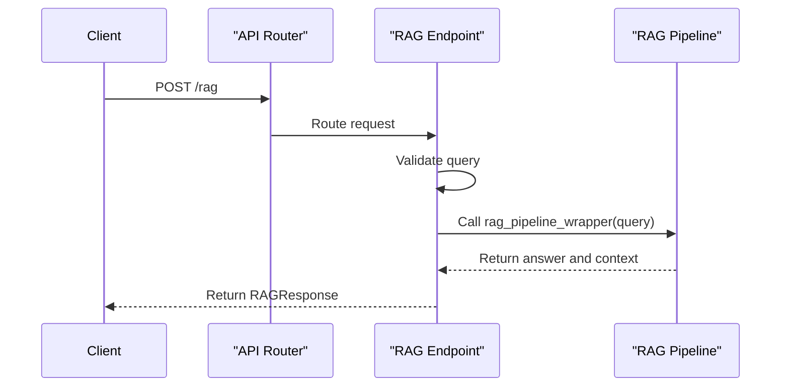
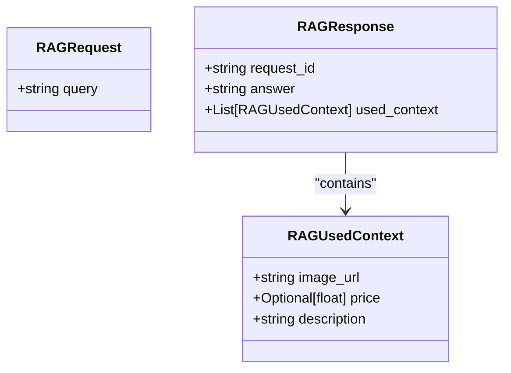
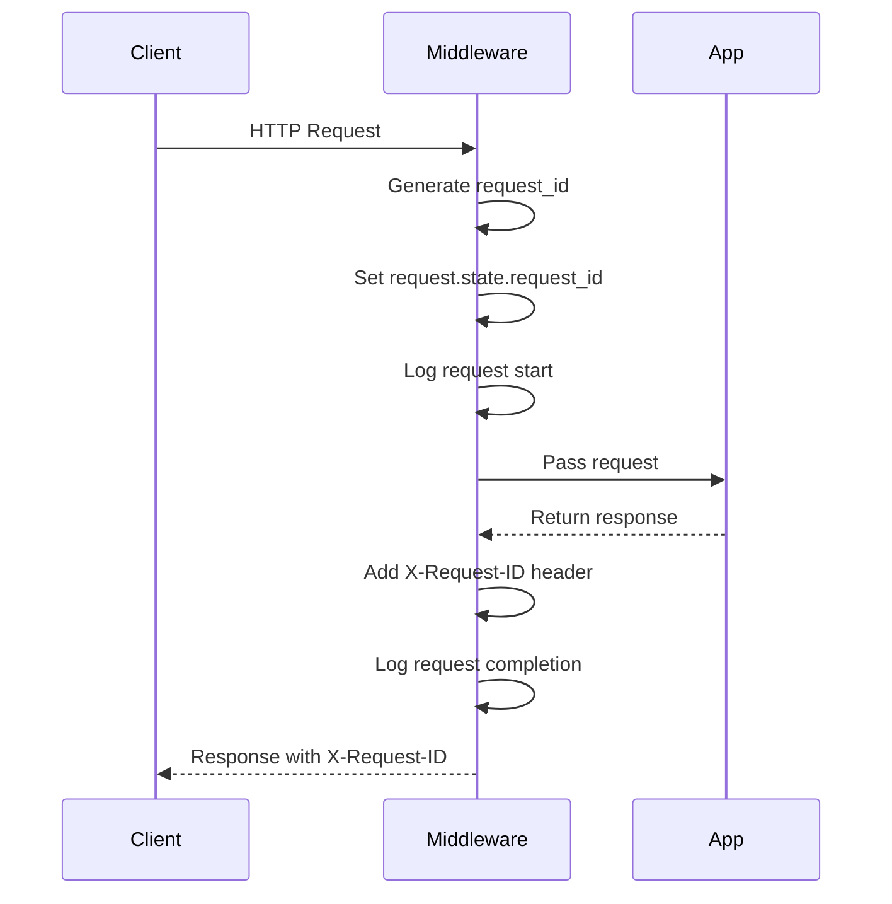
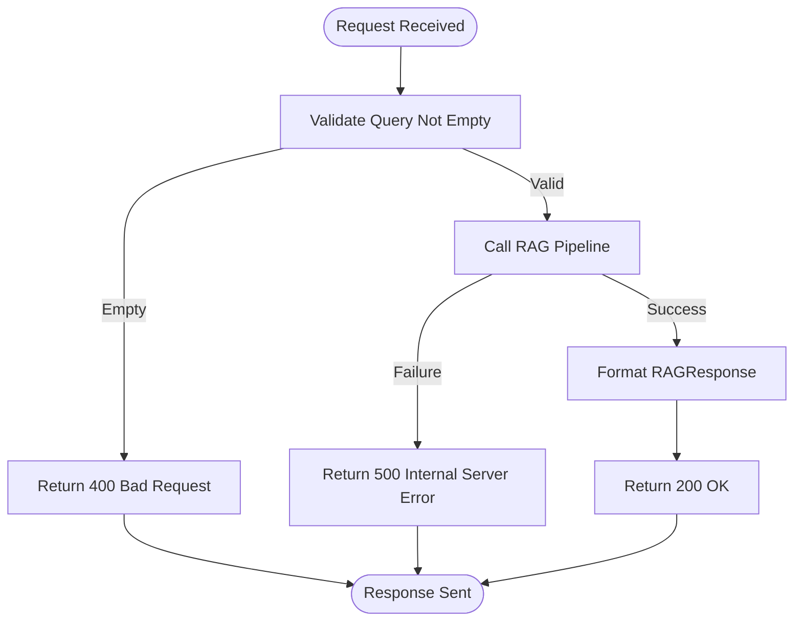

# API Reference

<cite>
**Referenced Files in This Document**   
- [endpoints.py](file://src/api/api/endpoints.py)
- [models.py](file://src/api/api/models.py)
- [middleware.py](file://src/api/api/middleware.py)
- [app.py](file://src/api/app.py)
- [retrieval_generation.py](file://src/api/rag/retrieval_generation.py)
</cite>

## Table of Contents
1. [Introduction](#introduction)
2. [POST /rag Endpoint](#post-rag-endpoint)
3. [Request and Response Models](#request-and-response-models)
4. [Middleware Implementation](#middleware-implementation)
5. [Authentication and Rate Limiting](#authentication-and-rate-limiting)
6. [Example Requests and Responses](#example-requests-and-responses)
7. [Client Integration Guidelines](#client-integration-guidelines)
8. [Error Handling and Troubleshooting](#error-handling-and-troubleshooting)
9. [OpenAPI/Swagger UI Integration](#openapiswagger-ui-integration)

## Introduction
This document provides comprehensive API documentation for the FastAPI backend of the AI-Powered Amazon Product Assistant. The system exposes a single primary endpoint for processing RAG (Retrieval-Augmented Generation) queries, returning product-aware responses with contextual information. The API is designed to be simple, reliable, and well-integrated with observability and error handling features.

**Section sources**
- [app.py](file://src/api/app.py#L1-L34)

## POST /rag Endpoint

The primary endpoint for the RAG system processes user queries and returns AI-generated answers with product context.

- **HTTP Method**: POST
- **URL Pattern**: `/rag`
- **Description**: Processes a user query through the RAG pipeline, retrieving relevant Amazon product information and generating a natural language response.
- **Tags**: rag

The endpoint is implemented in the `rag` function within the `endpoints.py` file and is mounted under the `/rag` prefix via FastAPI's router system.



**Diagram sources**
- [endpoints.py](file://src/api/api/endpoints.py#L15-L73)
- [retrieval_generation.py](file://src/api/rag/retrieval_generation.py#L331-L400)

**Section sources**
- [endpoints.py](file://src/api/api/endpoints.py#L15-L73)

## Request and Response Models

### RAGRequest Model
The request body schema for the `/rag` endpoint.

| Field | Type | Description | Validation Rules |
|-------|------|-------------|------------------|
| "query" | "string" | "The query to be used in the RAG pipeline" | "Required field, cannot be empty or whitespace only" |

Defined in the `RAGRequest` Pydantic model, this schema ensures that only valid queries are processed by the system.

### RAGResponse Model
The response body schema returned by the `/rag` endpoint.

| Field | Type | Description |
|-------|------|-------------|
| "request_id" | "string" | "Unique identifier for the request, used for logging and debugging" |
| "answer" | "string" | "The natural language answer generated by the LLM" |
| "used_context" | "List[RAGUsedContext]" | "Product information used to generate the answer" |

### RAGUsedContext Model
Represents product context used in generating the answer.

| Field | Type | Description |
|-------|------|-------------|
| "image_url" | "string" | "The image URL of the item" |
| "price" | "Optional[float]" | "The price of the item" |
| "description" | "string" | "The description of the item" |



**Diagram sources**
- [models.py](file://src/api/api/models.py#L4-L16)

**Section sources**
- [models.py](file://src/api/api/models.py#L4-L16)

## Middleware Implementation

### Request ID Middleware
The `RequestIDMiddleware` assigns a unique UUID to each incoming request and includes it in logs and response headers.

- Automatically generates a `request_id` for tracing
- Logs request start and completion with the request ID
- Adds `X-Request-ID` header to all responses
- Enables end-to-end request tracing for debugging



**Diagram sources**
- [middleware.py](file://src/api/api/middleware.py#L8-L24)

### CORS Middleware
The API includes CORS middleware configured to allow:

- All origins (`allow_origins=["*"]`)
- All methods (`allow_methods=["*"]`)
- All headers (`allow_headers=["*"]`)
- Credentials (`allow_credentials=True`)

This configuration enables the API to be consumed by web applications hosted on any domain.

**Section sources**
- [middleware.py](file://src/api/api/middleware.py#L8-L24)
- [app.py](file://src/api/app.py#L20-L27)

## Authentication and Rate Limiting

### Authentication Requirements
The API does **not** require authentication for access. The endpoint is publicly accessible, which is suitable for development and internal use cases. For production deployment, authentication should be implemented via reverse proxy or API gateway.

### Rate Limiting Policies
The API does **not** implement built-in rate limiting. However, external services may impose limits:

- OpenAI API calls are subject to OpenAI's rate limits
- Qdrant vector database may have connection limits
- Deployment environment may enforce network-level rate limiting

For production use, rate limiting should be implemented at the infrastructure level (e.g., API gateway, load balancer).

**Section sources**
- [app.py](file://src/api/app.py#L20-L27)
- [retrieval_generation.py](file://src/api/rag/retrieval_generation.py#L50-L65)

## Example Requests and Responses

### Example Request
```json
{
  "query": "What are some good wireless earbuds under $100?"
}
```

### Example Response
```json
{
  "request_id": "a1b2c3d4-e5f6-7890-g1h2-i3j4k5l6m7n8",
  "answer": "Based on customer reviews and features, here are some excellent wireless earbuds under $100...",
  "used_context": [
    {
      "image_url": "https://example.com/earbuds1.jpg",
      "price": 89.99,
      "description": "Wireless earbuds with noise cancellation and 20-hour battery life"
    },
    {
      "image_url": "https://example.com/earbuds2.jpg",
      "price": 79.99,
      "description": "Waterproof wireless earbuds with deep bass and comfortable fit"
    }
  ]
}
```

**Section sources**
- [endpoints.py](file://src/api/api/endpoints.py#L15-L73)
- [models.py](file://src/api/api/models.py#L4-L16)

## Client Integration Guidelines

### Python Client Example
```python
import requests
import json

url = "http://localhost:8000/rag"
headers = {"Content-Type": "application/json"}

payload = {
    "query": "Recommend a lightweight laptop for travel"
}

response = requests.post(url, json=payload, headers=headers)
data = response.json()

print(f"Answer: {data['answer']}")
print(f"Request ID: {data['request_id']}")

for context in data['used_context']:
    print(f"Product: {context['description']}, Price: ${context['price']}")
```

### JavaScript Client Example
```javascript
async function queryRAG(query) {
    const response = await fetch('http://localhost:8000/rag', {
        method: 'POST',
        headers: {
            'Content-Type': 'application/json',
        },
        body: JSON.stringify({ query: query })
    });

    const data = await response.json();
    
    console.log('Answer:', data.answer);
    console.log('Request ID:', data.request_id);
    
    data.used_context.forEach(context => {
        console.log(`Product: ${context.description}, Price: $${context.price}`);
    });
    
    return data;
}
```

### Error Handling in Clients
- Check HTTP status codes before processing response
- Handle 422 validation errors by validating input
- Implement retry logic for 500 errors with exponential backoff
- Extract `X-Request-ID` from response headers for debugging

**Section sources**
- [endpoints.py](file://src/api/api/endpoints.py#L15-L73)
- [models.py](file://src/api/api/models.py#L4-L16)

## Error Handling and Troubleshooting

### Common Status Codes

| Status Code | Meaning | Troubleshooting Tips |
|------------|--------|---------------------|
| "200" | "OK" | "Request successful, response contains answer" |
| "400" | "Bad Request" | "Query is empty or contains only whitespace" |
| "422" | "Unprocessable Entity" | "Request body validation failed, check JSON structure" |
| "500" | "Internal Server Error" | "RAG pipeline failed, check server logs and try again" |

### Error Handling Strategy
The API implements comprehensive error handling:

- Input validation for empty queries
- Try-catch blocks around critical operations
- Detailed logging with request IDs for debugging
- Graceful degradation when components fail
- Specific error messages for client guidance

### Troubleshooting Malformed Requests
1. Verify the request body is valid JSON
2. Ensure the `query` field is present and non-empty
3. Check that the Content-Type header is `application/json`
4. Validate that the request structure matches the RAGRequest model
5. Use the OpenAPI UI at `/docs` to test requests interactively



**Diagram sources**
- [endpoints.py](file://src/api/api/endpoints.py#L15-L73)

**Section sources**
- [endpoints.py](file://src/api/api/endpoints.py#L15-L73)

## OpenAPI/Swagger UI Integration

The API automatically generates OpenAPI documentation available at `/docs`. This interactive interface allows developers to:

- Explore all available endpoints
- View request and response schemas
- Test API calls directly from the browser
- See example payloads and responses
- Understand parameter requirements and validation rules

The documentation is automatically generated from the FastAPI application and Pydantic models, ensuring it stays in sync with the actual implementation. No additional configuration is required.

**Section sources**
- [app.py](file://src/api/app.py#L1-L34)