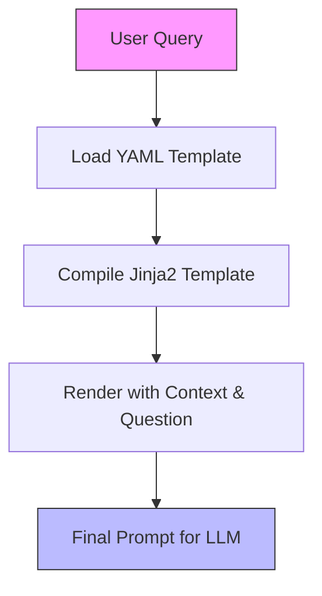
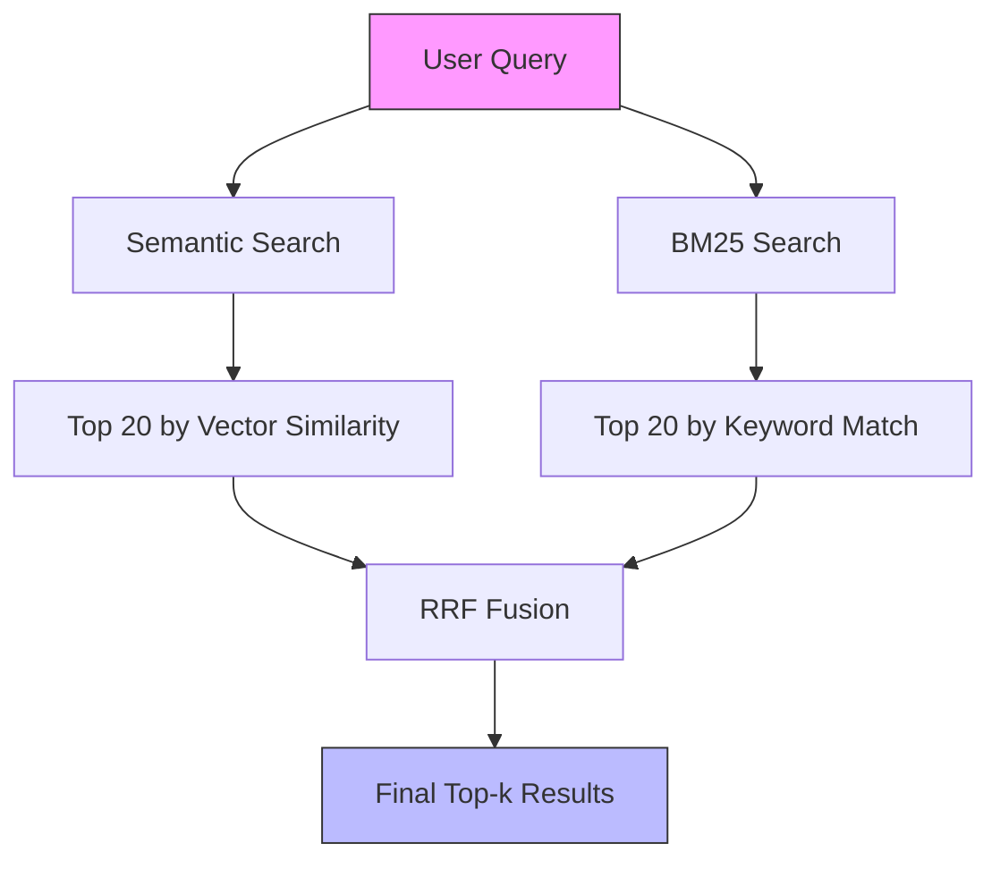
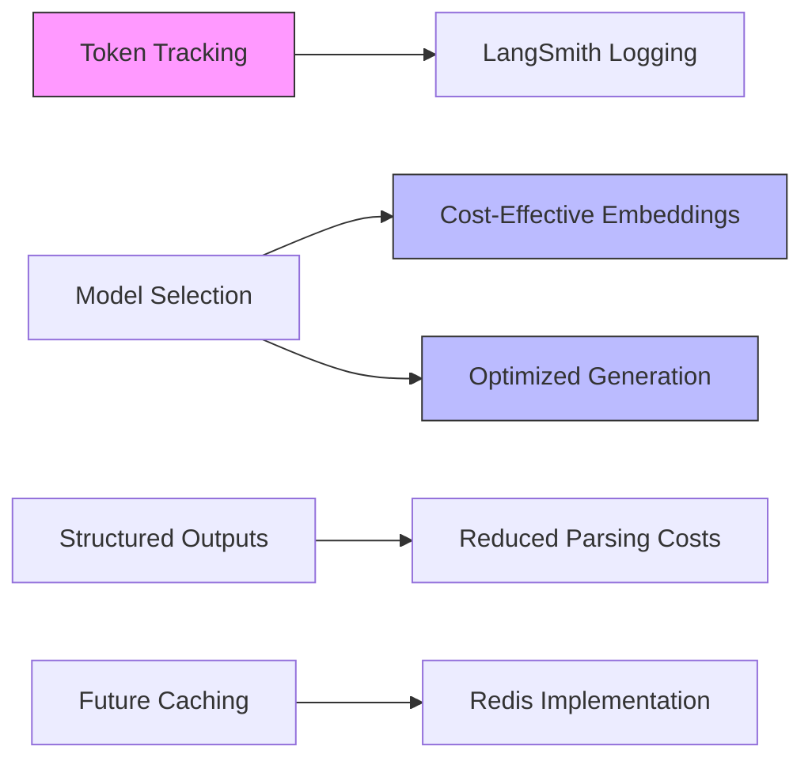
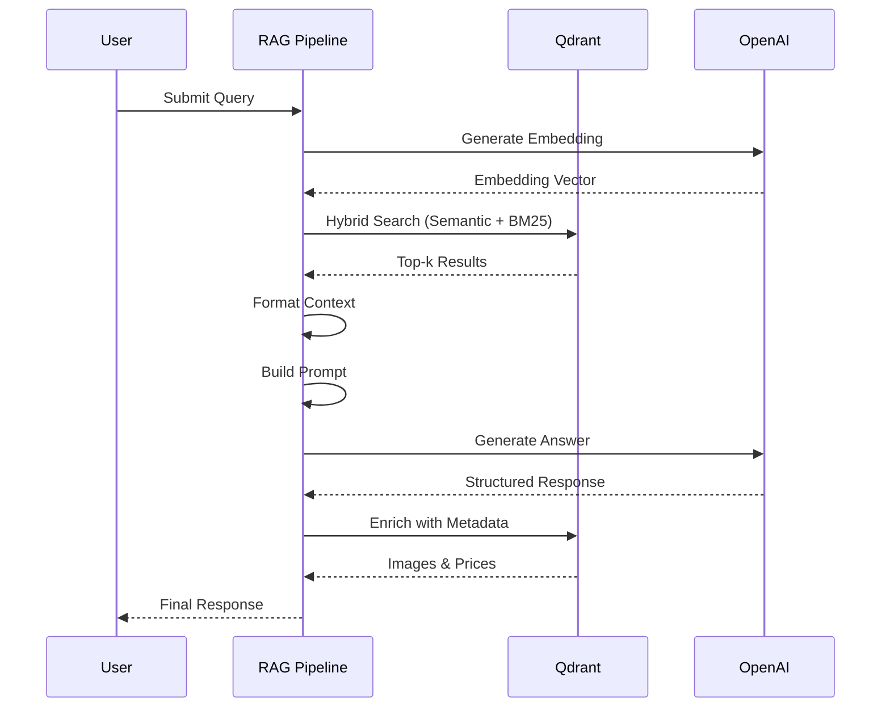
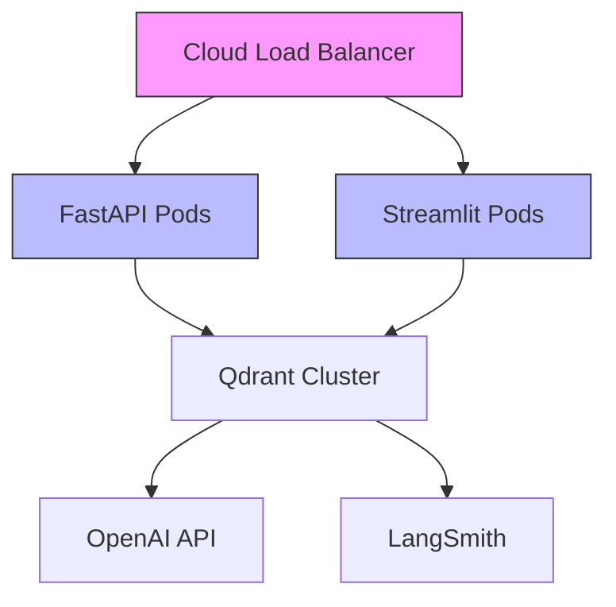
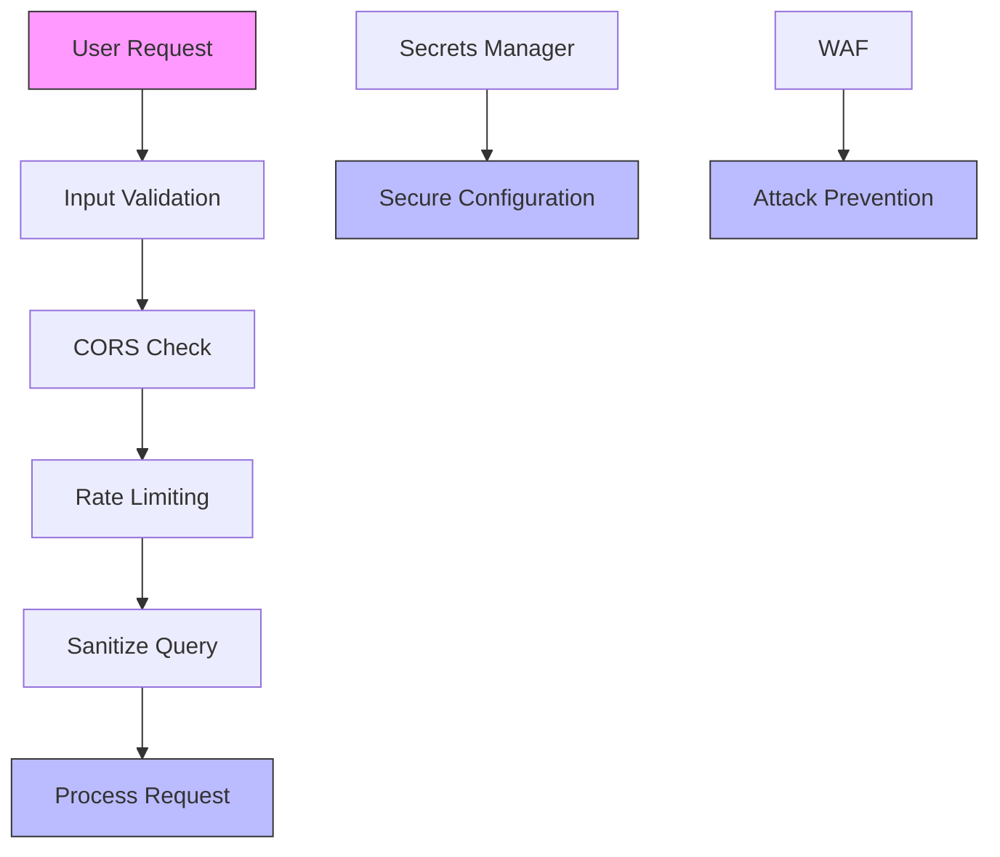

# Advanced Topics

<cite>
**Referenced Files in This Document**   
- [retrieval_generation.yaml](file://src/api/rag/prompts/retrieval_generation.yaml)
- [prompt_management.py](file://src/api/rag/utils/prompt_management.py)
- [retrieval_generation.py](file://src/api/rag/retrieval_generation.py)
- [ARCHITECTURE.md](file://documentation/ARCHITECTURE.md)
- [config.py](file://src/api/core/config.py)
</cite>

## Table of Contents
1. [Prompt Engineering with YAML Templates](#prompt-engineering-with-yaml-templates)
2. [Hybrid Search Tuning Parameters](#hybrid-search-tuning-parameters)
3. [Cost Optimization Strategies](#cost-optimization-strategies)
4. [Advanced RAG Patterns](#advanced-rag-patterns)
5. [Customization for New Product Categories](#customization-for-new-product-categories)
6. [Scaling Considerations](#scaling-considerations)
7. [Security Aspects](#security-aspects)

## Prompt Engineering with YAML Templates

The system implements a structured prompt management system using YAML templates combined with Jinja2 rendering. This approach enables version control, A/B testing, and separation of concerns between code and prompt logic. The primary template `retrieval_generation.yaml` defines a shopping assistant persona with strict instructions to answer based only on provided context, refer to products instead of "context", and return structured outputs including product IDs and descriptions.

The prompt template system is managed through the `prompt_template_config` function in `prompt_management.py`, which loads YAML files and compiles them into Jinja2 templates. This allows dynamic rendering of prompts by injecting preprocessed context and user questions. The system supports multiple prompts within a single YAML file, enabling easy management of different prompt variants for various use cases or A/B testing scenarios.

**Benefits of the YAML-based prompt system include:**
- Version control and diff tracking through Git
- Easy A/B testing by swapping template files
- Clear separation between application code and prompt content
- Support for multiple prompt variants within a single configuration file
- Metadata tracking including author, version, and description

**Section sources**
- [retrieval_generation.yaml](file://src/api/rag/prompts/retrieval_generation.yaml)
- [prompt_management.py](file://src/api/rag/utils/prompt_management.py)
- [retrieval_generation.py](file://src/api/rag/retrieval_generation.py#L199-L225)

## Hybrid Search Tuning Parameters

The system employs a hybrid search strategy combining semantic (vector) and keyword (BM25) retrieval methods with Reciprocal Rank Fusion (RRF) for re-ranking. This approach balances the strengths of both retrieval methods: semantic search captures conceptual similarity while BM25 ensures exact keyword matches. The hybrid search is implemented in the `retrieve_data` function using Qdrant's prefetch and fusion query capabilities.

The system retrieves the top 20 results from each method (semantic and BM25) before applying RRF fusion to produce the final top-k results (default: 5). The RRF algorithm calculates a combined score for each product using the formula: `RRF_score(p) = 1/(60 + semantic_rank(p)) + 1/(60 + bm25_rank(p))`. The constant 60 acts as a smoothing parameter to prevent extremely high ranks from dominating the fusion.

This hybrid approach addresses the limitations of using either method alone. Semantic search might miss products with exact keyword matches but different phrasing, while BM25 might overlook conceptually similar products with different terminology. The RRF fusion ensures that products performing well in either method receive appropriate ranking, with optimal results occurring when products rank highly in both methods.

**Diagram sources**
- [retrieval_generation.py](file://src/api/rag/retrieval_generation.py#L78-L153)
- [ARCHITECTURE.md](file://documentation/ARCHITECTURE.md#L588-L631)

**Section sources**
- [retrieval_generation.py](file://src/api/rag/retrieval_generation.py#L78-L153)
- [ARCHITECTURE.md](file://documentation/ARCHITECTURE.md#L268-L297)

## Cost Optimization Strategies

The system incorporates several cost optimization strategies to minimize expenses associated with API calls and computational resources. Token usage is tracked and logged to LangSmith for detailed cost analysis, with metadata capturing input, output, and total tokens for both embedding and generation operations. This enables precise cost attribution and identification of optimization opportunities.

The architecture separates concerns between retrieval and generation, allowing independent optimization of each component. The system uses the cost-effective `text-embedding-3-small` model for embeddings at $0.00002 per 1K tokens, while leveraging `gpt-4.1-mini` for generation at $0.150/1M input tokens and $0.600/1M output tokens. The structured output approach using Instructor and Pydantic reduces parsing costs and ensures response validity, eliminating the need for additional validation layers.

Future cost optimization opportunities include implementing response caching for identical queries using Redis, introducing batch processing for multiple queries, and exploring cheaper model alternatives for specific use cases. The system's modular design facilitates A/B testing of different models and configurations to identify the optimal cost-performance balance.

**Section sources**
- [retrieval_generation.py](file://src/api/rag/retrieval_generation.py#L233-L273)
- [retrieval_generation.py](file://src/api/rag/retrieval_generation.py#L34-L71)
- [ARCHITECTURE.md](file://documentation/ARCHITECTURE.md#L400-L425)
- [ARCHITECTURE.md](file://documentation/ARCHITECTURE.md#L453-L492)

## Advanced RAG Patterns

The system implements several advanced RAG patterns to enhance retrieval quality and response accuracy. The hybrid search with RRF fusion represents a sophisticated retrieval pattern that combines multiple search methodologies for improved results. The structured output pattern using Instructor and Pydantic ensures type-safe responses with automatic validation, eliminating manual JSON parsing and reducing error rates.

The pipeline follows a clear sequence of operations: embedding generation, hybrid retrieval, context formatting, prompt building, answer generation, and context enrichment. Each step is decorated with `@traceable` for comprehensive observability in LangSmith, enabling detailed performance analysis and debugging. The context enrichment step adds product metadata (images, prices) to the final response, enhancing the user experience without affecting the core retrieval and generation logic.

The system's design supports the implementation of additional advanced patterns such as query rewriting, step-back prompting, and multi-hop retrieval. The modular architecture allows for easy extension of the pipeline with new components, while the YAML-based prompt system facilitates experimentation with different prompting strategies. The separation of retrieval and generation concerns enables independent optimization of each component.

**Diagram sources**
- [retrieval_generation.py](file://src/api/rag/retrieval_generation.py#L279-L328)
- [retrieval_generation.py](file://src/api/rag/retrieval_generation.py#L34-L71)
- [retrieval_generation.py](file://src/api/rag/retrieval_generation.py#L78-L153)

**Section sources**
- [retrieval_generation.py](file://src/api/rag/retrieval_generation.py#L279-L328)
- [retrieval_generation.py](file://src/api/rag/retrieval_generation.py#L34-L71)
- [retrieval_generation.py](file://src/api/rag/retrieval_generation.py#L78-L153)

## Customization for New Product Categories

The system architecture supports customization for new product categories through its modular design and configuration-driven approach. The Qdrant collection schema can be extended to include category-specific fields while maintaining the core structure of product ID, description, rating, image, and price. The hybrid search functionality automatically adapts to new content without requiring changes to the retrieval algorithm.

The YAML-based prompt system allows for category-specific prompt templates that can emphasize different product attributes based on the category. For example, electronics might emphasize technical specifications while clothing might focus on size and material. The system can be configured to use different prompt templates based on detected category or user preferences.

The data ingestion pipeline can be extended to process new product categories by updating the preprocessing notebooks in the `notebooks/phase_1` directory. The vector dimension (1536) remains consistent across categories, ensuring compatibility with the existing embedding model. Category-specific metadata can be added to the payload without affecting the core retrieval and generation logic.

**Section sources**
- [retrieval_generation.py](file://src/api/rag/retrieval_generation.py#L78-L153)
- [retrieval_generation.yaml](file://src/api/rag/prompts/retrieval_generation.yaml)
- [ARCHITECTURE.md](file://documentation/ARCHITECTURE.md#L1290-L1335)

## Scaling Considerations

The system is designed with scalability in mind, following a microservices architecture that can be deployed in containerized environments. The current Docker Compose setup can be extended to Kubernetes or ECS for production deployments, enabling horizontal scaling of individual components based on demand. The FastAPI backend and Streamlit UI can be scaled independently to handle varying loads.

For larger datasets, the Qdrant vector database can be deployed as a managed cluster or self-hosted cluster with sharding and replication. The system's hybrid search approach remains efficient even with large datasets, as the RRF fusion operates on a limited number of top results from each retrieval method. The use of persistent storage for Qdrant ensures data durability and enables seamless scaling.

Higher traffic volumes can be accommodated through load balancing, API gateways with rate limiting, and caching layers. The system's observability stack with LangSmith provides insights into performance bottlenecks and resource utilization, guiding scaling decisions. Future enhancements could include async processing, batch operations, and connection pooling to further improve throughput and efficiency.

**Diagram sources**
- [ARCHITECTURE.md](file://documentation/ARCHITECTURE.md#L859-L907)

**Section sources**
- [ARCHITECTURE.md](file://documentation/ARCHITECTURE.md#L859-L907)
- [docker-compose.yml](file://docker-compose.yml)

## Security Aspects

The system implements several security measures while identifying areas for improvement in production environments. Input validation is enforced through Pydantic models, preventing malformed requests from reaching the core logic. The system avoids exposing stack traces to clients by returning generic 500 errors for internal failures. Dependencies are pinned in `uv.lock` to prevent supply chain attacks from version updates.

Key security enhancements needed for production include implementing API authentication with JWT tokens, adding rate limiting to prevent abuse, restricting CORS origins from wildcard to specific domains, and moving secrets from `.env` files to dedicated secret management services like AWS Secrets Manager or HashiCorp Vault. The current development configuration uses `allow_origins=["*"]` which should be restricted in production.

Prompt injection prevention can be implemented through input sanitization that detects and blocks system-level instruction attempts. A recommended approach includes filtering for phrases like "ignore previous instructions" or "system:" in user queries. Additional security layers could include Web Application Firewall (WAF) protection, TLS encryption, audit logging, and container image scanning for vulnerabilities.

**Diagram sources**
- [ARCHITECTURE.md](file://documentation/ARCHITECTURE.md#L945-L995)

**Section sources**
- [ARCHITECTURE.md](file://documentation/ARCHITECTURE.md#L909-L944)
- [ARCHITECTURE.md](file://documentation/ARCHITECTURE.md#L945-L995)
- [app.py](file://src/api/app.py#L21-L27)
- [config.py](file://src/api/core/config.py)