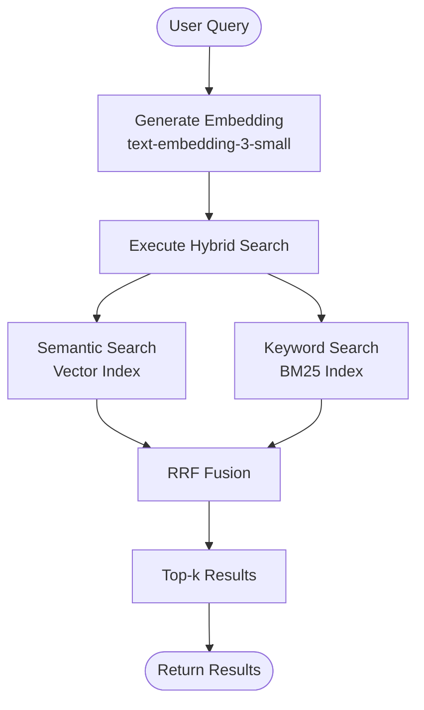
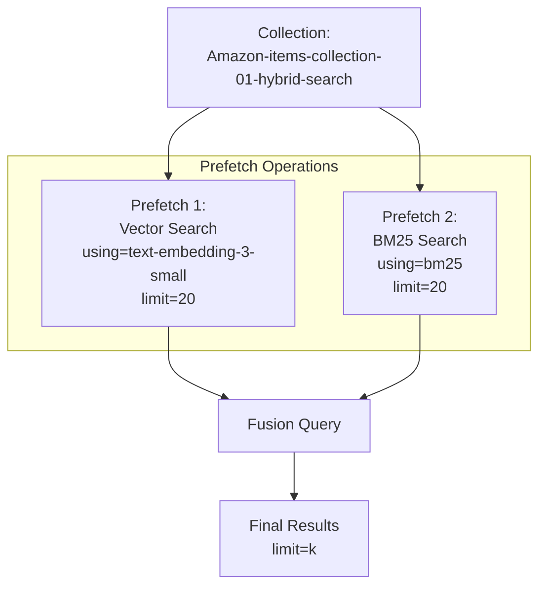
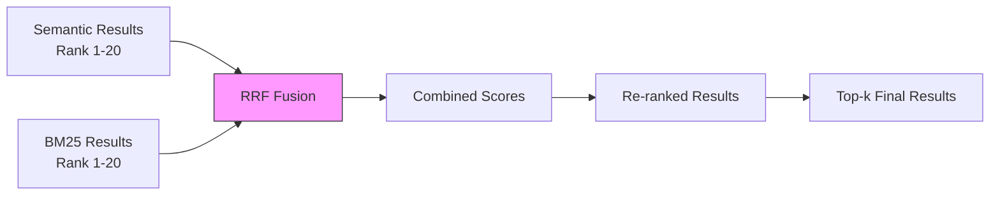
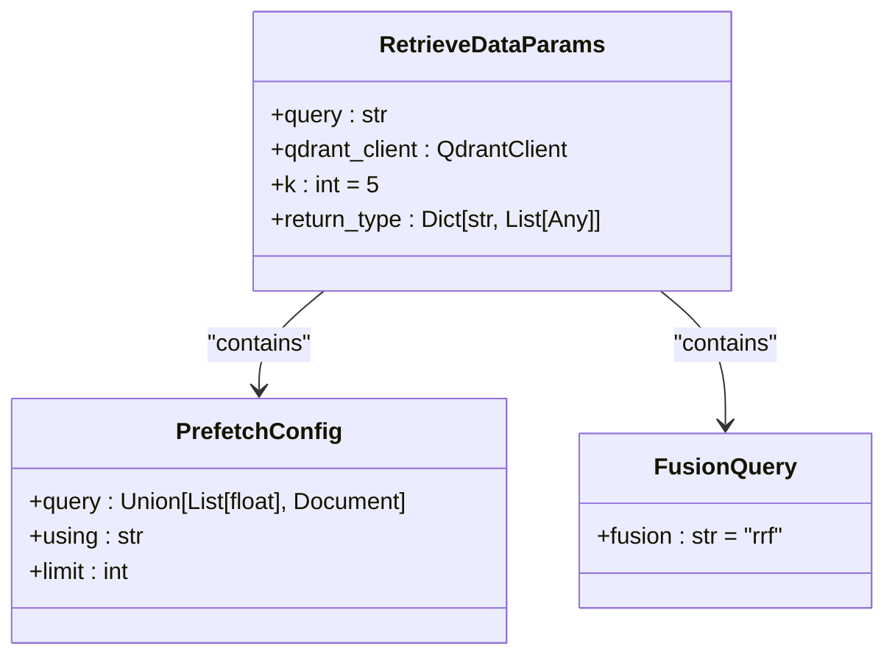

# Hybrid Search Tuning

<cite>
**Referenced Files in This Document**   
- [retrieval_generation.py](file://src/api/rag/retrieval_generation.py)
- [ARCHITECTURE.md](file://documentation/ARCHITECTURE.md)
- [03-Hybrid-Search.ipynb](file://notebooks/phase_3/03-Hybrid-Search.ipynb)
</cite>

## Table of Contents
1. [Introduction](#introduction)
2. [Hybrid Search Implementation](#hybrid-search-implementation)
3. [Prefetch Configuration](#prefetch-configuration)
4. [Fusion Strategies with RRF](#fusion-strategies-with-rrf)
5. [Retrieval Parameters](#retrieval-parameters)
6. [Scoring and Ranking](#scoring-and-ranking)
7. [Performance Considerations](#performance-considerations)
8. [Troubleshooting Common Issues](#troubleshooting-common-issues)

## Introduction
This document provides comprehensive guidance on tuning hybrid search parameters in the RAG system. The implementation leverages Qdrant's Prefetch and FusionQuery capabilities with Reciprocal Rank Fusion (RRF) to combine semantic and keyword search effectively. The document covers configuration options, performance implications, and optimization strategies for achieving optimal retrieval quality.

## Hybrid Search Implementation

The hybrid search implementation combines semantic (vector) and keyword (BM25) search methods through Qdrant's query_points API. The retrieve_data function orchestrates this process by generating embeddings for semantic search while simultaneously performing keyword matching.

The system first generates a query embedding using OpenAI's text-embedding-3-small model, then executes a hybrid search that combines this vector representation with BM25 keyword matching. This dual approach ensures both semantic understanding and exact keyword matching contribute to the final results.

**Diagram sources**
- [retrieval_generation.py](file://src/api/rag/retrieval_generation.py#L81-L153)
- [ARCHITECTURE.md](file://documentation/ARCHITECTURE.md#L268-L297)

**Section sources**
- [retrieval_generation.py](file://src/api/rag/retrieval_generation.py#L81-L153)

## Prefetch Configuration

The prefetch parameter in Qdrant's query_points method enables parallel execution of multiple search strategies. The implementation configures two prefetch operations: one for semantic search and another for keyword search.

For semantic search, the prefetch configuration uses the generated embedding vector with the text-embedding-3-small model, retrieving the top 20 most similar items based on cosine similarity. For keyword search, it uses the qdrant/bm25 model with the original query text, also retrieving the top 20 keyword matches.

The limit parameter in each prefetch operation controls the number of results from each search method before fusion. Setting this to 20 ensures sufficient candidates from both methods participate in the final ranking process, preventing premature filtering that could eliminate relevant results.

**Diagram sources**
- [retrieval_generation.py](file://src/api/rag/retrieval_generation.py#L100-L115)
- [03-Hybrid-Search.ipynb](file://notebooks/phase_3/03-Hybrid-Search.ipynb#L249-L307)

**Section sources**
- [retrieval_generation.py](file://src/api/rag/retrieval_generation.py#L100-L115)

## Fusion Strategies with RRF

Reciprocal Rank Fusion (RRF) serves as the primary fusion strategy, combining results from semantic and keyword searches into a unified ranking. The RRF algorithm calculates a combined score for each item based on its position in both result sets, using the formula: `1/(k + rank)` where k is a constant (60 in this implementation) and rank is the item's position.

RRF effectively balances the strengths of both search methods, preventing either from dominating the results. Items that perform well in both semantic and keyword searches receive higher combined scores, while items that excel in only one method are appropriately weighted. This approach mitigates the risk of missing relevant results that might be ranked highly by only one search strategy.

The fusion process occurs after both prefetch operations complete, ensuring all candidate results are available for re-ranking. The final result set is then limited to the top-k items as specified by the k parameter.

**Diagram sources**
- [retrieval_generation.py](file://src/api/rag/retrieval_generation.py#L116)
- [ARCHITECTURE.md](file://documentation/ARCHITECTURE.md#L612-L631)

**Section sources**
- [retrieval_generation.py](file://src/api/rag/retrieval_generation.py#L116)
- [ARCHITECTURE.md](file://documentation/ARCHITECTURE.md#L297-L323)

## Retrieval Parameters

The retrieve_data function accepts several key parameters that control the retrieval process. The k parameter determines the final number of results returned, with a default value of 5. This parameter directly impacts both user experience and system performance.

The limit values in the prefetch operations (set to 20 for both semantic and keyword searches) represent a tuning point for retrieval quality. Increasing these values allows more candidates to participate in the fusion process, potentially improving result quality at the cost of increased computational overhead.

The using parameter in each prefetch operation specifies the index to use for searching. The text-embedding-3-small index enables semantic search through vector similarity, while the bm25 index enables keyword-based search through sparse vector representation.

**Diagram sources**
- [retrieval_generation.py](file://src/api/rag/retrieval_generation.py#L78-L153)
- [03-Hybrid-Search.ipynb](file://notebooks/phase_3/03-Hybrid-Search.ipynb#L249-L307)

**Section sources**
- [retrieval_generation.py](file://src/api/rag/retrieval_generation.py#L78-L153)

## Scoring and Ranking

The scoring mechanism combines results from both search methods through RRF, which converts rank positions into scores using the reciprocal function. Each item receives a combined score that reflects its performance across both semantic and keyword searches.

The similarity_scores returned by the retrieve_data function represent the final RRF scores, with higher values indicating better overall relevance. These scores enable downstream components to understand the confidence level of each retrieved item.

The ranking process ensures that items appearing in both result sets are prioritized, while items unique to one method are appropriately weighted based on their rank position. This approach maintains diversity in results while emphasizing items with strong performance across multiple criteria.

**Section sources**
- [retrieval_generation.py](file://src/api/rag/retrieval_generation.py#L119-L153)
- [ARCHITECTURE.md](file://documentation/ARCHITECTURE.md#L612-L631)

## Performance Considerations

Query latency is influenced by several factors in the hybrid search implementation. The dual prefetch operations execute in parallel within Qdrant, minimizing the performance impact of combining search methods. However, larger limit values in prefetch operations increase computational requirements and memory usage.

Index optimization plays a crucial role in maintaining performance. The vector index (text-embedding-3-small) should be optimized for fast approximate nearest neighbor search, while the BM25 index benefits from efficient text tokenization and inverted index structures.

Caching strategies can significantly improve performance for repeated queries. Since both embedding generation and hybrid search involve computational overhead, implementing result caching for common queries reduces latency and conserves resources.

The k parameter represents a direct trade-off between result quality and performance. Larger values increase the amount of data processed and transferred, affecting both server-side processing time and client-side rendering performance.

**Section sources**
- [retrieval_generation.py](file://src/api/rag/retrieval_generation.py#L81-L153)
- [ARCHITECTURE.md](file://documentation/ARCHITECTURE.md#L1129)

## Troubleshooting Common Issues

Uneven weighting between search methods can occur when one method consistently dominates results. This issue can be addressed by adjusting the RRF constant (k) or modifying the prefetch limits to ensure balanced representation from both methods.

Low recall in hybrid results may indicate insufficient candidates from one search method. Increasing the limit parameter in the affected prefetch operation allows more results to participate in fusion, potentially improving recall.

Query latency issues can stem from suboptimal index configuration or excessive prefetch limits. Monitoring query performance and adjusting parameters based on observed metrics helps maintain acceptable response times.

When debugging retrieval issues, examining the similarity_scores can provide insights into the fusion process. Consistently low scores may indicate problems with either the semantic or keyword search components, while extreme score disparities suggest imbalance in the fusion process.

**Section sources**
- [retrieval_generation.py](file://src/api/rag/retrieval_generation.py#L81-L153)
- [ARCHITECTURE.md](file://documentation/ARCHITECTURE.md#L297-L323)