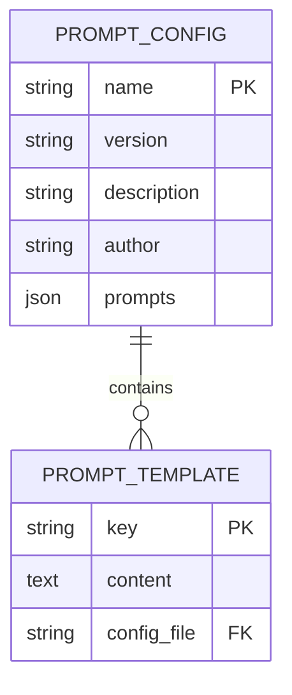
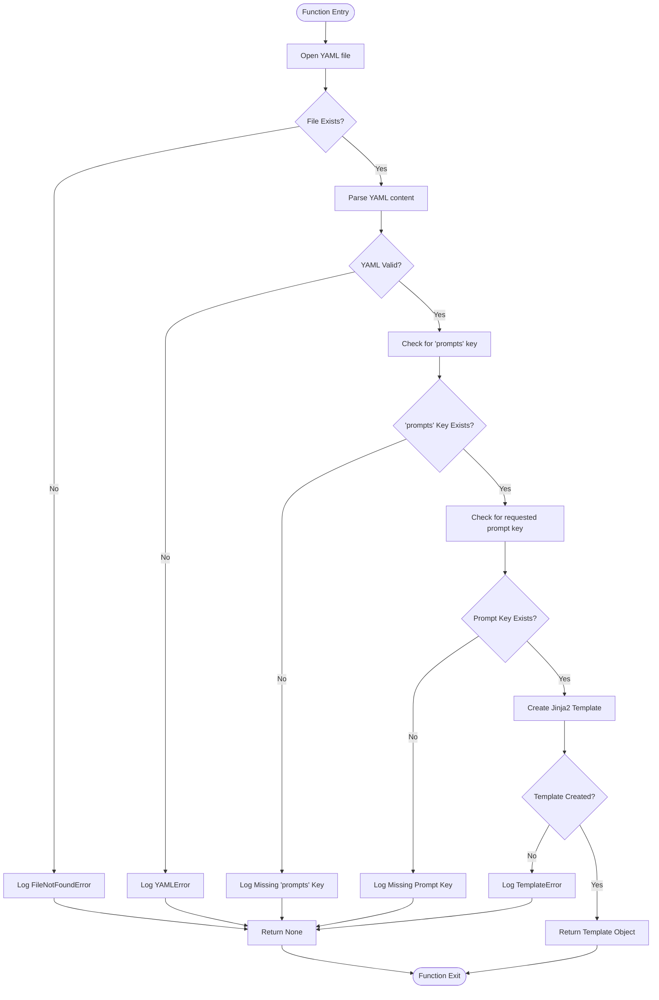
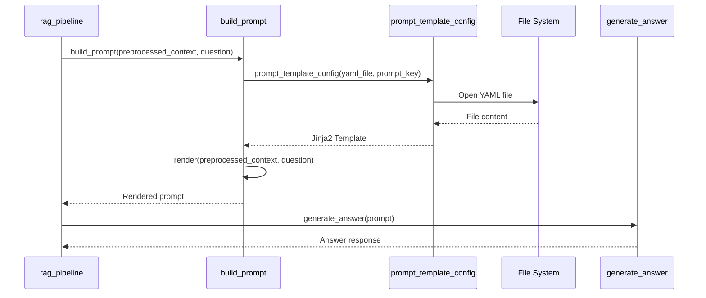

# Prompt Engineering

<cite>
**Referenced Files in This Document**   
- [prompt_management.py](file://src/api/rag/utils/prompt_management.py)
- [retrieval_generation.yaml](file://src/api/rag/prompts/retrieval_generation.yaml)
- [retrieval_generation.py](file://src/api/rag/retrieval_generation.py)
</cite>

## Table of Contents
1. [Introduction](#introduction)
2. [Prompt Template Configuration System](#prompt-template-configuration-system)
3. [YAML Configuration Structure](#yaml-configuration-structure)
4. [Template Loading and Error Handling](#template-loading-and-error-handling)
5. [Prompt Integration in RAG Pipeline](#prompt-integration-in-rag-pipeline)
6. [Creating and Registering New Prompts](#creating-and-registering-new-prompts)
7. [Best Practices for Prompt Design](#best-practices-for-prompt-design)
8. [Common Issues and Troubleshooting](#common-issues-and-troubleshooting)
9. [Versioning Strategies](#versioning-strategies)
10. [Performance Considerations](#performance-considerations)
11. [Conclusion](#conclusion)

## Introduction
This document provides comprehensive guidance on prompt engineering within the AI-Powered Amazon Product Assistant system. It details the architecture of the prompt management system, focusing on YAML-based template configuration, error handling, integration with the Retrieval-Augmented Generation (RAG) pipeline, and best practices for effective prompt design. The system enables structured, maintainable, and version-controlled prompt management through a combination of YAML configuration files and Jinja2 templating.

## Prompt Template Configuration System
The prompt management system centralizes prompt definitions in YAML configuration files, enabling version control, metadata tracking, and easy modification without code changes. The core functionality is implemented in the `prompt_template_config` function, which loads Jinja2 templates from YAML files based on specified keys. This approach allows for multiple prompt variants within a single file, facilitating A/B testing and gradual rollout of prompt improvements.

The system also supports alternative prompt retrieval from external registries like LangSmith through the `prompt_template_registry` function, providing flexibility in prompt sourcing and management.

**Section sources**
- [prompt_management.py](file://src/api/rag/utils/prompt_management.py#L11-L52)
- [retrieval_generation.py](file://src/api/rag/retrieval_generation.py#L199-L225)

## YAML Configuration Structure
The `retrieval_generation.yaml` file defines the structure for prompt configuration with both metadata and prompt content. The metadata section includes essential information such as name, version, description, and author, enabling proper documentation and traceability of prompt evolution.

The prompts section contains the actual template content under specific keys, with the `retrieval_generation` key defining the primary prompt used in the RAG pipeline. Template variables like `{{ preprocessed_context }}` and `{{ question }}` are used as placeholders that are dynamically replaced during prompt rendering.

**Diagram sources**
- [retrieval_generation.yaml](file://src/api/rag/prompts/retrieval_generation.yaml#L1-L31)

**Section sources**
- [retrieval_generation.yaml](file://src/api/rag/prompts/retrieval_generation.yaml#L1-L31)

## Template Loading and Error Handling
The `prompt_template_config` function implements comprehensive error handling for various failure scenarios in the template loading process. The function follows a systematic validation approach:

1. **File existence check**: Handles `FileNotFoundError` when the YAML configuration file is missing
2. **YAML parsing validation**: Catches `yaml.YAMLError` for invalid YAML syntax
3. **Structure validation**: Verifies the presence of required 'prompts' key in the configuration
4. **Key validation**: Ensures the requested prompt key exists within the prompts dictionary
5. **Template compilation**: Handles `TemplateError` during Jinja2 template creation
6. **General exception handling**: Catches unexpected errors with appropriate logging

Each error condition is logged with descriptive messages, enabling effective debugging and monitoring of prompt loading issues. The function returns `None` on failure, allowing calling functions to handle the absence of a template appropriately.

**Diagram sources**
- [prompt_management.py](file://src/api/rag/utils/prompt_management.py#L11-L52)

**Section sources**
- [prompt_management.py](file://src/api/rag/utils/prompt_management.py#L11-L52)

## Prompt Integration in RAG Pipeline
Prompts are integrated into the RAG pipeline through the `build_prompt` function, which serves as the bridge between template configuration and actual prompt usage. The function orchestrates the prompt rendering process by:

1. Loading the appropriate template using `prompt_template_config`
2. Validating the template was loaded successfully
3. Rendering the template with context variables (`preprocessed_context` and `question`)
4. Returning the final prompt string for LLM consumption

The `rag_pipeline` function demonstrates the end-to-end integration, where the built prompt is passed to the `generate_answer` function for processing by the language model. This integration ensures that prompt changes are automatically reflected in the RAG pipeline without requiring code modifications.

**Diagram sources**
- [retrieval_generation.py](file://src/api/rag/retrieval_generation.py#L199-L225)
- [prompt_management.py](file://src/api/rag/utils/prompt_management.py#L11-L52)

**Section sources**
- [retrieval_generation.py](file://src/api/rag/retrieval_generation.py#L199-L225)

## Creating and Registering New Prompts
To create and register new prompts in the system, follow these steps:

1. **Add to YAML configuration**: Extend the `retrieval_generation.yaml` file with a new prompt entry under the `prompts` section, using a unique key and the desired template content with appropriate Jinja2 variables.

2. **Reference in code**: Use the `prompt_template_config` function with the new prompt key to load and render the template in relevant functions.

3. **Test thoroughly**: Validate the new prompt with various input scenarios to ensure proper rendering and expected LLM behavior.

4. **Document changes**: Update the metadata section with version increments and descriptive change logs to maintain proper version control.

Alternative registration through external prompt registries like LangSmith is also supported via the `prompt_template_registry` function, allowing prompts to be managed and versioned in dedicated prompt management platforms.

**Section sources**
- [retrieval_generation.yaml](file://src/api/rag/prompts/retrieval_generation.yaml#L1-L31)
- [prompt_management.py](file://src/api/rag/utils/prompt_management.py#L54-L80)

## Best Practices for Prompt Design
Effective prompt design within this system should follow these best practices:

1. **Clear instructions**: Provide explicit, unambiguous instructions to the LLM about expected output format and constraints, as demonstrated in the retrieval_generation template's detailed instruction set.

2. **Few-shot examples**: While not implemented in the current template, consider including example input-output pairs to guide the LLM's response pattern.

3. **Structured output formatting**: Define precise output formats using bullet points, specific sections, or JSON-like structures to ensure consistent and parseable responses.

4. **Contextual awareness**: Design prompts to properly utilize the provided context variables (`preprocessed_context` and `question`) and instruct the LLM to base responses solely on the given context.

5. **Error prevention**: Include instructions that prevent common LLM failure modes, such as hallucination or using information outside the provided context.

6. **Variable naming**: Use descriptive, consistent variable names in Jinja2 templates that clearly indicate their purpose and content type.

**Section sources**
- [retrieval_generation.yaml](file://src/api/rag/prompts/retrieval_generation.yaml#L1-L31)

## Common Issues and Troubleshooting
Common issues in the prompt management system and their troubleshooting approaches include:

1. **Template rendering failures**: These typically occur due to missing context variables during rendering. Ensure all variables referenced in the template (e.g., `{{ preprocessed_context }}`, `{{ question }}`) are provided in the render call.

2. **Missing YAML files**: Verify the file path passed to `prompt_template_config` is correct and the file exists in the specified location. The function logs detailed error messages for file not found exceptions.

3. **Invalid YAML syntax**: Use YAML validation tools to check for syntax errors such as improper indentation, missing colons, or incorrect quoting. The system logs specific YAML parsing errors to aid diagnosis.

4. **Incorrect prompt keys**: Ensure the prompt key used in `prompt_template_config` exactly matches a key defined in the YAML file's prompts section, considering case sensitivity.

5. **Template compilation errors**: Jinja2 syntax errors in templates (e.g., mismatched braces, invalid expressions) are caught during template creation and logged appropriately.

**Section sources**
- [prompt_management.py](file://src/api/rag/utils/prompt_management.py#L11-L52)

## Versioning Strategies
The system supports multiple versioning strategies for prompt management:

1. **YAML-based versioning**: Utilize the metadata section in YAML files to track prompt versions, enabling Git-based version control of prompt evolution. Each change can be committed with descriptive messages.

2. **External registry versioning**: Leverage LangSmith or similar prompt registries that provide built-in versioning, A/B testing, and performance tracking capabilities.

3. **Key-based variant management**: Maintain multiple prompt variants within the same YAML file using different keys (e.g., `retrieval_generation_v1`, `retrieval_generation_v2`), allowing for easy comparison and switching.

4. **Semantic versioning**: Follow semantic versioning principles in the YAML metadata to indicate the nature of changes (major, minor, patch) and their potential impact.

The notebook `05-Prompt-Versioning.ipynb` provides practical examples of these versioning approaches and their implementation in the system.

## Performance Considerations
While the current implementation does not include explicit caching mechanisms, several performance considerations should be addressed:

1. **Template loading optimization**: The `prompt_template_config` function currently loads and parses the YAML file on each call. Implementing a caching layer to store compiled templates would reduce file I/O and parsing overhead, especially for frequently used prompts.

2. **Error handling efficiency**: The comprehensive error handling, while robust, adds some overhead. In production environments with stable configurations, some validation checks could potentially be optimized or made conditional.

3. **Memory usage**: Compiled Jinja2 templates are stored in memory. For systems with many prompts, monitor memory usage and consider lazy loading or template eviction strategies.

4. **Validation overhead**: The multiple validation steps in template loading ensure reliability but add processing time. In high-throughput scenarios, consider caching validation results for unchanged configuration files.

Future enhancements could include implementing a template cache with time-to-live (TTL) settings or file modification monitoring to automatically reload templates when configuration files change.

**Section sources**
- [prompt_management.py](file://src/api/rag/utils/prompt_management.py#L11-L52)

## Conclusion
The prompt engineering system in the AI-Powered Amazon Product Assistant provides a robust, maintainable framework for managing LLM prompts through YAML configuration and Jinja2 templating. By centralizing prompt definitions, implementing comprehensive error handling, and integrating seamlessly with the RAG pipeline, the system enables efficient prompt development, testing, and deployment. Following the documented best practices for prompt design and versioning will ensure high-quality, reliable responses from the assistant while maintaining system performance and stability.