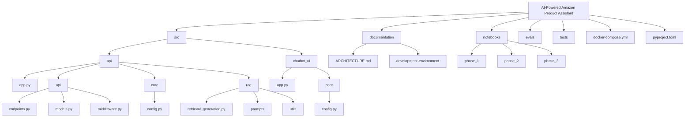
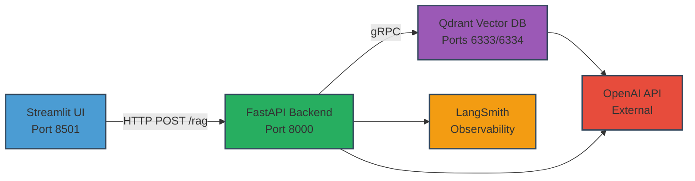
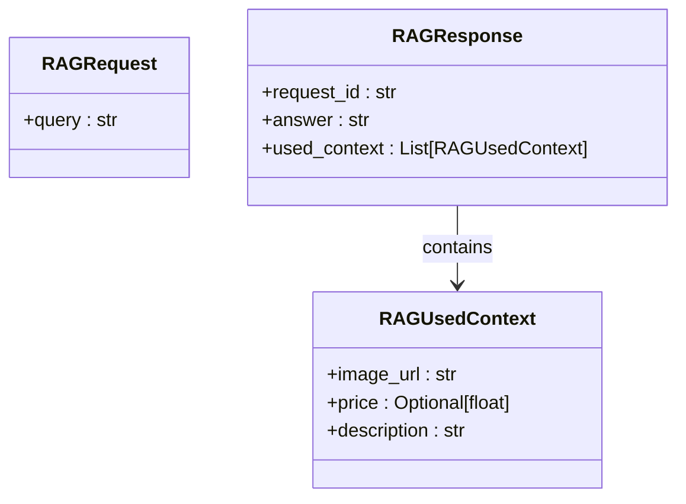
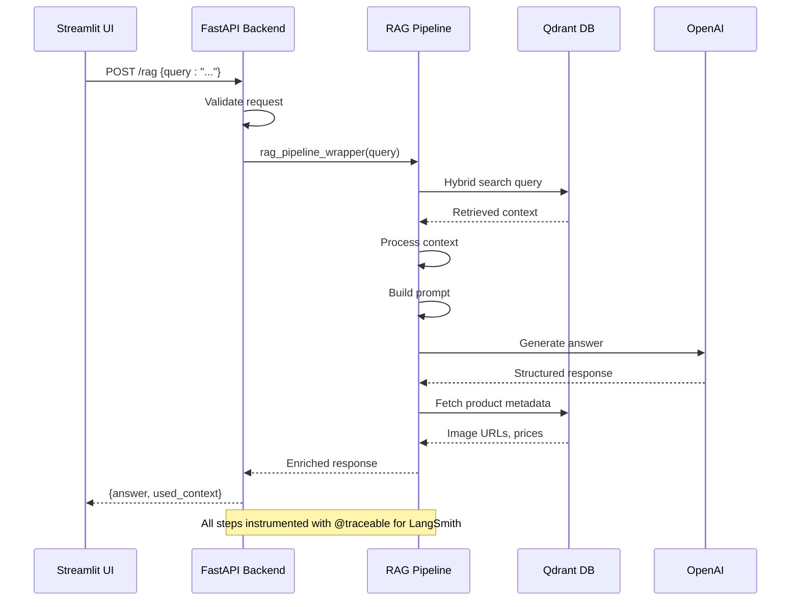
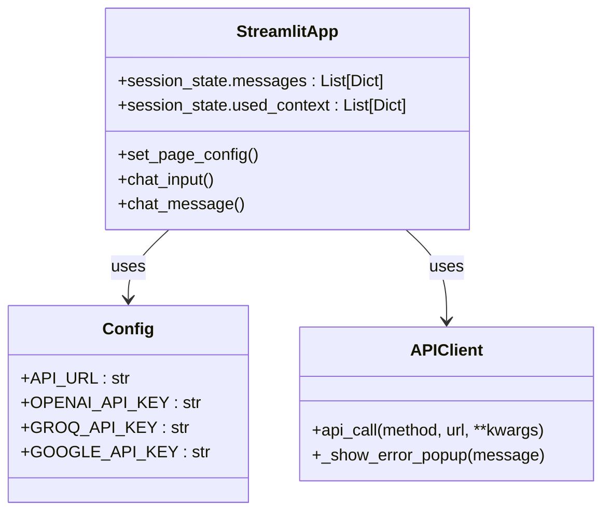
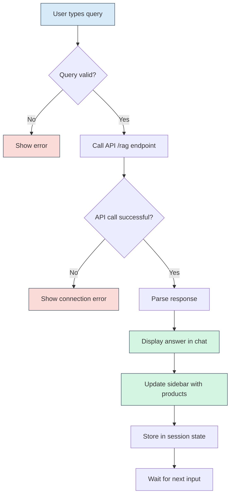
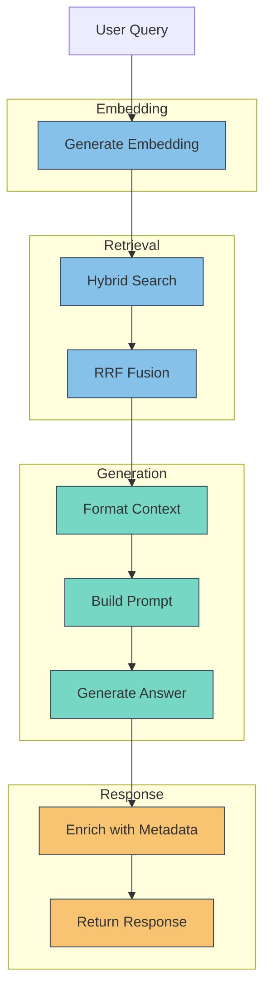
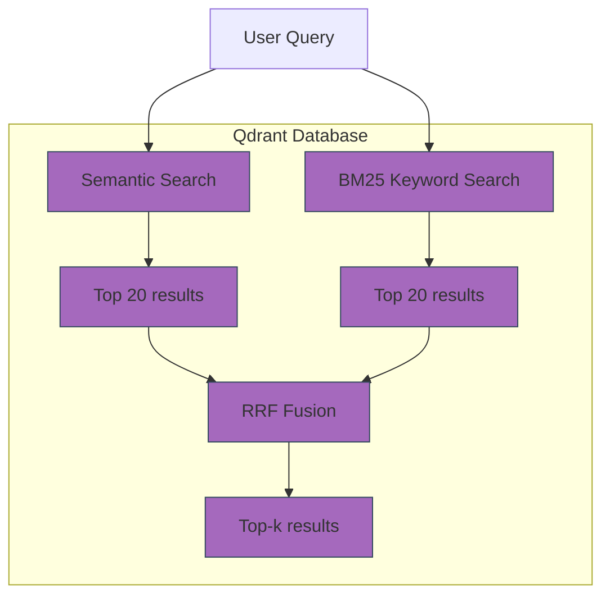
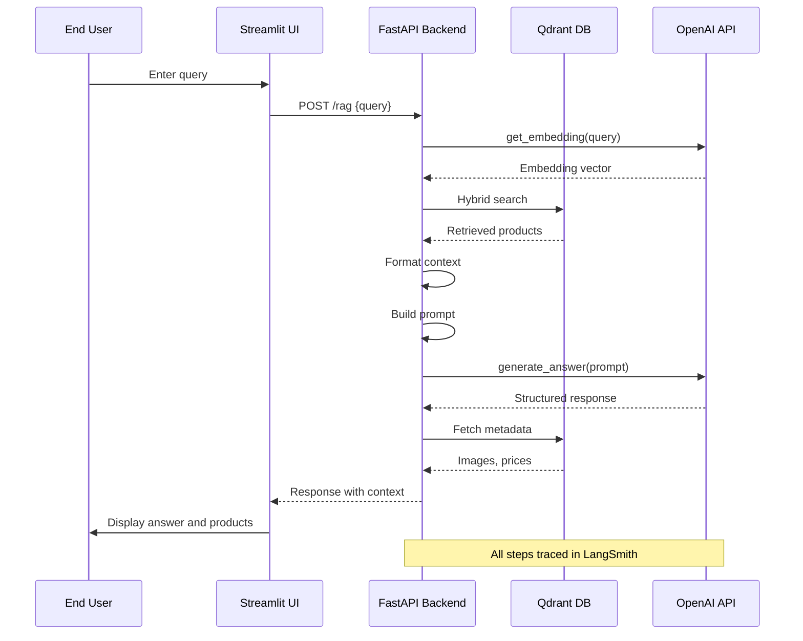

# Architecture

<cite>
**Referenced Files in This Document**   
- [docker-compose.yml](file://docker-compose.yml)
- [src/api/app.py](file://src/api/app.py)
- [src/api/api/endpoints.py](file://src/api/api/endpoints.py)
- [src/api/api/models.py](file://src/api/api/models.py)
- [src/api/api/middleware.py](file://src/api/api/middleware.py)
- [src/api/core/config.py](file://src/api/core/config.py)
- [src/api/rag/retrieval_generation.py](file://src/api/rag/retrieval_generation.py)
- [src/chatbot_ui/app.py](file://src/chatbot_ui/app.py)
- [src/chatbot_ui/core/config.py](file://src/chatbot_ui/core/config.py)
</cite>

## Table of Contents
1. [Introduction](#introduction)
2. [Project Structure](#project-structure)
3. [Core Components](#core-components)
4. [Architecture Overview](#architecture-overview)
5. [Detailed Component Analysis](#detailed-component-analysis)
6. [Dependency Analysis](#dependency-analysis)
7. [Performance Considerations](#performance-considerations)
8. [Troubleshooting Guide](#troubleshooting-guide)
9. [Conclusion](#conclusion)

## Introduction
The AI-Powered Amazon Product Assistant is a production-ready RAG (Retrieval-Augmented Generation) system that enables semantic product search over an Amazon Electronics dataset. The system follows a microservices architecture orchestrated via Docker Compose, with clear separation between the Streamlit frontend and FastAPI backend. This documentation details the architectural design, component interactions, data flow, and technology decisions that enable the system to deliver accurate, context-aware product recommendations through natural language queries.

## Project Structure
The project follows a modular structure with distinct directories for source code, documentation, notebooks, and configuration files. The core application logic is separated into two main components: the API backend and the chatbot UI, both located under the `src` directory. The architecture supports development workflows through Jupyter notebooks organized by phase, comprehensive documentation, and containerized services defined in Docker Compose.

**Diagram sources**
- [docker-compose.yml](file://docker-compose.yml)
- [src/api/app.py](file://src/api/app.py)
- [src/chatbot_ui/app.py](file://src/chatbot_ui/app.py)

**Section sources**
- [docker-compose.yml](file://docker-compose.yml)
- [src/api/app.py](file://src/api/app.py)
- [src/chatbot_ui/app.py](file://src/chatbot_ui/app.py)

## Core Components
The system consists of three core components: a Streamlit-based frontend for user interaction, a FastAPI backend that orchestrates the RAG pipeline, and a Qdrant vector database that enables hybrid search capabilities. These components work together to process user queries, retrieve relevant product information, generate natural language responses, and present product suggestions with images and pricing information.

**Section sources**
- [src/api/app.py](file://src/api/app.py)
- [src/chatbot_ui/app.py](file://src/chatbot_ui/app.py)
- [src/api/rag/retrieval_generation.py](file://src/api/rag/retrieval_generation.py)

## Architecture Overview
The system implements a microservices architecture deployed via Docker Compose, with three containerized services: Streamlit UI, FastAPI backend, and Qdrant vector database. The architecture enables separation of concerns, with the frontend handling user interaction and presentation, the backend managing business logic and API endpoints, and the database providing persistent storage and hybrid search capabilities.

**Diagram sources**
- [docker-compose.yml](file://docker-compose.yml)
- [src/api/app.py](file://src/api/app.py)
- [src/chatbot_ui/app.py](file://src/chatbot_ui/app.py)

## Detailed Component Analysis

### FastAPI Backend Analysis
The FastAPI backend serves as the central orchestration point for the RAG pipeline, exposing a RESTful API endpoint for processing user queries. Built with FastAPI for its performance and automatic documentation capabilities, the backend handles request validation, error handling, and coordination between the various components of the RAG system.

#### API Endpoint Structure

**Diagram sources**
- [src/api/api/models.py](file://src/api/api/models.py)

#### Request Processing Flow

**Diagram sources**
- [src/api/api/endpoints.py](file://src/api/api/endpoints.py)
- [src/api/rag/retrieval_generation.py](file://src/api/rag/retrieval_generation.py)

**Section sources**
- [src/api/app.py](file://src/api/app.py)
- [src/api/api/endpoints.py](file://src/api/api/endpoints.py)
- [src/api/api/models.py](file://src/api/api/models.py)
- [src/api/api/middleware.py](file://src/api/api/middleware.py)
- [src/api/core/config.py](file://src/api/core/config.py)

### Streamlit UI Analysis
The Streamlit frontend provides an interactive chat interface that enables users to query the product database using natural language. The UI is designed for rapid development and features a clean layout with a main chat area and a sidebar for product suggestions.

#### UI Component Structure

**Diagram sources**
- [src/chatbot_ui/app.py](file://src/chatbot_ui/app.py)
- [src/chatbot_ui/core/config.py](file://src/chatbot_ui/core/config.py)

#### User Interaction Flow

**Diagram sources**
- [src/chatbot_ui/app.py](file://src/chatbot_ui/app.py)

**Section sources**
- [src/chatbot_ui/app.py](file://src/chatbot_ui/app.py)
- [src/chatbot_ui/core/config.py](file://src/chatbot_ui/core/config.py)

### RAG Pipeline Analysis
The RAG (Retrieval-Augmented Generation) pipeline is the core intelligence of the system, implementing a sophisticated pattern that combines retrieval and generation to provide accurate, contextually relevant responses to user queries.

#### RAG Pipeline Implementation

**Diagram sources**
- [src/api/rag/retrieval_generation.py](file://src/api/rag/retrieval_generation.py)

#### Hybrid Search Mechanism

**Diagram sources**
- [src/api/rag/retrieval_generation.py](file://src/api/rag/retrieval_generation.py)

#### Data Flow Sequence

**Diagram sources**
- [src/api/rag/retrieval_generation.py](file://src/api/rag/retrieval_generation.py)
- [src/api/api/endpoints.py](file://src/api/api/endpoints.py)

**Section sources**
- [src/api/rag/retrieval_generation.py](file://src/api/rag/retrieval_generation.py)

## Dependency Analysis
The system's components are connected through well-defined interfaces and dependencies, with clear separation between services. The architecture leverages Docker Compose for service orchestration, enabling independent development and deployment of each component while maintaining seamless communication.

```mermaid
graph TD
A[Streamlit UI] --> |HTTP| B[FastAPI Backend]
B --> |gRPC| C[Qdrant Vector DB]
B --> |API Calls| D[OpenAI Services]
B --> |Tracing| E[LangSmith]
C --> |Persistent Storage| F[qdrant_storage/]
B --> |Configuration| G[.env file]
A --> |Configuration| G
style A fill:#4B9CD3,stroke:#34495E
style B fill:#27AE60,stroke:#34495E
style C fill:#9B59B6,stroke:#34495E
style D fill:#E74C3C,stroke:#34495E
style E fill:#F39C12,stroke:#34495E
style F fill:#34495E,stroke:#34495E
style G fill:#34495E,stroke:#34495E
```

**Diagram sources**
- [docker-compose.yml](file://docker-compose.yml)
- [src/api/core/config.py](file://src/api/core/config.py)
- [src/chatbot_ui/core/config.py](file://src/chatbot_ui/core/config.py)

## Performance Considerations
The architecture incorporates several performance optimizations to ensure responsive user experiences. FastAPI provides high-performance asynchronous request handling, while the hybrid search approach balances semantic understanding with keyword precision. The system uses LangSmith tracing to monitor latency and identify bottlenecks in the RAG pipeline. Caching strategies and connection pooling are potential areas for future optimization to further improve response times and reduce API costs.

## Troubleshooting Guide
When encountering issues with the system, consider the following common problems and solutions:

**Section sources**
- [src/api/rag/retrieval_generation.py](file://src/api/rag/retrieval_generation.py)
- [src/api/api/endpoints.py](file://src/api/api/endpoints.py)
- [src/chatbot_ui/app.py](file://src/chatbot_ui/app.py)

## Conclusion
The AI-Powered Amazon Product Assistant demonstrates a robust microservices architecture that effectively combines modern AI techniques with sound software engineering principles. By leveraging Docker Compose for orchestration, FastAPI for high-performance backend services, Streamlit for rapid UI development, and Qdrant for hybrid search capabilities, the system delivers a seamless user experience for natural language product discovery. The RAG implementation with structured outputs and comprehensive observability through LangSmith ensures both accuracy and maintainability. This architecture provides a solid foundation for further enhancements, including agent-based systems and multi-modal interactions, while remaining scalable for production deployment.