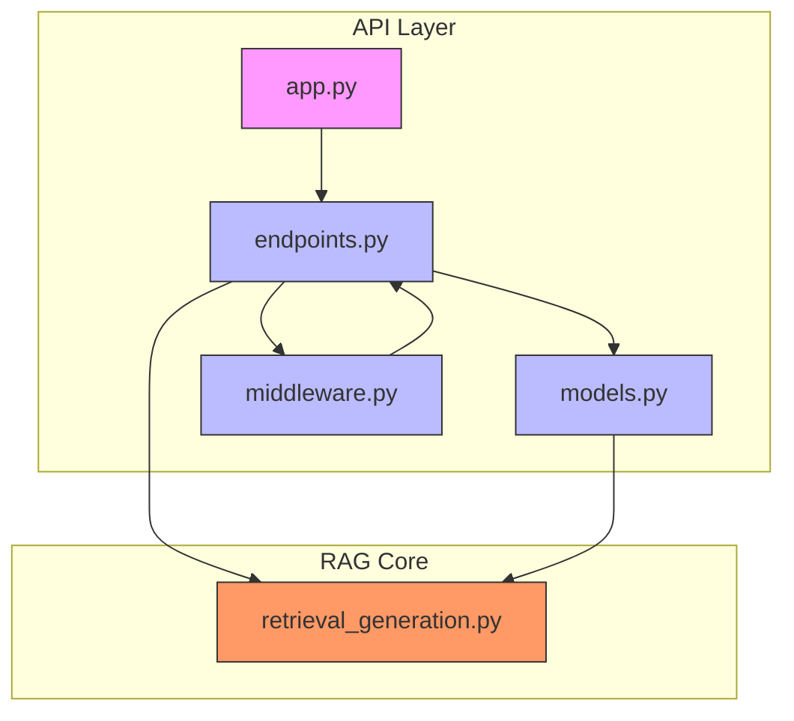
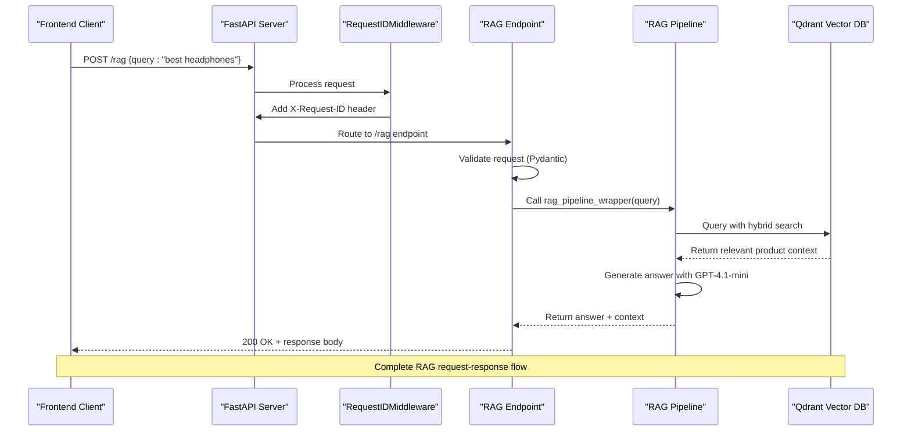
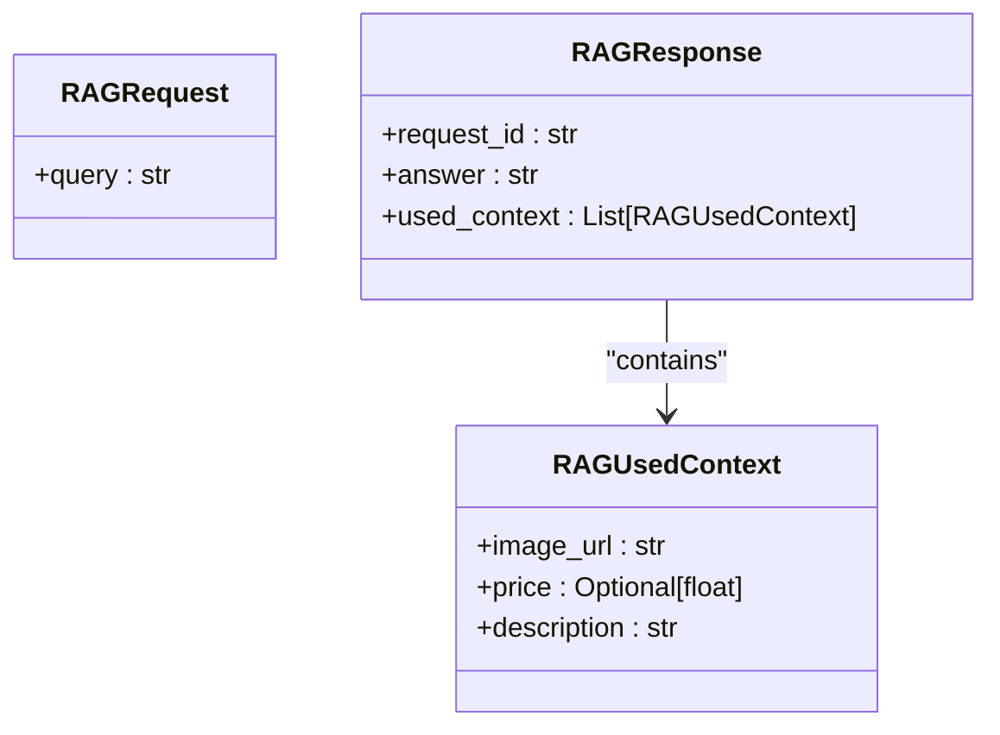
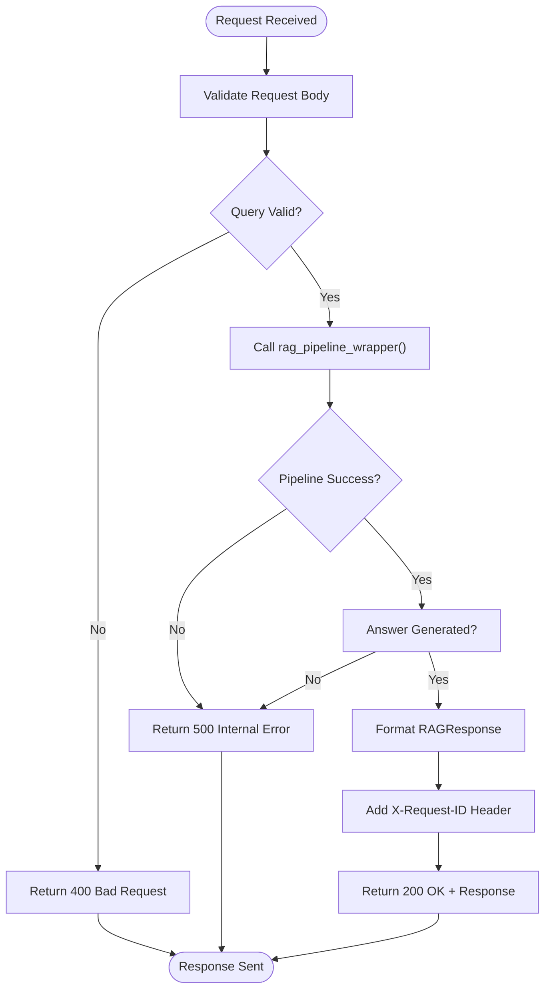
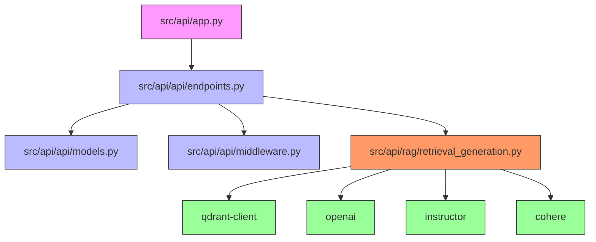

# API Endpoints

<cite>
**Referenced Files in This Document**   
- [src/api/api/endpoints.py](file://src/api/api/endpoints.py)
- [src/api/api/models.py](file://src/api/api/models.py)
- [src/api/rag/retrieval_generation.py](file://src/api/rag/retrieval_generation.py)
- [src/api/api/middleware.py](file://src/api/api/middleware.py)
- [src/api/app.py](file://src/api/app.py)
</cite>

## Table of Contents
1. [Introduction](#introduction)
2. [Project Structure](#project-structure)
3. [Core Components](#core-components)
4. [Architecture Overview](#architecture-overview)
5. [Detailed Component Analysis](#detailed-component-analysis)
6. [Dependency Analysis](#dependency-analysis)
7. [Performance Considerations](#performance-considerations)
8. [Troubleshooting Guide](#troubleshooting-guide)
9. [Conclusion](#conclusion)

## Introduction
This document provides comprehensive documentation for the FastAPI endpoints in the AI-Powered Amazon Product Assistant, with a primary focus on the POST /rag endpoint. The document explains the purpose of this endpoint in handling Retrieval-Augmented Generation (RAG) queries, its request validation mechanism using Pydantic models, and its integration with the core RAG pipeline. It details the complete request-response flow, error handling strategies, response structure, and the role of this endpoint as the contract between frontend and backend systems.

## Project Structure
The API endpoints are organized within a modular structure that separates concerns between routing, models, business logic, and application configuration. The core API functionality resides in the `src/api` directory, with specific components organized into dedicated subdirectories for endpoints, models, middleware, and the RAG processing pipeline.

**Diagram sources**
- [src/api/app.py](file://src/api/app.py#L1-L34)
- [src/api/api/endpoints.py](file://src/api/api/endpoints.py#L1-L73)
- [src/api/api/models.py](file://src/api/api/models.py#L1-L16)
- [src/api/api/middleware.py](file://src/api/api/middleware.py#L1-L24)
- [src/api/rag/retrieval_generation.py](file://src/api/rag/retrieval_generation.py#L1-L400)

**Section sources**
- [src/api/app.py](file://src/api/app.py#L1-L34)
- [src/api/api/endpoints.py](file://src/api/api/endpoints.py#L1-L73)

## Core Components
The core components of the API include the FastAPI application entry point, the RAG endpoint handler, Pydantic data models for request and response validation, middleware for request tracking, and the RAG pipeline implementation. These components work together to receive user queries, validate input, process requests through the retrieval-generation pipeline, and return structured responses with relevant product information.

**Section sources**
- [src/api/app.py](file://src/api/app.py#L1-L34)
- [src/api/api/endpoints.py](file://src/api/api/endpoints.py#L1-L73)
- [src/api/api/models.py](file://src/api/api/models.py#L1-L16)

## Architecture Overview
The API architecture follows a clean separation of concerns, with the FastAPI application serving as the entry point that routes requests to specific endpoints. The RAG endpoint acts as the interface between the frontend client and the backend RAG processing pipeline. When a request is received, it passes through middleware that adds a unique request identifier, then proceeds to the endpoint handler which validates the request, processes it through the RAG pipeline, and returns a structured response.

**Diagram sources**
- [src/api/app.py](file://src/api/app.py#L1-L34)
- [src/api/api/middleware.py](file://src/api/api/middleware.py#L1-L24)
- [src/api/api/endpoints.py](file://src/api/api/endpoints.py#L1-L73)
- [src/api/rag/retrieval_generation.py](file://src/api/rag/retrieval_generation.py#L1-L400)

## Detailed Component Analysis

### POST /rag Endpoint Analysis
The POST /rag endpoint serves as the primary interface for the RAG system, handling user queries about Amazon products and returning answers with supporting product context. This endpoint implements robust validation, error handling, and integrates with the core RAG pipeline to provide accurate, context-rich responses.

#### Request Validation and Models
The endpoint uses Pydantic models to enforce strict request validation, ensuring data integrity and providing clear error messages for invalid inputs.

**Diagram sources**
- [src/api/api/models.py](file://src/api/api/models.py#L4-L16)

**Section sources**
- [src/api/api/models.py](file://src/api/api/models.py#L4-L16)
- [src/api/api/endpoints.py](file://src/api/api/endpoints.py#L14-L69)

#### Request-Response Flow
The endpoint implements a comprehensive flow for processing RAG queries, from initial request reception to final response generation.

**Diagram sources**
- [src/api/api/endpoints.py](file://src/api/api/endpoints.py#L14-L69)
- [src/api/rag/retrieval_generation.py](file://src/api/rag/retrieval_generation.py#L331-L400)

**Section sources**
- [src/api/api/endpoints.py](file://src/api/api/endpoints.py#L14-L69)

## Dependency Analysis
The components of the API system are interconnected through well-defined dependencies that enable the RAG functionality. The endpoint depends on the models for validation, the middleware for request tracking, and the RAG pipeline for core processing.

**Diagram sources**
- [src/api/app.py](file://src/api/app.py#L1-L34)
- [src/api/api/endpoints.py](file://src/api/api/endpoints.py#L1-L73)
- [src/api/api/models.py](file://src/api/api/models.py#L1-L16)
- [src/api/api/middleware.py](file://src/api/api/middleware.py#L1-L24)
- [src/api/rag/retrieval_generation.py](file://src/api/rag/retrieval_generation.py#L1-L400)

**Section sources**
- [src/api/app.py](file://src/api/app.py#L1-L34)
- [src/api/api/endpoints.py](file://src/api/api/endpoints.py#L1-L73)

## Performance Considerations
The RAG endpoint is designed with performance in mind, implementing logging at key stages to monitor processing time and potential bottlenecks. The use of efficient vector search with Qdrant and optimized LLM calls with structured outputs helps maintain responsive performance. The hybrid search approach combines semantic and keyword-based retrieval to balance relevance and efficiency.

## Troubleshooting Guide
The system includes comprehensive error handling and logging to facilitate troubleshooting of issues with the RAG endpoint.

**Section sources**
- [src/api/api/endpoints.py](file://src/api/api/endpoints.py#L14-L69)
- [src/api/rag/retrieval_generation.py](file://src/api/rag/retrieval_generation.py#L331-L400)
- [src/api/api/middleware.py](file://src/api/api/middleware.py#L1-L24)

## Conclusion
The POST /rag endpoint serves as the critical contract between the frontend interface and the backend RAG processing system in the AI-Powered Amazon Product Assistant. It provides a robust, well-structured API that handles user queries, validates input, processes requests through the retrieval-generation pipeline, and returns informative responses with product context. The endpoint's design emphasizes reliability through comprehensive error handling, traceability through request identifiers, and maintainability through clear separation of concerns. This architecture enables the system to deliver accurate, context-rich answers to user queries about Amazon products while maintaining performance and reliability.