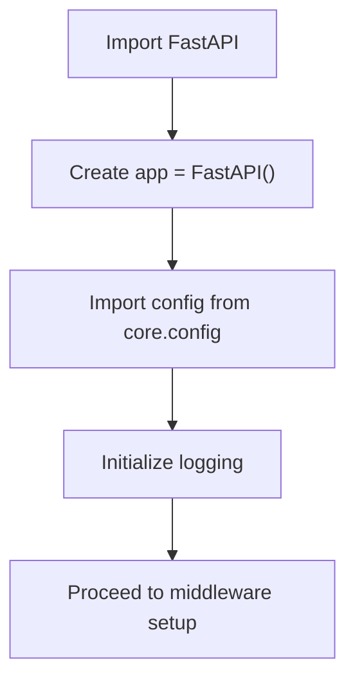
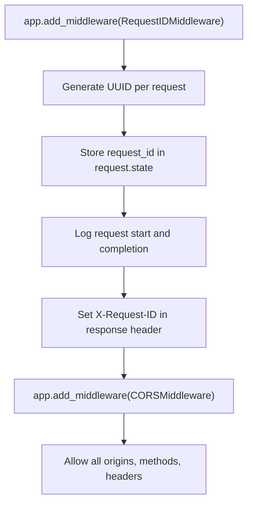
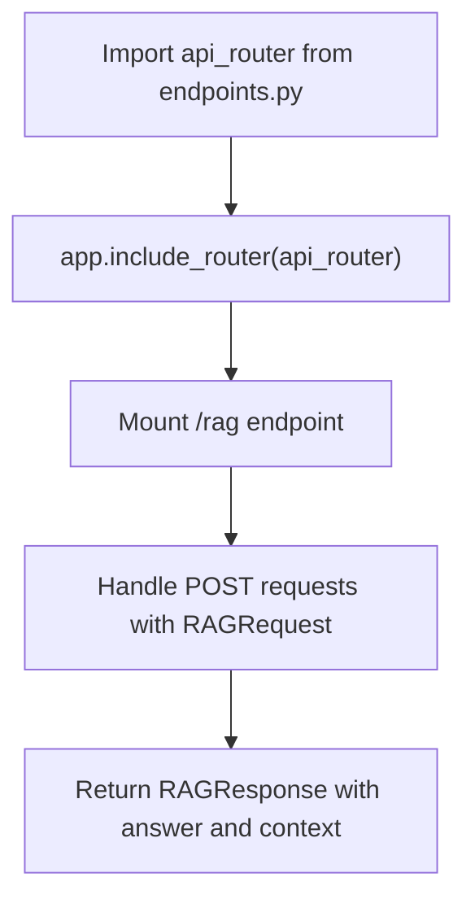
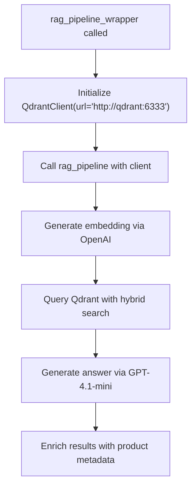
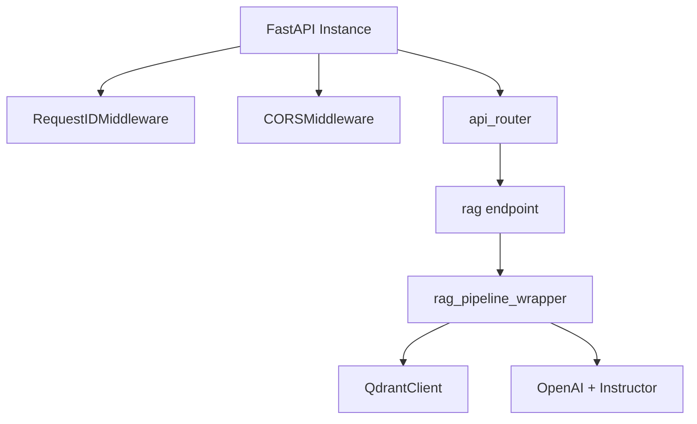

# Application Initialization

<cite>
**Referenced Files in This Document**   
- [app.py](file://src/api/app.py)
- [config.py](file://src/api/core/config.py)
- [endpoints.py](file://src/api/api/endpoints.py)
- [middleware.py](file://src/api/api/middleware.py)
- [retrieval_generation.py](file://src/api/rag/retrieval_generation.py)
</cite>

## Table of Contents
1. [Introduction](#introduction)
2. [Application Factory and FastAPI Instance Creation](#application-factory-and-fastapi-instance-creation)
3. [Middleware Registration](#middleware-registration)
4. [API Router Inclusion](#api-router-inclusion)
5. [Root Endpoint Definition](#root-endpoint-definition)
6. [Dependency Initialization in RAG Pipeline](#dependency-initialization-in-rag-pipeline)
7. [Execution Flow and Component Wiring](#execution-flow-and-component-wiring)
8. [Troubleshooting Common Startup Issues](#troubleshooting-common-startup-issues)
9. [Conclusion](#conclusion)

## Introduction
This document details the initialization process of the FastAPI application located in `src/api/app.py`. The application follows a straightforward initialization pattern where the FastAPI instance is created, middleware is registered for request tracking and CORS handling, and API routes are mounted via a central router. External dependencies such as Qdrant and OpenAI are not initialized at the application startup level but are instead instantiated on-demand within the RAG pipeline. The configuration is managed through Pydantic settings, loading environment variables from a `.env` file. This document explains how these components are wired together to ensure reliable service startup.

## Application Factory and FastAPI Instance Creation
The application begins by instantiating a FastAPI object, which serves as the core of the web service. This instance is created at the module level, making it directly accessible for configuration and routing. The configuration is imported from `src/api/core/config.py`, which defines environment-specific settings using Pydantic's `BaseSettings`. This ensures that critical API keys (OpenAI, Groq, Google, Cohere) are securely loaded from environment variables, promoting separation of configuration from code.

**Diagram sources**  
- [app.py](file://src/api/app.py#L1-L16)

**Section sources**  
- [app.py](file://src/api/app.py#L1-L16)
- [config.py](file://src/api/core/config.py#L1-L11)

## Middleware Registration
Two middleware components are registered with the FastAPI application to enhance observability and cross-origin resource sharing. The `RequestIDMiddleware` assigns a unique UUID to each incoming request, storing it in the request state and including it in the response headers as `X-Request-ID`. This facilitates end-to-end request tracing in logs. Additionally, the `CORSMiddleware` is configured to allow all origins, methods, and headers, enabling broad client access, which is typical during development but should be restricted in production.

**Diagram sources**  
- [app.py](file://src/api/app.py#L18-L27)
- [middleware.py](file://src/api/api/middleware.py#L9-L24)

**Section sources**  
- [app.py](file://src/api/app.py#L18-L27)
- [middleware.py](file://src/api/api/middleware.py#L1-L24)

## API Router Inclusion
The application routes are organized under a modular router defined in `src/api/api/endpoints.py`. This router, named `api_router`, is imported and included in the main application instance using `app.include_router()`. The router mounts a `/rag` endpoint that processes user queries through a Retrieval-Augmented Generation (RAG) pipeline. This modular approach promotes clean separation of concerns and scalable route management.

**Diagram sources**  
- [app.py](file://src/api/app.py#L14-L15)
- [endpoints.py](file://src/api/api/endpoints.py#L72-L73)

**Section sources**  
- [app.py](file://src/api/app.py#L14-L15)
- [endpoints.py](file://src/api/api/endpoints.py#L1-L74)

## Root Endpoint Definition
A simple root endpoint is defined using the `@app.get("/")` decorator, returning a static welcome message. This serves as a health check and entry point for users or monitoring systems to confirm the application is running. The endpoint is minimal and does not require complex processing or dependency injection.

**Section sources**  
- [app.py](file://src/api/app.py#L29-L33)

## Dependency Initialization in RAG Pipeline
Unlike typical FastAPI applications that use lifespan events or startup handlers, external dependencies (Qdrant, OpenAI) are initialized within the `rag_pipeline_wrapper` function in `src/api/rag/retrieval_generation.py`. The Qdrant client is instantiated with a hardcoded URL (`http://qdrant:6333`), indicating a Docker-based deployment. OpenAI integration occurs through the `instructor` library, which wraps the OpenAI client for structured output parsing. These dependencies are created on-demand per request, avoiding long-lived connections but potentially impacting performance.

**Diagram sources**  
- [retrieval_generation.py](file://src/api/rag/retrieval_generation.py#L331-L400)

**Section sources**  
- [retrieval_generation.py](file://src/api/rag/retrieval_generation.py#L1-L401)

## Execution Flow and Component Wiring
The initialization sequence ensures reliable startup by separating configuration, middleware, and routing concerns. The FastAPI instance is created first, followed by middleware registration for observability and security (CORS). Routes are then mounted from a dedicated module, promoting modularity. Dependencies are deferred to the business logic layer, reducing startup complexity. This wiring ensures that the application is ready to serve requests immediately after startup, with critical services initialized just-in-time.

**Diagram sources**  
- [app.py](file://src/api/app.py#L1-L33)
- [retrieval_generation.py](file://src/api/rag/retrieval_generation.py#L331-L400)

**Section sources**  
- [app.py](file://src/api/app.py#L1-L33)
- [retrieval_generation.py](file://src/api/rag/retrieval_generation.py#L331-L400)

## Troubleshooting Common Startup Issues
Common startup failures include missing environment variables and port conflicts. If `OPENAI_API_KEY`, `GROQ_API_KEY`, `GOOGLE_API_KEY`, or `CO_API_KEY` are not set in the `.env` file, the application will fail to start with a `ValidationError` from Pydantic. Ensure the `.env` file exists in the root directory with all required keys. Port conflicts may occur if another service occupies the default port (likely 8000). Use `lsof -i :8000` to check port usage and configure Uvicorn to use an alternative port via command-line arguments. Additionally, if the Qdrant service is not running at `http://qdrant:6333`, RAG requests will fail, though the application itself will start successfully.

**Section sources**  
- [config.py](file://src/api/core/config.py#L1-L11)
- [retrieval_generation.py](file://src/api/rag/retrieval_generation.py#L331-L400)

## Conclusion
The FastAPI application in `src/api/app.py` employs a clean and modular initialization pattern. It creates the FastAPI instance, registers essential middleware for request tracking and CORS, and mounts API routes through a centralized router. While external dependencies are not initialized at startup, they are reliably instantiated within the RAG pipeline, ensuring that the application remains lightweight and responsive. This design promotes maintainability, observability, and scalability, with clear separation between application setup and business logic execution.