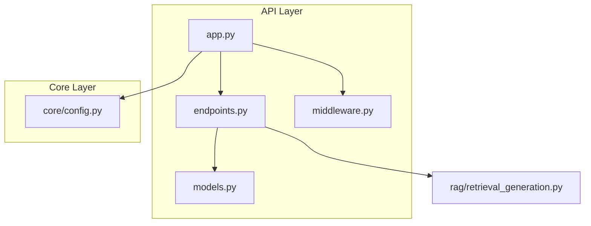
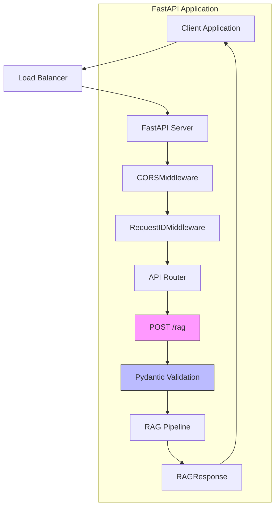
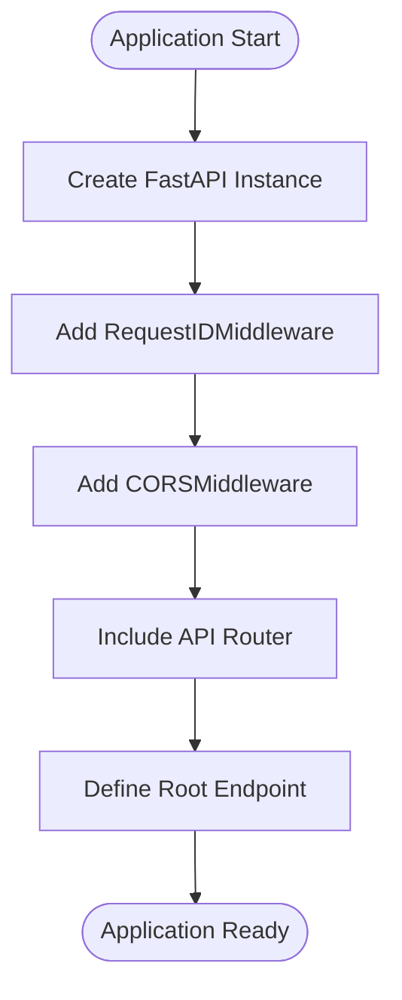
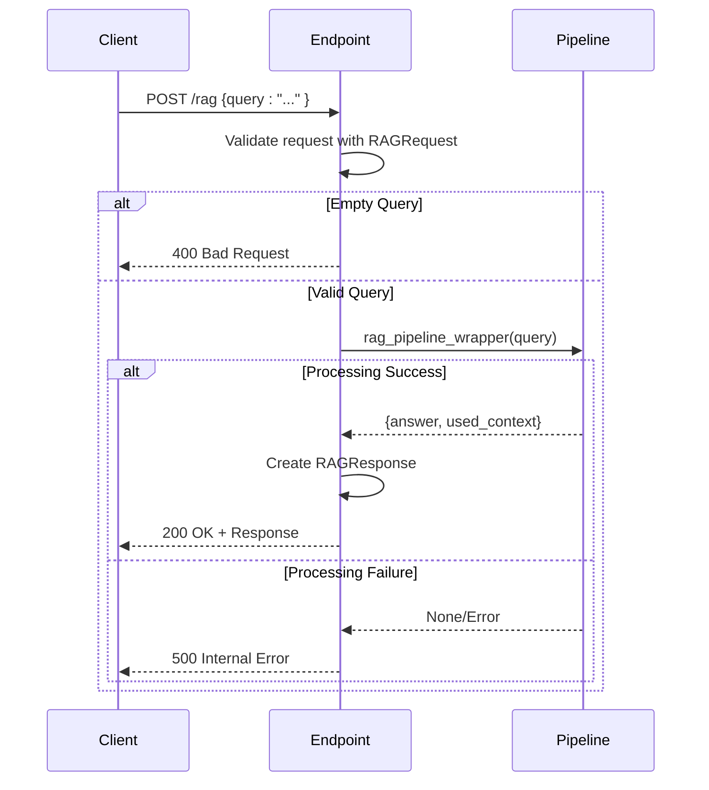
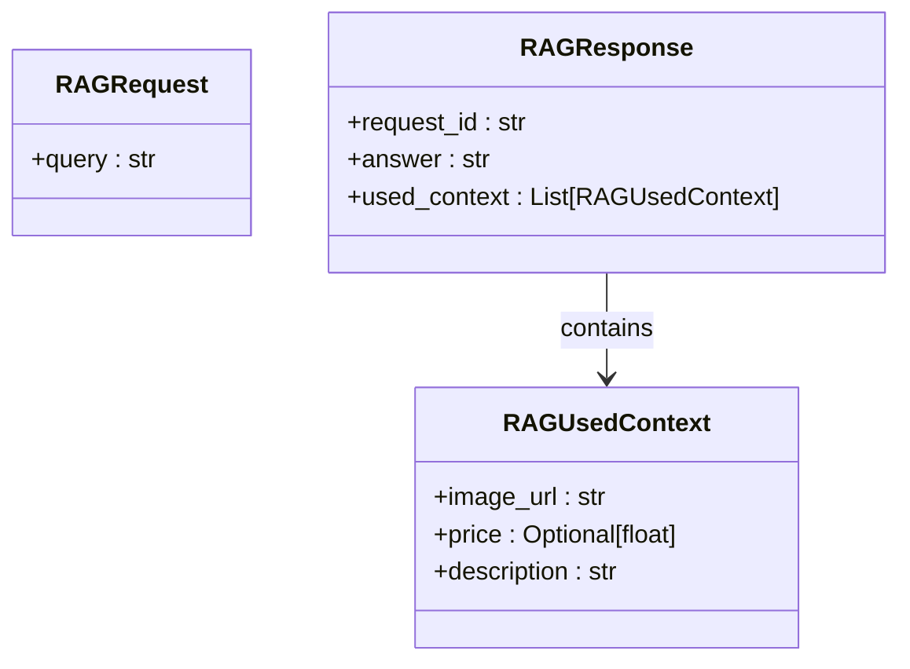
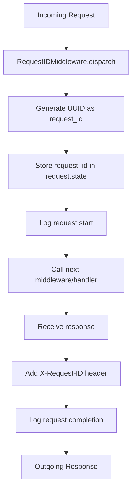
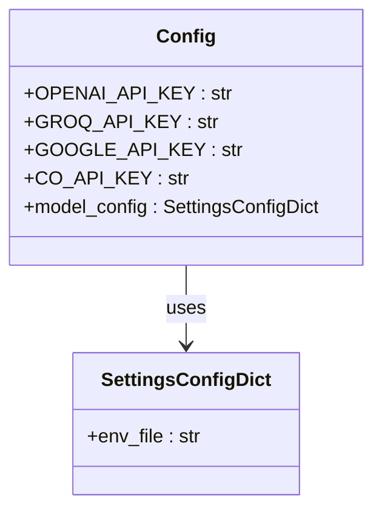
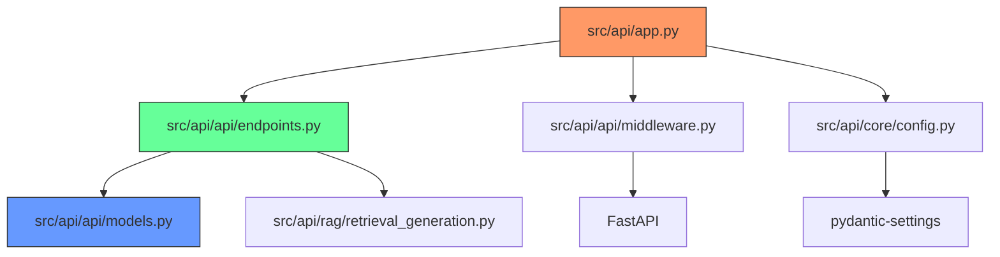

# Backend Architecture

<cite>
**Referenced Files in This Document**   
- [src/api/app.py](file://src/api/app.py)
- [src/api/api/endpoints.py](file://src/api/api/endpoints.py)
- [src/api/api/models.py](file://src/api/api/models.py)
- [src/api/api/middleware.py](file://src/api/api/middleware.py)
- [src/api/core/config.py](file://src/api/core/config.py)
</cite>

## Table of Contents
1. [Introduction](#introduction)
2. [Project Structure](#project-structure)
3. [Core Components](#core-components)
4. [Architecture Overview](#architecture-overview)
5. [Detailed Component Analysis](#detailed-component-analysis)
6. [Dependency Analysis](#dependency-analysis)
7. [Performance Considerations](#performance-considerations)
8. [Troubleshooting Guide](#troubleshooting-guide)
9. [Conclusion](#conclusion)

## Introduction
This document provides a comprehensive architectural overview of the FastAPI backend service for the AI-Powered Amazon Product Assistant. It details the application initialization, endpoint implementation, middleware stack, configuration management, and error handling strategy. The system is designed to support Retrieval-Augmented Generation (RAG) workflows with robust tracing, cross-origin support, and structured request/response validation.

## Project Structure
The backend service is organized in a modular structure under the `src/api` directory. The core application components are separated into distinct packages: `app.py` for application initialization, `api/` for endpoints and models, `core/` for configuration, and `rag/` for RAG-specific logic. This separation enables clear responsibility boundaries and facilitates maintainability.

**Diagram sources**
- [src/api/app.py](file://src/api/app.py#L1-L33)
- [src/api/api/endpoints.py](file://src/api/api/endpoints.py#L1-L73)
- [src/api/api/models.py](file://src/api/api/models.py#L1-L16)
- [src/api/api/middleware.py](file://src/api/api/middleware.py#L1-L24)
- [src/api/core/config.py](file://src/api/core/config.py#L1-L10)

**Section sources**
- [src/api/app.py](file://src/api/app.py#L1-L33)
- [src/api/api/endpoints.py](file://src/api/api/endpoints.py#L1-L73)

## Core Components
The backend consists of five core components: the FastAPI application instance, API endpoints for RAG processing, Pydantic models for request/response validation, custom middleware for request tracing and CORS, and a configuration system based on Pydantic Settings. These components work together to provide a robust, traceable, and secure API service for product recommendation queries.

**Section sources**
- [src/api/app.py](file://src/api/app.py#L16-L16)
- [src/api/api/models.py](file://src/api/api/models.py#L4-L5)
- [src/api/api/middleware.py](file://src/api/api/middleware.py#L9-L24)
- [src/api/core/config.py](file://src/api/core/config.py#L10-L10)

## Architecture Overview
The FastAPI backend follows a layered architecture with clear separation between application initialization, API routing, business logic, and external dependencies. The service starts with application configuration in `app.py`, which registers middleware and includes API routers. Requests flow through middleware for request ID generation and CORS handling before reaching the RAG endpoint, where they are validated and processed.

**Diagram sources**
- [src/api/app.py](file://src/api/app.py#L1-L33)
- [src/api/api/endpoints.py](file://src/api/api/endpoints.py#L1-L73)
- [src/api/api/middleware.py](file://src/api/api/middleware.py#L1-L24)

## Detailed Component Analysis

### Application Initialization
The FastAPI application is initialized in `src/api/app.py` with essential middleware and router configuration. The application instance is created and configured to include CORS middleware with permissive settings (allowing all origins, methods, and headers) and a custom RequestIDMiddleware for distributed tracing. The API router from `endpoints.py` is included to register all endpoints.

**Diagram sources**
- [src/api/app.py](file://src/api/app.py#L16-L33)

**Section sources**
- [src/api/app.py](file://src/api/app.py#L1-L33)

### Endpoint Implementation
The RAG endpoint is implemented as a POST route at `/rag` using FastAPI's APIRouter. The endpoint accepts a `RAGRequest` model containing the user query, validates the input, and returns a `RAGResponse` containing the answer and contextual product information. The endpoint includes comprehensive error handling for empty queries and internal processing failures.

**Diagram sources**
- [src/api/api/endpoints.py](file://src/api/api/endpoints.py#L1-L73)

**Section sources**
- [src/api/api/endpoints.py](file://src/api/api/endpoints.py#L1-L73)

### Request Validation and Response Schema
Request validation is implemented using Pydantic models defined in `models.py`. The `RAGRequest` model enforces that a non-empty query string is provided, while the `RAGResponse` model defines the structure of the successful response, including the request ID, answer text, and list of used context items. Each context item includes product details like image URL, price, and description.

**Diagram sources**
- [src/api/api/models.py](file://src/api/api/models.py#L4-L16)

**Section sources**
- [src/api/api/models.py](file://src/api/api/models.py#L1-L16)

### Middleware Stack
The application employs two middleware components: `RequestIDMiddleware` for request tracing and `CORSMiddleware` for cross-origin resource sharing. The RequestIDMiddleware generates a unique UUID for each request, stores it in the request state, and includes it in the response headers as `X-Request-ID`. This enables end-to-end request tracing across distributed systems.

**Diagram sources**
- [src/api/api/middleware.py](file://src/api/api/middleware.py#L9-L24)

**Section sources**
- [src/api/api/middleware.py](file://src/api/api/middleware.py#L1-L24)

### Configuration Management
Configuration is managed through Pydantic's BaseSettings in `core/config.py`. The Config class defines required API keys for external services (OpenAI, Groq, Google, and Cohere) and loads values from a `.env` file using SettingsConfigDict. This approach provides type-safe configuration with automatic environment variable loading and validation.

**Diagram sources**
- [src/api/core/config.py](file://src/api/core/config.py#L1-L10)

**Section sources**
- [src/api/core/config.py](file://src/api/core/config.py#L1-L10)

## Dependency Analysis
The backend service has a clear dependency hierarchy with minimal circular dependencies. The main application depends on the API endpoints, middleware, and configuration modules. The endpoints depend on the models for validation and the RAG pipeline for business logic. All components share a common logging configuration and exception handling strategy.

**Diagram sources**
- [src/api/app.py](file://src/api/app.py#L1-L33)
- [src/api/api/endpoints.py](file://src/api/api/endpoints.py#L1-L73)
- [src/api/api/models.py](file://src/api/api/models.py#L1-L16)
- [src/api/api/middleware.py](file://src/api/api/middleware.py#L1-L24)
- [src/api/core/config.py](file://src/api/core/config.py#L1-L10)

**Section sources**
- [src/api/app.py](file://src/api/app.py#L1-L33)
- [src/api/api/endpoints.py](file://src/api/api/endpoints.py#L1-L73)

## Performance Considerations
The application is designed with performance and observability in mind. Each request is assigned a unique ID for tracing, and comprehensive logging is implemented at key points in the request lifecycle. The use of Pydantic for validation ensures efficient data parsing and error handling. The middleware pattern allows for non-blocking request processing, and the error handling strategy prevents internal server details from being exposed to clients.

## Troubleshooting Guide
The system implements a robust error handling strategy with appropriate HTTP status codes: 400 for client errors (empty queries) and 500 for server errors (pipeline failures). Each request is logged with its unique request ID, enabling easy correlation of logs across the system. The X-Request-ID response header allows clients to reference specific requests when reporting issues.

**Section sources**
- [src/api/api/endpoints.py](file://src/api/api/endpoints.py#L1-L73)
- [src/api/api/middleware.py](file://src/api/api/middleware.py#L1-L24)

## Conclusion
The FastAPI backend service provides a well-structured, maintainable architecture for the AI-Powered Amazon Product Assistant. Key architectural decisions include the use of Pydantic for data validation, middleware for cross-cutting concerns like tracing and CORS, and a clean separation of concerns between application initialization, API endpoints, and business logic. The system is designed for observability with request ID tracing and comprehensive logging, making it suitable for production deployment and troubleshooting.