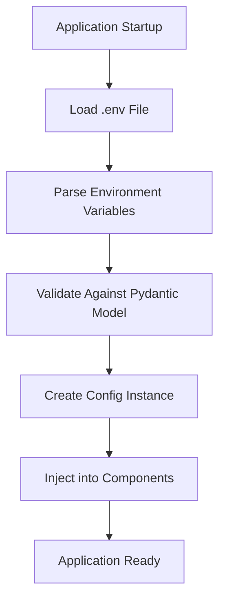
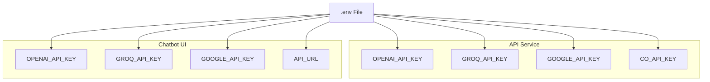
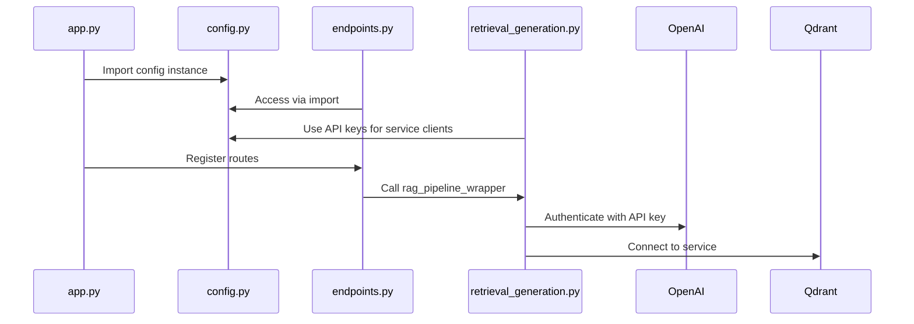

# Configuration Management

<cite>
**Referenced Files in This Document**   
- [config.py](file://src/api/core/config.py)
- [config.py](file://src/chatbot_ui/core/config.py)
- [app.py](file://src/api/app.py)
- [endpoints.py](file://src/api/api/endpoints.py)
- [retrieval_generation.py](file://src/api/rag/retrieval_generation.py)
- [middleware.py](file://src/api/api/middleware.py)
- [pyproject.toml](file://pyproject.toml)
</cite>

## Table of Contents
1. [Introduction](#introduction)
2. [Configuration System Overview](#configuration-system-overview)
3. [Settings Definition and Validation](#settings-definition-and-validation)
4. [Environment Variable Loading](#environment-variable-loading)
5. [Configuration Hierarchy](#configuration-hierarchy)
6. [Dependency Injection and Component Integration](#dependency-injection-and-component-integration)
7. [Best Practices for Environment Management](#best-practices-for-environment-management)
8. [Error Handling and Debugging](#error-handling-and-debugging)
9. [Security Considerations](#security-considerations)
10. [Conclusion](#conclusion)

## Introduction
This document provides comprehensive architectural documentation for the configuration management system in the AI-Powered Amazon Product Assistant. The system leverages Pydantic Settings to implement type-safe, validated configuration with automatic environment variable loading. The documentation details how configuration is structured, validated, and injected across components including API endpoints, the RAG pipeline, and middleware layers.

**Section sources**
- [config.py](file://src/api/core/config.py#L0-L10)
- [config.py](file://src/chatbot_ui/core/config.py#L0-L11)

## Configuration System Overview
The application implements a robust configuration system using Pydantic Settings, which provides automatic type validation, environment variable loading from `.env` files, and structured configuration management. The system ensures that all configuration values are properly typed and validated at application startup, preventing runtime errors due to misconfiguration.

Two primary configuration instances exist in the system: one for the API service and another for the chatbot UI. Both configurations inherit from Pydantic's `BaseSettings` class, enabling consistent behavior across services while allowing service-specific settings.



**Diagram sources**
- [config.py](file://src/api/core/config.py#L0-L10)
- [config.py](file://src/chatbot_ui/core/config.py#L0-L11)

**Section sources**
- [config.py](file://src/api/core/config.py#L0-L10)
- [config.py](file://src/chatbot_ui/core/config.py#L0-L11)

## Settings Definition and Validation
Configuration settings are defined using Pydantic models that inherit from `BaseSettings`. This approach provides automatic type checking, validation, and IDE support. Each setting is declared with its type annotation, ensuring that only values of the correct type can be assigned.

The API service configuration defines several API keys as required string fields, including `OPENAI_API_KEY`, `GROQ_API_KEY`, `GOOGLE_API_KEY`, and `CO_API_KEY`. These fields are mandatory and must be present in the environment for the application to start. The chatbot UI configuration includes the same API keys plus an `API_URL` field with a default value pointing to the API service.

Validation occurs automatically when the configuration instance is created. If any required field is missing or has an invalid type, Pydantic raises a validation error with detailed information about the issue, preventing the application from starting with invalid configuration.

```mermaid
classDiagram
class BaseSettings {
<<abstract>>
+dict model_dump()
+str model_dump_json()
+validate_assignment : bool
}
class Config {
+str OPENAI_API_KEY
+str GROQ_API_KEY
+str GOOGLE_API_KEY
+str CO_API_KEY
+SettingsConfigDict model_config
}
Config --> BaseSettings : inherits
note right of Config
API service configuration with
required API keys and .env loading
end
```

**Diagram sources**
- [config.py](file://src/api/core/config.py#L2-L8)

**Section sources**
- [config.py](file://src/api/core/config.py#L2-L8)

## Environment Variable Loading
The configuration system automatically loads environment variables from a `.env` file located in the application root directory. This is configured through the `SettingsConfigDict` with the `env_file=".env"` parameter. When the application starts, Pydantic reads the `.env` file and populates the configuration model with the values.

The system uses python-dotenv (included as a dependency of pydantic-settings) to parse the `.env` file. Environment variables defined in the file are automatically mapped to the corresponding fields in the configuration model based on name matching. This eliminates the need for manual environment variable loading and provides a clean separation between configuration values and code.

The pyproject.toml file specifies pydantic-settings as a dependency, which includes both pydantic and python-dotenv, ensuring that the environment loading functionality is available without additional dependencies.

**Section sources**
- [config.py](file://src/api/core/config.py#L7-L8)
- [pyproject.toml](file://pyproject.toml#L2414-L2426)

## Configuration Hierarchy
The application implements a hierarchical configuration structure with service-specific settings. The API service configuration contains all credentials needed for backend operations, including access to AI services like OpenAI, Groq, Google, and Cohere. The chatbot UI configuration includes the same API keys for client-side functionality plus the `API_URL` setting that defines how the UI connects to the backend service.

This separation allows different deployment environments to have different configurations while maintaining consistency in credential management. The default `API_URL` value of "http://api:8000" is optimized for Docker Compose deployments, where services are networked by name.

The configuration hierarchy supports environment-specific overrides through the `.env` file, allowing different values to be used in development, testing, and production environments without code changes.



**Diagram sources**
- [config.py](file://src/api/core/config.py#L2-L8)
- [config.py](file://src/chatbot_ui/core/config.py#L2-L9)

**Section sources**
- [config.py](file://src/api/core/config.py#L2-L8)
- [config.py](file://src/chatbot_ui/core/config.py#L2-L9)

## Dependency Injection and Component Integration
Configuration is injected into application components through direct import of the configured instance. The `config` object is instantiated at module level in both the API and UI services, making it globally available throughout each service.

In the API service, the configuration is imported into `app.py` where it's used during application initialization. The RAG pipeline in `retrieval_generation.py` accesses API keys directly from the configuration when initializing clients for OpenAI and Cohere services. The Qdrant client connection details are hardcoded in the `rag_pipeline_wrapper` function, indicating a potential area for configuration extraction.

Middleware components like `RequestIDMiddleware` do not directly use configuration values but operate within the same application context that has access to the configuration system. API endpoints access configuration indirectly through the RAG pipeline, which uses the API keys for service authentication.



**Diagram sources**
- [app.py](file://src/api/app.py#L5-L6)
- [endpoints.py](file://src/api/api/endpoints.py#L3-L4)
- [retrieval_generation.py](file://src/api/rag/retrieval_generation.py#L1-L5)

**Section sources**
- [app.py](file://src/api/app.py#L5-L6)
- [endpoints.py](file://src/api/api/endpoints.py#L3-L4)
- [retrieval_generation.py](file://src/api/rag/retrieval_generation.py#L1-L5)

## Best Practices for Environment Management
The configuration system follows several best practices for environment management. By using a `.env` file, the application separates configuration from code, allowing different environments to use different settings without code changes. Sensitive credentials are kept out of version control and can be managed separately for each deployment environment.

For development environments, developers can create a local `.env` file with their personal API keys and test settings. Production deployments can use environment variables passed through container orchestration or cloud platform configuration, bypassing the `.env` file entirely while still using the same configuration interface.

The use of default values for non-sensitive settings like `API_URL` reduces configuration burden while still allowing overrides when needed. This approach supports the twelve-factor app methodology by treating config as environment variables.

To manage multiple environments, teams should maintain separate `.env` files (e.g., `.env.development`, `.env.production`) and use environment-specific variable loading or deployment scripts to ensure the correct configuration is used in each environment.

**Section sources**
- [config.py](file://src/chatbot_ui/core/config.py#L7-L8)

## Error Handling and Debugging
The configuration system provides robust error handling through Pydantic's validation mechanisms. If required environment variables are missing or have invalid types, the application fails fast at startup with a clear error message identifying the problematic field. This prevents silent failures and makes configuration issues immediately apparent.

When debugging configuration issues, developers should first verify that the `.env` file exists in the correct location and contains all required variables. The application's logging system, configured in `app.py`, can help identify configuration-related issues by showing when the application starts and what services are being initialized.

Common configuration issues include missing API keys, incorrect file paths for prompt templates, and network configuration problems for service connections. These can be diagnosed by checking the `.env` file contents, verifying network connectivity, and ensuring that all required services are running.

**Section sources**
- [config.py](file://src/api/core/config.py#L2-L8)
- [app.py](file://src/api/app.py#L10-L15)

## Security Considerations
The configuration system addresses several security concerns. Sensitive credentials like API keys are stored in the `.env` file, which should be added to `.gitignore` to prevent accidental exposure in version control. The pyproject.toml file correctly excludes the `.env` file from packaging.

All API keys are treated as required secrets that must be provided externally, following the principle of least privilege. The application does not hardcode any credentials in the source code, reducing the risk of credential leakage.

For production deployments, teams should consider using secret management systems instead of `.env` files, injecting environment variables through secure channels. The current configuration system supports this transition seamlessly, as Pydantic Settings can read from environment variables directly without the `.env` file.

The system should be enhanced by adding validation for API key formats where possible and implementing configuration encryption for highly sensitive environments.

**Section sources**
- [config.py](file://src/api/core/config.py#L2-L8)
- [pyproject.toml](file://pyproject.toml#L2414-L2426)

## Conclusion
The configuration management system in the AI-Powered Amazon Product Assistant provides a robust, type-safe foundation for application settings. By leveraging Pydantic Settings, the system ensures that all configuration is validated at startup, preventing many common runtime errors. The separation of configuration from code through `.env` file loading enables flexible deployment across different environments while maintaining security for sensitive credentials.

The current implementation could be improved by extracting more hardcoded values (like Qdrant connection details) into the configuration system and by adding more sophisticated validation rules for API keys. Overall, the system provides a solid foundation for managing application configuration in a secure and maintainable way.