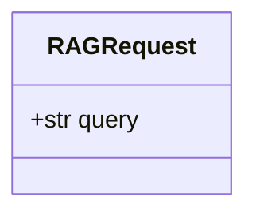
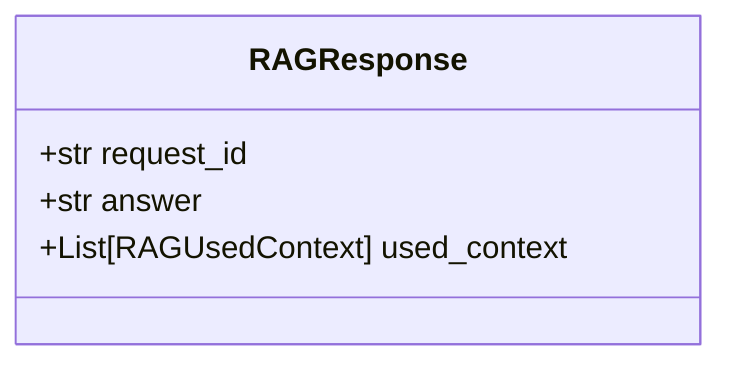
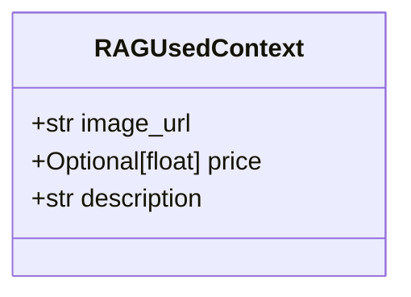
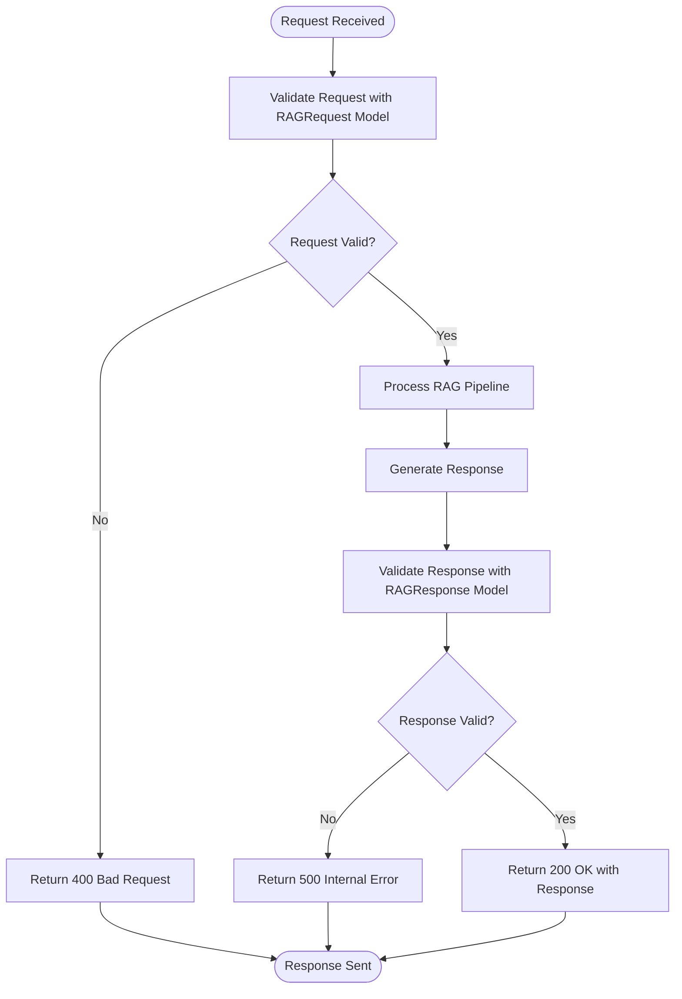
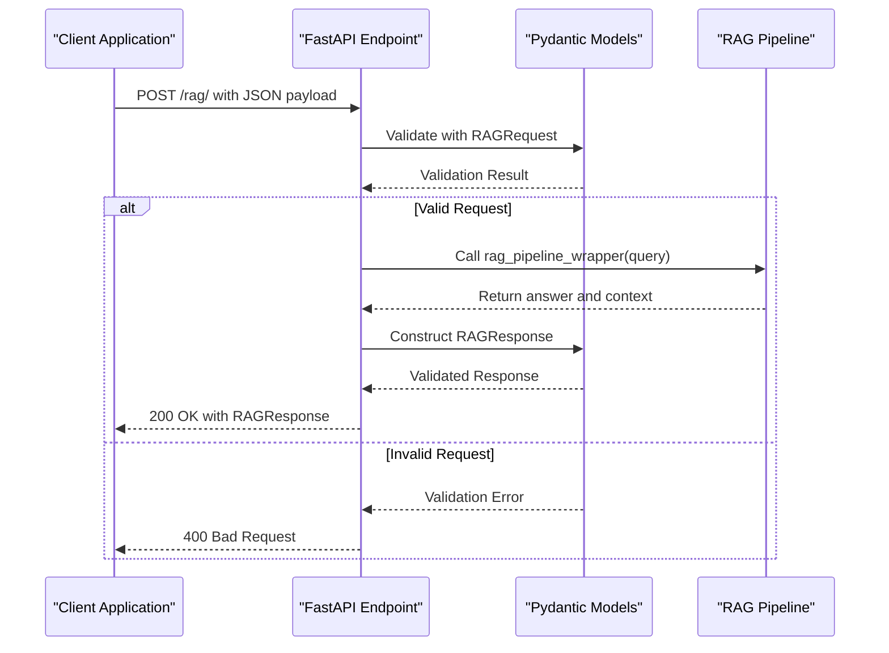
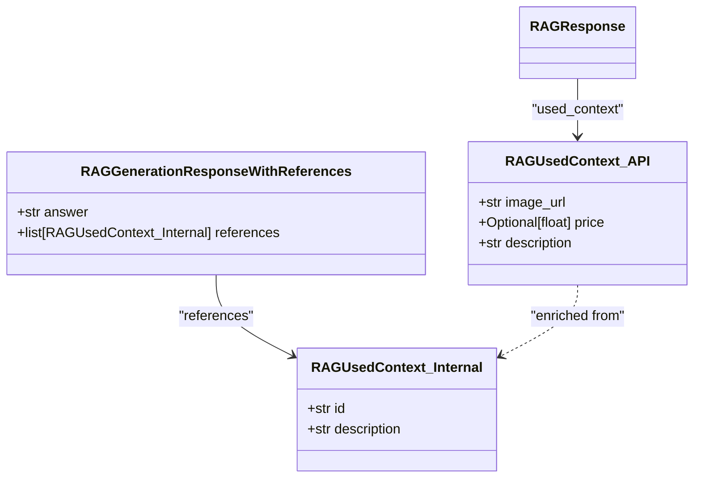

# Data Models

<cite>
**Referenced Files in This Document**   
- [models.py](file://src/api/api/models.py)
- [endpoints.py](file://src/api/api/endpoints.py)
- [retrieval_generation.py](file://src/api/rag/retrieval_generation.py)
- [test_models.py](file://tests/test_models.py)
</cite>

## Table of Contents
1. [Introduction](#introduction)
2. [Core Data Models](#core-data-models)
3. [Model Validation and Error Handling](#model-validation-and-error-handling)
4. [Request-Response Lifecycle](#request-response-lifecycle)
5. [Integration with RAG Pipeline](#integration-with-rag-pipeline)
6. [Extensibility and Backward Compatibility](#extensibility-and-backward-compatibility)
7. [Testing and Validation](#testing-and-validation)
8. [Conclusion](#conclusion)

## Introduction
This document provides comprehensive documentation for the Pydantic models used in the FastAPI backend of the AI-Powered Amazon Product Assistant. The primary models—RAGRequest, RAGResponse, and RAGUsedContext—serve as the foundation for structured data exchange between clients and the backend system. These models enforce strict schema contracts that ensure data integrity, enable automatic API documentation generation, and provide robust validation for all incoming and outgoing payloads. The models are strategically designed to support the Retrieval-Augmented Generation (RAG) pipeline, facilitating seamless communication between the API endpoints and the underlying AI components.

**Section sources**
- [models.py](file://src/api/api/models.py#L4-L16)

## Core Data Models

### RAGRequest Model
The RAGRequest model defines the structure for incoming requests to the RAG endpoint. It contains a single required field, `query`, which represents the user's natural language question or search query that will be processed by the RAG pipeline. The model enforces that the query field must be present and non-null, ensuring that all requests contain meaningful input for processing. This simple yet focused structure allows clients to submit queries with minimal overhead while providing the necessary information for the backend to initiate the retrieval and generation process.



**Diagram sources**
- [models.py](file://src/api/api/models.py#L4-L5)

**Section sources**
- [models.py](file://src/api/api/models.py#L4-L5)

### RAGResponse Model
The RAGResponse model defines the structure of successful responses from the RAG endpoint. It contains three required fields: `request_id`, `answer`, and `used_context`. The `request_id` field provides a unique identifier for tracking and debugging purposes, enabling correlation between requests and responses. The `answer` field contains the generated natural language response to the user's query. The `used_context` field is a list of RAGUsedContext objects that provide information about the Amazon products used to generate the answer, creating transparency in the AI's decision-making process.



**Diagram sources**
- [models.py](file://src/api/api/models.py#L13-L16)

**Section sources**
- [models.py](file://src/api/api/models.py#L13-L16)

### RAGUsedContext Model
The RAGUsedContext model defines the structure of product context information included in the response. It contains three fields: `image_url`, `price`, and `description`. The `image_url` field provides a link to the product's image, enabling rich UI rendering. The `price` field is optional and may be null if pricing information is unavailable, reflecting the real-world scenario where not all products have listed prices. The `description` field contains a textual description of the product used in generating the response. This model serves as a bridge between the AI-generated content and the actual product data, allowing clients to display relevant product information alongside the AI's answer.



**Diagram sources**
- [models.py](file://src/api/api/models.py#L8-L11)

**Section sources**
- [models.py](file://src/api/api/models.py#L8-L11)

## Model Validation and Error Handling

### Validation Rules and Constraints
The Pydantic models enforce strict validation rules to ensure data integrity throughout the API lifecycle. The RAGRequest model requires the `query` field to be present and non-null, preventing empty or malformed requests from entering the system. The RAGResponse model enforces that all three fields (`request_id`, `answer`, and `used_context`) must be present, ensuring that successful responses contain complete information. The RAGUsedContext model requires `image_url` and `description` fields to be present while allowing `price` to be optional, reflecting the varying completeness of product data in the underlying database.

The validation system prevents common input errors such as missing required fields, type mismatches, and null values for non-optional fields. When invalid data is received, Pydantic automatically raises validation errors that are translated into appropriate HTTP 400 Bad Request responses by FastAPI, providing clear feedback to clients about the nature of the validation failure.



**Diagram sources**
- [models.py](file://src/api/api/models.py#L4-L16)
- [endpoints.py](file://src/api/api/endpoints.py#L20-L73)

**Section sources**
- [models.py](file://src/api/api/models.py#L4-L16)
- [endpoints.py](file://src/api/api/endpoints.py#L20-L73)

### Example Payloads
**Valid Request Payload:**
```json
{
  "query": "What are some good wireless earbuds under $100?"
}
```

**Valid Response Payload:**
```json
{
  "request_id": "req-12345",
  "answer": "Based on customer reviews and features, here are some excellent wireless earbuds under $100...",
  "used_context": [
    {
      "image_url": "https://example.com/earbuds1.jpg",
      "price": 89.99,
      "description": "Wireless earbuds with noise cancellation and 20-hour battery life"
    },
    {
      "image_url": "https://example.com/earbuds2.jpg",
      "price": null,
      "description": "Budget wireless earbuds with good sound quality"
    }
  ]
}
```

**Invalid Request Payload (Missing Query):**
```json
{}
```
This would trigger a 400 Bad Request response with validation error details.

**Invalid Response Scenario (Missing Required Field):**
If the system attempted to return a response without a `request_id`, Pydantic validation would prevent the response from being sent, triggering a 500 Internal Server Error instead.

## Request-Response Lifecycle

### Endpoint Integration
The data models are tightly integrated with the FastAPI endpoint defined in endpoints.py. The RAGRequest model is used as the parameter type for the request payload, automatically deserializing and validating incoming JSON data. The RAGResponse model is used as the return type for the endpoint function, ensuring that all successful responses conform to the expected structure. This integration enables FastAPI to automatically generate OpenAPI documentation that accurately reflects the request and response schemas, providing clients with clear specifications for API usage.

The endpoint implementation includes additional validation beyond the Pydantic model constraints, such as checking for empty or whitespace-only queries, which are treated as invalid input. This layered validation approach ensures robust error handling and provides meaningful error messages to clients.



**Diagram sources**
- [models.py](file://src/api/api/models.py#L4-L16)
- [endpoints.py](file://src/api/api/endpoints.py#L20-L73)

**Section sources**
- [endpoints.py](file://src/api/api/endpoints.py#L20-L73)

## Integration with RAG Pipeline

### Data Transformation and Enrichment
The RAG pipeline in retrieval_generation.py uses a different internal model structure that is transformed to match the API response format. The internal RAGUsedContext model contains `id` and `description` fields, which are used during the retrieval and generation phases. The rag_pipeline_wrapper function serves as an adapter between the internal pipeline representation and the external API contract, enriching the results with additional product metadata such as image URLs and prices by querying the Qdrant vector database.

This separation of concerns allows the internal pipeline to operate efficiently with minimal data requirements while enabling the API to provide rich, user-facing information. The transformation process ensures that the final response conforms to the RAGResponse schema while incorporating data from multiple sources.



**Diagram sources**
- [models.py](file://src/api/api/models.py#L8-L11)
- [retrieval_generation.py](file://src/api/rag/retrieval_generation.py#L20-L26)

**Section sources**
- [retrieval_generation.py](file://src/api/rag/retrieval_generation.py#L20-L73)
- [models.py](file://src/api/api/models.py#L8-L11)

## Extensibility and Backward Compatibility

### Adding New Fields
The data models support extensibility through several mechanisms. New optional fields can be added to existing models without breaking backward compatibility, as clients that don't recognize the new fields can safely ignore them. For example, additional product attributes such as `rating`, `availability`, or `brand` could be added to the RAGUsedContext model as optional fields. Default values can be specified for new fields to ensure that existing code paths continue to function correctly.

When adding required fields, a versioning strategy should be employed to maintain backward compatibility. This could involve creating new endpoint versions (e.g., /v2/rag/) with updated models, allowing clients to migrate at their own pace. Alternatively, default values with appropriate business logic can be used to make new fields effectively optional during a transition period.

### Backward Compatibility Considerations
The current model design prioritizes backward compatibility through the use of optional fields and clear separation between internal and external representations. The price field in RAGUsedContext is already optional, demonstrating this principle in practice. Future extensions should follow the same pattern, making new fields optional by default and providing sensible default values when possible.

The separation between the internal RAGUsedContext model in the pipeline and the external RAGUsedContext model in the API contract provides an additional layer of protection against breaking changes. Changes to the internal model do not necessarily require changes to the external API, as the transformation layer in rag_pipeline_wrapper can handle any necessary adaptations.

## Testing and Validation

### Unit Testing Strategy
The test_models.py file contains unit tests that verify the validation behavior of the Pydantic models. These tests confirm that valid payloads are accepted and properly instantiated, while invalid payloads trigger appropriate validation errors. The test suite includes cases for valid models, models with optional fields set to null, and models missing required fields, ensuring comprehensive coverage of the validation logic.

The testing approach follows best practices by using pytest markers to categorize tests and providing clear, descriptive test names that document the expected behavior. The tests validate both the structural integrity of the models and their compliance with the specified validation rules, providing confidence in the reliability of the data validation system.

**Section sources**
- [test_models.py](file://tests/test_models.py#L1-L75)

## Conclusion
The Pydantic models in the FastAPI backend provide a robust foundation for structured data exchange in the AI-Powered Amazon Product Assistant. By enforcing strict schema contracts, these models ensure data integrity, enable automatic API documentation, and provide comprehensive validation for all API interactions. The thoughtful design of the RAGRequest, RAGResponse, and RAGUsedContext models supports the specific requirements of the RAG pipeline while maintaining flexibility for future extensions. The integration between the models and the FastAPI framework creates a seamless development experience, allowing developers to focus on business logic while the framework handles data validation and serialization. This architecture promotes maintainability, reliability, and ease of use for both backend developers and API consumers.