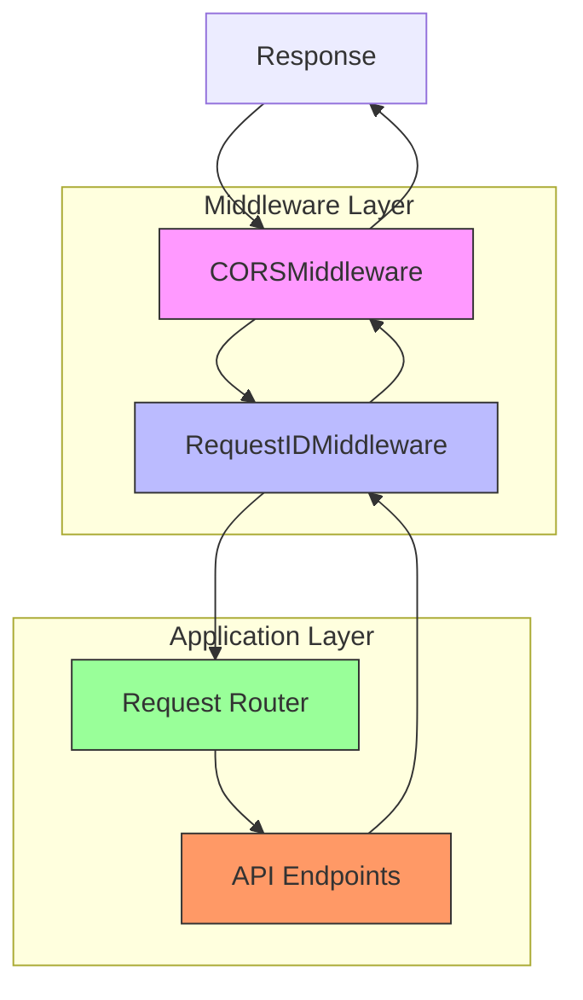
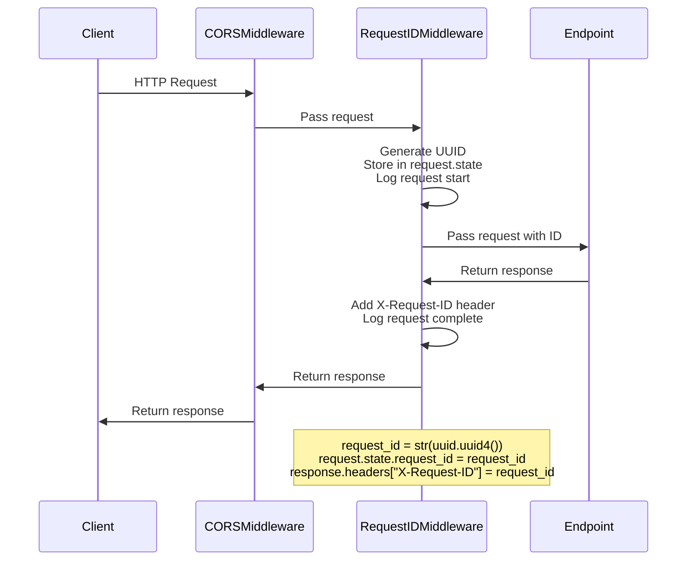

# Middleware Stack

<cite>
**Referenced Files in This Document**   
- [app.py](file://src/api/app.py)
- [middleware.py](file://src/api/api/middleware.py)
- [endpoints.py](file://src/api/api/endpoints.py)
- [config.py](file://src/api/core/config.py)
</cite>

## Table of Contents
1. [Introduction](#introduction)
2. [Middleware Architecture](#middleware-architecture)
3. [RequestIDMiddleware Implementation](#requestidmiddleware-implementation)
4. [CORSMiddleware Configuration](#corsmiddleware-configuration)
5. [Middleware Execution Order](#middleware-execution-order)
6. [Request Lifecycle Interception](#request-lifecycle-interception)
7. [Performance Impact Analysis](#performance-impact-analysis)
8. [Extending the Middleware Stack](#extending-the-middleware-stack)
9. [Troubleshooting Common Issues](#troubleshooting-common-issues)
10. [Conclusion](#conclusion)

## Introduction
The FastAPI backend implements a middleware stack to handle cross-origin resource sharing and distributed request tracing. This document details the implementation and configuration of two critical middleware components: RequestIDMiddleware for end-to-end request tracking and CORSMiddleware for enabling communication with the Streamlit frontend. The middleware architecture provides essential functionality for logging, debugging, and frontend integration in a distributed system environment.

## Middleware Architecture
The middleware stack is configured during FastAPI application initialization, where components are registered to intercept requests and responses throughout their lifecycle. The architecture follows a layered approach, with each middleware component responsible for specific cross-cutting concerns. The stack enables separation of concerns while maintaining performance and reliability across service boundaries.

**Diagram sources**
- [app.py](file://src/api/app.py#L1-L34)
- [middleware.py](file://src/api/api/middleware.py#L1-L25)

**Section sources**
- [app.py](file://src/api/app.py#L1-L34)
- [middleware.py](file://src/api/api/middleware.py#L1-L25)

## RequestIDMiddleware Implementation
The RequestIDMiddleware component generates unique identifiers for each incoming request, enabling comprehensive distributed tracing across services and logs. This middleware implements FastAPI's BaseHTTPMiddleware to intercept requests at the earliest possible point in the processing pipeline. For each request, a UUID is generated and stored in the request state, making it accessible to downstream components and endpoints.

The middleware logs the start and completion of each request with its unique identifier, creating a consistent audit trail. Upon response generation, the same request ID is added to the response headers as X-Request-ID, allowing clients to correlate requests and responses. This implementation facilitates debugging, performance monitoring, and error tracking across distributed systems.

**Diagram sources**
- [middleware.py](file://src/api/api/middleware.py#L9-L24)
- [endpoints.py](file://src/api/api/endpoints.py#L1-L74)

**Section sources**
- [middleware.py](file://src/api/api/middleware.py#L9-L24)
- [endpoints.py](file://src/api/api/endpoints.py#L1-L74)

## CORSMiddleware Configuration
The CORSMiddleware is configured to enable cross-origin communication between the FastAPI backend and Streamlit frontend. This configuration allows the frontend application to make HTTP requests to the API endpoints despite originating from a different domain or port. The middleware is set up with permissive policies to support development and integration requirements.

The configuration permits all origins (*), methods (*), and headers (*), while allowing credentials to be included in requests. This setup facilitates seamless integration with the Streamlit frontend during development and production. The middleware intercepts preflight OPTIONS requests and adds appropriate CORS headers to responses, ensuring compliance with browser security policies.

**Section sources**
- [app.py](file://src/api/app.py#L1-L34)

## Middleware Execution Order
The order of middleware registration determines the sequence in which requests and responses are processed. In this implementation, RequestIDMiddleware is registered before CORSMiddleware, establishing the processing chain. Requests flow through the middleware stack in the order they were added, while responses traverse the stack in reverse order.

This execution order ensures that request IDs are generated before CORS processing occurs, allowing the request identifier to be available for CORS-related logging and debugging. The layered approach creates a consistent processing pipeline where each middleware component can access information added by previous components in the chain.

**Section sources**
- [app.py](file://src/api/app.py#L1-L34)

## Request Lifecycle Interception
The middleware components intercept requests at specific points in the processing lifecycle. RequestIDMiddleware captures the request immediately after entry into the application but before routing decisions are made. This early interception enables comprehensive logging and state management throughout the entire request lifecycle.

The dispatch method in RequestIDMiddleware executes before the endpoint handler and again after response generation, creating a complete request-response cycle. This pattern allows the middleware to measure processing time, capture execution context, and ensure consistent header injection regardless of the endpoint's behavior or potential exceptions.

**Section sources**
- [middleware.py](file://src/api/api/middleware.py#L9-L24)

## Performance Impact Analysis
The middleware stack introduces minimal performance overhead while providing significant operational benefits. RequestIDMiddleware adds UUID generation and logging operations to each request, with UUID generation being a lightweight operation. The logging overhead is consistent across requests and provides valuable debugging information that can reduce troubleshooting time.

CORSMiddleware adds minimal processing overhead, primarily involving header inspection and injection. The permissive configuration avoids complex origin validation logic, maintaining high throughput. Both middleware components operate synchronously within the request processing pipeline, with execution time measured in microseconds under normal conditions.

**Section sources**
- [middleware.py](file://src/api/api/middleware.py#L9-L24)
- [app.py](file://src/api/app.py#L1-L34)

## Extending the Middleware Stack
New middleware components can be added to the stack using the app.add_middleware() method in the main application file. Additional components should inherit from BaseHTTPMiddleware and implement the dispatch method to handle request interception. When adding new middleware, consideration should be given to execution order and potential interactions with existing components.

Custom middleware can be used to implement authentication, rate limiting, request validation, or additional logging capabilities. Each new component should follow the same pattern of minimal processing overhead and clear separation of concerns. Dependencies should be injected through the middleware constructor to maintain testability and configuration flexibility.

**Section sources**
- [app.py](file://src/api/app.py#L1-L34)
- [middleware.py](file://src/api/api/middleware.py#L1-L25)

## Troubleshooting Common Issues
Common issues with the middleware stack include missing request IDs in logs and blocked CORS requests. Missing request IDs typically indicate that downstream components are not properly accessing the request.state.request_id property. This can be resolved by ensuring all logging statements include the request ID when available.

CORS-related issues usually stem from misconfigured origins or missing preflight request handling. Since the current configuration allows all origins, CORS blocking should not occur in normal operation. If CORS errors appear, verify that the CORSMiddleware is properly registered and that no other middleware components are interfering with header processing.

**Section sources**
- [middleware.py](file://src/api/api/middleware.py#L9-L24)
- [app.py](file://src/api/app.py#L1-L34)

## Conclusion
The middleware stack provides essential functionality for distributed tracing and cross-origin communication in the FastAPI backend. RequestIDMiddleware enables comprehensive request tracking through unique identifiers, while CORSMiddleware facilitates integration with the Streamlit frontend. The implementation follows best practices for middleware design, with clear separation of concerns and minimal performance impact. This architecture supports scalable development and robust production operations.