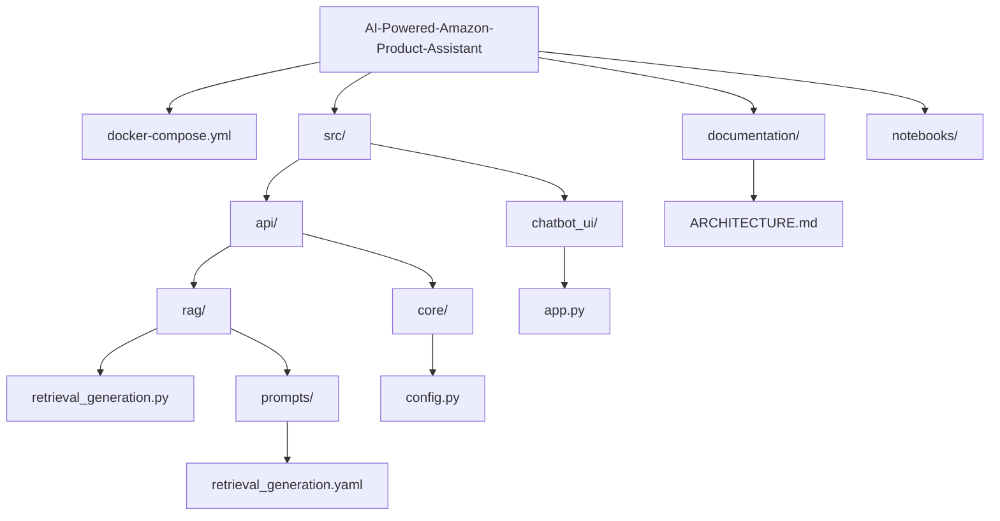
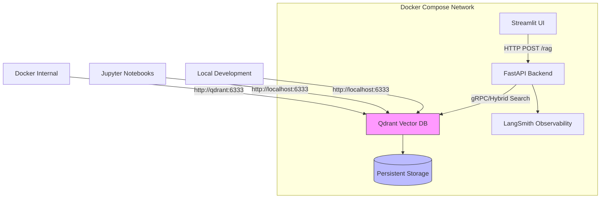
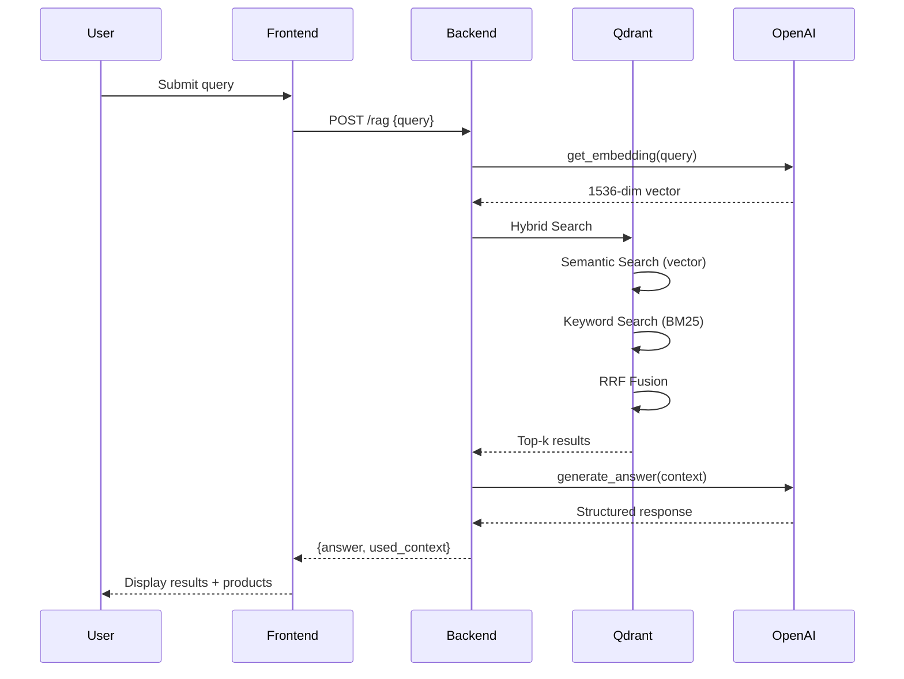
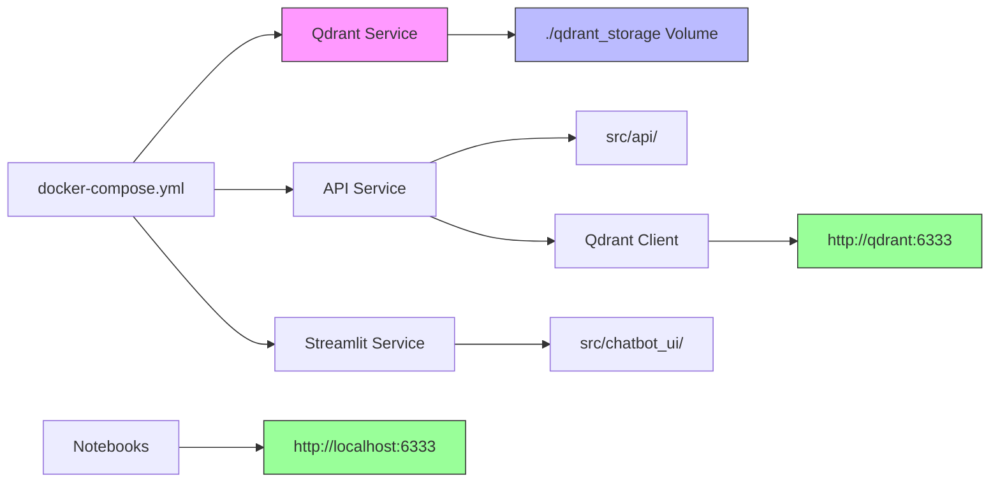

# Data Storage Architecture

<cite>
**Referenced Files in This Document**   
- [docker-compose.yml](file://docker-compose.yml)
- [src/api/rag/retrieval_generation.py](file://src/api/rag/retrieval_generation.py)
- [src/api/core/config.py](file://src/api/core/config.py)
- [src/api/rag/prompts/retrieval_generation.yaml](file://src/api/rag/prompts/retrieval_generation.yaml)
- [src/chatbot_ui/app.py](file://src/chatbot_ui/app.py)
- [documentation/ARCHITECTURE.md](file://documentation/ARCHITECTURE.md)
- [README.md](file://README.md)
</cite>

## Table of Contents
1. [Introduction](#introduction)
2. [Project Structure](#project-structure)
3. [Core Components](#core-components)
4. [Architecture Overview](#architecture-overview)
5. [Detailed Component Analysis](#detailed-component-analysis)
6. [Dependency Analysis](#dependency-analysis)
7. [Performance Considerations](#performance-considerations)
8. [Troubleshooting Guide](#troubleshooting-guide)
9. [Conclusion](#conclusion)

## Introduction
This document provides comprehensive architectural documentation for the Qdrant vector database implementation within the AI-Powered Amazon Product Assistant system. It details the hybrid search capabilities combining semantic and keyword indexing strategies, collection schema configuration, Docker Compose setup with persistent storage, connection patterns across different contexts, data persistence mechanisms, scalability considerations, and failure mode analysis.

## Project Structure



**Diagram sources**
- [docker-compose.yml](file://docker-compose.yml#L1-L32)
- [src/api/rag/retrieval_generation.py](file://src/api/rag/retrieval_generation.py#L1-L401)
- [src/chatbot_ui/app.py](file://src/chatbot_ui/app.py#L1-L94)

**Section sources**
- [docker-compose.yml](file://docker-compose.yml#L1-L32)
- [src/api/rag/retrieval_generation.py](file://src/api/rag/retrieval_generation.py#L1-L401)
- [src/chatbot_ui/app.py](file://src/chatbot_ui/app.py#L1-L94)

## Core Components
The system's data storage architecture centers around Qdrant as the vector database for hybrid search functionality. The core components include the Qdrant service configuration in Docker Compose, the hybrid search implementation in the RAG pipeline, and the connection management between services. The architecture enables both semantic search through vector embeddings and keyword-based retrieval using BM25, combined via Reciprocal Rank Fusion (RRF) to deliver comprehensive search results.

**Section sources**
- [docker-compose.yml](file://docker-compose.yml#L1-L32)
- [src/api/rag/retrieval_generation.py](file://src/api/rag/retrieval_generation.py#L1-L401)
- [documentation/ARCHITECTURE.md](file://documentation/ARCHITECTURE.md#L1-L1484)

## Architecture Overview



**Diagram sources**
- [docker-compose.yml](file://docker-compose.yml#L1-L32)
- [src/api/rag/retrieval_generation.py](file://src/api/rag/retrieval_generation.py#L1-L401)
- [documentation/ARCHITECTURE.md](file://documentation/ARCHITECTURE.md#L1-L1484)

## Detailed Component Analysis

### Qdrant Hybrid Search Implementation



**Diagram sources**
- [src/api/rag/retrieval_generation.py](file://src/api/rag/retrieval_generation.py#L1-L401)
- [src/chatbot_ui/app.py](file://src/chatbot_ui/app.py#L1-L94)

### Collection Schema and Vector Configuration

```mermaid
erDiagram
AMAZON_ITEMS_COLLECTION {
string parent_asin PK
string description
float average_rating
string image
float price
vector text_embedding_3_small 1536
sparse bm25
}
AMAZON_ITEMS_COLLECTION ||--o{ HYBRID_SEARCH : "uses"
HYBRID_SEARCH }o--|| SEMANTIC_INDEX : "semantic"
HYBRID_SEARCH }o--|| KEYWORD_INDEX : "keyword"
```

**Diagram sources**
- [src/api/rag/retrieval_generation.py](file://src/api/rag/retrieval_generation.py#L1-L401)
- [documentation/ARCHITECTURE.md](file://documentation/ARCHITECTURE.md#L1-L1484)

### Docker Compose Configuration

```mermaid
graph TB
subgraph "Services"
A[qdrant Service]
B[api Service]
C[streamlit-app Service]
end
subgraph "Network"
D[Docker Internal Network]
A < --> D
B < --> D
C < --> D
end
subgraph "Host"
E[./qdrant_storage]
F[Port 6333]
G[Port 6334]
H[Port 8000]
I[Port 8501]
end
A --> E
A --> F
A --> G
B --> H
C --> I
style A fill:#f96,stroke:#333
style E fill:#bbf,stroke:#333
```

**Diagram sources**
- [docker-compose.yml](file://docker-compose.yml#L1-L32)
- [src/api/core/config.py](file://src/api/core/config.py#L1-L11)

## Dependency Analysis



**Diagram sources**
- [docker-compose.yml](file://docker-compose.yml#L1-L32)
- [src/api/rag/retrieval_generation.py](file://src/api/rag/retrieval_generation.py#L1-L401)
- [src/chatbot_ui/app.py](file://src/chatbot_ui/app.py#L1-L94)

**Section sources**
- [docker-compose.yml](file://docker-compose.yml#L1-L32)
- [src/api/rag/retrieval_generation.py](file://src/api/rag/retrieval_generation.py#L1-L401)

## Performance Considerations
The hybrid search architecture balances semantic understanding with keyword precision through Reciprocal Rank Fusion, optimizing retrieval quality. The persistent storage configuration via Docker volume mounting ensures data durability across container restarts. Connection pooling and efficient vector indexing contribute to low-latency search operations. The system's scalability is enhanced by containerization, allowing for horizontal scaling of components as needed. Cache strategies and connection reuse minimize redundant operations and improve overall system efficiency.

## Troubleshooting Guide

**Section sources**
- [README.md](file://README.md#L1-L508)
- [documentation/ARCHITECTURE.md](file://documentation/ARCHITECTURE.md#L1-L1484)
- [src/api/rag/retrieval_generation.py](file://src/api/rag/retrieval_generation.py#L1-L401)

## Conclusion
The Qdrant vector database implementation provides a robust foundation for hybrid search capabilities in the AI-Powered Amazon Product Assistant. By combining semantic and keyword indexing strategies, the system delivers comprehensive and relevant search results. The Docker Compose setup with persistent storage ensures data durability and service isolation, while the dual connection pattern accommodates both internal service communication and external development access. This architecture supports scalable, reliable, and high-performance vector search operations essential for an effective RAG system.