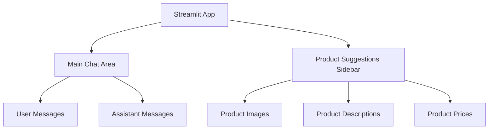
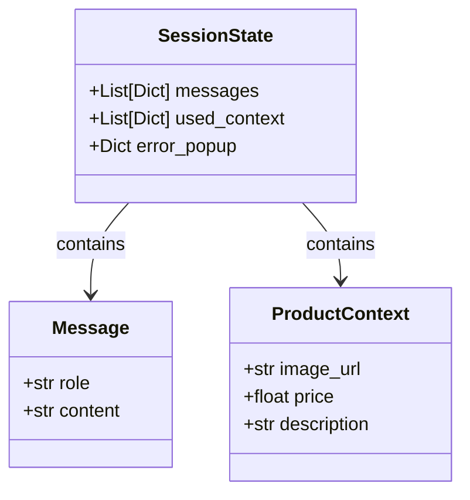
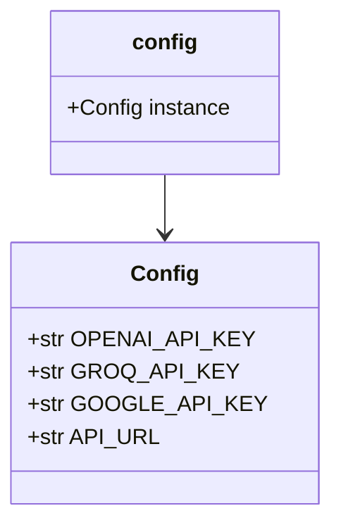
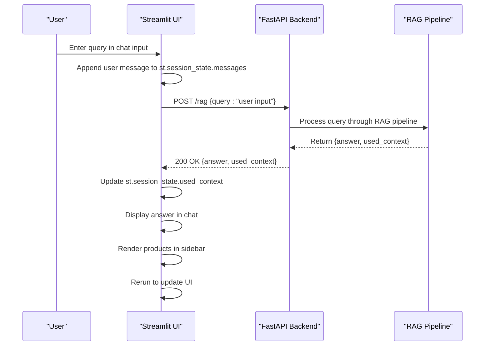
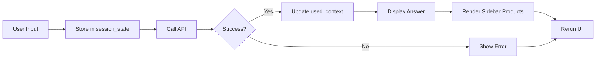

# Frontend Architecture

<cite>
**Referenced Files in This Document**   
- [app.py](file://src/chatbot_ui/app.py)
- [config.py](file://src/chatbot_ui/core/config.py)
- [app.py](file://src/api/app.py)
- [endpoints.py](file://src/api/api/endpoints.py)
- [models.py](file://src/api/api/models.py)
</cite>

## Table of Contents
1. [Introduction](#introduction)
2. [UI Layout and Components](#ui-layout-and-components)
3. [Session State Management](#session-state-management)
4. [Configuration and Environment](#configuration-and-environment)
5. [API Integration and Request Flow](#api-integration-and-request-flow)
6. [Error Handling Strategies](#error-handling-strategies)
7. [UI Interaction Patterns](#ui-interaction-patterns)
8. [Performance Considerations](#performance-considerations)
9. [Conclusion](#conclusion)

## Introduction
The Streamlit frontend component of the AI-Powered Amazon Product Assistant provides an interactive chat interface for users to query product recommendations. The frontend communicates with a FastAPI backend to process queries through a Retrieval-Augmented Generation (RAG) pipeline, displaying generated responses in the main chat area and relevant product suggestions in the sidebar. This document details the architectural components, state management, API integration, and error handling mechanisms that enable this functionality.

## UI Layout and Components
The user interface is structured into two primary regions: the main chat area and the product suggestions sidebar. The layout is configured to use a wide format with an expanded sidebar, optimizing screen real estate for both conversation and product visualization.



**Diagram sources**
- [app.py](file://src/chatbot_ui/app.py#L50-L93)

**Section sources**
- [app.py](file://src/chatbot_ui/app.py#L50-L93)

## Session State Management
The application leverages Streamlit's `st.session_state` to maintain conversation history and product context across reruns. Two key state variables are initialized: `messages` for storing the chat history and `used_context` for holding product information retrieved from the backend.



**Diagram sources**
- [app.py](file://src/chatbot_ui/app.py#L50-L55)

**Section sources**
- [app.py](file://src/chatbot_ui/app.py#L50-L55)

## Configuration and Environment
Configuration is managed through Pydantic Settings in `src/chatbot_ui/core/config.py`, which loads environment variables from a `.env` file. The primary configuration parameter for frontend-backend communication is `API_URL`, which defaults to the Docker internal hostname `http://api:8000`.



**Diagram sources**
- [config.py](file://src/chatbot_ui/core/config.py#L1-L11)

**Section sources**
- [config.py](file://src/chatbot_ui/core/config.py#L1-L11)

## API Integration and Request Flow
The frontend integrates with the FastAPI backend through HTTP POST requests to the `/rag` endpoint. The request flow begins with user input via `st.chat_input`, triggers an API call, and processes the response for display in both the chat interface and sidebar.



**Diagram sources**
- [app.py](file://src/chatbot_ui/app.py#L84-L93)
- [endpoints.py](file://src/api/api/endpoints.py#L15-L73)
- [models.py](file://src/api/api/models.py#L1-L16)

**Section sources**
- [app.py](file://src/chatbot_ui/app.py#L84-L93)
- [endpoints.py](file://src/api/api/endpoints.py#L15-L73)

## Error Handling Strategies
The frontend implements comprehensive error handling for API communication failures, including connection errors, timeouts, and malformed responses. Errors are displayed to users through popup notifications positioned in the top-right corner of the interface.

```mermaid
flowchart TD
A[API Call] --> B{Success?}
B --> |Yes| C[Process Response]
B --> |No| D{Error Type}
D --> |ConnectionError| E[Show "Connection error" popup]
D --> |Timeout| F[Show "Request timed out" popup]
D --> |JSONDecodeError| G[Show "Invalid response format" message]
D --> |Other Exception| H[Show generic error popup]
E --> I[Return error response]
F --> I
G --> I
H --> I
```

**Diagram sources**
- [app.py](file://src/chatbot_ui/app.py#L18-L48)

**Section sources**
- [app.py](file://src/chatbot_ui/app.py#L18-L48)

## UI Interaction Patterns
The user interface follows a reactive pattern where user input triggers a sequence of actions: message storage, API communication, response processing, and UI updates. The `st.rerun()` function ensures the interface reflects the latest state after each interaction.



**Diagram sources**
- [app.py](file://src/chatbot_ui/app.py#L75-L93)

**Section sources**
- [app.py](file://src/chatbot_ui/app.py#L75-L93)

## Performance Considerations
The frontend architecture considers performance implications of real-time updates and image rendering. Product images are displayed at a fixed width of 250 pixels to balance visual quality with loading performance. The use of `st.rerun()` after each interaction ensures state consistency but may impact perceived responsiveness with high-latency API calls.

**Section sources**
- [app.py](file://src/chatbot_ui/app.py#L65-L70)

## Conclusion
The Streamlit frontend effectively combines a user-friendly chat interface with dynamic product recommendations through seamless integration with a FastAPI backend. The architecture leverages Streamlit's session state for persistence, implements robust error handling for API communications, and maintains a clean separation of concerns between UI presentation and business logic. The configuration system allows for easy environment management, while the request-response flow ensures timely delivery of product recommendations to users.