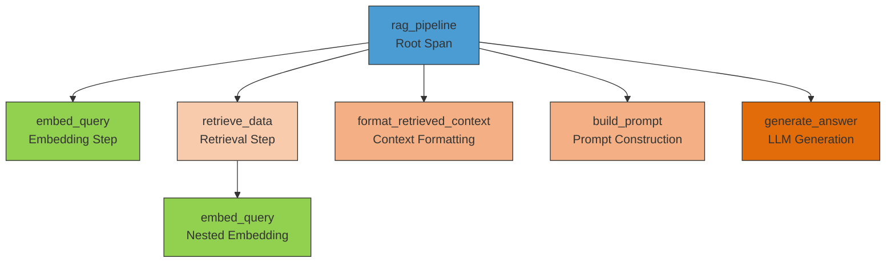
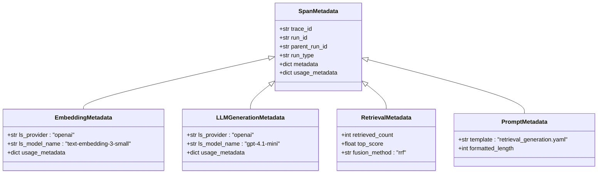
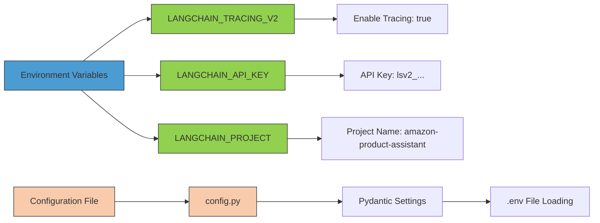
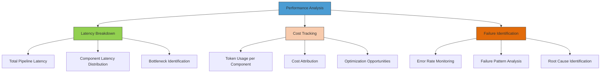
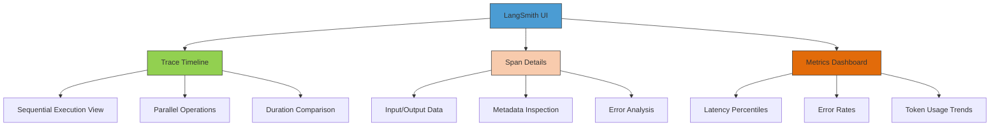

# Observability Architecture

<cite>
**Referenced Files in This Document**   
- [retrieval_generation.py](file://src/api/rag/retrieval_generation.py)
- [config.py](file://src/api/core/config.py)
- [endpoints.py](file://src/api/api/endpoints.py)
- [prompt_management.py](file://src/api/rag/utils/prompt_management.py)
</cite>

## Table of Contents
1. [Introduction](#introduction)
2. [Traceable Decorator Implementation](#traceable-decorator-implementation)
3. [Trace Hierarchy and Structure](#trace-hierarchy-and-structure)
4. [Metadata Capture and Enrichment](#metadata-capture-and-enrichment)
5. [Configuration Requirements](#configuration-requirements)
6. [Performance Analysis Capabilities](#performance-analysis-capabilities)
7. [LangSmith Visualization Examples](#langsmith-visualization-examples)
8. [Conclusion](#conclusion)

## Introduction
The observability system in the AI-Powered Amazon Product Assistant leverages LangSmith to provide comprehensive monitoring and analysis of the RAG pipeline. By implementing `@traceable` decorators across all pipeline components, the system captures detailed execution traces that enable performance optimization, cost tracking, and debugging. This documentation details the implementation of distributed tracing across the RAG pipeline components including embedding, retrieval, prompt building, and LLM generation, with a focus on how trace data supports operational excellence.

## Traceable Decorator Implementation

The RAG pipeline implements `@traceable` decorators from LangSmith on all critical functions to enable end-to-end observability. Each component in the pipeline is instrumented with appropriate metadata and run types to categorize the processing steps.

The implementation spans multiple components of the RAG pipeline, with each function decorated to capture its execution context. The decorators are applied to functions handling embedding generation, data retrieval, context formatting, prompt construction, and answer generation.

**Section sources**
- [retrieval_generation.py](file://src/api/rag/retrieval_generation.py#L35-L400)

## Trace Hierarchy and Structure

The tracing system establishes a hierarchical structure with a root span that encompasses all pipeline operations. This parent-child relationship enables comprehensive analysis of the entire request lifecycle.

**Diagram sources**
- [retrieval_generation.py](file://src/api/rag/retrieval_generation.py#L276-L312)
- [retrieval_generation.py](file://src/api/rag/retrieval_generation.py#L78-L153)

The trace hierarchy begins with the `rag_pipeline` function as the root span, which orchestrates the entire RAG process. This root span contains five child spans representing the sequential steps of the pipeline:
- `embed_query`: Generates embeddings for the user query
- `retrieve_data`: Performs hybrid search to retrieve relevant product data
- `format_retrieved_context`: Processes and formats the retrieved context
- `build_prompt`: Constructs the final prompt using templates
- `generate_answer`: Generates the final answer using the LLM

Notably, the `retrieve_data` span contains a nested `embed_query` span, reflecting the internal embedding generation required for semantic search. This nested structure accurately represents the actual execution flow and enables granular performance analysis.

**Section sources**
- [retrieval_generation.py](file://src/api/rag/retrieval_generation.py#L276-L312)
- [retrieval_generation.py](file://src/api/rag/retrieval_generation.py#L78-L153)

## Metadata Capture and Enrichment

The system captures comprehensive metadata for each span, providing rich context for analysis and optimization. This metadata includes technical specifications, performance metrics, and operational details.

**Diagram sources**
- [retrieval_generation.py](file://src/api/rag/retrieval_generation.py#L35-L72)
- [retrieval_generation.py](file://src/api/rag/retrieval_generation.py#L233-L273)

The metadata capture system records several key categories of information:

**LLM Provider and Model Information:**
- Provider: `"openai"`
- Model names: `"text-embedding-3-small"` for embeddings, `"gpt-4.1-mini"` for generation

**Token Usage Metrics:**
- Input tokens: Number of tokens in the prompt/request
- Output tokens: Number of tokens in the response/answer
- Total tokens: Sum of input and output tokens

**Run Type Classification:**
- `"embedding"`: Embedding generation steps
- `"retriever"`: Data retrieval operations
- `"prompt"`: Context formatting and prompt building
- `"llm"`: Language model generation

**Component-Specific Metadata:**
- Retrieval: Number of results retrieved, similarity scores, fusion method
- Prompt: Template name, formatted context length
- Generation: Temperature setting, response structure

The system also captures execution context such as trace IDs, run IDs, and parent run IDs to maintain the hierarchical relationship between spans. This comprehensive metadata enables detailed analysis of both individual components and the pipeline as a whole.

**Section sources**
- [retrieval_generation.py](file://src/api/rag/retrieval_generation.py#L35-L72)
- [retrieval_generation.py](file://src/api/rag/retrieval_generation.py#L233-L273)
- [retrieval_generation.py](file://src/api/rag/retrieval_generation.py#L78-L153)

## Configuration Requirements

The observability system requires specific environment variables to be configured for LangSmith integration. These settings enable tracing, authentication, and project organization within the LangSmith platform.

**Diagram sources**
- [config.py](file://src/api/core/config.py#L1-L11)

The following environment variables must be configured:

**Tracing Activation:**
- `LANGCHAIN_TRACING_V2=true`: Enables distributed tracing across all LangChain components

**Authentication:**
- `LANGCHAIN_API_KEY=lsv2_...`: Authentication token for LangSmith API access

**Project Organization:**
- `LANGCHAIN_PROJECT=amazon-product-assistant`: Project name for organizing traces in LangSmith UI

These environment variables are typically set in the `.env` file at the project root and loaded automatically through the Pydantic settings system. The configuration is validated at application startup, ensuring that required variables are present before the service begins processing requests.

The system uses Pydantic's `BaseSettings` class to manage configuration, which automatically loads values from the `.env` file while allowing environment variables to override these values. This provides flexibility for different deployment environments while maintaining consistency in configuration management.

**Section sources**
- [config.py](file://src/api/core/config.py#L1-L11)

## Performance Analysis Capabilities

The tracing implementation enables three primary analysis capabilities: latency breakdown, cost tracking, and failure identification. These capabilities provide actionable insights for optimizing the RAG pipeline.

**Diagram sources**
- [retrieval_generation.py](file://src/api/rag/retrieval_generation.py#L276-L312)
- [retrieval_generation.py](file://src/api/rag/retrieval_generation.py#L233-L273)

**Latency Breakdown:**
The system captures execution time for each span, enabling detailed latency analysis. For example, a trace might show:
- Total pipeline time: 2.3 seconds
- Embedding: 98ms
- Retrieval: 423ms
- Prompt building: 45ms
- Answer generation: 1.72s

This breakdown helps identify performance bottlenecks, such as the LLM generation step consuming 75% of the total time, indicating potential optimization opportunities.

**Cost Tracking:**
By capturing token usage at each stage, the system enables precise cost attribution:
- Embedding cost: $0.00001 (based on input tokens)
- Generation cost: $0.00234 (based on input/output tokens)
- Total cost per request: $0.00236

This granular cost tracking allows for budgeting, forecasting, and identifying expensive operations that could be optimized.

**Failure Identification:**
The hierarchical trace structure facilitates rapid failure diagnosis. When a request fails, the trace reveals:
- Which specific component failed
- The error message and stack trace
- The state of preceding steps
- Whether partial results were generated

For example, if the `retrieve_data` step fails, the trace shows whether the embedding was successful but retrieval failed, helping distinguish between different failure modes.

**Section sources**
- [retrieval_generation.py](file://src/api/rag/retrieval_generation.py#L276-L312)
- [retrieval_generation.py](file://src/api/rag/retrieval_generation.py#L233-L273)

## LangSmith Visualization Examples

The LangSmith UI provides interactive visualizations of traces that support pipeline optimization and debugging. These visual representations transform raw trace data into actionable insights.

**Diagram sources**
- [retrieval_generation.py](file://src/api/rag/retrieval_generation.py#L276-L312)
- [retrieval_generation.py](file://src/api/rag/retrieval_generation.py#L78-L153)

The LangSmith interface displays traces in a hierarchical tree format, showing the parent-child relationships between spans. Each span is annotated with duration, status, and metadata, allowing users to quickly identify slow or failing components.

Key visualization features include:
- **Interactive Timeline**: Shows the sequence and duration of operations
- **Metadata Explorer**: Allows drilling into the metadata captured for each span
- **Error Highlighting**: Failed spans are prominently displayed for rapid identification
- **Cost Annotations**: Monetary cost estimates are shown alongside token usage
- **Comparison Tools**: Enables side-by-side comparison of different trace runs

These visualizations support optimization by making performance characteristics immediately apparent. For example, a developer can quickly see that the `generate_answer` step consistently takes longer than other steps, prompting investigation into prompt optimization, model selection, or caching strategies.

**Section sources**
- [retrieval_generation.py](file://src/api/rag/retrieval_generation.py#L276-L312)
- [retrieval_generation.py](file://src/api/rag/retrieval_generation.py#L78-L153)

## Conclusion
The observability architecture implemented with LangSmith provides comprehensive monitoring of the RAG pipeline through strategic use of `@traceable` decorators. By establishing a clear trace hierarchy with the `rag_pipeline` as the root span and capturing detailed metadata across all components, the system enables effective performance analysis, cost tracking, and debugging. The configuration requirements are straightforward, requiring only environment variables to activate tracing and authenticate with LangSmith. The resulting trace data, when visualized in the LangSmith UI, provides actionable insights that support continuous optimization of the RAG pipeline for improved performance, cost efficiency, and reliability.