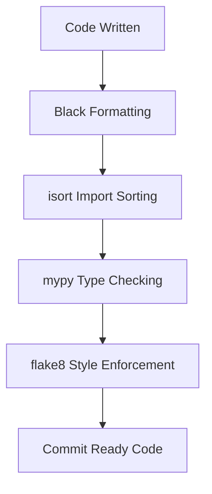
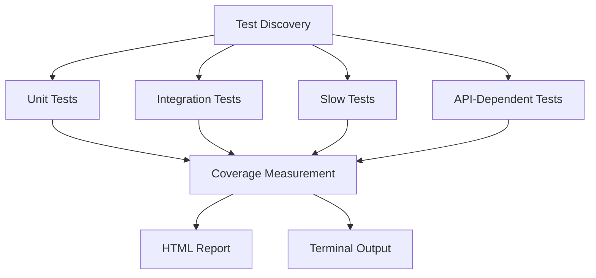
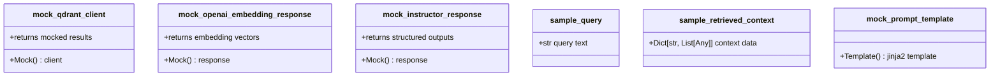
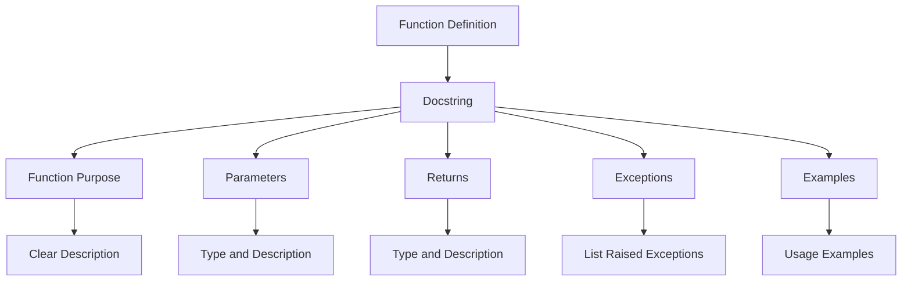
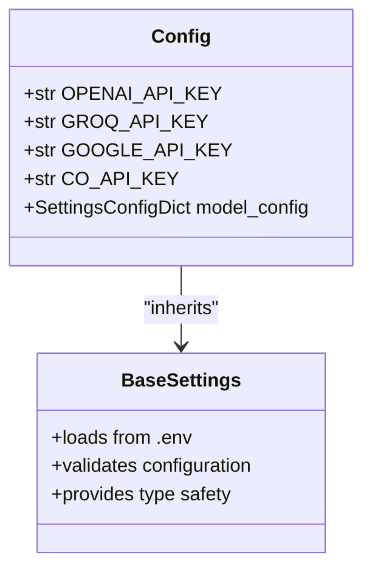

# Contributing

<cite>
**Referenced Files in This Document**   
- [pyproject.toml](file://pyproject.toml)
- [pytest.ini](file://pytest.ini)
- [src/api/rag/retrieval_generation.py](file://src/api/rag/retrieval_generation.py)
- [src/api/api/models.py](file://src/api/api/models.py)
- [src/api/core/config.py](file://src/api/core/config.py)
- [src/chatbot_ui/app.py](file://src/chatbot_ui/app.py)
- [tests/test_models.py](file://tests/test_models.py)
- [tests/conftest.py](file://tests/conftest.py)
</cite>

## Table of Contents
1. [Code Style and Formatting](#code-style-and-formatting)
2. [Pull Request Workflow](#pull-request-workflow)
3. [Issue Reporting](#issue-reporting)
4. [Testing Framework](#testing-framework)
5. [Documentation Standards](#documentation-standards)
6. [Dependency Management](#dependency-management)
7. [Versioning and Backward Compatibility](#versioning-and-backward-compatibility)
8. [Open Source Best Practices](#open-source-best-practices)

## Code Style and Formatting

The project enforces consistent code style through configuration in `pyproject.toml`. All Python code must adhere to these standards to ensure readability and maintainability across the codebase.

The project uses modern Python tooling for code quality enforcement:
- **Black** for code formatting
- **isort** for import sorting
- **mypy** for type checking
- **flake8** for style enforcement

These tools are specified as dependencies in the project configuration, ensuring consistent application across development environments.

**Diagram sources**
- [pyproject.toml](file://pyproject.toml)

**Section sources**
- [pyproject.toml](file://pyproject.toml)

## Pull Request Workflow

Contributors should follow a standardized workflow when submitting changes to ensure code quality and maintain project stability.

### Branch Naming Convention
Use descriptive branch names following the pattern: `<type>/<description>`. Valid types include:
- `feature/` - for new functionality
- `bugfix/` - for bug corrections
- `docs/` - for documentation updates
- `refactor/` - for code restructuring
- `test/` - for test additions or modifications

Example: `feature/hybrid-search-enhancement`

### Testing Requirements
All pull requests must include appropriate tests covering the implemented functionality. The test suite must pass before merging:
- Unit tests for isolated functions and methods
- Integration tests for component interactions
- Type checking validation
- Code formatting compliance

### Code Review Expectations
Pull requests will be evaluated on the following criteria:
- Code functionality and correctness
- Adherence to coding standards
- Test coverage and quality
- Documentation completeness
- Performance implications
- Security considerations

Maintainers will provide timely feedback, and contributors are expected to address review comments promptly.

**Section sources**
- [pyproject.toml](file://pyproject.toml)
- [pytest.ini](file://pytest.ini)

## Issue Reporting

Effective issue reporting helps maintainers quickly understand and address problems. Follow these guidelines when reporting issues.

### Issue Templates
The project uses standardized templates for different issue types:
- Bug reports
- Feature requests
- Documentation improvements
- Performance issues

### Reproduction Steps
When reporting bugs, provide clear, step-by-step instructions to reproduce the issue:
1. Describe the environment (OS, Python version, dependencies)
2. List exact steps taken
3. Include relevant configuration
4. Specify expected vs. actual behavior
5. Attach screenshots or logs when applicable

For API-related issues, include sample requests and responses. For UI issues, provide browser information and screen dimensions.

**Section sources**
- [README.md](file://README.md)

## Testing Framework

The project uses pytest as its primary testing framework, configured through `pytest.ini` to ensure consistent test execution and coverage measurement.

### Test Configuration
The pytest configuration enforces strict testing practices:
- Test discovery in the `tests` directory
- Test files prefixed with `test_`
- Test classes prefixed with `Test`
- Test functions prefixed with `test_`
- Verbose output with coverage reporting
- Branch coverage measurement
- HTML coverage report generation

**Diagram sources**
- [pytest.ini](file://pytest.ini)

### Writing New Tests
When adding tests for new features, follow these guidelines:
- Place tests in appropriate subdirectories within `tests/`
- Use descriptive test function names
- Test both success and failure cases
- Mock external dependencies using pytest fixtures
- Ensure tests are isolated and repeatable
- Include appropriate test markers

The `conftest.py` file provides shared fixtures for mocking external services like Qdrant and OpenAI APIs, enabling reliable testing without external dependencies.

**Diagram sources**
- [tests/conftest.py](file://tests/conftest.py)

**Section sources**
- [pytest.ini](file://pytest.ini)
- [tests/conftest.py](file://tests/conftest.py)
- [tests/test_models.py](file://tests/test_models.py)

## Documentation Standards

Code documentation follows established standards to ensure clarity and maintainability.

### Code Comments
Use inline comments to explain complex logic, algorithms, or non-obvious implementation choices. Comments should:
- Explain "why" rather than "what"
- Be concise and relevant
- Avoid stating the obvious
- Be updated when code changes

### Docstrings
All public functions, classes, and methods must have comprehensive docstrings following Google style:
- Describe purpose and functionality
- Document parameters with type and description
- Document return values with type and description
- Include examples when helpful
- Note exceptions that may be raised

The codebase demonstrates proper docstring usage in the RAG pipeline functions, including parameter typing and return value descriptions.

**Diagram sources**
- [src/api/rag/retrieval_generation.py](file://src/api/rag/retrieval_generation.py)

**Section sources**
- [src/api/rag/retrieval_generation.py](file://src/api/rag/retrieval_generation.py)

## Dependency Management

The project uses UV for dependency management, ensuring fast and reliable package resolution and installation.

### Dependency Specification
Dependencies are declared in `pyproject.toml` with explicit version constraints where necessary:
- Core application dependencies
- Development tools
- Testing libraries
- Linters and formatters

The project specifies exact versions for critical dependencies to ensure reproducible builds, while allowing minor updates for less critical packages.

### Adding Dependencies
To add a new dependency:
1. Use `uv add <package-name>` to install and update `pyproject.toml`
2. Verify the package is necessary and well-maintained
3. Document the dependency's purpose in code comments
4. Update relevant documentation if needed
5. Test the application with the new dependency

### Dependency Updates
Regularly review and update dependencies to address security vulnerabilities and benefit from improvements. Use `uv sync` to install dependencies from the lock file, ensuring consistent environments across development and production.

**Section sources**
- [pyproject.toml](file://pyproject.toml)

## Versioning and Backward Compatibility

The project follows semantic versioning principles to communicate the nature of changes between releases.

### Versioning Policy
Versions follow the MAJOR.MINOR.PATCH format:
- MAJOR: Incompatible API changes
- MINOR: Backward-compatible functionality additions
- PATCH: Backward-compatible bug fixes

### Maintaining Backward Compatibility
When making changes that could affect existing functionality:
- Preserve existing APIs when possible
- Use deprecation warnings for planned removals
- Provide migration guides for breaking changes
- Maintain backward compatibility within major versions

### Deprecating Features
When deprecating features:
1. Add deprecation warnings with `DeprecationWarning`
2. Document the deprecation in release notes
3. Specify the version when removal will occur
4. Provide alternatives or migration paths
5. Remove after sufficient notice period

The configuration system demonstrates backward compatibility by using Pydantic Settings with environment file loading, allowing flexible configuration while maintaining a stable interface.

**Diagram sources**
- [src/api/core/config.py](file://src/api/core/config.py)

**Section sources**
- [src/api/core/config.py](file://src/api/core/config.py)

## Open Source Best Practices

The project adheres to community standards and open-source best practices to foster collaboration and maintainability.

### Community Standards
- Responsive issue tracking and triage
- Clear contribution guidelines
- Timely pull request reviews
- Respectful communication
- Transparent decision-making

### Development Workflow
The project uses a phased development approach with clear milestones and completion criteria. Each phase includes specific deliverables and quality gates, ensuring systematic progress toward project goals.

### Code Quality
The project maintains high code quality through:
- Comprehensive test coverage
- Static type checking
- Automated formatting
- Continuous integration
- Code reviews

### Documentation
Extensive documentation is provided, including:
- Architecture overview
- Component details
- Data flow diagrams
- Configuration guides
- Troubleshooting information

The architecture documentation provides detailed system design, component interactions, and deployment considerations, serving as a comprehensive reference for contributors.

**Section sources**
- [README.md](file://README.md)
- [documentation/ARCHITECTURE.md](file://documentation/ARCHITECTURE.md)