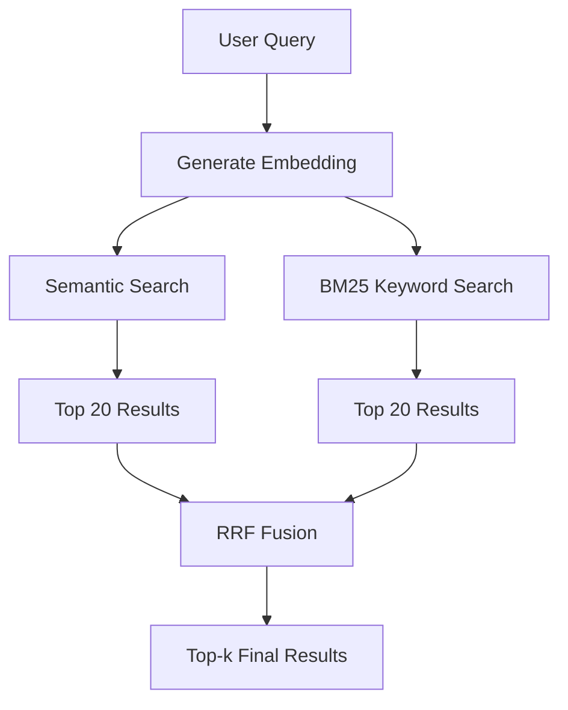
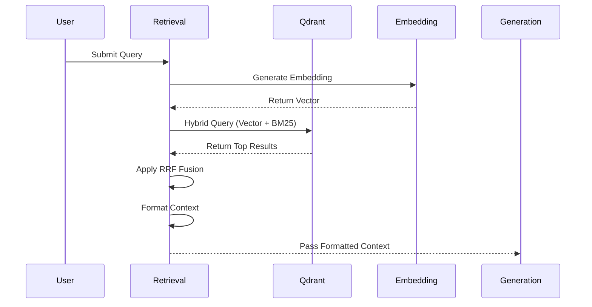
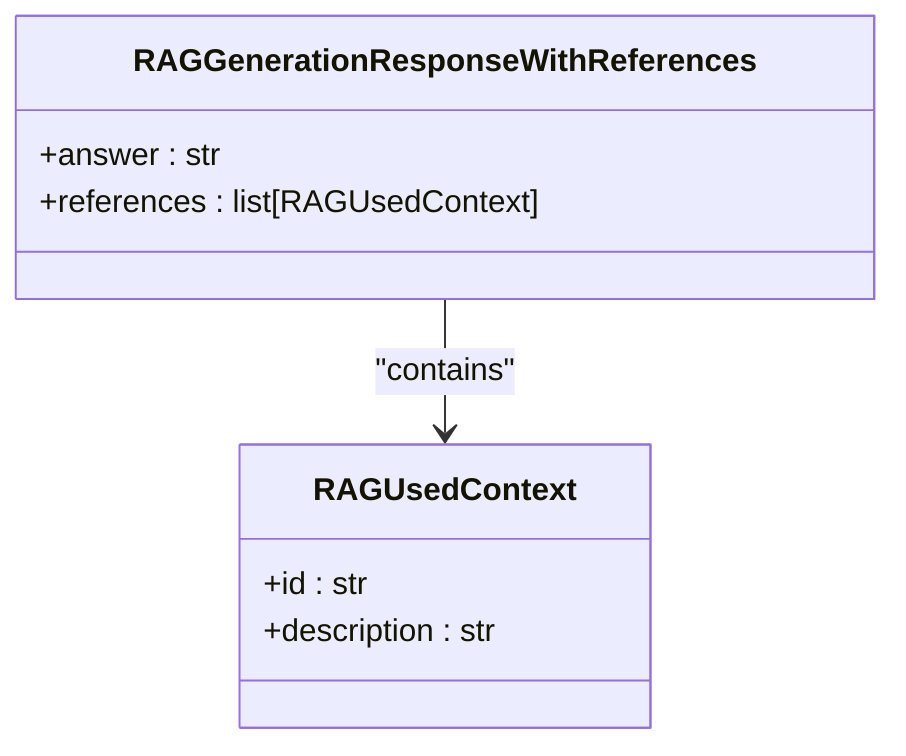
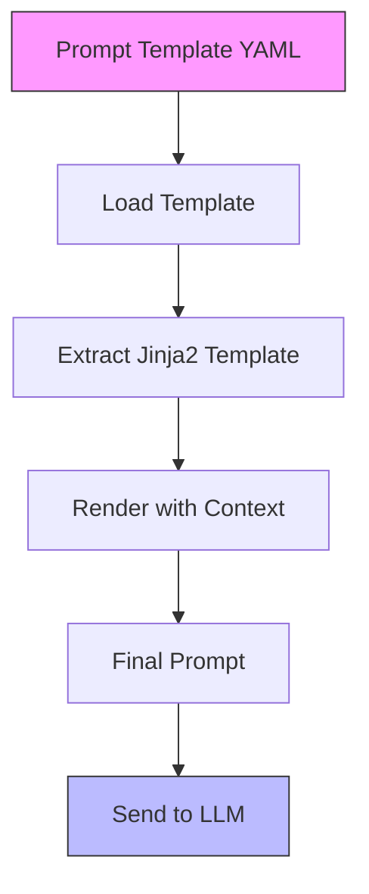
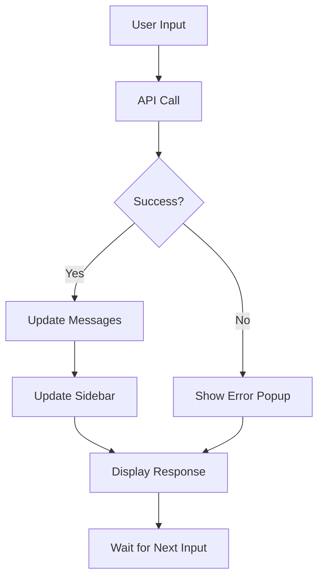

# Core Features

<cite>
**Referenced Files in This Document**   
- [retrieval_generation.py](file://src/api/rag/retrieval_generation.py)
- [retrieval_generation.yaml](file://src/api/rag/prompts/retrieval_generation.yaml)
- [app.py](file://src/chatbot_ui/app.py)
</cite>

## Table of Contents
1. [Hybrid Search Implementation](#hybrid-search-implementation)
2. [Retrieval Pipeline](#retrieval-pipeline)
3. [Generation Pipeline](#generation-pipeline)
4. [Prompt Engineering Practices](#prompt-engineering-practices)
5. [Chat Interface Features](#chat-interface-features)
6. [Performance Considerations](#performance-considerations)

## Hybrid Search Implementation

The RAG system implements a hybrid search strategy that combines semantic (vector) and keyword (BM25) retrieval methods with Reciprocal Rank Fusion (RRF) for optimal results. This approach leverages both the semantic understanding of vector embeddings and the precision of keyword matching to deliver comprehensive search results.

The hybrid search is implemented in the `retrieve_data` function, which orchestrates a dual-retrieval process against the Qdrant vector database. The system first generates an embedding for the user query using OpenAI's `text-embedding-3-small` model, then executes two parallel retrieval operations: a semantic search using the generated embedding and a keyword search using Qdrant's BM25 algorithm.

**Diagram sources**
- [retrieval_generation.py](file://src/api/rag/retrieval_generation.py#L78-L153)

**Section sources**
- [retrieval_generation.py](file://src/api/rag/retrieval_generation.py#L78-L153)

## Retrieval Pipeline

The retrieval pipeline encompasses the complete process from query ingestion to context preparation for the generation phase. It begins with embedding generation, followed by hybrid retrieval, and concludes with context formatting.

The pipeline starts with the `get_embedding` function, which calls OpenAI's embedding API to convert the text query into a 1536-dimensional vector. This embedding is then used in the `retrieve_data` function to query the Qdrant collection using both vector similarity and BM25 keyword matching. The results from both retrieval methods are fused using RRF (Reciprocal Rank Fusion), which combines the rankings from both systems using the formula: `1/(60 + rank)` for each result, ensuring that items ranked highly by either method receive appropriate weighting in the final results.

After retrieval, the `process_context` function formats the raw payload data into a structured string format that includes product IDs, ratings, and descriptions. This formatted context is then passed to the prompt construction phase.

**Diagram sources**
- [retrieval_generation.py](file://src/api/rag/retrieval_generation.py#L34-L71)
- [retrieval_generation.py](file://src/api/rag/retrieval_generation.py#L78-L153)
- [retrieval_generation.py](file://src/api/rag/retrieval_generation.py#L160-L192)

**Section sources**
- [retrieval_generation.py](file://src/api/rag/retrieval_generation.py#L34-L192)

## Generation Pipeline

The generation pipeline transforms the retrieved context into structured, human-readable responses using OpenAI's language model with Instructor for structured output. This pipeline ensures consistent response formatting and reliable data extraction.

The core of the generation pipeline is the `generate_answer` function, which uses Instructor to wrap the OpenAI client and enforce a Pydantic schema for the response. The system employs the `gpt-4.1-mini` model with a temperature of 0.5 to balance creativity and consistency. The response model `RAGGenerationResponseWithReferences` defines a strict schema requiring an answer field and a list of references, each containing product IDs and descriptions.

The complete pipeline is orchestrated by the `rag_pipeline` function, which chains together retrieval, context processing, prompt building, and answer generation. For production use, the `rag_pipeline_wrapper` enhances the results by enriching the references with additional metadata such as image URLs and prices from the Qdrant database.

**Diagram sources**
- [retrieval_generation.py](file://src/api/rag/retrieval_generation.py#L21-L27)
- [retrieval_generation.py](file://src/api/rag/retrieval_generation.py#L233-L273)

**Section sources**
- [retrieval_generation.py](file://src/api/rag/retrieval_generation.py#L233-L400)

## Prompt Engineering Practices

The system employs YAML-based prompt templates with Jinja2 rendering for flexible and version-controlled prompt management. This approach enables systematic experimentation, A/B testing, and collaborative development of prompt engineering strategies.

The primary prompt template is defined in `retrieval_generation.yaml`, which includes metadata such as name, version, description, and author. The template itself provides clear instructions to the language model, specifying that it should act as a shopping assistant and respond based solely on the provided context. Key requirements include avoiding the term "context" in responses, providing detailed product specifications in bullet points, and including short descriptions that mention the item name.

The `build_prompt` function loads the template using the `prompt_template_config` utility and renders it with the formatted context and user question. This separation of concerns allows prompt iteration without code changes, facilitating rapid experimentation and optimization.

**Diagram sources**
- [retrieval_generation.yaml](file://src/api/rag/prompts/retrieval_generation.yaml)
- [retrieval_generation.py](file://src/api/rag/retrieval_generation.py#L199-L225)

**Section sources**
- [retrieval_generation.yaml](file://src/api/rag/prompts/retrieval_generation.yaml)
- [retrieval_generation.py](file://src/api/rag/retrieval_generation.py#L199-L225)

## Chat Interface Features

The chat interface provides an intuitive user experience with a main conversation area and a sidebar for product suggestions. Built with Streamlit, the interface manages session state to maintain conversation history and dynamically update product recommendations.

The interface uses Streamlit's session state to store messages and used context. When a user submits a query, the frontend sends a POST request to the RAG API endpoint, receives the response with answer and product metadata, and updates both the chat display and the sidebar. The sidebar displays product images, descriptions, and prices for items referenced in the response, creating a rich, interactive shopping assistant experience.

Session state management ensures that the conversation history persists across interactions, and the `st.rerun()` function refreshes the interface to display new content. Error handling is implemented to show user-friendly popups for connection issues, timeouts, or other exceptions.

**Diagram sources**
- [app.py](file://src/chatbot_ui/app.py#L50-L93)

**Section sources**
- [app.py](file://src/chatbot_ui/app.py#L50-L93)

## Performance Considerations

The system incorporates several performance optimizations to minimize latency and token usage while maintaining high-quality responses. These optimizations span the entire RAG pipeline from retrieval to generation.

Token usage is optimized through careful context formatting in the `process_context` function, which extracts only essential information (ID, rating, description) from retrieved documents. The system also tracks token usage via LangSmith integration, capturing input, output, and total tokens for both embedding and generation phases, enabling detailed cost analysis and optimization.

Latency is reduced through the hybrid search architecture, which limits the initial retrieval to 20 results per method before RRF fusion narrows to the final top-k results (default: 5). The use of Qdrant's efficient vector and sparse index implementations ensures fast retrieval times. Additionally, the system could benefit from implementing response caching for identical queries, though this is currently identified as technical debt.

The architecture leverages Docker volume mounting for hot reloading during development, allowing code changes to be immediately reflected without container rebuilds, significantly accelerating the development and optimization cycle.

**Section sources**
- [retrieval_generation.py](file://src/api/rag/retrieval_generation.py#L34-L400)
- [app.py](file://src/chatbot_ui/app.py#L50-L93)