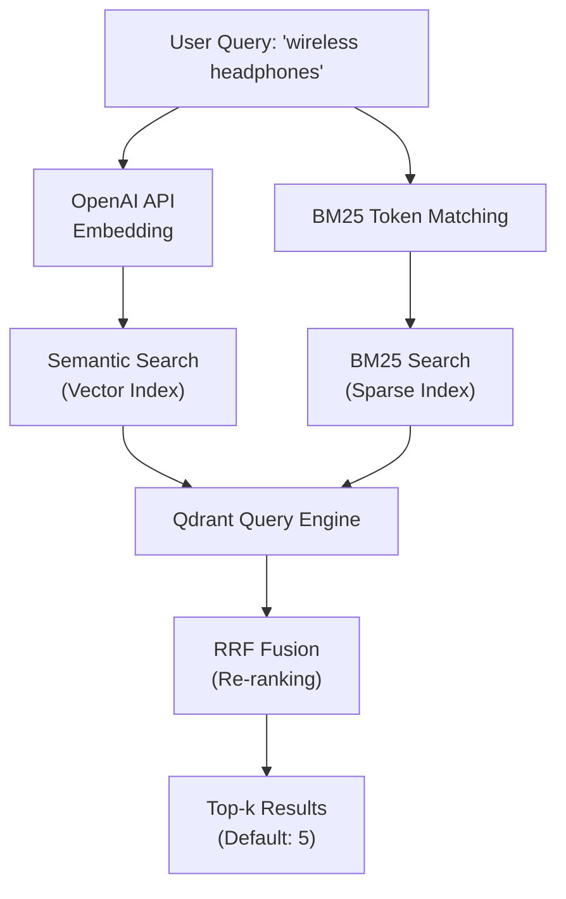
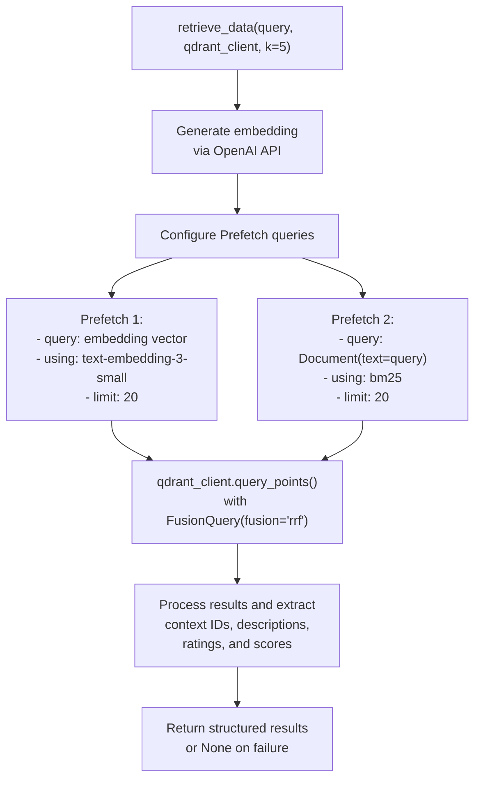
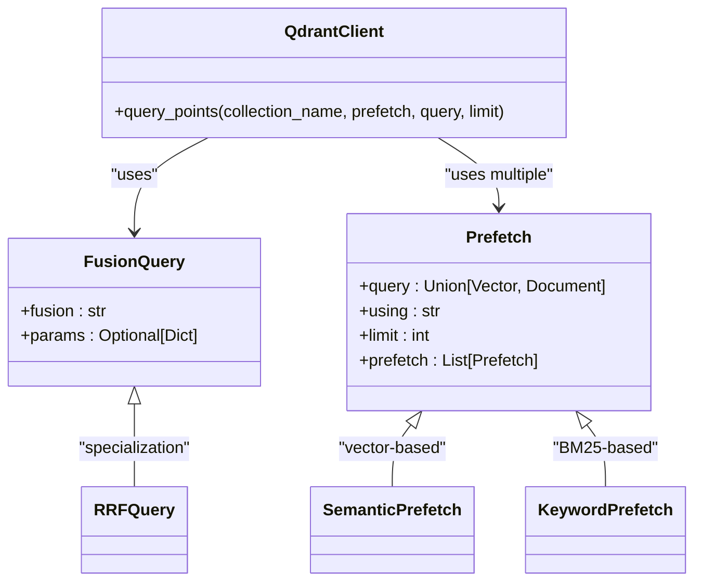
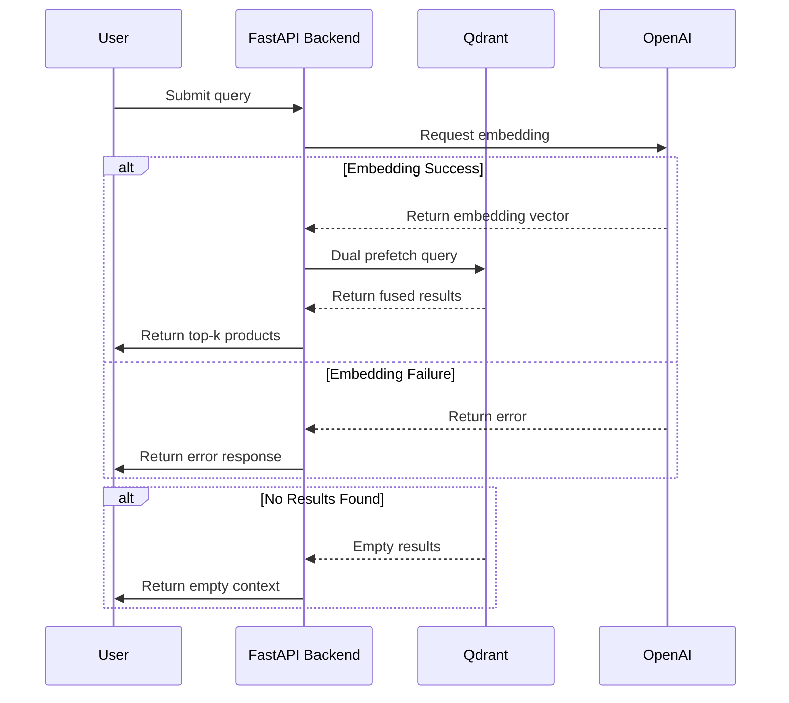

# Hybrid Search

<cite>
**Referenced Files in This Document**   
- [retrieval_generation.py](file://src/api/rag/retrieval_generation.py)
- [ARCHITECTURE.md](file://documentation/ARCHITECTURE.md)
</cite>

## Table of Contents
1. [Introduction](#introduction)
2. [Hybrid Search Architecture](#hybrid-search-architecture)
3. [Implementation of Dual Retrieval](#implementation-of-dual-retrieval)
4. [RRF Fusion Mechanism](#rrf-fusion-mechanism)
5. [Performance Considerations](#performance-considerations)
6. [Error Handling and Debugging](#error-handling-and-debugging)
7. [Conclusion](#conclusion)

## Introduction
The Hybrid Search feature implements a dual-retrieval strategy combining semantic (vector) and keyword (BM25) search methods to improve product retrieval relevance. This approach leverages both intent-based understanding through embeddings and exact keyword matching through BM25, fused using Reciprocal Rank Fusion (RRF) to produce optimal results. The system is designed to handle Amazon product queries with high precision and recall.

**Section sources**
- [retrieval_generation.py](file://src/api/rag/retrieval_generation.py#L78-L153)
- [ARCHITECTURE.md](file://documentation/ARCHITECTURE.md#L194-L244)

## Hybrid Search Architecture

**Diagram sources**
- [ARCHITECTURE.md](file://documentation/ARCHITECTURE.md#L588-L631)
- [retrieval_generation.py](file://src/api/rag/retrieval_generation.py#L99-L118)

## Implementation of Dual Retrieval

The `retrieve_data` function in retrieval_generation.py performs dual prefetch queries against Qdrant using both text embeddings and BM25 token matching. The implementation uses Qdrant's Prefetch functionality to execute both retrieval methods in parallel.

**Diagram sources**
- [retrieval_generation.py](file://src/api/rag/retrieval_generation.py#L81-L117)
- [retrieval_generation.py](file://src/api/rag/retrieval_generation.py#L37-L79)

**Section sources**
- [retrieval_generation.py](file://src/api/rag/retrieval_generation.py#L78-L153)

## RRF Fusion Mechanism

Reciprocal Rank Fusion (RRF) combines results from both retrieval methods to improve relevance by aggregating rankings from semantic and keyword searches. The RRF score is calculated using the formula: `RRF_score(p) = 1/(60 + semantic_rank(p)) + 1/(60 + bm25_rank(p))`.

**Diagram sources**
- [retrieval_generation.py](file://src/api/rag/retrieval_generation.py#L115)
- [ARCHITECTURE.md](file://documentation/ARCHITECTURE.md#L268-L297)

**Section sources**
- [retrieval_generation.py](file://src/api/rag/retrieval_generation.py#L104-L112)
- [ARCHITECTURE.md](file://documentation/ARCHITECTURE.md#L588-L631)

## Performance Considerations

The hybrid search implementation balances query latency, result diversity, and retrieval quality through careful configuration of k-values and limit parameters. The system retrieves top-20 results from each method before applying RRF fusion to produce the final top-k results (default: 5).

**Key Performance Parameters:**
- **Prefetch limit**: 20 results per method (semantic and BM25)
- **Final limit (k)**: Configurable, default 5
- **Embedding model**: text-embedding-3-small (1536 dimensions)
- **Fusion method**: RRF with k=60 parameter

The dual retrieval approach increases query complexity but significantly improves result relevance by combining the strengths of both semantic understanding and keyword matching. The system is optimized to minimize the performance impact through parallel execution of prefetch queries.

**Section sources**
- [retrieval_generation.py](file://src/api/rag/retrieval_generation.py#L104-L112)
- [ARCHITECTURE.md](file://documentation/ARCHITECTURE.md#L588-L631)

## Error Handling and Debugging

The system implements comprehensive error handling for various failure scenarios, including embedding generation failures and empty result sets. All pipeline steps are instrumented with LangSmith tracing for debugging and performance analysis.

**Common Issues and Solutions:**
- **Empty results**: Handled by returning empty context lists with appropriate logging
- **Embedding failures**: Detected and logged, with function returning None
- **Qdrant connection issues**: Caught and logged as UnexpectedResponse
- **Rate limiting**: OpenAI rate limit errors are specifically handled

**Diagram sources**
- [retrieval_generation.py](file://src/api/rag/retrieval_generation.py#L81-L153)
- [retrieval_generation.py](file://src/api/rag/retrieval_generation.py#L37-L79)

**Section sources**
- [retrieval_generation.py](file://src/api/rag/retrieval_generation.py#L81-L153)
- [retrieval_generation.py](file://src/api/rag/retrieval_generation.py#L37-L79)

## Conclusion
The Hybrid Search implementation effectively combines semantic and keyword retrieval methods using RRF fusion to deliver high-quality product search results. By leveraging both vector embeddings and BM25 matching, the system captures both intent-based relevance and exact keyword matches, producing more comprehensive and accurate results than either method alone. The architecture is robust, observable through LangSmith tracing, and handles edge cases gracefully, making it suitable for production deployment in e-commerce search scenarios.