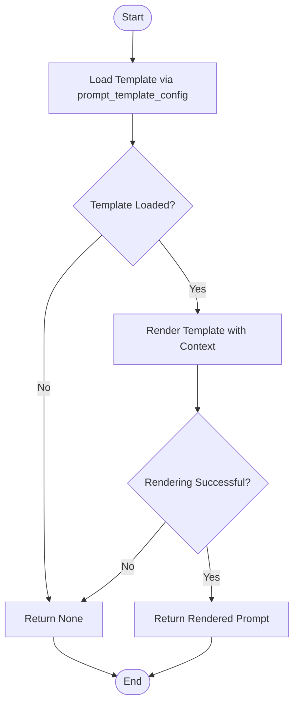
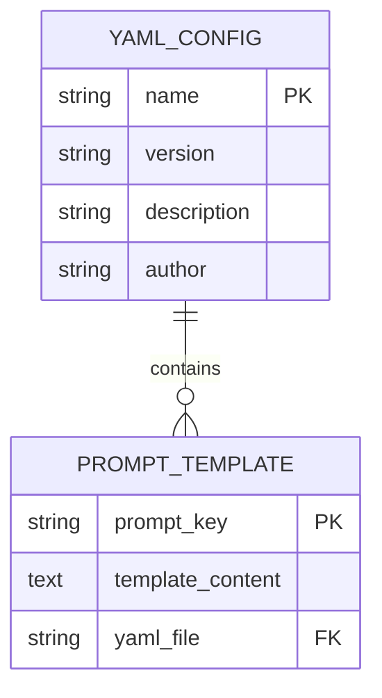
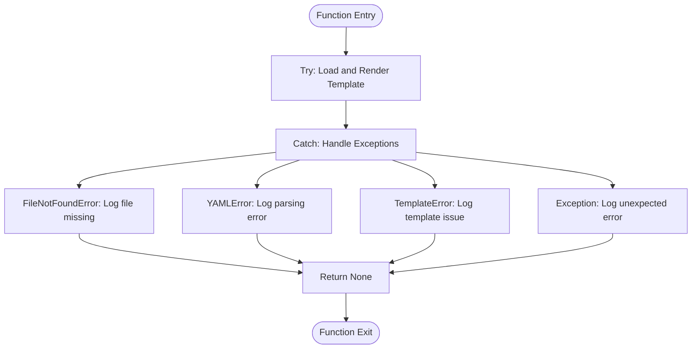
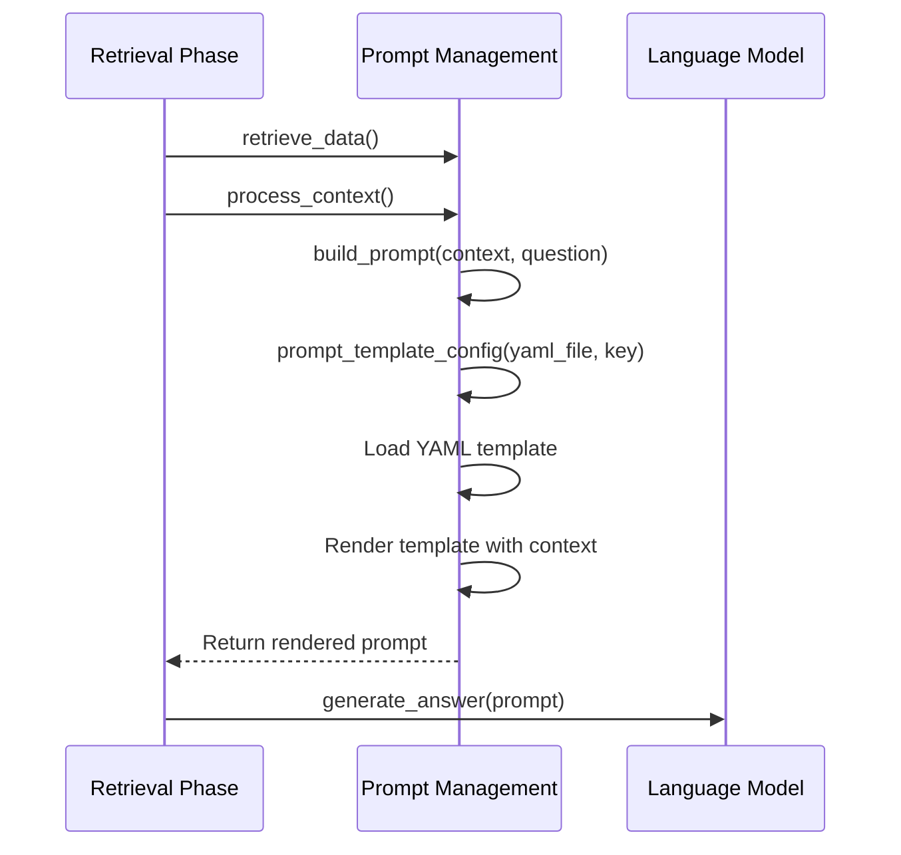

# Prompt Management

<cite>
**Referenced Files in This Document**   
- [prompt_management.py](file://src/api/rag/utils/prompt_management.py)
- [retrieval_generation.yaml](file://src/api/rag/prompts/retrieval_generation.yaml)
- [retrieval_generation.py](file://src/api/rag/retrieval_generation.py)
</cite>

## Table of Contents
1. [Introduction](#introduction)
2. [Prompt Template Configuration](#prompt-template-configuration)
3. [Template Loading and Rendering Process](#template-loading-and-rendering-process)
4. [YAML Configuration Structure](#yaml-configuration-structure)
5. [Error Handling and Debugging](#error-handling-and-debugging)
6. [Best Practices for Prompt Management](#best-practices-for-prompt-management)
7. [Integration with RAG Pipeline](#integration-with-rag-pipeline)
8. [Conclusion](#conclusion)

## Introduction
The Prompt Management system provides a structured approach to managing and rendering prompt templates for the Retrieval-Augmented Generation (RAG) pipeline. This system enables dynamic prompt construction through YAML-based configuration files and Jinja2 templating, allowing for flexible and maintainable prompt design. The core functionality revolves around loading templates from configuration files, rendering them with context variables, and integrating them seamlessly into the RAG workflow.

## Prompt Template Configuration

The prompt template configuration system is implemented through the `prompt_template_config` utility function, which serves as the primary interface for loading and processing prompt templates from YAML files. This function accepts two parameters: the path to the YAML configuration file and the specific prompt key to retrieve. It returns a Jinja2 Template object that can be rendered with context variables.

The configuration system supports multiple prompt templates within a single YAML file, allowing for A/B testing and version management through different prompt keys. The function handles various error conditions including file not found, YAML parsing errors, and template compilation issues, providing comprehensive logging for debugging purposes.

**Section sources**
- [prompt_management.py](file://src/api/rag/utils/prompt_management.py#L11-L52)

## Template Loading and Rendering Process

The template loading and rendering process follows a well-defined workflow that begins with template retrieval and concludes with prompt generation. The `build_prompt` function orchestrates this process by first invoking `prompt_template_config` to load the appropriate template from the YAML configuration file. If template loading fails, the function returns None and logs an error message.

Once the template is successfully loaded, it is rendered using the provided context variables (`preprocessed_context` and `question`). The rendering process substitutes the Jinja2 placeholders with actual values, producing the final prompt string that will be sent to the language model. This two-step process (load then render) provides clear separation of concerns and facilitates error handling at each stage.

**Diagram sources**
- [retrieval_generation.py](file://src/api/rag/retrieval_generation.py#L199-L225)
- [prompt_management.py](file://src/api/rag/utils/prompt_management.py#L11-L52)

**Section sources**
- [retrieval_generation.py](file://src/api/rag/retrieval_generation.py#L199-L225)

## YAML Configuration Structure

The YAML configuration file follows a structured format with two main sections: metadata and prompts. The metadata section contains descriptive information about the prompt template including name, version, description, and author. This metadata enables version tracking and provides context for template usage.

The prompts section contains the actual template content, with each template identified by a unique key. In the case of `retrieval_generation.yaml`, the template uses Jinja2 syntax with two placeholders: `{{ preprocessed_context }}` and `{{ question }}`. These placeholders are dynamically replaced during the rendering process with the formatted context from the retrieval phase and the user's original question, respectively.

The template content includes detailed instructions for the language model, specifying the expected output format and behavior. This includes requirements to answer based on context only, refer to context as "available products," and provide structured output with answer, chunk IDs, and item descriptions.

**Diagram sources**
- [retrieval_generation.yaml](file://src/api/rag/prompts/retrieval_generation.yaml#L1-L32)

**Section sources**
- [retrieval_generation.yaml](file://src/api/rag/prompts/retrieval_generation.yaml#L1-L32)

## Error Handling and Debugging

The prompt management system implements comprehensive error handling to ensure robust operation in production environments. The `prompt_template_config` function catches and handles several types of exceptions, including `FileNotFoundError` for missing configuration files, `yaml.YAMLError` for parsing issues, and `TemplateError` for template compilation problems.

Each error condition is logged with descriptive messages that include the specific error and relevant context, facilitating debugging and troubleshooting. The system follows a fail-safe approach, returning None when template loading or rendering fails, which allows the calling function to handle the error appropriately.

For debugging purposes, the system generates detailed log output at each stage of the template loading and rendering process. This includes informational messages when templates are successfully loaded and rendered, as well as error messages when issues occur. Developers can inspect these logs to identify the root cause of prompt-related issues.

**Diagram sources**
- [prompt_management.py](file://src/api/rag/utils/prompt_management.py#L11-L52)

**Section sources**
- [prompt_management.py](file://src/api/rag/utils/prompt_management.py#L11-L52)

## Best Practices for Prompt Management

Effective prompt management requires adherence to several best practices to ensure maintainability, reliability, and performance. For prompt versioning, it is recommended to increment the version number in the YAML metadata whenever significant changes are made to the template. This enables tracking of template evolution and facilitates rollback to previous versions if needed.

For A/B testing, multiple prompt templates can be defined within the same YAML file or across different files, allowing for comparison of different prompt strategies. The template keys serve as identifiers for different variants, making it easy to switch between them in the application code.

Maintaining readability in prompt templates is crucial for collaboration and debugging. This includes using clear and descriptive template keys, providing comprehensive metadata, and formatting the template content with proper indentation and comments. The instructions within the template should be explicit and unambiguous to ensure consistent behavior from the language model.

When modifying templates, it is important to test thoroughly and monitor the impact on output quality. Changes to prompt structure or instructions can have significant effects on the generated responses, so incremental changes with proper evaluation are recommended.

## Integration with RAG Pipeline

The prompt management system is tightly integrated with the RAG pipeline through the `build_prompt` function, which serves as the bridge between the retrieval and generation phases. After the retrieval phase produces relevant context, this context is preprocessed and passed to `build_prompt` along with the original question.

The integration follows a dependency chain where the `retrieval_generation.py` module imports the `prompt_template_config` function from the prompt management utility. This modular design allows for independent development and testing of the prompt management functionality while ensuring seamless integration with the broader RAG system.

The integration points are clearly defined, with well-documented interfaces and error handling. If prompt building fails, the RAG pipeline gracefully handles the error by terminating the process and logging the issue, preventing malformed prompts from being sent to the language model.

**Diagram sources**
- [retrieval_generation.py](file://src/api/rag/retrieval_generation.py#L199-L225)
- [prompt_management.py](file://src/api/rag/utils/prompt_management.py#L11-L52)

**Section sources**
- [retrieval_generation.py](file://src/api/rag/retrieval_generation.py#L199-L225)

## Conclusion

The Prompt Management system provides a robust and flexible foundation for managing prompt templates in the RAG pipeline. By leveraging YAML-based configuration and Jinja2 templating, it enables dynamic prompt construction with comprehensive error handling and debugging capabilities. The system supports best practices for prompt versioning, A/B testing, and maintainability, making it well-suited for production environments. Through its clean integration with the RAG pipeline, it ensures reliable prompt generation that contributes to the overall effectiveness of the AI-powered product assistant.