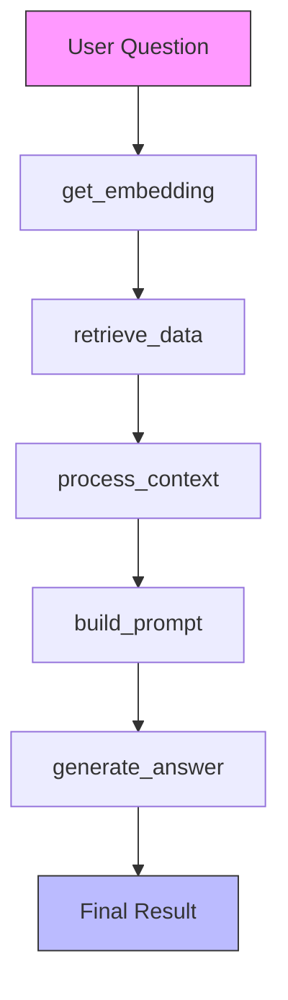
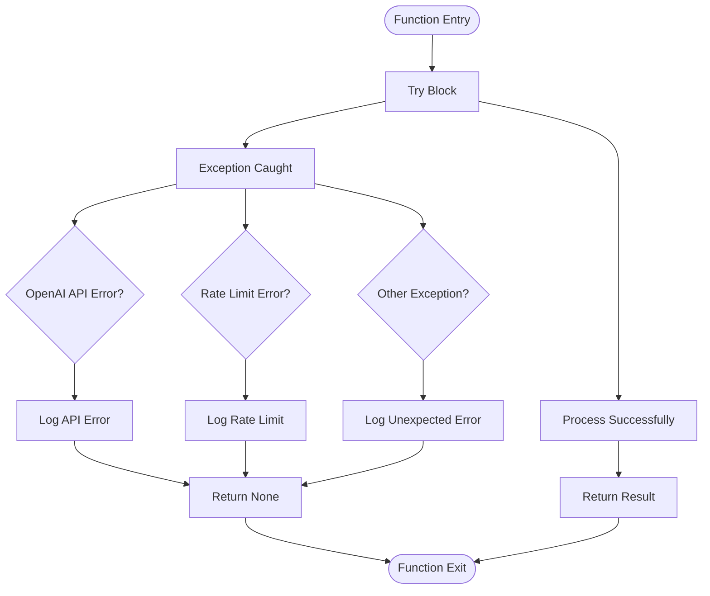
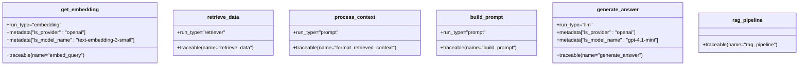

# RAG Pipeline

<cite>
**Referenced Files in This Document**   
- [retrieval_generation.py](file://src/api/rag/retrieval_generation.py)
- [retrieval_generation.yaml](file://src/api/rag/prompts/retrieval_generation.yaml)
- [models.py](file://src/api/api/models.py)
</cite>

## Table of Contents
1. [Introduction](#introduction)
2. [Core Components](#core-components)
3. [RAG Pipeline Execution Flow](#rag-pipeline-execution-flow)
4. [Error Handling and Logging](#error-handling-and-logging)
5. [Integration with External Services](#integration-with-external-services)
6. [Observability with LangSmith](#observability-with-langsmith)
7. [Performance Considerations](#performance-considerations)
8. [Conclusion](#conclusion)

## Introduction
The RAG (Retrieval-Augmented Generation) Pipeline is a critical component of the AI-Powered Amazon Product Assistant, designed to provide accurate and contextually relevant responses to user queries about products. This document details the end-to-end process of the pipeline, from query embedding generation to final answer synthesis. The system leverages hybrid search capabilities via Qdrant for efficient context retrieval and uses OpenAI's language models for structured answer generation. Each stage incorporates robust error handling, logging, and observability features to ensure reliability and maintainability.

## Core Components

The RAG pipeline consists of several modular functions that work together to process user queries and generate informed responses. These components are designed with separation of concerns, enabling independent testing and optimization.

### get_embedding Function
Generates vector embeddings for input text using OpenAI's `text-embedding-3-small` model. This function converts natural language queries into numerical vectors suitable for semantic similarity comparisons in the retrieval phase.

**Section sources**
- [retrieval_generation.py](file://src/api/rag/retrieval_generation.py#L34-L71)

### retrieve_data Function
Executes a hybrid search strategy combining semantic and keyword-based (BM25) retrieval methods through Qdrant's RRF fusion mechanism. This approach enhances result relevance by leveraging both vector similarity and lexical matching.

**Section sources**
- [retrieval_generation.py](file://src/api/rag/retrieval_generation.py#L78-L153)

### process_context Function
Transforms raw retrieval results into a structured string format suitable for inclusion in LLM prompts. The function extracts key product attributes such as ASIN, description, and average rating for downstream processing.

**Section sources**
- [retrieval_generation.py](file://src/api/rag/retrieval_generation.py#L160-L192)

### build_prompt Function
Constructs the final prompt by combining the preprocessed context with a templated instruction set loaded from a YAML configuration file. This ensures consistency in prompt engineering across different query types.

**Section sources**
- [retrieval_generation.py](file://src/api/rag/retrieval_generation.py#L199-L225)
- [retrieval_generation.yaml](file://src/api/rag/prompts/retrieval_generation.yaml#L1-L32)

### generate_answer Function
Uses OpenAI's GPT-4.1-mini model via the Instructor library to produce structured outputs conforming to the `RAGGenerationResponseWithReferences` schema. This enables predictable parsing of answers and referenced items.

**Section sources**
- [retrieval_generation.py](file://src/api/rag/retrieval_generation.py#L233-L273)

## RAG Pipeline Execution Flow

The complete RAG pipeline orchestrates all components in a sequential workflow, ensuring data flows correctly from input to output while handling potential failures at each stage.

**Diagram sources**
- [retrieval_generation.py](file://src/api/rag/retrieval_generation.py#L279-L328)

### rag_pipeline Function
Coordinates the entire retrieval and generation process. It accepts a user question and Qdrant client instance, then sequentially executes:
1. Context retrieval using hybrid search
2. Context preprocessing for prompt formatting
3. Prompt construction using template rendering
4. Answer generation with structured output parsing
5. Final result assembly with metadata preservation

The function returns a dictionary containing the generated answer, reference materials, and retrieval metrics.

**Section sources**
- [retrieval_generation.py](file://src/api/rag/retrieval_generation.py#L279-L328)

### rag_pipeline_wrapper Function
Enhances the base pipeline output by enriching referenced items with additional metadata such as image URLs and pricing information. It performs secondary lookups in Qdrant using parent ASIN identifiers to retrieve full product details.

**Section sources**
- [retrieval_generation.py](file://src/api/rag/retrieval_generation.py#L331-L400)

## Error Handling and Logging

Each component implements comprehensive error handling to ensure graceful degradation in case of service failures or unexpected conditions.

**Diagram sources**
- [retrieval_generation.py](file://src/api/rag/retrieval_generation.py#L34-L71)
- [retrieval_generation.py](file://src/api/rag/retrieval_generation.py#L78-L153)
- [retrieval_generation.py](file://src/api/rag/retrieval_generation.py#L233-L273)

All functions use Python's logging module to record execution status, including:
- Informational messages for successful operations
- Warnings for recoverable issues (e.g., empty results)
- Errors for failed operations with exception details
- Input parameters and outcome summaries for audit purposes

Specific error types handled include:
- `openai.APIError`: General OpenAI service errors
- `openai.RateLimitError`: Quota exhaustion scenarios
- `UnexpectedResponse`: Qdrant client communication failures
- `KeyError`: Missing expected data fields in payloads

**Section sources**
- [retrieval_generation.py](file://src/api/rag/retrieval_generation.py#L34-L71)
- [retrieval_generation.py](file://src/api/rag/retrieval_generation.py#L78-L153)
- [retrieval_generation.py](file://src/api/rag/retrieval_generation.py#L233-L273)

## Integration with External Services

The pipeline integrates with two primary external services: Qdrant for vector search and OpenAI for language generation.

### Qdrant Integration
Uses the QdrantClient to connect to a local instance (`http://qdrant:6333`) and execute hybrid search queries against the `Amazon-items-collection-01-hybrid-search` collection. The integration supports:
- Semantic search using `text-embedding-3-small` vectors
- Keyword search using BM25 algorithm
- Reciprocal Rank Fusion (RRF) for result combination
- Payload filtering for metadata enrichment

### OpenAI Integration
Leverages OpenAI's API for both embedding generation and answer synthesis:
- `text-embedding-3-small` model for query vectorization
- `gpt-4.1-mini` model for answer generation with structured output
- Instructor library for Pydantic model-based response parsing

**Section sources**
- [retrieval_generation.py](file://src/api/rag/retrieval_generation.py#L34-L71)
- [retrieval_generation.py](file://src/api/rag/retrieval_generation.py#L78-L153)
- [retrieval_generation.py](file://src/api/rag/retrieval_generation.py#L233-L273)

## Observability with LangSmith

The pipeline employs `@traceable` decorators from LangSmith to enable comprehensive monitoring and debugging capabilities.

**Diagram sources**
- [retrieval_generation.py](file://src/api/rag/retrieval_generation.py#L34-L71)
- [retrieval_generation.py](file://src/api/rag/retrieval_generation.py#L78-L153)
- [retrieval_generation.py](file://src/api/rag/retrieval_generation.py#L160-L192)
- [retrieval_generation.py](file://src/api/rag/retrieval_generation.py#L199-L225)
- [retrieval_generation.py](file://src/api/rag/retrieval_generation.py#L233-L273)
- [retrieval_generation.py](file://src/api/rag/retrieval_generation.py#L279-L328)

Each traced function captures:
- Execution timing and sequence
- Input/output data (where appropriate)
- Token usage metrics from OpenAI API calls
- Custom metadata including provider and model information
- Error details when exceptions occur

Token usage is specifically tracked in both `get_embedding` and `generate_answer` functions by capturing `prompt_tokens`, `completion_tokens`, and `total_tokens` from API responses and storing them in LangSmith run metadata.

**Section sources**
- [retrieval_generation.py](file://src/api/rag/retrieval_generation.py#L34-L71)
- [retrieval_generation.py](file://src/api/rag/retrieval_generation.py#L233-L273)

## Performance Considerations

The pipeline incorporates several optimizations to balance response quality with efficiency.

### Latency Optimization
- Hybrid search limits initial retrieval to 20 candidates per method before RRF fusion
- Top-k parameter (default: 5) controls final result count to minimize processing overhead
- Vector dimensions optimized using 1536-dimensional `text-embedding-3-small` model

### Failure Recovery Strategies
- Comprehensive try-except blocks at each processing stage
- Graceful degradation: returns partial results when possible
- Null checks after each function call to prevent cascading failures
- Wrapper function isolates Qdrant connection logic for retry opportunities

### Data Model Consistency
The system maintains consistent data structures across components:

**RAG Response Schema**
| Field | Type | Description |
|-------|------|-------------|
| answer | string | Final generated response |
| references | list[RAGUsedContext] | Items used in answering |
| question | string | Original user query |
| retrieved_context_ids | list[string] | ASIN identifiers of retrieved items |
| retrieved_context | list[string] | Product descriptions |
| similarity_scores | list[float] | Relevance scores from retrieval |

**RAGUsedContext Schema**
| Field | Type | Description |
|-------|------|-------------|
| id | string | Product ASIN identifier |
| description | string | Item description used in response |

**Section sources**
- [retrieval_generation.py](file://src/api/rag/retrieval_generation.py#L20-L26)
- [models.py](file://src/api/api/models.py#L8-L16)

## Conclusion
The RAG Pipeline provides a robust framework for answering product-related queries by combining advanced retrieval techniques with structured language generation. Its modular design enables independent optimization of each processing stage while comprehensive error handling and observability features ensure reliability in production environments. The integration of hybrid search, structured outputs, and detailed telemetry creates a powerful foundation for an effective shopping assistant application.