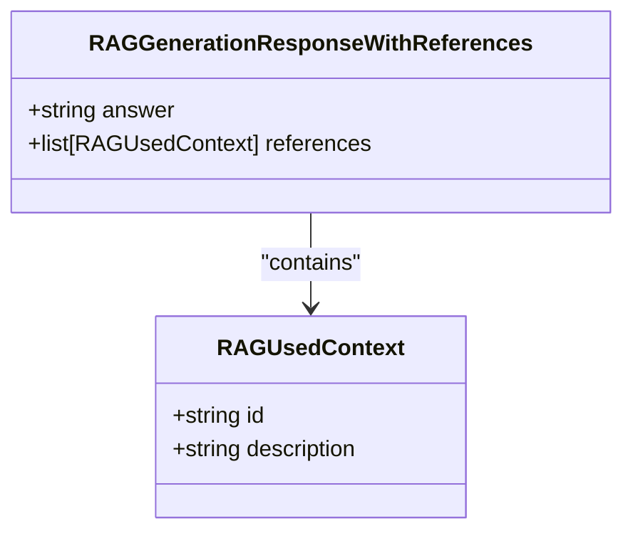
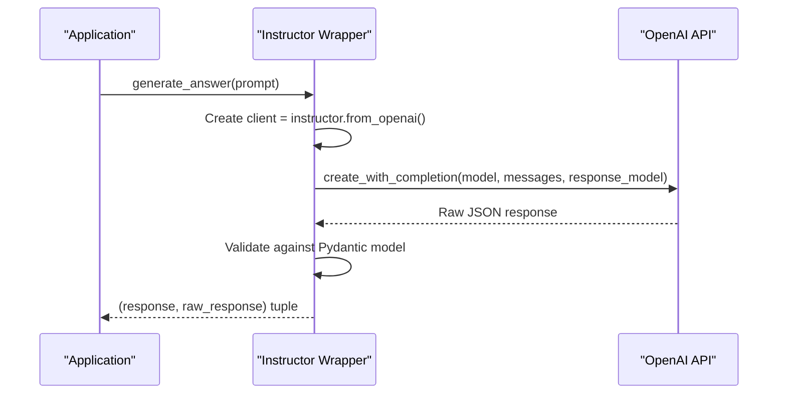

# Structured Outputs

<cite>
**Referenced Files in This Document**   
- [retrieval_generation.py](file://src/api/rag/retrieval_generation.py)
- [models.py](file://src/api/api/models.py)
</cite>

## Table of Contents
1. [Introduction](#introduction)
2. [Core Pydantic Models](#core-pydantic-models)
3. [Structured Response Generation](#structured-response-generation)
4. [Instructor Integration](#instructor-integration)
5. [Token Usage Tracking](#token-usage-tracking)
6. [Benefits of Structured Outputs](#benefits-of-structured-outputs)
7. [Common Issues and Troubleshooting](#common-issues-and-troubleshooting)
8. [Model Extension Guidelines](#model-extension-guidelines)

## Introduction
The Structured Outputs feature leverages Instructor and Pydantic models to enforce schema-constrained responses from Large Language Models (LLMs). This approach ensures predictable, reliable, and type-safe outputs in the RAG (Retrieval-Augmented Generation) pipeline. By defining strict output schemas, the system eliminates the need for complex prompt engineering to control response formats and reduces parsing errors from unstructured LLM outputs.

**Section sources**
- [retrieval_generation.py](file://src/api/rag/retrieval_generation.py#L20-L26)

## Core Pydantic Models
The system utilizes two primary Pydantic models to define the required output structure: `RAGGenerationResponseWithReferences` and `RAGUsedContext`. These models serve as contracts that the LLM response must adhere to, ensuring consistent data types and field availability.

The `RAGUsedContext` model defines the structure for individual reference items, containing an `id` field that corresponds to the product's unique identifier (parent ASIN) and a `description` field with a concise product summary. This model is used to track which products were referenced in generating the answer.

The `RAGGenerationResponseWithReferences` model serves as the main response container, with an `answer` field for the natural language response and a `references` field that contains a list of `RAGUsedContext` objects. This hierarchical structure enables the system to provide both a human-readable answer and machine-readable references to the source products.

**Diagram sources**
- [retrieval_generation.py](file://src/api/rag/retrieval_generation.py#L20-L26)

**Section sources**
- [retrieval_generation.py](file://src/api/rag/retrieval_generation.py#L20-L26)

## Structured Response Generation
The `generate_answer` function is responsible for producing structured responses by leveraging the defined Pydantic models. This function takes a formatted prompt as input and returns a validated `RAGGenerationResponseWithReferences` object or `None` if the generation fails.

The process begins with the creation of an Instructor-wrapped OpenAI client, which enables structured output functionality. The client's `create_with_completion` method is then called with the target model, system message (prompt), and crucially, the `response_model` parameter set to `RAGGenerationResponseWithReferences`. This configuration forces the LLM to generate a response that conforms to the specified schema.

Upon successful generation, the response is automatically validated against the Pydantic model. If the LLM output does not match the expected structure, a validation error is raised, preventing malformed responses from propagating through the system. This validation occurs before the response is returned, ensuring that downstream components can rely on the presence and type of all expected fields.

**Section sources**
- [retrieval_generation.py](file://src/api/rag/retrieval_generation.py#L233-L273)

## Instructor Integration
The integration of Instructor with the OpenAI client is a critical component of the structured output system. The `instructor.from_openai(openai.OpenAI())` function wraps the standard OpenAI client, adding structured output capabilities without requiring changes to the underlying API interaction patterns.

This wrapper converts the Pydantic model schema into an OpenAI function calling specification, which is used to constrain the LLM's output. The LLM is effectively instructed to return JSON that matches the specified structure, with Instructor handling the conversion between the function calling format and the native Pydantic model.

The `create_with_completion` method returns a tuple containing both the parsed Pydantic model instance and the raw OpenAI response object. This dual return value provides access to both the structured data for application use and the complete API response for metadata extraction, such as token usage statistics.

**Diagram sources**
- [retrieval_generation.py](file://src/api/rag/retrieval_generation.py#L245-L252)

**Section sources**
- [retrieval_generation.py](file://src/api/rag/retrieval_generation.py#L233-L273)

## Token Usage Tracking
The system captures detailed token usage metrics by accessing the raw response object returned from the `create_with_completion` method. This raw response contains usage information that is extracted and stored in the LangSmith tracing system for observability and cost tracking.

The token metrics include `prompt_tokens` (input tokens), `completion_tokens` (output tokens), and `total_tokens`, which are stored in the current run's metadata. This information is crucial for monitoring API costs, optimizing prompt efficiency, and analyzing performance characteristics of the RAG pipeline.

By capturing this data at the point of LLM generation, the system provides comprehensive insights into resource consumption for each query, enabling fine-grained analysis of the cost-performance trade-offs in the retrieval and generation process.

**Section sources**
- [retrieval_generation.py](file://src/api/rag/retrieval_generation.py#L254-L261)

## Benefits of Structured Outputs
The implementation of structured outputs provides several key advantages for the RAG system. First, it ensures predictable parsing by guaranteeing that the response will always contain the expected fields with the correct data types, eliminating the need for error-prone string parsing or JSON validation logic.

Second, it significantly reduces prompt engineering complexity. Without structured outputs, extensive prompt engineering would be required to encourage the LLM to produce consistently formatted responses. The schema enforcement allows for simpler, more focused prompts that emphasize content quality rather than format compliance.

Third, it improves reliability by failing fast when the LLM produces invalid output. Instead of propagating malformed responses through the system, validation errors are raised immediately, enabling proper error handling and preventing downstream failures.

Finally, the type safety provided by Pydantic models enables better IDE support, code completion, and static analysis, improving developer productivity and reducing bugs in the codebase that consumes the LLM responses.

## Common Issues and Troubleshooting
Despite the robustness of structured outputs, several common issues may arise. Schema mismatches can occur when the LLM fails to generate output that conforms to the Pydantic model, typically resulting in validation errors. This may happen when the requested information cannot be extracted from the provided context or when the model misunderstands the required format.

To address schema mismatches, consider refining the prompt to provide clearer instructions about the expected output structure, or adjust the Pydantic model to be more flexible with optional fields. Monitoring the LangSmith traces can help identify patterns in validation failures and inform prompt improvements.

Another potential issue is performance overhead from the validation process. While generally minimal, the schema validation adds computational cost. For high-throughput scenarios, ensure that the benefits of structured outputs outweigh this overhead.

When troubleshooting, examine the raw response from the LLM to understand what was generated before validation, as this can provide insights into whether the issue lies with the LLM's understanding or with the schema definition.

## Model Extension Guidelines
Extending the response model for additional fields requires careful consideration of backward compatibility and system integration. To add new fields, modify the `RAGGenerationResponseWithReferences` or `RAGUsedContext` models by adding new Pydantic fields with appropriate type hints and descriptions.

When adding fields, consider making them optional (using `Optional[T]` or providing default values) to maintain compatibility with existing code that may not expect the new fields. Document the purpose and expected content of each new field clearly in the Field description.

After extending the model, update any downstream components that consume the response to handle the new fields appropriately. This includes the API response model in `models.py`, which may need to be updated to include the new information in the final response to clients.

Thorough testing is essential when extending models. Create test cases that verify both successful parsing of valid responses with the new fields and proper error handling when the LLM fails to provide the expected data.

**Section sources**
- [retrieval_generation.py](file://src/api/rag/retrieval_generation.py#L20-L26)
- [models.py](file://src/api/api/models.py#L8-L11)