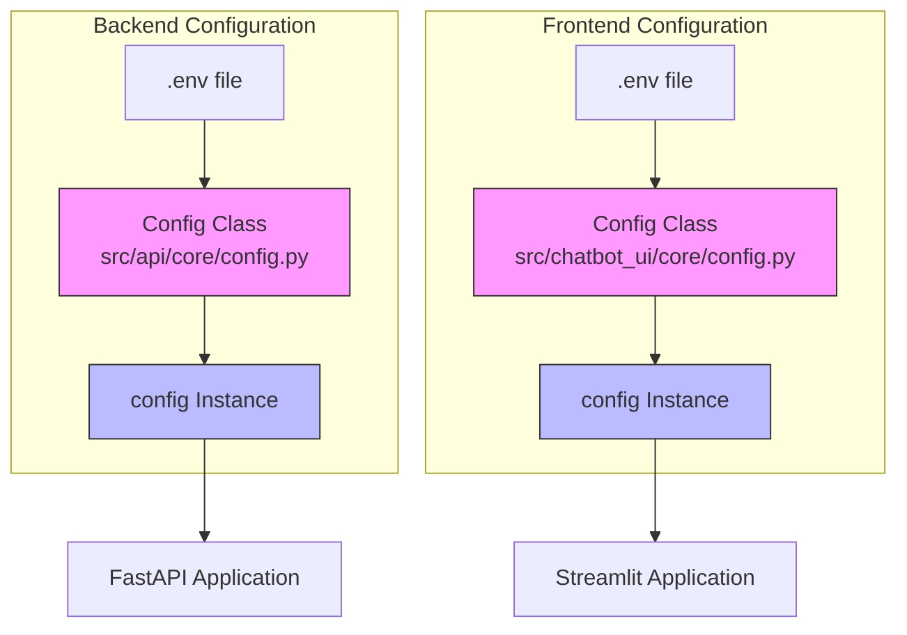
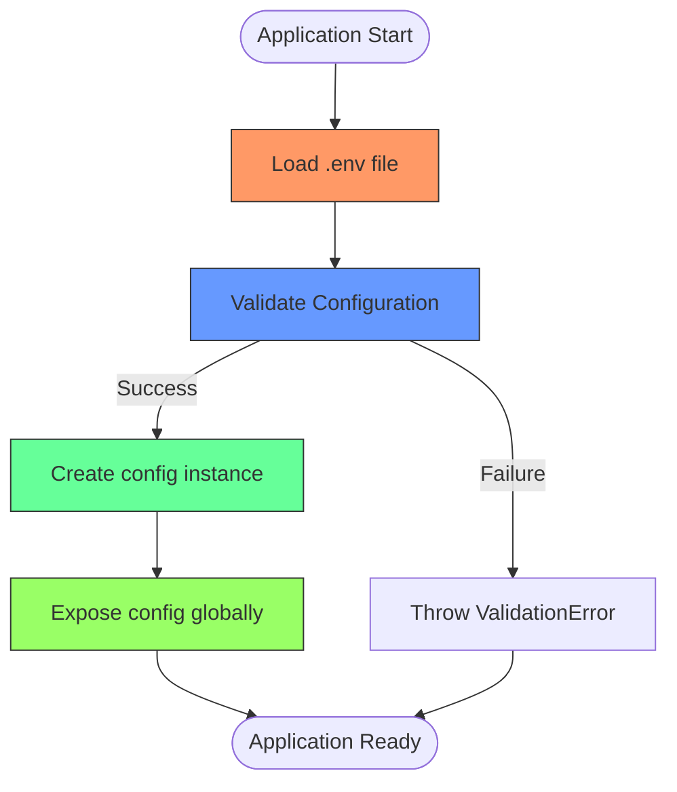

# Configuration Management

<cite>
**Referenced Files in This Document**   
- [src/api/core/config.py](file://src/api/core/config.py)
- [src/chatbot_ui/core/config.py](file://src/chatbot_ui/core/config.py)
- [docker-compose.yml](file://docker-compose.yml)
- [env.example](file://env.example)
- [src/api/app.py](file://src/api/app.py)
- [src/chatbot_ui/app.py](file://src/chatbot_ui/app.py)
</cite>

## Table of Contents
1. [Introduction](#introduction)
2. [Configuration Architecture](#configuration-architecture)
3. [Core Configuration Implementation](#core-configuration-implementation)
4. [Environment Variable Management](#environment-variable-management)
5. [Docker Integration](#docker-integration)
6. [Accessing Configuration in Application Code](#accessing-configuration-in-application-code)
7. [Extending Configuration](#extending-configuration)
8. [Best Practices](#best-practices)
9. [Conclusion](#conclusion)

## Introduction

The configuration management system in the AI-Powered Amazon Product Assistant is built on Pydantic's BaseSettings, providing a robust, type-safe approach to managing application settings. This system centralizes configuration through singleton instances in both the FastAPI backend and Streamlit frontend, enabling consistent access to environment variables and API keys across the application. The design supports secure credential management, environment separation, and seamless integration with containerized deployment via Docker Compose.

**Section sources**
- [src/api/core/config.py](file://src/api/core/config.py#L0-L10)
- [src/chatbot_ui/core/config.py](file://src/chatbot_ui/core/config.py#L0-L11)

## Configuration Architecture

The application employs a dual-configuration architecture with separate but aligned configuration classes for the backend API and frontend UI. Both configurations inherit from Pydantic's BaseSettings and load values from a shared .env file, ensuring consistency while allowing service-specific parameters.



**Diagram sources**
- [src/api/core/config.py](file://src/api/core/config.py#L2-L8)
- [src/chatbot_ui/core/config.py](file://src/chatbot_ui/core/config.py#L2-L9)

**Section sources**
- [src/api/core/config.py](file://src/api/core/config.py#L0-L10)
- [src/chatbot_ui/core/config.py](file://src/chatbot_ui/core/config.py#L0-L11)

## Core Configuration Implementation

The configuration system is implemented using Pydantic's BaseSettings class, which provides automatic environment variable loading and type validation. Each service defines a Config class that specifies the required environment variables with their types, and a singleton config instance that can be imported throughout the application.

The backend configuration in `src/api/core/config.py` defines four required API keys (OPENAI_API_KEY, GROQ_API_KEY, GOOGLE_API_KEY, CO_API_KEY) without default values, ensuring these credentials must be provided. The frontend configuration in `src/chatbot_ui/core/config.py` includes the same API keys plus an API_URL parameter with a default value pointing to the backend service at "http://api:8000", facilitating container-to-container communication in Docker.

```mermaid
classDiagram
class BaseSettings {
<<abstract>>
+load environment variables
+type validation
+.env file support
}
class Config {
+OPENAI_API_KEY : str
+GROQ_API_KEY : str
+GOOGLE_API_KEY : str
+CO_API_KEY : str
+API_URL : str = "http : //api : 8000"
+model_config : SettingsConfigDict
}
class ConfigBackend {
+OPENAI_API_KEY : str
+GROQ_API_KEY : str
+GOOGLE_API_KEY : str
+CO_API_KEY : str
+model_config : SettingsConfigDict
}
class ConfigFrontend {
+OPENAI_API_KEY : str
+GROQ_API_KEY : str
+GOOGLE_API_KEY : str
+API_URL : str = "http : //api : 8000"
+model_config : SettingsConfigDict
}
BaseSettings <|-- ConfigBackend
BaseSettings <|-- ConfigFrontend
ConfigBackend : config instance
ConfigFrontend : config instance
note right of ConfigBackend
Backend configuration for FastAPI service
All API keys are required (no defaults)
end note
note right of ConfigFrontend
Frontend configuration for Streamlit UI
API_URL has default for Docker deployment
end note
```

**Diagram sources**
- [src/api/core/config.py](file://src/api/core/config.py#L2-L8)
- [src/chatbot_ui/core/config.py](file://src/chatbot_ui/core/config.py#L2-L9)

**Section sources**
- [src/api/core/config.py](file://src/api/core/config.py#L0-L10)
- [src/chatbot_ui/core/config.py](file://src/chatbot_ui/core/config.py#L0-L11)

## Environment Variable Management

Configuration values are loaded from a .env file using Pydantic's SettingsConfigDict with the env_file parameter set to ".env". This enables automatic loading of environment variables without requiring explicit os.environ calls throughout the codebase. The env.example file serves as a template for developers, listing all required environment variables with empty values.

The system enforces type safety through Pydantic's field type annotations. String-typed fields ensure API keys are handled as text, while future extensions could include other types like integers, booleans, or complex objects. Required fields without default values (like the API keys) will cause application startup to fail if not present in the environment, preventing runtime errors due to missing credentials.



**Diagram sources**
- [src/api/core/config.py](file://src/api/core/config.py#L8-L8)
- [src/chatbot_ui/core/config.py](file://src/chatbot_ui/core/config.py#L9-L9)
- [env.example](file://env.example#L0-L6)

**Section sources**
- [src/api/core/config.py](file://src/api/core/config.py#L8-L8)
- [src/chatbot_ui/core/config.py](file://src/chatbot_ui/core/config.py#L9-L9)
- [env.example](file://env.example#L0-L6)

## Docker Integration

The configuration system is designed for seamless integration with Docker Compose, as defined in docker-compose.yml. Both the streamlit-app and api services use the env_file directive to load environment variables from the .env file, ensuring credentials are securely passed to containers without hardcoding values in the compose file.

The container networking configuration allows the Streamlit frontend to communicate with the FastAPI backend using the service name "api" as a hostname, which aligns with the default API_URL value of "http://api:8000" in the frontend configuration. This enables automatic service discovery within the Docker network without requiring external IP addresses or ports.

```mermaid
graph TB
subgraph "Docker Network"
Streamlit[Streamlit Container]
API[FastAPI Container]
Qdrant[Qdrant Container]
end
Host[Host Machine]
EnvFile[.env file]
EnvFile --> Streamlit
EnvFile --> API
Host --> EnvFile
Streamlit --> API : HTTP requests
API --> Qdrant : Vector database operations
style Streamlit fill:#f96,stroke:#333
style API fill:#69f,stroke:#333
style Qdrant fill:#6f9,stroke:#333
style EnvFile fill:#9f6,stroke:#333
note above of Streamlit
Built from Dockerfile.streamlit
Exposes port 8501
end note
note above of API
Built from Dockerfile.fastapi
Exposes port 8000
end note
```

**Diagram sources**
- [docker-compose.yml](file://docker-compose.yml#L1-L33)

**Section sources**
- [docker-compose.yml](file://docker-compose.yml#L1-L33)

## Accessing Configuration in Application Code

Configuration is accessed throughout the application via the singleton config instance imported from the respective configuration module. In the FastAPI backend (src/api/app.py), the config is imported from src.api.core.config and can be used by any component that needs access to API keys or other settings.

Similarly, in the Streamlit frontend (src/chatbot_ui/app.py), the config is imported from core.config and used to construct API endpoints for backend communication. The config.API_URL value is particularly important as it determines where the frontend sends its requests, enabling the application to work in different environments (development, staging, production) by simply changing the configuration.

```mermaid
sequenceDiagram
participant App as FastAPI App
participant Config as Config Module
participant Env as Environment
participant Backend as Backend Logic
App->>Config : import config
Config->>Env : Load .env file
Env-->>Config : Return env variables
Config->>Config : Validate types
Config-->>App : Provide config instance
App->>Backend : Use config.OPENAI_API_KEY
Backend->>OpenAI : Make API call
OpenAI-->>Backend : Return response
Backend-->>App : Process result
note right of Config
Pydantic handles validation
and type conversion
end note
```

**Diagram sources**
- [src/api/app.py](file://src/api/app.py#L3-L3)
- [src/api/core/config.py](file://src/api/core/config.py#L10-L10)
- [src/chatbot_ui/app.py](file://src/chatbot_ui/app.py#L5-L5)
- [src/chatbot_ui/core/config.py](file://src/chatbot_ui/core/config.py#L11-L11)

**Section sources**
- [src/api/app.py](file://src/api/app.py#L3-L3)
- [src/chatbot_ui/app.py](file://src/chatbot_ui/app.py#L5-L5)

## Extending Configuration

To add new configuration parameters, developers should extend the Config class in the appropriate module (backend or frontend) by adding new field definitions with appropriate types. Required parameters should be defined without default values, while optional parameters can include defaults.

For example, to add LangSmith observability support, the configuration could be extended with LANGSMITH_API_KEY and related fields. The env.example file should be updated to include the new variables, and documentation should be updated to explain their purpose and usage.

When adding parameters that should be consistent across both services, the change should be made in both configuration files to maintain alignment. For service-specific parameters, only the relevant configuration file should be modified.

**Section sources**
- [src/api/core/config.py](file://src/api/core/config.py#L2-L8)
- [src/chatbot_ui/core/config.py](file://src/chatbot_ui/core/config.py#L2-L9)
- [env.example](file://env.example#L0-L6)

## Best Practices

The configuration system follows several best practices for secure and maintainable application settings:

1. **Secrets Management**: API keys and credentials are never hardcoded but loaded from environment variables, preventing accidental exposure in version control.

2. **Type Safety**: Pydantic's type annotations ensure configuration values are validated at startup, catching errors early.

3. **Environment Separation**: Different .env files can be used for development, staging, and production environments by changing the env_file parameter or using environment-specific compose files.

4. **Default Values**: Service URLs and non-sensitive parameters include sensible defaults that work in common deployment scenarios (like Docker).

5. **Error Handling**: Missing required configuration causes immediate startup failure, making issues visible rather than allowing silent failures at runtime.

6. **Documentation**: The env.example file serves as living documentation of required configuration.

7. **Consistency**: Both frontend and backend use the same configuration pattern, reducing cognitive load for developers.

**Section sources**
- [src/api/core/config.py](file://src/api/core/config.py#L0-L10)
- [src/chatbot_ui/core/config.py](file://src/chatbot_ui/core/config.py#L0-L11)
- [env.example](file://env.example#L0-L6)

## Conclusion

The Pydantic-based configuration system provides a robust foundation for managing application settings in the AI-Powered Amazon Product Assistant. By centralizing configuration through typed classes and singleton instances, the system ensures consistent access to environment variables across both the FastAPI backend and Streamlit frontend. The integration with Docker Compose enables secure credential management in containerized environments, while the use of env.example provides clear guidance for developers setting up the application. This approach balances security, maintainability, and developer experience, serving as a model for configuration management in modern Python applications.