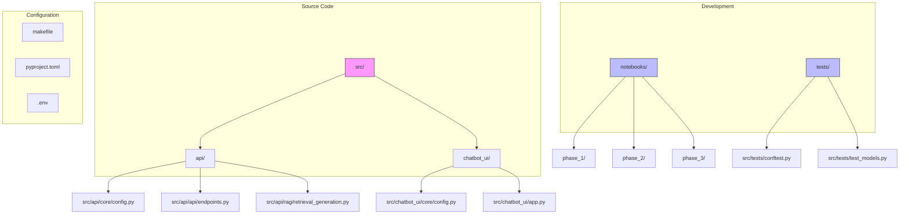
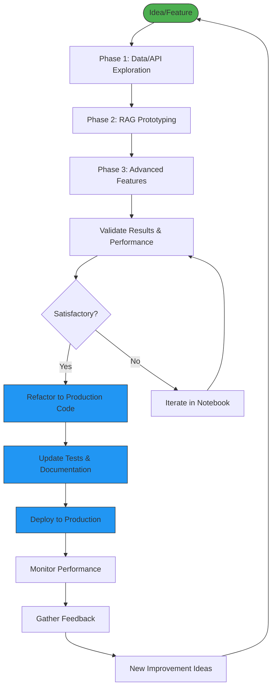
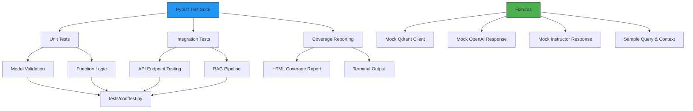
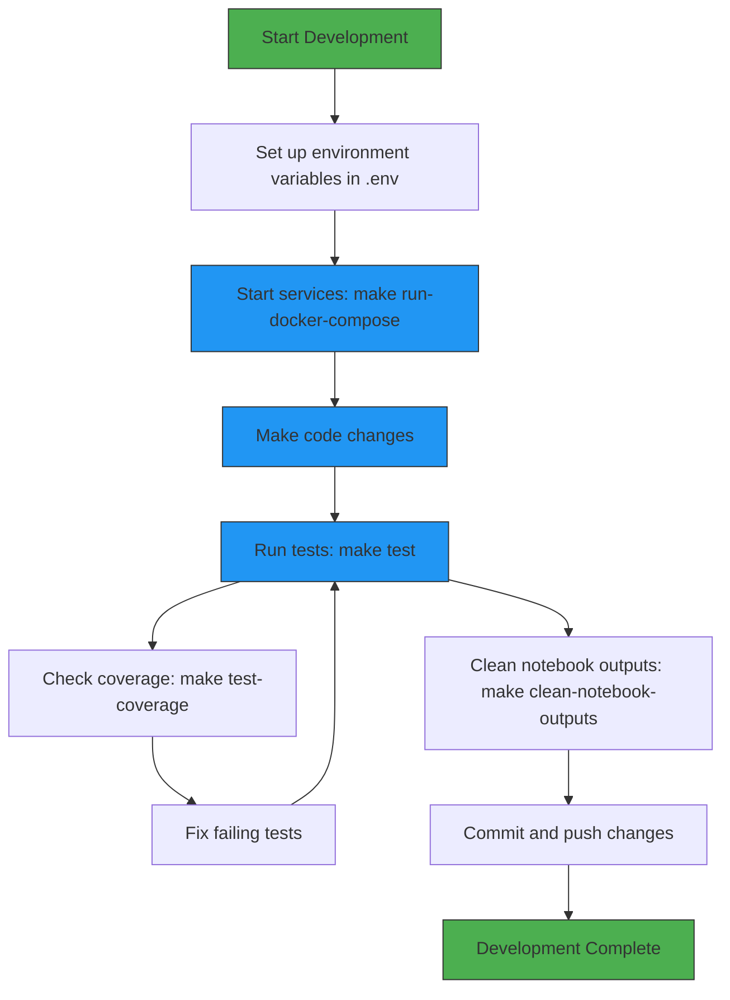
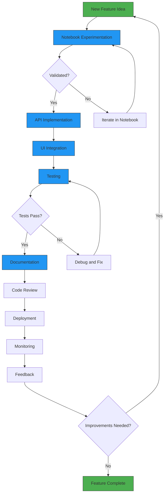
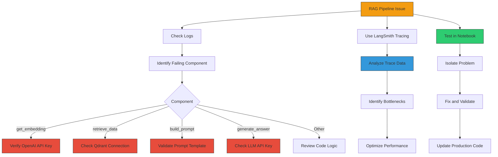

# Development Guide

<cite>
**Referenced Files in This Document**   
- [src/api/core/config.py](file://src/api/core/config.py)
- [src/chatbot_ui/core/config.py](file://src/chatbot_ui/core/config.py)
- [src/api/rag/retrieval_generation.py](file://src/api/rag/retrieval_generation.py)
- [src/api/api/endpoints.py](file://src/api/api/endpoints.py)
- [src/api/app.py](file://src/api/app.py)
- [src/chatbot_ui/app.py](file://src/chatbot_ui/app.py)
- [src/api/rag/utils/prompt_management.py](file://src/api/rag/utils/prompt_management.py)
- [src/api/rag/prompts/retrieval_generation.yaml](file://src/api/rag/prompts/retrieval_generation.yaml)
- [tests/conftest.py](file://tests/conftest.py)
- [tests/test_models.py](file://tests/test_models.py)
- [makefile](file://makefile)
- [pyproject.toml](file://pyproject.toml)
- [pytest.ini](file://pytest.ini)
- [notebooks/phase_3/02-Structured-Outputs-RAG-pipeline.ipynb](file://notebooks/phase_3/02-Structured-Outputs-RAG-pipeline.ipynb)
- [notebooks/phase_3/05-Prompt-Versioning.ipynb](file://notebooks/phase_3/05-Prompt-Versioning.ipynb)
- [documentation/ARCHITECTURE.md](file://documentation/ARCHITECTURE.md)
- [README.md](file://README.md)
</cite>

## Table of Contents
1. [Project Structure](#project-structure)
2. [Notebook Prototyping Workflow](#notebook-prototyping-workflow)
3. [Configuration Management](#configuration-management)
4. [Testing Practices](#testing-practices)
5. [Development Workflow](#development-workflow)
6. [Feature Development Guidelines](#feature-development-guidelines)
7. [RAG Pipeline Debugging](#rag-pipeline-debugging)

## Project Structure

The project follows a modular architecture with clear separation between components. The main directories are:

- **src/**: Contains all production code
  - **api/**: FastAPI backend with RAG pipeline implementation
  - **chatbot_ui/**: Streamlit frontend application
- **notebooks/**: Jupyter notebooks for prototyping and experimentation
- **tests/**: Test suite with fixtures and model validation
- **documentation/**: Architectural and development documentation

The backend API is organized into logical modules:
- **core/config.py**: Configuration management using Pydantic Settings
- **api/endpoints.py**: REST API endpoints
- **api/models.py**: Pydantic request/response models
- **rag/retrieval_generation.py**: Core RAG pipeline implementation
- **rag/utils/prompt_management.py**: Prompt template management

The frontend consists of a single Streamlit application that communicates with the backend API.



**Diagram sources**
- [README.md](file://README.md)
- [documentation/ARCHITECTURE.md](file://documentation/ARCHITECTURE.md)

**Section sources**
- [README.md](file://README.md#L1-L508)
- [documentation/ARCHITECTURE.md](file://documentation/ARCHITECTURE.md#L1-L1484)

## Notebook Prototyping Workflow

The notebooks directory is organized into three phases that represent the development lifecycle:

### Phase 1: Exploration
Located in `notebooks/phase_1/`, this phase focuses on initial data exploration and API testing:
- **02-explore-amazon-dataset.ipynb**: Exploratory data analysis of Amazon product data
- **03-explore-arxiv-api.ipynb**: Investigation of external API capabilities

### Phase 2: RAG Implementation
Located in `notebooks/phase_2/`, this phase develops the core RAG functionality:
- **01-RAG-preprocessing-Amazon.ipynb**: Data preprocessing and preparation
- **02-RAG-pipeline.ipynb**: Initial RAG pipeline implementation
- **03-evaluation-dataset.ipynb**: Evaluation dataset creation
- **04-RAG-Evals.ipynb**: RAG performance evaluation

### Phase 3: Advanced Features
Located in `notebooks/phase_3/`, this phase implements advanced RAG capabilities:
- **01-Structured-Outputs-Intro.ipynb**: Introduction to structured outputs
- **02-Structured-Outputs-RAG-pipeline.ipynb**: Implementation of structured outputs in RAG
- **03-Hybrid-Search.ipynb**: Hybrid search implementation
- **04-Reranking.ipynb**: Re-ranking strategies
- **05-Prompt-Versioning.ipynb**: Prompt versioning and management

The prototyping workflow follows an iterative process:
1. Experiment with new features in Jupyter notebooks
2. Validate results and performance
3. Refactor working code into production modules in `src/`
4. Update documentation and tests

Notebooks serve as a sandbox for testing ideas before implementing them in the production codebase. They allow for rapid iteration and visualization of results without affecting the main application.



**Diagram sources**
- [notebooks/phase_3/02-Structured-Outputs-RAG-pipeline.ipynb](file://notebooks/phase_3/02-Structured-Outputs-RAG-pipeline.ipynb)
- [notebooks/phase_3/05-Prompt-Versioning.ipynb](file://notebooks/phase_3/05-Prompt-Versioning.ipynb)

**Section sources**
- [README.md](file://README.md#L1-L508)
- [documentation/ARCHITECTURE.md](file://documentation/ARCHITECTURE.md#L1-L1484)

## Configuration Management

Configuration is managed using Pydantic Settings with environment variables, providing type safety and validation.

### Backend Configuration
The API configuration is defined in `src/api/core/config.py`:

```python
class Config(BaseSettings):
    OPENAI_API_KEY: str
    GROQ_API_KEY: str
    GOOGLE_API_KEY: str
    CO_API_KEY: str

    model_config = SettingsConfigDict(env_file=".env")
```

This configuration loads settings from a `.env` file in the project root and validates that all required fields are present. Missing or invalid values will cause the application to fail at startup, preventing misconfigured deployments.

### Frontend Configuration
The UI configuration is defined in `src/chatbot_ui/core/config.py`:

```python
class Config(BaseSettings):
    OPENAI_API_KEY: str
    GROQ_API_KEY: str
    GOOGLE_API_KEY: str
    API_URL: str = "http://api:8000"
    model_config = SettingsConfigDict(env_file=".env")
```

This includes the API_URL with a default value for Docker container communication.

### Environment Variables
The following environment variables must be set in the `.env` file:

- **OPENAI_API_KEY**: Required for embedding generation and LLM calls
- **GROQ_API_KEY**: Optional, for alternative LLM provider
- **GOOGLE_API_KEY**: Optional, for alternative LLM provider
- **CO_API_KEY**: Optional, for Cohere API (re-ranking)
- **LANGSMITH_API_KEY**: Optional, for observability and tracing

The configuration system automatically loads these values from the `.env` file and provides type checking and validation. This ensures that configuration errors are caught early in the development process.

```mermaid
classDiagram
class Config {
+OPENAI_API_KEY : str
+GROQ_API_KEY : str
+GOOGLE_API_KEY : str
+CO_API_KEY : str
+model_config : SettingsConfigDict
}
class BaseSettings {
+__init__()
+model_validate()
+model_dump()
}
Config --|> BaseSettings : inherits
note right of Config
Configuration class for API settings
Loads from .env file with validation
Ensures required API keys are present
end note
```

**Diagram sources**
- [src/api/core/config.py](file://src/api/core/config.py#L1-L11)
- [src/chatbot_ui/core/config.py](file://src/chatbot_ui/core/config.py#L1-L12)

**Section sources**
- [src/api/core/config.py](file://src/api/core/config.py#L1-L11)
- [src/chatbot_ui/core/config.py](file://src/chatbot_ui/core/config.py#L1-L12)
- [README.md](file://README.md#L1-L508)

## Testing Practices

The project uses pytest for comprehensive testing with a focus on unit and integration tests.

### Test Structure
The test suite is located in the `tests/` directory with the following structure:
- **conftest.py**: Shared fixtures and test configuration
- **test_models.py**: Model validation tests
- Additional test files follow the pattern `test_*.py`

### Fixtures in conftest.py
The `tests/conftest.py` file defines reusable fixtures that can be used across multiple test files:

- **mock_qdrant_client**: Mock Qdrant client for testing database interactions
- **mock_openai_embedding_response**: Mock response for OpenAI embedding API
- **mock_qdrant_query_results**: Mock query results for retrieval testing
- **mock_instructor_response**: Mock response for Instructor/LLM calls
- **sample_query**: Sample user query for testing
- **sample_retrieved_context**: Sample retrieved context data
- **mock_prompt_template**: Mock prompt template for testing

These fixtures enable isolated testing of components without external dependencies.

### Model Validation Tests
The `tests/test_models.py` file contains tests for API models:

```python
class TestRAGRequestModel:
    def test_valid_request_model(self):
        request = RAGRequest(query="test query")
        assert request.query == "test query"

    def test_request_model_with_empty_query(self):
        request = RAGRequest(query="")
        assert request.query == ""

    def test_request_model_missing_query(self):
        with pytest.raises(ValidationError):
            RAGRequest()
```

These tests verify that Pydantic models correctly validate input data and handle edge cases like empty or missing fields.

### Test Configuration
The `pytest.ini` file configures pytest with the following settings:
- Test paths: `tests`
- Python files: `test_*.py`
- Markers for test categorization:
  - `unit`: Unit tests
  - `integration`: Integration tests
  - `slow`: Slow running tests
  - `requires_api`: Tests that require external API calls

This configuration enables selective test execution based on markers.



**Diagram sources**
- [tests/conftest.py](file://tests/conftest.py#L1-L115)
- [tests/test_models.py](file://tests/test_models.py#L1-L76)
- [pytest.ini](file://pytest.ini#L1-L18)

**Section sources**
- [tests/conftest.py](file://tests/conftest.py#L1-L115)
- [tests/test_models.py](file://tests/test_models.py#L1-L76)
- [pytest.ini](file://pytest.ini#L1-L18)

## Development Workflow

The development workflow is streamlined through Makefile commands that automate common tasks.

### Makefile Commands
The `makefile` provides the following commands:

**Docker and Service Management**
- **run-docker-compose**: Start all services with Docker Compose
- **clean-notebook-outputs**: Clean Jupyter notebook outputs before committing

**Testing Commands**
- **test**: Run all tests
- **test-unit**: Run unit tests only
- **test-integration**: Run integration tests only
- **test-coverage**: Run tests with coverage reporting
- **test-verbose**: Run tests with verbose output
- **test-watch**: Run tests in watch mode (re-run on changes)
- **test-no-api**: Run tests that don't require external API calls

### Development Process
The recommended development workflow is:

1. Start services using `make run-docker-compose`
2. Make code changes in the appropriate modules
3. Run tests using `make test` or specific test commands
4. Verify coverage with `make test-coverage`
5. Clean notebook outputs with `make clean-notebook-outputs` before committing

The Docker Compose configuration includes volume mounts that enable hot reloading, so changes to Python files are immediately reflected in the running containers without requiring a rebuild.

### Dependency Management
Dependencies are managed using uv (a fast Python package installer and resolver) as specified in `pyproject.toml`. To add a new dependency:

```bash
uv add package-name
docker compose up --build
```

This ensures that all team members use the same dependency versions and that the development environment is consistent.



**Diagram sources**
- [makefile](file://makefile#L1-L39)
- [pyproject.toml](file://pyproject.toml#L1-L31)

**Section sources**
- [makefile](file://makefile#L1-L39)
- [pyproject.toml](file://pyproject.toml#L1-L31)
- [README.md](file://README.md#L1-L508)

## Feature Development Guidelines

When adding new features to the codebase, follow this structured approach:

### 1. Notebook Experimentation
Begin by creating a new notebook in the appropriate phase directory:
- For new RAG features: `notebooks/phase_3/`
- For data preprocessing: `notebooks/phase_2/`
- For API exploration: `notebooks/phase_1/`

Use the notebook to prototype the feature, test different approaches, and validate results. This allows for rapid iteration without affecting the production code.

### 2. API Implementation
Once the feature is validated in the notebook, implement it in the backend API:

**For new endpoints:**
1. Define request and response models in `src/api/api/models.py`
2. Create a new router in `src/api/api/endpoints.py`
3. Implement the business logic in the appropriate module under `src/api/`

**For RAG pipeline enhancements:**
1. Add new functions to `src/api/rag/retrieval_generation.py`
2. Use `@traceable` decorator for observability
3. Ensure proper error handling and logging

### 3. UI Integration
Integrate the new feature with the Streamlit UI in `src/chatbot_ui/app.py`:

1. Update the API call function to support the new feature
2. Modify the UI layout to display new information
3. Update session state management if needed
4. Add error handling for the new API calls

### 4. Testing
Create comprehensive tests for the new feature:

1. Add unit tests in the appropriate test file
2. Use fixtures from `conftest.py` to mock external dependencies
3. Test edge cases and error conditions
4. Verify that the feature works as expected

### 5. Documentation
Update documentation to reflect the new feature:

1. Add a section to this Development Guide
2. Update the README with usage instructions
3. Document any new configuration options
4. Update architecture diagrams if needed

This structured approach ensures that new features are thoroughly tested and well-integrated into the existing codebase.



**Section sources**
- [src/api/rag/retrieval_generation.py](file://src/api/rag/retrieval_generation.py#L1-L401)
- [src/api/api/endpoints.py](file://src/api/api/endpoints.py#L1-L74)
- [src/chatbot_ui/app.py](file://src/chatbot_ui/app.py#L1-L94)

## RAG Pipeline Debugging

Effective debugging of the RAG pipeline requires understanding its components and using the available tools.

### Pipeline Components
The RAG pipeline in `src/api/rag/retrieval_generation.py` consists of several key functions:

- **get_embedding()**: Generates embeddings for queries
- **retrieve_data()**: Retrieves relevant documents from Qdrant
- **process_context()**: Formats retrieved context for the prompt
- **build_prompt()**: Constructs the final prompt with context
- **generate_answer()**: Generates the answer using the LLM
- **rag_pipeline()**: Orchestrates the entire pipeline
- **rag_pipeline_wrapper()**: Adds post-processing and metadata enrichment

### Debugging Tips
1. **Enable Detailed Logging**: The pipeline uses Python logging with detailed messages at each step. Check the logs to identify where failures occur.

2. **Use LangSmith Tracing**: All pipeline steps are decorated with `@traceable`, which sends data to LangSmith. Use the LangSmith dashboard to visualize the entire pipeline execution, including:
   - Latency for each step
   - Input and output data
   - Token usage and costs
   - Error information

3. **Test Components in Isolation**: Each function in the pipeline can be tested independently. Use the Jupyter notebooks to test individual components with sample data.

4. **Check Configuration**: Ensure all API keys are correctly set in the `.env` file and that the Qdrant database is accessible.

5. **Validate Prompts**: Use the prompt management system to test different prompt templates. The YAML-based prompt system in `src/api/rag/prompts/retrieval_generation.yaml` allows for easy experimentation.

6. **Monitor Retrieval Quality**: Check that the hybrid search is returning relevant results. The RRF (Reciprocal Rank Fusion) combines semantic and keyword search results, so verify that both are working correctly.

7. **Handle Edge Cases**: Test with empty queries, very long queries, and queries with special characters to ensure robust error handling.

### Common Issues and Solutions
- **No Results from Qdrant**: Verify that the collection name is correct and that data has been properly ingested.
- **LLM Not Following Instructions**: Review the prompt template and consider adding more explicit instructions.
- **High Latency**: Check the LangSmith traces to identify bottlenecks. Consider caching frequently accessed data.
- **Invalid API Keys**: Verify that all required API keys are present in the `.env` file and have sufficient quotas.

By following these debugging practices, you can quickly identify and resolve issues in the RAG pipeline.



**Diagram sources**
- [src/api/rag/retrieval_generation.py](file://src/api/rag/retrieval_generation.py#L1-L401)
- [documentation/ARCHITECTURE.md](file://documentation/ARCHITECTURE.md#L1-L1484)

**Section sources**
- [src/api/rag/retrieval_generation.py](file://src/api/rag/retrieval_generation.py#L1-L401)
- [documentation/ARCHITECTURE.md](file://documentation/ARCHITECTURE.md#L1-L1484)