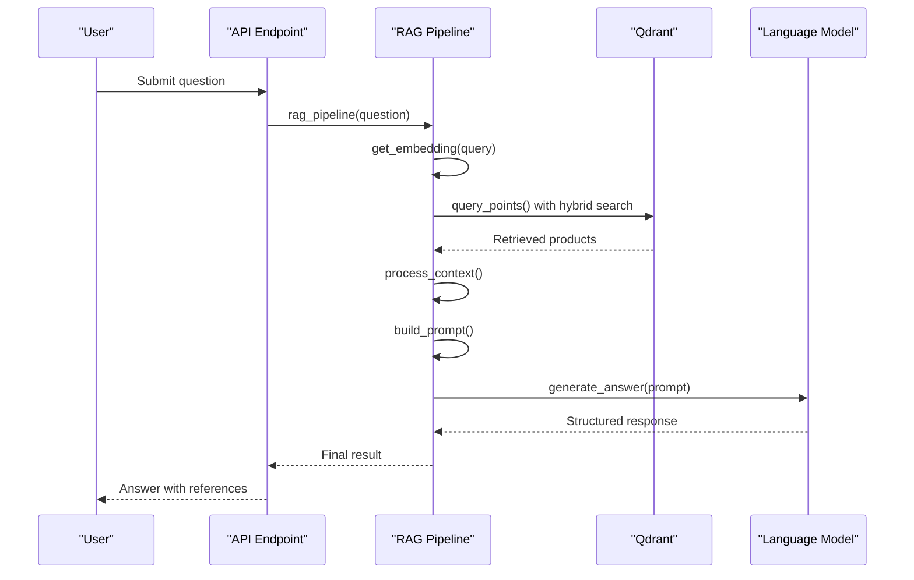
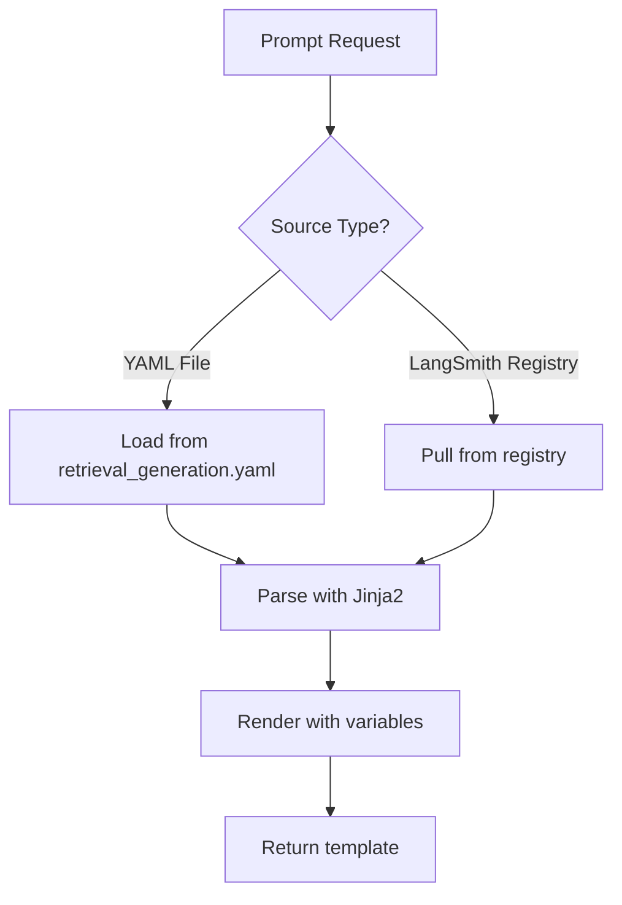

# Notebooks Usage

<cite>
**Referenced Files in This Document**   
- [02-explore-amazon-dataset.ipynb](file://notebooks/phase_1/02-explore-amazon-dataset.ipynb)
- [03-explore-arxiv-api.ipynb](file://notebooks/phase_1/03-explore-arxiv-api.ipynb)
- [01-RAG-preprocessing-Amazon.ipynb](file://notebooks/phase_2/01-RAG-preprocessing-Amazon.ipynb)
- [02-RAG-pipeline.ipynb](file://notebooks/phase_2/02-RAG-pipeline.ipynb)
- [03-evaluation-dataset.ipynb](file://notebooks/phase_2/03-evaluation-dataset.ipynb)
- [04-RAG-Evals.ipynb](file://notebooks/phase_2/04-RAG-Evals.ipynb)
- [01-Structured-Outputs-Intro.ipynb](file://notebooks/phase_3/01-Structured-Outputs-Intro.ipynb)
- [02-Structured-Outputs-RAG-pipeline.ipynb](file://notebooks/phase_3/02-Structured-Outputs-RAG-pipeline.ipynb)
- [03-Hybrid-Search.ipynb](file://notebooks/phase_3/03-Hybrid-Search.ipynb)
- [04-Reranking.ipynb](file://notebooks/phase_3/04-Reranking.ipynb)
- [05-Prompt-Versioning.ipynb](file://notebooks/phase_3/05-Prompt-Versioning.ipynb)
- [retrieval_generation.py](file://src/api/rag/retrieval_generation.py)
- [retrieval_generation.yaml](file://src/api/rag/prompts/retrieval_generation.yaml)
- [prompt_management.py](file://src/api/rag/utils/prompt_management.py)
- [eval_retriever.py](file://evals/eval_retriever.py)
</cite>

## Table of Contents
1. [Introduction](#introduction)
2. [Phase 1: Data Exploration](#phase-1-data-exploration)
3. [Phase 2: RAG Pipeline Prototyping and Evaluation](#phase-2-rag-pipeline-prototyping-and-evaluation)
4. [Phase 3: Advanced Features Development](#phase-3-advanced-features-development)
5. [Notebook to Production Transition](#notebook-to-production-transition)
6. [Best Practices for Notebook Usage](#best-practices-for-notebook-usage)
7. [Version Control and Prompt Management](#version-control-and-prompt-management)
8. [Conclusion](#conclusion)

## Introduction
Jupyter notebooks serve as the primary experimental environment for developing and refining the Retrieval-Augmented Generation (RAG) system for the AI-Powered Amazon Product Assistant. The notebook workflow is structured into three distinct phases that guide the progression from data exploration to advanced feature implementation. This document details how notebooks are used throughout the development lifecycle, how experimental patterns are translated into production code, and best practices for maintaining reproducibility and code quality.

**Section sources**
- [02-explore-amazon-dataset.ipynb](file://notebooks/phase_1/02-explore-amazon-dataset.ipynb)
- [03-explore-arxiv-api.ipynb](file://notebooks/phase_1/03-explore-arxiv-api.ipynb)
- [02-RAG-pipeline.ipynb](file://notebooks/phase_2/02-RAG-pipeline.ipynb)
- [03-Hybrid-Search.ipynb](file://notebooks/phase_3/03-Hybrid-Search.ipynb)

## Phase 1: Data Exploration
The first phase focuses on understanding and preparing the data sources that will power the RAG system. Two primary data sources are explored: the Amazon product dataset and academic research papers from ArXiv.

### Amazon Dataset Exploration
The `02-explore-amazon-dataset.ipynb` notebook contains the initial data exploration and preprocessing steps for the Amazon Electronics dataset. The notebook implements filtering logic to select products based on specific criteria such as release date (2022 or later), presence of main categories, and minimum rating thresholds (at least 100 ratings). The exploration includes analyzing the distribution of ratings and prices across different product categories, which helps identify representative samples for model training and evaluation.

The notebook also demonstrates data sampling techniques, creating a manageable subset of 1,000 products for experimentation while maintaining statistical relevance. This sampled dataset is then used to extract corresponding review data, ensuring that both product metadata and customer reviews are available for the RAG system.

**Section sources**
- [02-explore-amazon-dataset.ipynb](file://notebooks/phase_1/02-explore-amazon-dataset.ipynb)

### ArXiv API Exploration
The `03-explore-arxiv-api.ipynb` notebook focuses on retrieving relevant academic research papers from ArXiv to inform the RAG system's development. The notebook demonstrates how to construct API queries using the ArXiv REST API, filtering papers by category (cs.AI) and publication date range. It implements XML parsing to extract key information from the API response, including paper titles, abstracts, authors, and publication dates.

The notebook also includes functionality to download PDF versions of the retrieved papers, enabling offline analysis of cutting-edge research in artificial intelligence that can inform the RAG system's design and implementation. This exploration helps ensure that the system incorporates the latest advancements in the field.

**Section sources**
- [03-explore-arxiv-api.ipynb](file://notebooks/phase_1/03-explore-arxiv-api.ipynb)

## Phase 2: RAG Pipeline Prototyping and Evaluation
The second phase transitions from data exploration to building and evaluating the core RAG pipeline. This phase focuses on prototyping the retrieval and generation components and establishing evaluation methodologies.

### RAG Preprocessing and Pipeline Development
The `01-RAG-preprocessing-Amazon.ipynb` notebook handles the preprocessing of Amazon product data for vector storage in Qdrant. It combines product titles and features into comprehensive descriptions, extracts image URLs, and creates embeddings using OpenAI's text-embedding-3-small model. The notebook demonstrates the creation of a Qdrant collection and the uploading of embedded product data, establishing the foundation for semantic search capabilities.

The `02-RAG-pipeline.ipynb` notebook implements the complete RAG pipeline, including retrieval, context formatting, prompt construction, and answer generation. The retrieval function uses vector similarity search to find relevant products based on the user's query. The context is then formatted to include product IDs, ratings, and descriptions before being incorporated into a structured prompt for the language model. The notebook demonstrates the end-to-end flow from user question to generated response.

**Section sources**
- [01-RAG-preprocessing-Amazon.ipynb](file://notebooks/phase_2/01-RAG-preprocessing-Amazon.ipynb)
- [02-RAG-pipeline.ipynb](file://notebooks/phase_2/02-RAG-pipeline.ipynb)

### Evaluation Dataset Creation and Metrics
The `03-evaluation-dataset.ipynb` notebook focuses on creating a synthetic evaluation dataset using the language model itself. It retrieves all product data from Qdrant and constructs a prompt that instructs the model to generate 30 questions about the available products, along with ground truth answers and reference context IDs. The dataset includes questions that require single or multiple chunks for answering, as well as unanswerable questions to test the system's ability to recognize knowledge boundaries.

The `04-RAG-Evals.ipynb` notebook implements evaluation metrics using the RAGAS framework to assess the quality of the RAG pipeline. It downloads the evaluation dataset from LangSmith and applies metrics such as faithfulness (how factually consistent the answer is with the retrieved context), response relevancy, context precision, and context recall. These metrics provide quantitative feedback on the system's performance and guide further improvements.

**Section sources**
- [03-evaluation-dataset.ipynb](file://notebooks/phase_2/03-evaluation-dataset.ipynb)
- [04-RAG-Evals.ipynb](file://notebooks/phase_2/04-RAG-Evals.ipynb)

## Phase 3: Advanced Features Development
The third phase introduces advanced features that enhance the RAG system's capabilities beyond basic retrieval and generation. These features are prototyped in notebooks before being integrated into the production codebase.

### Structured Outputs and Hybrid Search
The `01-Structured-Outputs-Intro.ipynb` and `02-Structured-Outputs-RAG-pipeline.ipynb` notebooks explore the use of structured outputs from the language model. By defining Pydantic models for the expected response format, the system can reliably extract specific information such as product IDs and descriptions from the generated text, enabling more sophisticated downstream processing.

The `03-Hybrid-Search.ipynb` notebook implements hybrid search functionality that combines semantic search with keyword-based BM25 search using Qdrant's fusion capabilities. The notebook creates a new Qdrant collection with both dense and sparse vector configurations, allowing for more robust retrieval that leverages the strengths of both search methods. The retrieval function uses Reciprocal Rank Fusion (RRF) to combine results from both search approaches, improving the relevance of retrieved products.

**Section sources**
- [01-Structured-Outputs-Intro.ipynb](file://notebooks/phase_3/01-Structured-Outputs-Intro.ipynb)
- [02-Structured-Outputs-RAG-pipeline.ipynb](file://notebooks/phase_3/02-Structured-Outputs-RAG-pipeline.ipynb)
- [03-Hybrid-Search.ipynb](file://notebooks/phase_3/03-Hybrid-Search.ipynb)

### Reranking and Prompt Versioning
The `04-Reranking.ipynb` notebook implements a reranking step that improves the quality of retrieved results. After initial retrieval using hybrid search, the notebook applies Cohere's rerank model to reorder the results based on their relevance to the query. This two-stage approach (retrieve then rerank) often produces better results than retrieval alone, as the reranker can consider the full context of the query and document pair.

The `05-Prompt-Versioning.ipynb` notebook explores various prompt management strategies, including Jinja2 templates and prompt registries via LangSmith. It demonstrates how to externalize prompts into YAML configuration files and load them dynamically, enabling easier experimentation and version control. The notebook also shows how to pull prompts from a centralized registry, facilitating collaboration and consistency across different components of the system.

**Section sources**
- [04-Reranking.ipynb](file://notebooks/phase_3/04-Reranking.ipynb)
- [05-Prompt-Versioning.ipynb](file://notebooks/phase_3/05-Prompt-Versioning.ipynb)

## Notebook to Production Transition
Experimental patterns developed in notebooks are systematically translated into production code in the `src/api/rag/` directory. This transition ensures that validated approaches are integrated into the main application with proper error handling, logging, and performance monitoring.

### RAG Pipeline Implementation
The `retrieval_generation.py` file contains the production implementation of the RAG pipeline, incorporating lessons learned from the notebook experiments. The code is organized into modular functions with clear responsibilities: `get_embedding` for generating embeddings, `retrieve_data` for hybrid search retrieval, `process_context` for formatting retrieved data, `build_prompt` for prompt construction, and `generate_answer` for LLM interaction.

The production code enhances the notebook prototypes with comprehensive error handling, logging, and monitoring via LangSmith traces. Each function is decorated with `@traceable` to enable observability and performance analysis. The code also implements structured output using Pydantic models, ensuring that the generated responses can be reliably parsed and used by downstream components.

**Diagram sources**
- [retrieval_generation.py](file://src/api/rag/retrieval_generation.py#L15-L400)

**Section sources**
- [02-RAG-pipeline.ipynb](file://notebooks/phase_2/02-RAG-pipeline.ipynb)
- [retrieval_generation.py](file://src/api/rag/retrieval_generation.py)

### Prompt Management System
The `prompt_management.py` file implements a robust system for managing prompt templates, addressing the versioning challenges explored in the notebooks. The `prompt_template_config` function loads prompts from YAML files, providing a clear separation between code and prompt content. This allows for easy experimentation with different prompt variations without modifying the core logic.

The system also supports pulling prompts from LangSmith's registry via the `prompt_template_registry` function, enabling centralized management of prompts across different services and environments. This approach ensures consistency and facilitates collaboration among team members working on different aspects of the system.

**Diagram sources**
- [prompt_management.py](file://src/api/rag/utils/prompt_management.py#L1-L80)
- [retrieval_generation.yaml](file://src/api/rag/prompts/retrieval_generation.yaml#L1-L31)

**Section sources**
- [05-Prompt-Versioning.ipynb](file://notebooks/phase_3/05-Prompt-Versioning.ipynb)
- [prompt_management.py](file://src/api/rag/utils/prompt_management.py)
- [retrieval_generation.yaml](file://src/api/rag/prompts/retrieval_generation.yaml)

## Best Practices for Notebook Usage
To ensure effective use of notebooks in the development workflow, several best practices are followed throughout the project.

### Reproducibility and Documentation
Notebooks are designed to be fully reproducible by including all necessary setup steps and dependencies at the beginning. Each significant code block is accompanied by markdown explanations that document the purpose, assumptions, and expected outcomes. This documentation serves as a living record of the experimentation process, making it easier for team members to understand and build upon previous work.

Data preprocessing steps are carefully documented, including the rationale for filtering criteria and sampling methods. This transparency ensures that the resulting datasets are well-understood and their limitations are clearly communicated.

### Code Extraction and Validation
Validated logic from notebooks is extracted into the production codebase following a clear process. Functions that have been tested and proven effective in the notebook environment are refactored into reusable modules with proper error handling and type annotations. The extraction process includes adding comprehensive logging and monitoring to enable debugging and performance analysis in production.

The transition from notebook to production code is verified through automated testing and evaluation metrics, ensuring that the production implementation maintains or improves upon the performance observed in the experimental environment.

**Section sources**
- [02-RAG-pipeline.ipynb](file://notebooks/phase_2/02-RAG-pipeline.ipynb)
- [retrieval_generation.py](file://src/api/rag/retrieval_generation.py)

## Version Control and Prompt Management
Effective version control practices are essential for managing the evolution of both notebooks and prompt templates throughout the development lifecycle.

### Notebook Versioning
Notebooks are version-controlled using Git, with regular commits that capture significant milestones in the experimentation process. The three-phase structure (phase_1, phase_2, phase_3) provides a clear progression of development, making it easier to track the evolution of ideas and approaches. When significant changes are made to a notebook, a new version is created rather than overwriting the existing one, preserving the history of experimentation.

The use of relative paths for data files (e.g., `../../data/`) ensures that notebooks can be run in different environments without modification, as long as the directory structure is maintained. This portability facilitates collaboration and reproducibility across different team members' development environments.

### YAML Prompt Templates
Prompt templates are managed in YAML files within the `src/api/rag/prompts/` directory, providing a structured format for version control. The `retrieval_generation.yaml` file includes metadata such as name, version, description, and author, making it easy to track changes and understand the purpose of each template.

The separation of prompts from code enables independent versioning of prompt iterations, allowing for A/B testing of different prompt variations without modifying the underlying logic. Changes to prompts are tracked in Git, providing a complete history of prompt evolution and facilitating rollback if needed.

**Section sources**
- [retrieval_generation.yaml](file://src/api/rag/prompts/retrieval_generation.yaml)
- [prompt_management.py](file://src/api/rag/utils/prompt_management.py)

## Conclusion
Jupyter notebooks play a crucial role in the development of the AI-Powered Amazon Product Assistant, serving as the primary environment for experimentation, prototyping, and evaluation. The structured three-phase approach—data exploration, RAG pipeline development, and advanced feature implementation—provides a clear progression from initial concept to production-ready code.

The transition from experimental notebooks to production code in `src/api/rag/` ensures that validated approaches are integrated into the main application with proper engineering practices. This workflow enables rapid iteration and innovation while maintaining code quality and reliability. By following best practices for reproducibility, documentation, and version control, the team can effectively collaborate and build upon each other's work, ultimately delivering a robust and effective RAG system.