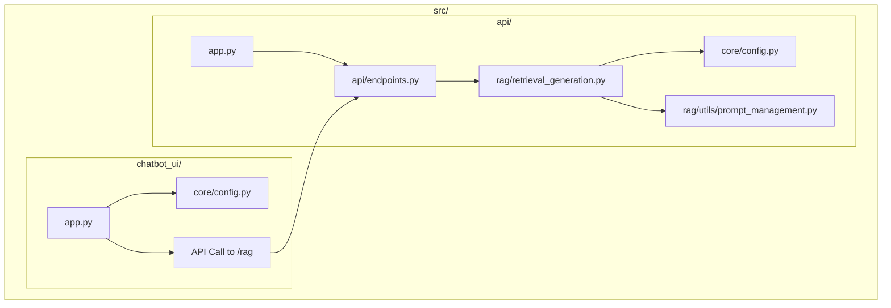
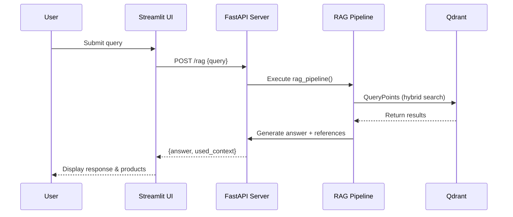
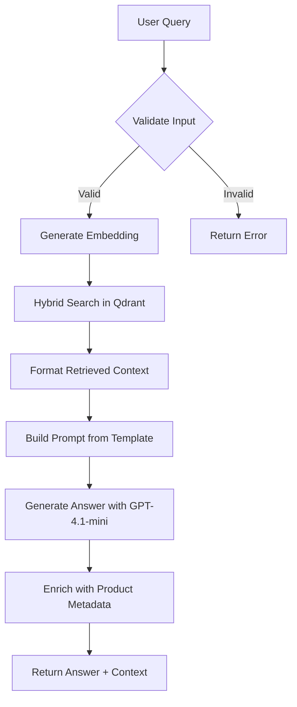

# Project Structure

<cite>
**Referenced Files in This Document**   
- [src/api/app.py](file://src/api/app.py)
- [src/chatbot_ui/app.py](file://src/chatbot_ui/app.py)
- [src/api/rag/retrieval_generation.py](file://src/api/rag/retrieval_generation.py)
- [src/api/core/config.py](file://src/api/core/config.py)
- [src/chatbot_ui/core/config.py](file://src/chatbot_ui/core/config.py)
- [src/api/api/endpoints.py](file://src/api/api/endpoints.py)
- [src/api/rag/utils/prompt_management.py](file://src/api/rag/utils/prompt_management.py)
- [notebooks/phase_1/02-explore-amazon-dataset.ipynb](file://notebooks/phase_1/02-explore-amazon-dataset.ipynb)
- [notebooks/phase_2/02-RAG-pipeline.ipynb](file://notebooks/phase_2/02-RAG-pipeline.ipynb)
- [notebooks/phase_3/03-Hybrid-Search.ipynb](file://notebooks/phase_3/03-Hybrid-Search.ipynb)
</cite>

## Table of Contents
1. [Top-Level Directory Organization](#top-level-directory-organization)
2. [Source Code Structure (src/)](#source-code-structure-src)
3. [Frontend and Backend Separation](#frontend-and-backend-separation)
4. [Configuration Management](#configuration-management)
5. [RAG Pipeline Implementation](#rag-pipeline-implementation)
6. [Notebook-Based Development Phases](#notebook-based-development-phases)
7. [Codebase Navigation and Best Practices](#codebase-navigation-and-best-practices)

## Top-Level Directory Organization

The AI-Powered-Amazon-Product-Assistant repository follows a modular and purpose-driven directory structure designed to support iterative development, testing, and documentation. The top-level directories are organized as follows:

- **src/**: Contains all production-ready source code, including both backend API services and frontend chatbot interface.
- **notebooks/**: Houses Jupyter notebooks used for experimental prototyping, data exploration, and iterative development of the RAG system.
- **tests/**: Includes unit and integration tests to validate functionality and ensure code quality.
- **documentation/**: Stores technical documentation, architecture overviews, and setup guides.
- **evals/**: Contains evaluation scripts for assessing retriever performance.
- Root-level configuration files (e.g., `pyproject.toml`, `docker-compose.yml`) manage dependencies, deployment, and project tooling.

This clear separation enables team members to quickly locate relevant components based on their role—whether developing features, conducting experiments, or reviewing system design.

**Section sources**
- [src/api/app.py](file://src/api/app.py#L1-L34)
- [src/chatbot_ui/app.py](file://src/chatbot_ui/app.py#L1-L94)

## Source Code Structure (src/)

The `src/` directory is the core of the application, housing all executable code. It is divided into two main subdirectories: `api/` for the FastAPI backend and `chatbot_ui/` for the Streamlit frontend.

### Backend (api/)
Located at `src/api/`, this component implements a RESTful API using FastAPI. Key submodules include:
- **api/**: Contains route definitions (`endpoints.py`), request/response models (`models.py`), and middleware.
- **core/**: Houses shared configuration via `config.py`, which loads environment variables using Pydantic Settings.
- **rag/**: Implements the Retrieval-Augmented Generation pipeline, including prompt management and interaction with Qdrant and OpenAI.
- **app.py**: The entry point that initializes the FastAPI application, registers routes, and configures logging and CORS.

### Frontend (chatbot_ui/)
Located at `src/chatbot_ui/`, this component provides a user-friendly chat interface built with Streamlit. It includes:
- **core/config.py**: Configuration file mirroring backend settings but tailored for UI needs.
- **app.py**: Main application file that manages session state, handles API calls to the backend, and renders the chat interface with product suggestions.

This modular layout ensures separation of concerns while allowing both components to share configuration patterns and securely communicate via HTTP.

**Diagram sources**
- [src/api/app.py](file://src/api/app.py#L1-L34)
- [src/api/api/endpoints.py](file://src/api/api/endpoints.py#L1-L74)
- [src/api/rag/retrieval_generation.py](file://src/api/rag/retrieval_generation.py#L1-L401)
- [src/chatbot_ui/app.py](file://src/chatbot_ui/app.py#L1-L94)

**Section sources**
- [src/api/app.py](file://src/api/app.py#L1-L34)
- [src/api/api/endpoints.py](file://src/api/api/endpoints.py#L1-L74)
- [src/chatbot_ui/app.py](file://src/chatbot_ui/app.py#L1-L94)

## Frontend and Backend Separation

The codebase maintains a clean architectural boundary between frontend and backend systems, enabling independent development and deployment.

The **FastAPI backend** (`src/api/`) exposes a `/rag` endpoint that processes natural language queries through the RAG pipeline. It returns structured responses containing both an answer and contextual product information (e.g., image URL, price). The backend is stateless and designed for scalability.

The **Streamlit frontend** (`src/chatbot_ui/`) consumes this API and presents a conversational interface. It manages user interactions, displays chat history, and shows product recommendations in the sidebar. When a user submits a query, the frontend sends a POST request to the backend and updates the UI accordingly.

Communication occurs over HTTP, with the frontend configured to connect to `http://api:8000` in Docker environments. This decoupled design allows frontend developers to work independently from backend logic and facilitates integration with other clients if needed.

**Diagram sources**
- [src/api/app.py](file://src/api/app.py#L1-L34)
- [src/api/api/endpoints.py](file://src/api/api/endpoints.py#L1-L74)
- [src/api/rag/retrieval_generation.py](file://src/api/rag/retrieval_generation.py#L1-L401)
- [src/chatbot_ui/app.py](file://src/chatbot_ui/app.py#L1-L94)

**Section sources**
- [src/api/app.py](file://src/api/app.py#L1-L34)
- [src/api/api/endpoints.py](file://src/api/api/endpoints.py#L1-L74)
- [src/chatbot_ui/app.py](file://src/chatbot_ui/app.py#L1-L94)

## Configuration Management

Configuration is centralized using Pydantic Settings across both frontend and backend components. Each has its own `config.py` file that inherits from `BaseSettings` and loads values from a `.env` file.

The backend configuration (`src/api/core/config.py`) defines API keys for external services such as OpenAI, Groq, Google, and Cohere. These are injected into the RAG pipeline during execution.

The frontend configuration (`src/chatbot_ui/core/config.py`) includes the same API keys plus an `API_URL` field pointing to the backend service. This allows the UI to dynamically adjust endpoints based on environment (e.g., local vs. containerized).

This pattern ensures secure, environment-aware configuration while promoting consistency across components. It also simplifies deployment through Docker and supports easy extension for new services.

**Section sources**
- [src/api/core/config.py](file://src/api/core/config.py#L1-L11)
- [src/chatbot_ui/core/config.py](file://src/chatbot_ui/core/config.py#L1-L12)

## RAG Pipeline Implementation

The core intelligence of the assistant resides in the RAG pipeline implemented in `src/api/rag/retrieval_generation.py`. This module orchestrates the full flow from query to answer:

1. **Embedding**: Uses OpenAI’s `text-embedding-3-small` model to convert the user query into a vector.
2. **Retrieval**: Performs hybrid search (semantic + BM25) using Qdrant’s fusion query capabilities to retrieve relevant product data.
3. **Context Formatting**: Structures retrieved items into a readable format for the LLM prompt.
4. **Prompt Building**: Renders a Jinja2 template loaded from `retrieval_generation.yaml`, ensuring consistent prompt engineering.
5. **Answer Generation**: Uses OpenAI’s `gpt-4.1-mini` with structured output via the Instructor library to generate accurate, reference-aware responses.
6. **Metadata Enrichment**: The `rag_pipeline_wrapper` function enriches results with product images and prices by querying Qdrant again using retrieved IDs.

The pipeline is instrumented with LangSmith tracing (`@traceable`) for observability and debugging, making it easier to analyze performance bottlenecks and refine prompts.

**Diagram sources**
- [src/api/rag/retrieval_generation.py](file://src/api/rag/retrieval_generation.py#L1-L401)
- [src/api/rag/utils/prompt_management.py](file://src/api/rag/utils/prompt_management.py#L1-L81)

**Section sources**
- [src/api/rag/retrieval_generation.py](file://src/api/rag/retrieval_generation.py#L1-L401)
- [src/api/rag/utils/prompt_management.py](file://src/api/rag/utils/prompt_management.py#L1-L81)

## Notebook-Based Development Phases

The `notebooks/` directory is organized into three phases that reflect the iterative development of the RAG system:

### Phase 1: Data Exploration
Located in `notebooks/phase_1/`, these notebooks focus on understanding the Amazon product dataset:
- `02-explore-amazon-dataset.ipynb`: Filters and analyzes product metadata (e.g., ratings, availability).
- `03-explore-arxiv-api.ipynb`: Investigates academic research for potential integration.

### Phase 2: RAG Pipeline Prototyping
In `notebooks/phase_2/`, the team builds and tests the foundational RAG workflow:
- `01-RAG-preprocessing-Amazon.ipynb`: Prepares product data for embedding.
- `02-RAG-pipeline.ipynb`: Implements and validates the end-to-end retrieval and generation logic.
- `03-evaluation-dataset.ipynb` and `04-RAG-Evals.ipynb`: Assess pipeline performance.

### Phase 3: Advanced Features
Under `notebooks/phase_3/`, the focus shifts to optimization:
- `03-Hybrid-Search.ipynb`: Introduces BM25 keyword search fused with semantic vectors.
- `04-Reranking.ipynb`: Implements post-processing ranking improvements.
- `05-Prompt-Versioning.ipynb`: Manages prompt evolution using LangSmith.

This phased approach enables systematic experimentation and validation before promoting features to production code.

**Section sources**
- [notebooks/phase_1/02-explore-amazon-dataset.ipynb](file://notebooks/phase_1/02-explore-amazon-dataset.ipynb#L1-L308)
- [notebooks/phase_2/02-RAG-pipeline.ipynb](file://notebooks/phase_2/02-RAG-pipeline.ipynb#L1-L326)
- [notebooks/phase_3/03-Hybrid-Search.ipynb](file://notebooks/phase_3/03-Hybrid-Search.ipynb#L1-L391)

## Codebase Navigation and Best Practices

### Entry Points
- **Backend**: `src/api/app.py` – Start here to understand API initialization and routing.
- **Frontend**: `src/chatbot_ui/app.py` – Entry point for UI logic and API interaction.
- **RAG Logic**: `src/api/rag/retrieval_generation.py` – Core business logic for product recommendations.

### Component Ownership
- **API Endpoints**: Managed in `src/api/api/endpoints.py`.
- **Configuration**: Shared pattern in both `src/*/core/config.py` files.
- **Prompt Templates**: Stored in YAML files under `src/api/rag/prompts/` and loaded via `prompt_management.py`.

### Best Practices for Extending the Codebase
1. **Maintain Separation of Concerns**: Add new features to appropriate modules (backend vs. frontend).
2. **Use Configuration Consistently**: Define new environment variables in `config.py` with proper typing.
3. **Leverage Notebooks for Experimentation**: Test new ideas in `notebooks/phase_3/` before integrating into `src/`.
4. **Preserve Tracing**: Use `@traceable` decorator when adding new functions for observability.
5. **Follow Naming Conventions**: Use descriptive, consistent names (e.g., `rag_pipeline`, `retrieve_data`).

This structure supports scalable, maintainable development and makes onboarding new contributors straightforward.

**Section sources**
- [src/api/app.py](file://src/api/app.py#L1-L34)
- [src/chatbot_ui/app.py](file://src/chatbot_ui/app.py#L1-L94)
- [src/api/rag/retrieval_generation.py](file://src/api/rag/retrieval_generation.py#L1-L401)