# Testing Practices

<cite>
**Referenced Files in This Document**   
- [makefile](file://makefile)
- [pytest.ini](file://pytest.ini)
- [tests/conftest.py](file://tests/conftest.py)
- [tests/test_models.py](file://tests/test_models.py)
- [src/api/api/models.py](file://src/api/api/models.py)
- [src/api/rag/retrieval_generation.py](file://src/api/rag/retrieval_generation.py)
- [src/api/api/endpoints.py](file://src/api/api/endpoints.py)
</cite>

## Table of Contents
1. [Introduction](#introduction)
2. [Test Directory Structure](#test-directory-structure)
3. [Testing Framework Configuration](#testing-framework-configuration)
4. [Shared Fixtures in conftest.py](#shared-fixtures-in-conftestpy)
5. [Model Validation Testing](#model-validation-testing)
6. [Available Makefile Commands](#available-makefile-commands)
7. [Writing Unit Tests](#writing-unit-tests)
8. [Writing Integration Tests](#writing-integration-tests)
9. [Test Isolation and Mocking](#test-isolation-and-mocking)
10. [Coverage Reporting](#coverage-reporting)
11. [Development Workflows](#development-workflows)
12. [Best Practices](#best-practices)

## Introduction
This document details the testing practices for the AI-Powered Amazon Product Assistant, focusing on the pytest-based testing framework and development workflows. The system employs a comprehensive testing strategy to ensure reliability of both the RAG (Retrieval-Augmented Generation) pipeline and API components. The testing infrastructure supports unit testing, integration testing, coverage analysis, and offline testing modes, all orchestrated through Makefile commands. This documentation covers the structure of the tests/ directory, shared fixtures, available test commands, and best practices for writing and executing tests.

## Test Directory Structure
The tests/ directory contains the complete test suite for the application, organized to support both unit and integration testing. The directory includes essential configuration files and test modules that validate core functionality.

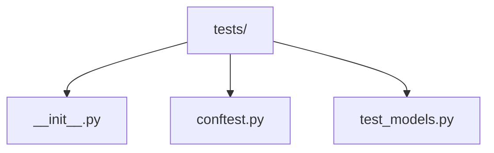

**Diagram sources**
- [tests/__init__.py](file://tests/__init__.py)
- [tests/conftest.py](file://tests/conftest.py)
- [tests/test_models.py](file://tests/test_models.py)

**Section sources**
- [tests/conftest.py](file://tests/conftest.py#L1-L115)
- [tests/test_models.py](file://tests/test_models.py#L1-L76)

## Testing Framework Configuration
The testing framework is configured through pytest.ini, which defines the test discovery patterns, markers, and default options. This configuration ensures consistent test execution across different environments and provides structured reporting.

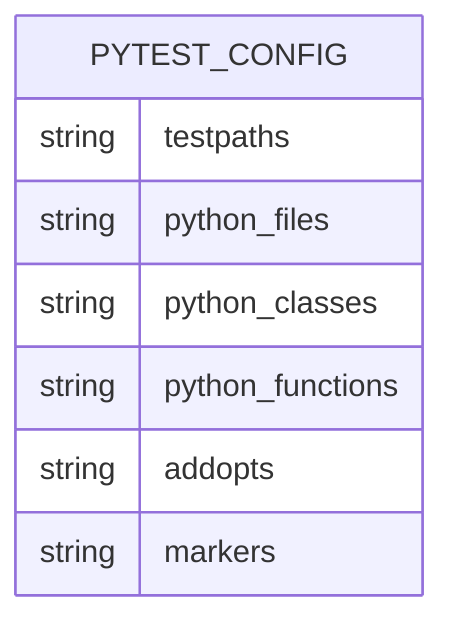

**Diagram sources**
- [pytest.ini](file://pytest.ini#L1-L18)

**Section sources**
- [pytest.ini](file://pytest.ini#L1-L18)

## Shared Fixtures in conftest.py
The conftest.py file provides shared fixtures that are available across all test modules. These fixtures mock external dependencies and provide test data, enabling isolated and reliable testing without requiring actual API calls or database connections.

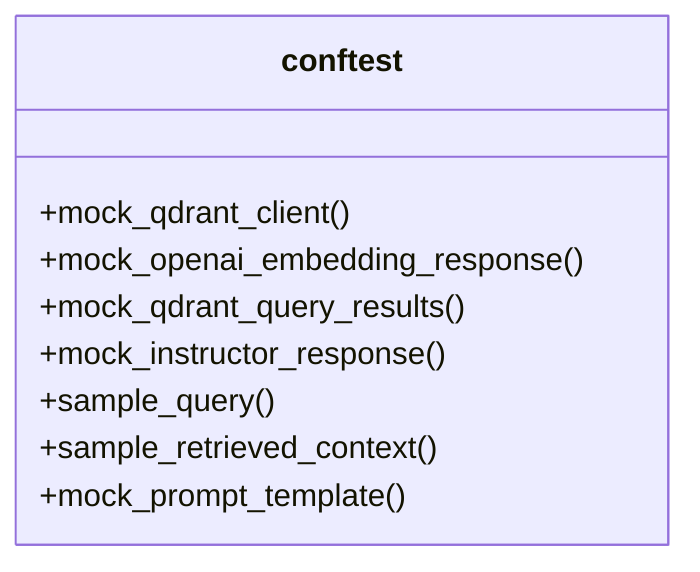

**Diagram sources**
- [tests/conftest.py](file://tests/conftest.py#L15-L114)

**Section sources**
- [tests/conftest.py](file://tests/conftest.py#L15-L114)

## Model Validation Testing
The test_models.py file contains unit tests for Pydantic models used in the API, specifically validating the RAGRequest and RAGResponse models. These tests ensure that model validation works correctly for various input scenarios, including edge cases like empty queries and missing fields.

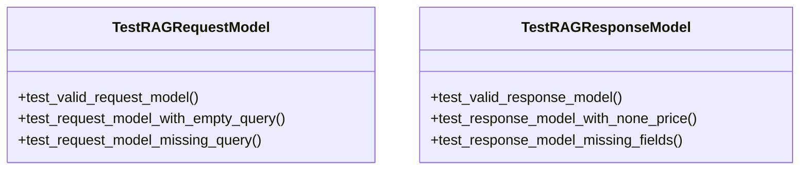

**Diagram sources**
- [tests/test_models.py](file://tests/test_models.py#L8-L75)
- [src/api/api/models.py](file://src/api/api/models.py#L4-L16)

**Section sources**
- [tests/test_models.py](file://tests/test_models.py#L8-L75)
- [src/api/api/models.py](file://src/api/api/models.py#L4-L16)

## Available Makefile Commands
The Makefile provides several commands for executing tests in different configurations. These commands handle dependency management, Python path configuration, and test execution with appropriate options.

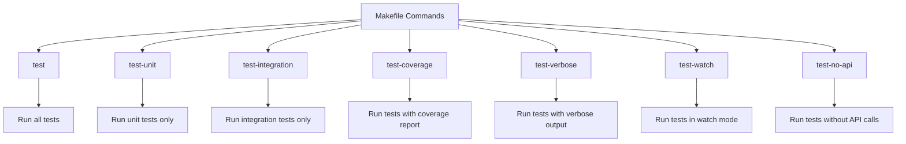

**Diagram sources**
- [makefile](file://makefile#L1-L38)

**Section sources**
- [makefile](file://makefile#L1-L38)

## Writing Unit Tests
Unit tests should focus on isolated components and use the provided fixtures to mock dependencies. The example below demonstrates how to write a unit test for API models using pytest markers and fixture injection.

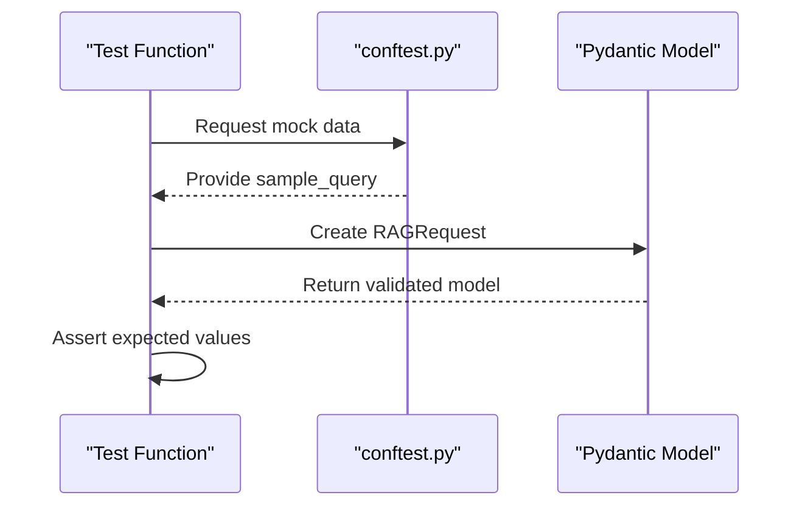

**Diagram sources**
- [tests/test_models.py](file://tests/test_models.py#L8-L75)
- [tests/conftest.py](file://tests/conftest.py#L90-L95)
- [src/api/api/models.py](file://src/api/api/models.py#L4-L6)

**Section sources**
- [tests/test_models.py](file://tests/test_models.py#L8-L75)

## Writing Integration Tests
Integration tests validate the interaction between components, particularly the RAG pipeline. These tests should use appropriate markers and can be executed selectively using the test-integration Makefile command.

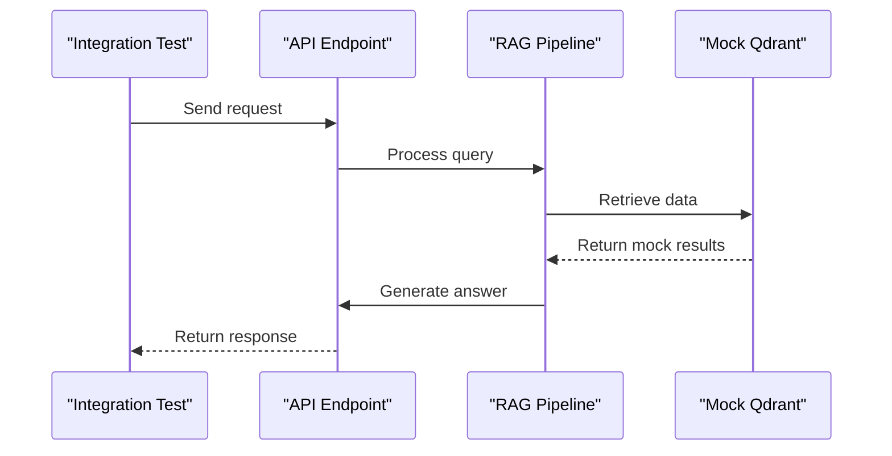

**Diagram sources**
- [src/api/api/endpoints.py](file://src/api/api/endpoints.py#L15-L73)
- [src/api/rag/retrieval_generation.py](file://src/api/rag/retrieval_generation.py#L331-L400)
- [tests/conftest.py](file://tests/conftest.py#L15-L30)

**Section sources**
- [src/api/api/endpoints.py](file://src/api/api/endpoints.py#L15-L73)
- [src/api/rag/retrieval_generation.py](file://src/api/rag/retrieval_generation.py#L331-L400)

## Test Isolation and Mocking
The testing framework employs mocking to isolate tests from external dependencies. The conftest.py file provides mock objects for Qdrant, OpenAI, and other external services, ensuring tests are reliable and fast.

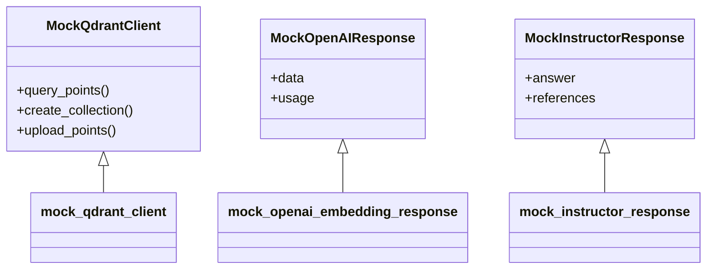

**Diagram sources**
- [tests/conftest.py](file://tests/conftest.py#L15-L85)

**Section sources**
- [tests/conftest.py](file://tests/conftest.py#L15-L85)

## Coverage Reporting
The test-coverage Makefile command generates HTML coverage reports, providing detailed insights into test coverage across the codebase. This helps identify untested code paths and ensures comprehensive test coverage.

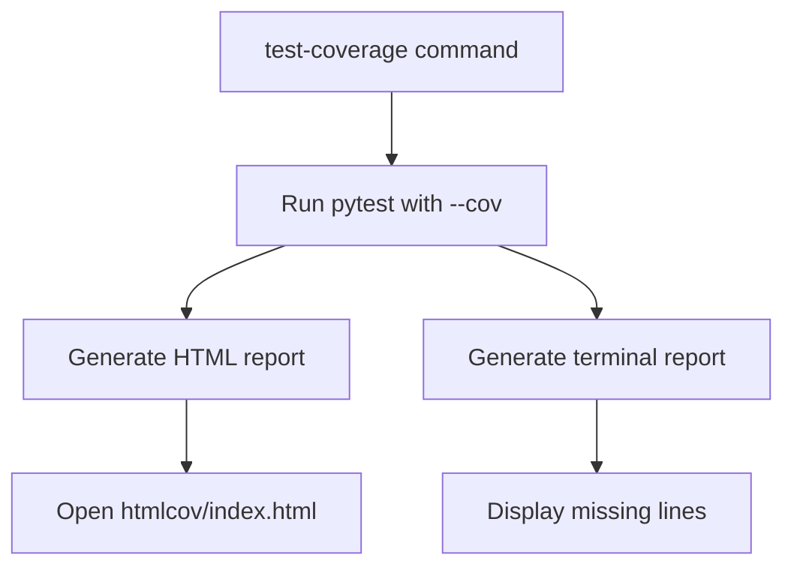

**Diagram sources**
- [makefile](file://makefile#L25-L28)
- [pytest.ini](file://pytest.ini#L7-L10)

**Section sources**
- [makefile](file://makefile#L25-L28)
- [pytest.ini](file://pytest.ini#L7-L10)

## Development Workflows
The testing infrastructure supports various development workflows, including watch mode for continuous testing and verbose output for detailed debugging information. These workflows help maintain a fast feedback loop during development.

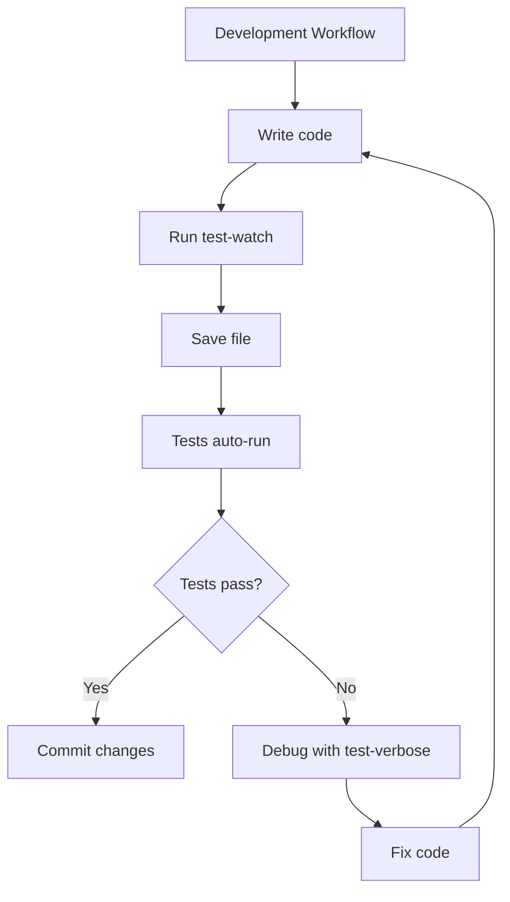

**Diagram sources**
- [makefile](file://makefile#L35-L38)

**Section sources**
- [makefile](file://makefile#L35-L38)

## Best Practices
Adhering to best practices ensures effective and maintainable tests. Key practices include using appropriate pytest markers, maintaining test isolation, and following the provided testing patterns.

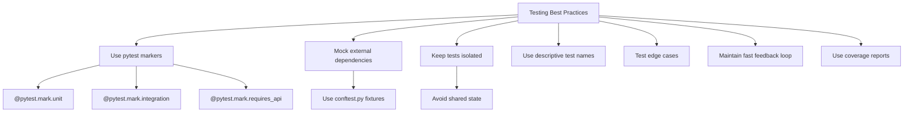

**Diagram sources**
- [pytest.ini](file://pytest.ini#L15-L18)
- [tests/conftest.py](file://tests/conftest.py#L1-L115)
- [makefile](file://makefile#L1-L38)

**Section sources**
- [pytest.ini](file://pytest.ini#L15-L18)
- [tests/conftest.py](file://tests/conftest.py#L1-L115)
- [makefile](file://makefile#L1-L38)