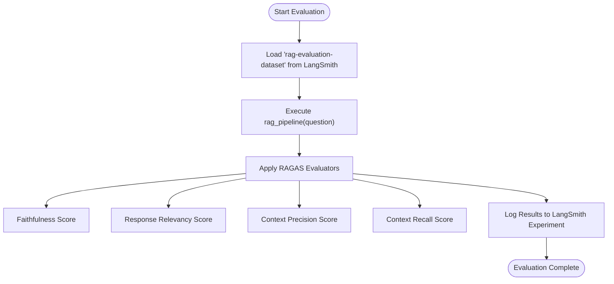

# Evaluation and Monitoring

<cite>
**Referenced Files in This Document**   
- [eval_retriever.py](file://evals/eval_retriever.py)
- [retrieval_generation.py](file://src/api/rag/retrieval_generation.py)
- [ARCHITECTURE.md](file://documentation/ARCHITECTURE.md)
- [03-evaluation-dataset.ipynb](file://notebooks/phase_2/03-evaluation-dataset.ipynb)
- [04-RAG-Evals.ipynb](file://notebooks/phase_2/04-RAG-Evals.ipynb)
</cite>

## Table of Contents
1. [Evaluation Framework with RAGAS Metrics](#evaluation-framework-with-ragas-metrics)
2. [Evaluation Execution via eval_retriever.py](#evaluation-execution-via-eval_retrieverpy)
3. [LangSmith Integration for Observability](#langsmith-integration-for-observability)
4. [Performance Tracking and Cost Analysis](#performance-tracking-and-cost-analysis)
5. [Interpreting Evaluation Results](#interpreting-evaluation-results)
6. [Best Practices for Evaluation Datasets](#best-practices-for-evaluation-datasets)
7. [Periodic Assessment Strategy](#periodic-assessment-strategy)

## Evaluation Framework with RAGAS Metrics

The evaluation framework leverages RAGAS (Retrieval-Augmented Generation Assessment) to quantitatively measure the quality of the RAG pipeline across retrieval and generation phases. The system evaluates four core metrics: context precision, faithfulness, answer relevancy, and context recall.

**Context Precision** measures the proportion of retrieved product IDs that are relevant to answering the user's question. It evaluates whether the hybrid search effectively filters out irrelevant items. High precision indicates that most retrieved products contribute meaningfully to the final answer.

**Faithfulness** assesses whether the generated answer is factually grounded in the retrieved context without hallucinations. This metric uses a language model to verify that claims in the answer can be directly supported by the provided product descriptions, ensuring reliability and accuracy.

**Answer Relevancy** determines how well the generated response addresses the original user query. It evaluates both the completeness and focus of the answer, penalizing responses that are off-topic or fail to resolve the user’s intent.

**Context Recall** measures the fraction of ground-truth product IDs (from the evaluation dataset) that were successfully retrieved by the system. High recall indicates comprehensive coverage of relevant items in the knowledge base.

These metrics are implemented using the `ragas` library version 0.3.6, which provides standardized scoring mechanisms for RAG systems.

**Section sources**
- [ARCHITECTURE.md](file://documentation/ARCHITECTURE.md#L1050-L1087)
- [eval_retriever.py](file://evals/eval_retriever.py#L0-L79)

## Evaluation Execution via eval_retriever.py

The `eval_retriever.py` script orchestrates the evaluation process by integrating with LangSmith and applying RAGAS metrics to test cases from the `rag-evaluation-dataset`. The script defines asynchronous evaluator functions for each metric, which are passed to the LangSmith `evaluate` method.

Each evaluator function—`ragas_faithfulness`, `ragas_responce_relevancy`, `ragas_context_precision_id_based`, and `ragas_context_recall_id_based`—constructs a `SingleTurnSample` using outputs from the executed run and ground-truth data from the example. These samples are scored using corresponding RAGAS scorers initialized with appropriate LLM and embedding wrappers.

The evaluation pipeline executes the `rag_pipeline` function for each question in the dataset, retrieving context via Qdrant and generating answers using GPT-4.1-mini. Results are automatically logged to LangSmith under the experiment prefix "retriever", enabling traceability and comparison across runs.

The evaluation can be triggered via command line using the Makefile target `make run-evals-retriever`, which invokes the script directly.



**Diagram sources**
- [eval_retriever.py](file://evals/eval_retriever.py#L0-L79)

**Section sources**
- [eval_retriever.py](file://evals/eval_retriever.py#L0-L79)

## LangSmith Integration for Observability

LangSmith is deeply integrated into the system for end-to-end observability, debugging, and monitoring of the RAG pipeline. The `@traceable` decorator is applied to all critical functions in `retrieval_generation.py`, including `embed_query`, `retrieve_data`, `build_prompt`, and `generate_answer`, creating a hierarchical trace for each user request.

Traces capture essential metadata such as model names (`gpt-4.1-mini`, `text-embedding-3-small`), provider information (`openai`), and token usage (input, output, total). This enables granular analysis of cost and latency at each pipeline stage. The trace hierarchy reflects the actual execution flow, with `rag_pipeline` as the root span containing nested spans for embedding, retrieval, prompt building, and generation steps.

In the LangSmith dashboard, users can inspect individual traces to debug slow queries, identify retrieval failures, compare prompt versions, and analyze error patterns. For example, a high-latency query can be broken down to determine whether the delay originated in embedding generation, Qdrant retrieval, or LLM response time.

Additionally, the system uses `RequestIDMiddleware` to assign a unique UUID per HTTP request, which is logged throughout the pipeline and returned in the `X-Request-ID` header. This facilitates cross-service correlation and enhances traceability in distributed environments.

```mermaid
graph TD
A[HTTP Request] --> B[RequestIDMiddleware]
B --> C[rag_pipeline @traceable]
C --> D[embed_query @traceable]
C --> E[retrieve_data @traceable]
E --> F[embed_query (nested)]
C --> G[build_prompt @traceable]
C --> H[generate_answer @traceable]
H --> I[OpenAI API Call]
C --> J[rag_pipeline_wrapper]
J --> K[Fetch Product Metadata]
C --> L[Return Response]
L --> M[X-Request-ID Header]
```

**Diagram sources**
- [retrieval_generation.py](file://src/api/rag/retrieval_generation.py#L26-L273)
- [ARCHITECTURE.md](file://documentation/ARCHITECTURE.md#L492-L525)

**Section sources**
- [retrieval_generation.py](file://src/api/rag/retrieval_generation.py#L26-L273)
- [ARCHITECTURE.md](file://documentation/ARCHITECTURE.md#L492-L525)

## Performance Tracking and Cost Analysis

Performance tracking encompasses latency measurement, token usage monitoring, and cost analysis across the RAG pipeline. Each `@traceable` function automatically logs execution duration and token counts to LangSmith, enabling detailed performance profiling.

Latency is measured at each stage: embedding generation (~100ms), retrieval (~400ms), and LLM generation (~1.7s). The total pipeline latency is typically dominated by the generation step. These metrics are used to set alerting thresholds, such as triggering an alert if median latency exceeds 3 seconds over a 10-minute window.

Token usage is captured via the `usage_metadata` field in LangSmith traces. Input and output tokens from both embedding and LLM calls are recorded, allowing precise cost attribution per request. For instance, `text-embedding-3-small` costs $0.00002 per 1K tokens, while `gpt-4.1-mini` costs $0.150 per million input tokens and $0.600 per million output tokens.

Although the current system lacks Prometheus-based application metrics, it relies on LangSmith for aggregating usage data. Future enhancements could include exporting metrics like `http_requests_total`, `openai_api_calls_total`, and `qdrant_query_duration_seconds` to enable real-time dashboards and automated alerting.

**Section sources**
- [retrieval_generation.py](file://src/api/rag/retrieval_generation.py#L233-L273)
- [ARCHITECTURE.md](file://documentation/ARCHITECTURE.md#L995-L1049)

## Interpreting Evaluation Results

Evaluation results from RAGAS provide actionable insights for improving system quality. A low **faithfulness** score indicates hallucinations, suggesting the need for stricter prompting or better context filtering. A low **answer relevancy** score may point to misalignment between the prompt instructions and model behavior, which can be addressed through prompt engineering.

Low **context precision** suggests that the retriever is bringing in irrelevant products, potentially due to overly broad semantic matches. This can be mitigated by adjusting the RRF (Reciprocal Rank Fusion) parameters or refining the BM25 keyword matching. Conversely, low **context recall** implies that relevant items are being missed, which might require expanding the retrieval scope or improving indexing.

By analyzing failure cases in LangSmith—such as queries returning no results or generating incorrect answers—teams can iteratively refine the pipeline. For example, if certain product categories are consistently under-retrieved, their embeddings or metadata can be reviewed for quality issues.

Comparing experiments with different prompt versions or retrieval strategies allows for data-driven optimization. Traces enable side-by-side comparison of latency, cost, and output quality, supporting informed decisions about trade-offs.

**Section sources**
- [ARCHITECTURE.md](file://documentation/ARCHITECTURE.md#L1050-L1087)
- [04-RAG-Evals.ipynb](file://notebooks/phase_2/04-RAG-Evals.ipynb)

## Best Practices for Evaluation Datasets

The evaluation dataset is constructed synthetically using GPT-4.1 to generate realistic questions, ground-truth answers, and reference context IDs based on the full product corpus. The dataset includes a balanced mix of single-chunk, multi-chunk, and unanswerable questions to comprehensively test system capabilities.

Questions are designed to reflect real user intents, such as price constraints ("noise-cancelling headphones under $200") or feature comparisons ("better battery life: model X or Y?"). Ground-truth context IDs are verified by querying Qdrant to ensure they correspond to actual products.

The dataset is stored in LangSmith as `rag-evaluation-dataset`, where it can be versioned, shared, and updated. Each example includes inputs (question) and outputs (ground_truth, reference_context_ids, reference_descriptions), enabling both retrieval and generation evaluation.

To maintain dataset quality, new questions should be validated against the current product catalog and reviewed for ambiguity. Regular updates are recommended to reflect changes in inventory or user behavior.

**Section sources**
- [03-evaluation-dataset.ipynb](file://notebooks/phase_2/03-evaluation-dataset.ipynb)
- [ARCHITECTURE.md](file://documentation/ARCHITECTURE.md#L1087-L1104)

## Periodic Assessment Strategy

A periodic assessment strategy ensures continuous monitoring of RAG system performance. Automated evaluations should be run weekly or after any significant change (e.g., prompt updates, model switches, data ingestion).

The `make run-evals-retriever` command facilitates scheduled execution via CI/CD pipelines or cron jobs. Results are automatically versioned in LangSmith, enabling trend analysis over time. Dashboards can track metric drift, such as declining faithfulness after a prompt change.

Regression testing should compare new runs against baseline experiments to detect performance degradation. Alerts can be configured in LangSmith for significant drops in key metrics (e.g., >10% decrease in context precision).

Additionally, manual spot-checks of traces should complement automated evaluations to catch edge cases not covered by the test set. This hybrid approach ensures both statistical rigor and qualitative insight into system behavior.

**Section sources**
- [eval_retriever.py](file://evals/eval_retriever.py#L0-L79)
- [makefile](file://makefile)