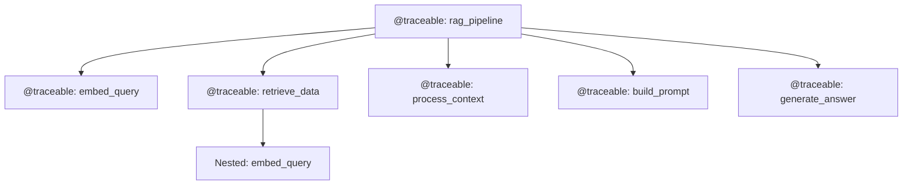
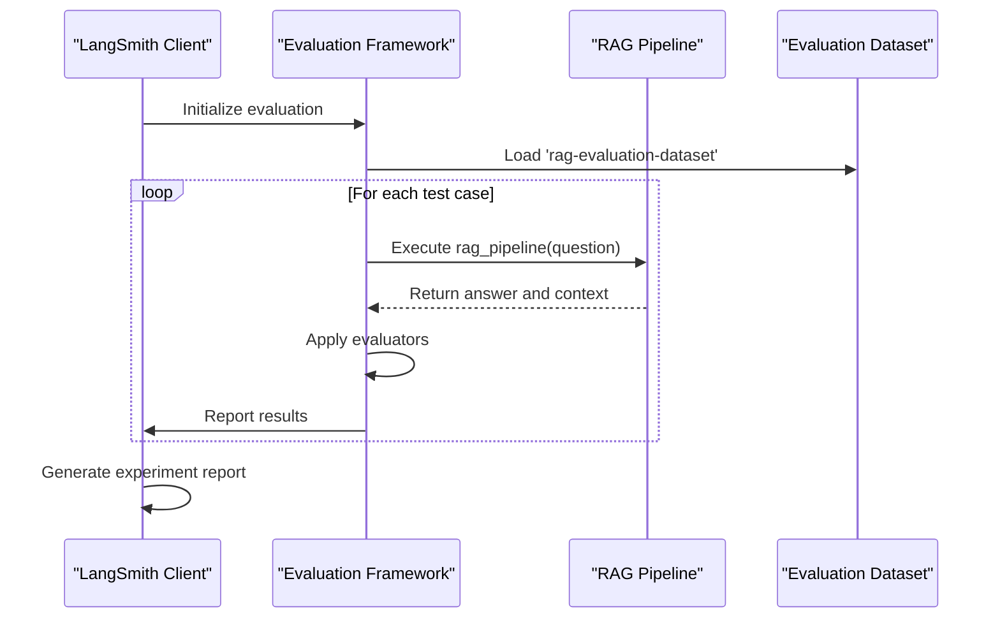
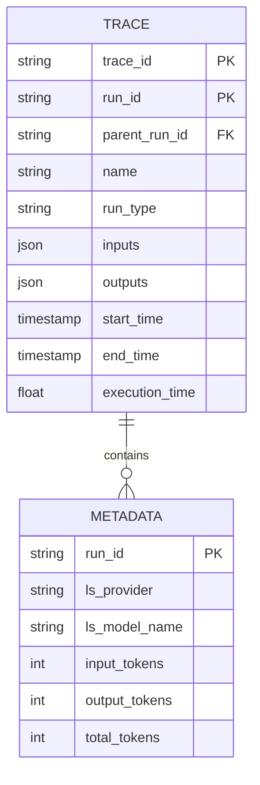

# LangSmith Integration

<cite>
**Referenced Files in This Document**   
- [retrieval_generation.py](file://src/api/rag/retrieval_generation.py)
- [eval_retriever.py](file://evals/eval_retriever.py)
- [ARCHITECTURE.md](file://documentation/ARCHITECTURE.md)
</cite>

## Table of Contents
1. [Introduction](#introduction)
2. [Traceable Decorator Implementation](#traceable-decorator-implementation)
3. [Evaluation Framework with LangSmith Client](#evaluation-framework-with-langsmith-client)
4. [Trace Data Structure and Metadata](#trace-data-structure-and-metadata)
5. [LangSmith UI for Performance Analysis](#langsmith-ui-for-performance-analysis)
6. [Best Practices for Observability](#best-practices-for-observability)

## Introduction

The LangSmith integration provides comprehensive observability and tracing capabilities for the RAG pipeline in the AI-Powered Amazon Product Assistant. By leveraging the `@traceable` decorator across key functions and the LangSmith Client for evaluation, developers can monitor pipeline performance, analyze latency, track token usage, and evaluate system effectiveness. This integration enables systematic debugging, performance optimization, and continuous improvement of the RAG system through detailed trace data and experiment results.

**Section sources**
- [ARCHITECTURE.md](file://documentation/ARCHITECTURE.md#L4-L10)

## Traceable Decorator Implementation

The `@traceable` decorator is systematically applied to all critical functions in the RAG pipeline to capture execution traces. This includes `embed_query`, `retrieve_data`, `generate_answer`, and the main `rag_pipeline` function. Each function is decorated with specific metadata that identifies the provider, model name, and run type, enabling granular analysis in the LangSmith UI.

The decorator captures the complete execution flow, including inputs, outputs, and execution time for each step. For functions that interact with external services like OpenAI, the decorator also captures token usage information by updating the `current_run.metadata` with usage data from the API response. This implementation provides a hierarchical trace structure where the root `rag_pipeline` span contains nested spans for each sub-operation.

**Diagram sources**
- [retrieval_generation.py](file://src/api/rag/retrieval_generation.py#L29-L30)
- [retrieval_generation.py](file://src/api/rag/retrieval_generation.py#L74-L75)

**Section sources**
- [retrieval_generation.py](file://src/api/rag/retrieval_generation.py#L29-L276)
- [ARCHITECTURE.md](file://documentation/ARCHITECTURE.md#L580-L674)

## Evaluation Framework with LangSmith Client

The evaluation framework in `eval_retriever.py` uses the LangSmith Client to systematically evaluate the RAG pipeline against the 'rag-evaluation-dataset'. The evaluation process runs the `rag_pipeline` function for each test case in the dataset and applies multiple evaluators to assess different aspects of performance.

The evaluation is configured with a prefix 'retriever' to organize experiment results in the LangSmith UI. The evaluators include RAGAS metrics such as faithfulness, response relevancy, context precision, and context recall, which are implemented as asynchronous functions that process the run outputs and ground truth data. This framework enables quantitative assessment of the RAG pipeline's effectiveness and facilitates comparison across different model versions and configurations.

**Diagram sources**
- [eval_retriever.py](file://evals/eval_retriever.py#L32-L79)
- [retrieval_generation.py](file://src/api/rag/retrieval_generation.py#L279-L328)

**Section sources**
- [eval_retriever.py](file://evals/eval_retriever.py#L1-L79)
- [retrieval_generation.py](file://src/api/rag/retrieval_generation.py#L279-L328)

## Trace Data Structure and Metadata

The trace data captured by LangSmith includes comprehensive information about each execution step, structured with inputs, outputs, and metadata. The inputs capture the function parameters, while the outputs contain the return values. The metadata is enriched with specific details such as model names, providers, and token usage information.

For OpenAI API calls, the implementation specifically updates the `current_run.metadata` with usage information from the API response, including input tokens, output tokens, and total tokens. This enables detailed cost tracking and performance analysis. The metadata also includes the `ls_provider` and `ls_model_name` fields that are specified in the `@traceable` decorator, allowing for filtering and grouping of traces by provider and model.

**Diagram sources**
- [retrieval_generation.py](file://src/api/rag/retrieval_generation.py#L54-L65)
- [retrieval_generation.py](file://src/api/rag/retrieval_generation.py#L254-L261)

**Section sources**
- [retrieval_generation.py](file://src/api/rag/retrieval_generation.py#L54-L65)
- [retrieval_generation.py](file://src/api/rag/retrieval_generation.py#L254-L261)

## LangSmith UI for Performance Analysis

The LangSmith UI provides powerful tools for analyzing the performance of the RAG pipeline. Developers can use the interface to examine latency breakdowns across different pipeline steps, identify bottlenecks, and compare model performance across experiments. The hierarchical trace visualization allows drilling down from the root `rag_pipeline` span to individual sub-operations, making it easy to pinpoint performance issues.

For debugging incorrect answers or low-scoring evaluations, developers can examine specific traces to review the inputs, outputs, and context used at each step. The UI enables comparison of different experiment runs, facilitating A/B testing of model versions, prompt variations, and retrieval strategies. This analysis capability is essential for optimizing the RAG pipeline and improving answer quality.

**Section sources**
- [ARCHITECTURE.md](file://documentation/ARCHITECTURE.md#L633-L674)
- [ARCHITECTURE.md](file://documentation/ARCHITECTURE.md#L995-L1012)

## Best Practices for Observability

Effective use of LangSmith for RAG pipeline observability requires adherence to several best practices. First, traces should be named meaningfully to reflect their purpose and enable easy filtering in the UI. The run type should be set appropriately (e.g., "embedding", "retriever", "llm", "prompt") to categorize operations correctly.

Datasets should be organized logically with clear naming conventions and versioning to support systematic evaluation. When debugging issues, developers should start with high-level experiment results to identify patterns, then drill down into individual traces for detailed analysis. For performance optimization, focus on the longest-running spans and consider strategies like model switching, prompt refinement, or retrieval optimization.

Regular evaluation runs should be conducted to track performance over time and catch regressions early. The integration of RAGAS metrics provides a comprehensive assessment framework that covers faithfulness, relevancy, and retrieval quality, enabling holistic evaluation of the RAG system.

**Section sources**
- [ARCHITECTURE.md](file://documentation/ARCHITECTURE.md#L995-L1012)
- [ARCHITECTURE.md](file://documentation/ARCHITECTURE.md#L1087-L1104)