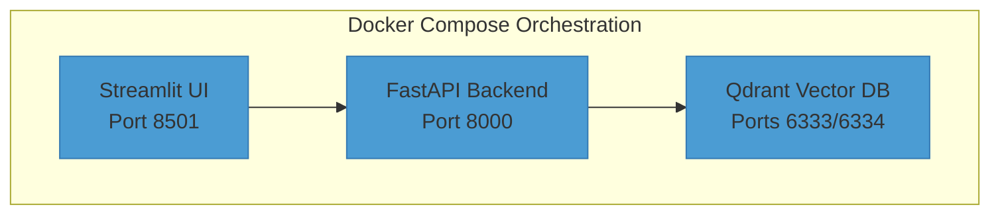
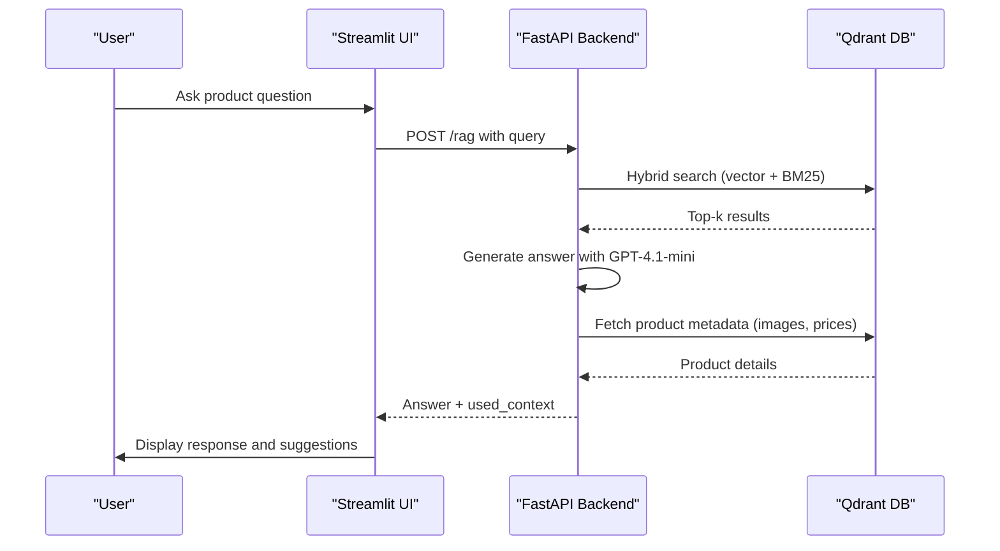

# Getting Started

<cite>
**Referenced Files in This Document**   
- [README.md](file://README.md)
- [docker-compose.yml](file://docker-compose.yml)
- [makefile](file://makefile)
- [.env](file://.env)
- [src/api/app.py](file://src/api/app.py)
- [src/chatbot_ui/app.py](file://src/chatbot_ui/app.py)
- [Dockerfile.fastapi](file://Dockerfile.fastapi)
- [Dockerfile.streamlit](file://Dockerfile.streamlit)
- [pyproject.toml](file://pyproject.toml)
- [src/api/rag/retrieval_generation.py](file://src/api/rag/retrieval_generation.py)
</cite>

## Table of Contents
1. [Prerequisites](#prerequisites)
2. [Environment Setup](#environment-setup)
3. [Configuration](#configuration)
4. [Launching the Application](#launching-the-application)
5. [Service Verification](#service-verification)
6. [Basic Usage](#basic-usage)
7. [Troubleshooting](#troubleshooting)
8. [Development Tooling](#development-tooling)

## Prerequisites

Before setting up the AI-Powered Amazon Product Assistant, ensure your development environment meets the following requirements:

- **Python 3.12+**: Required for compatibility with project dependencies
- **Docker and Docker Compose**: For containerized service orchestration
- **OpenAI API Key**: Mandatory for LLM functionality
- **Optional API Keys**: LangSmith (observability), Groq, and Google APIs

Verify your Python installation with:
```bash
python --version
```

Check Docker availability with:
```bash
docker --version
docker compose version
```

**Section sources**
- [README.md](file://README.md#L50-L55)
- [documentation/development-environment/README.md](file://documentation/development-environment/README.md#L3-L15)

## Environment Setup

The project uses UV as the package manager for fast dependency resolution. Install UV using pip:
```bash
pip install uv
```

Clone the repository and navigate to the project root:
```bash
git clone <repository-url>
cd AI-Powered-Amazon-Product-Assistant
```

The project structure organizes components into distinct directories:
- `src/api/`: FastAPI backend with RAG pipeline implementation
- `src/chatbot_ui/`: Streamlit frontend interface
- `notebooks/`: Jupyter notebooks for data exploration and prototyping
- `evals/`: Evaluation scripts for RAG performance metrics

**Section sources**
- [README.md](file://README.md#L57-L61)
- [pyproject.toml](file://pyproject.toml#L1-L31)

## Configuration

Create a `.env` file in the project root directory to store your API keys and configuration:

```env
OPENAI_API_KEY=sk-...
LANGSMITH_API_KEY=...       # Optional, for observability
GROQ_API_KEY=gsk_...        # Optional
GOOGLE_API_KEY=...          # Optional
```

The application uses Pydantic Settings for type-safe configuration management. Environment variables are automatically loaded from the `.env` file at startup. The configuration system validates all settings and provides clear error messages for missing or invalid values.

Key configuration files:
- `src/api/core/config.py`: Backend API configuration
- `src/chatbot_ui/core/config.py`: Frontend UI configuration

**Section sources**
- [README.md](file://README.md#L63-L71)
- [src/api/app.py](file://src/api/app.py#L1-L34)

## Launching the Application

You can start the application using either Docker Compose directly or the Makefile wrapper.

### Using Makefile (Recommended)
```bash
make run-docker-compose
```

This command executes the following steps:
1. Installs dependencies using `uv sync`
2. Builds Docker containers with `--build` flag
3. Starts all services defined in `docker-compose.yml`

### Using Docker Compose Directly
```bash
docker compose up --build
```

The Docker Compose configuration defines three services:
- **streamlit-app**: Frontend UI on port 8501
- **api**: FastAPI backend on port 8000
- **qdrant**: Vector database on ports 6333/6334

Both Dockerfiles (`Dockerfile.fastapi` and `Dockerfile.streamlit`) use the UV base image for optimized Python dependency management and include volume mounts for hot reload during development.



**Diagram sources**
- [docker-compose.yml](file://docker-compose.yml#L1-L33)
- [Dockerfile.fastapi](file://Dockerfile.fastapi#L1-L41)
- [Dockerfile.streamlit](file://Dockerfile.streamlit#L1-L50)

**Section sources**
- [makefile](file://makefile#L1-L8)
- [docker-compose.yml](file://docker-compose.yml#L1-L33)

## Service Verification

After launching the application, verify that all services are running correctly:

### Frontend Verification
- Access the Streamlit UI at http://localhost:8501
- Confirm the chat interface loads with the welcome message: "Hello! How can I assist you today?"
- Check that the sidebar displays "No suggestions yet" when no queries have been made

### Backend Verification
- Access the FastAPI documentation at http://localhost:8000/docs
- Verify the interactive Swagger UI loads with the `/rag` endpoint available
- Test the API directly using curl:
```bash
curl -X POST http://localhost:8000/rag \
  -H "Content-Type: application/json" \
  -d '{"query": "test"}'
```

### Vector Database Verification
- Access the Qdrant dashboard at http://localhost:6333/dashboard
- Confirm the collection `Amazon-items-collection-01-hybrid-search` exists
- Verify both semantic and BM25 indexes are populated

**Section sources**
- [src/chatbot_ui/app.py](file://src/chatbot_ui/app.py#L1-L94)
- [src/api/app.py](file://src/api/app.py#L1-L34)

## Basic Usage

Once the application is running, you can interact with the AI-powered product assistant through the Streamlit interface.

### Chat Interface
1. Navigate to http://localhost:8501
2. Type your product inquiry in the chat input field
3. Examples of effective queries:
   - "What wireless earbuds have noise cancellation under $200?"
   - "Show me gaming laptops with RTX 4070 under $1500"
   - "I need a tablet for drawing and note-taking, what are my options?"

The RAG pipeline processes your query through the following steps:
1. Generate embeddings using OpenAI's text-embedding-3-small
2. Perform hybrid search (semantic + BM25) in Qdrant
3. Apply Reciprocal Rank Fusion (RRF) to combine results
4. Generate structured responses using GPT-4.1-mini via Instructor
5. Enrich results with product images and pricing



**Diagram sources**
- [src/api/rag/retrieval_generation.py](file://src/api/rag/retrieval_generation.py#L331-L400)
- [src/chatbot_ui/app.py](file://src/chatbot_ui/app.py#L1-L94)

**Section sources**
- [src/api/rag/retrieval_generation.py](file://src/api/rag/retrieval_generation.py#L331-L400)

## Troubleshooting

### Common Issues and Solutions

#### Container Fails to Start
```bash
# Check container status
docker compose ps

# View detailed logs
docker compose logs -f

# Rebuild containers
docker compose down
docker compose up --build --force-recreate
```

#### API Connectivity Problems
- Verify API keys in `.env` file are correct and not expired
- Ensure no network restrictions are blocking connections to OpenAI
- Check that the `OPENAI_API_KEY` environment variable is properly loaded

#### Qdrant Connection Issues
- Confirm Qdrant service is running: `docker compose ps | grep qdrant`
- Verify the collection name matches exactly: `Amazon-items-collection-01-hybrid-search`
- Check that the volume mount `./qdrant_storage` has proper permissions

#### Empty Search Results
- Ensure the Qdrant collection contains data (visible in dashboard)
- Verify the hybrid search is returning results from both semantic and BM25 queries
- Check that the RRF fusion is properly combining results

### Debugging Commands
```bash
# View all container logs
docker compose logs

# Monitor a specific service
docker compose logs -f api

# Check Python dependencies
uv pip list

# Run tests to verify functionality
make test
```

**Section sources**
- [README.md](file://README.md#L450-L480)
- [docker-compose.yml](file://docker-compose.yml#L1-L33)

## Development Tooling

The project includes several Makefile targets to streamline development workflows:

### Testing Commands
```bash
make test                    # Run all tests
make test-unit               # Run unit tests only
make test-integration        # Run integration tests only
make test-coverage           # Run tests with coverage report
make test-verbose            # Run tests with verbose output
make test-no-api             # Run tests that don't require API keys
```

### Notebook Management
```bash
make clean-notebook-outputs  # Remove output cells from notebooks
```

### Evaluation Framework
```bash
make run-evals-retriever     # Run RAGAS evaluation metrics
```

The testing framework uses pytest with configuration in `pytest.ini`, including markers for unit, integration, and API-dependent tests. Code coverage is measured and reported in both terminal and HTML formats.

**Section sources**
- [makefile](file://makefile#L10-L38)
- [pytest.ini](file://pytest.ini#L1-L18)