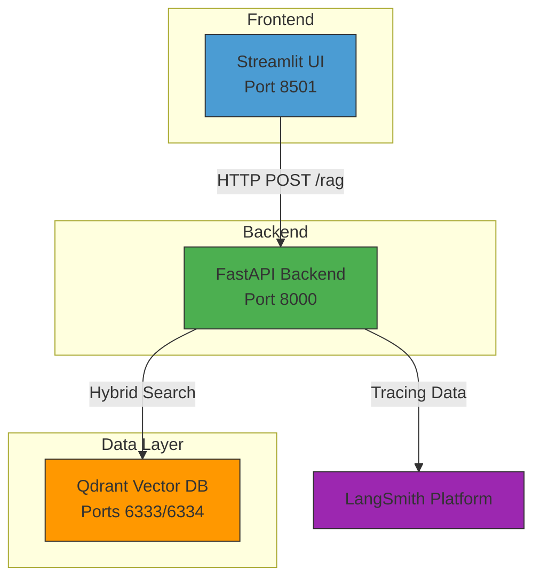
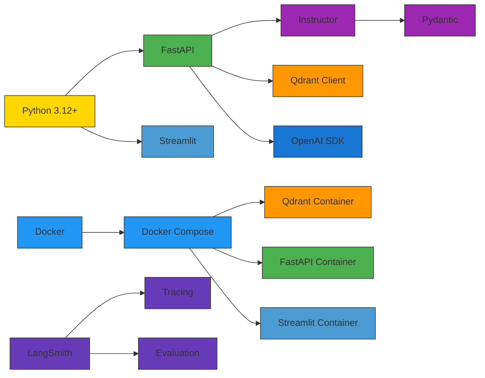
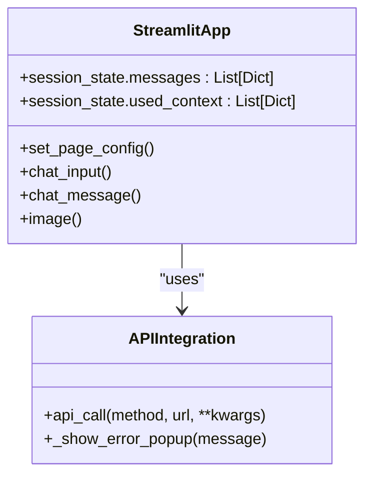
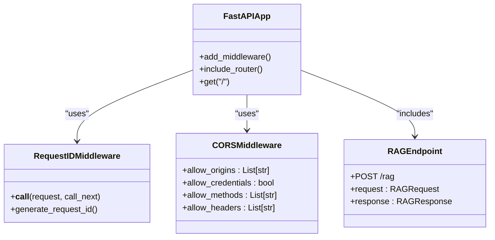
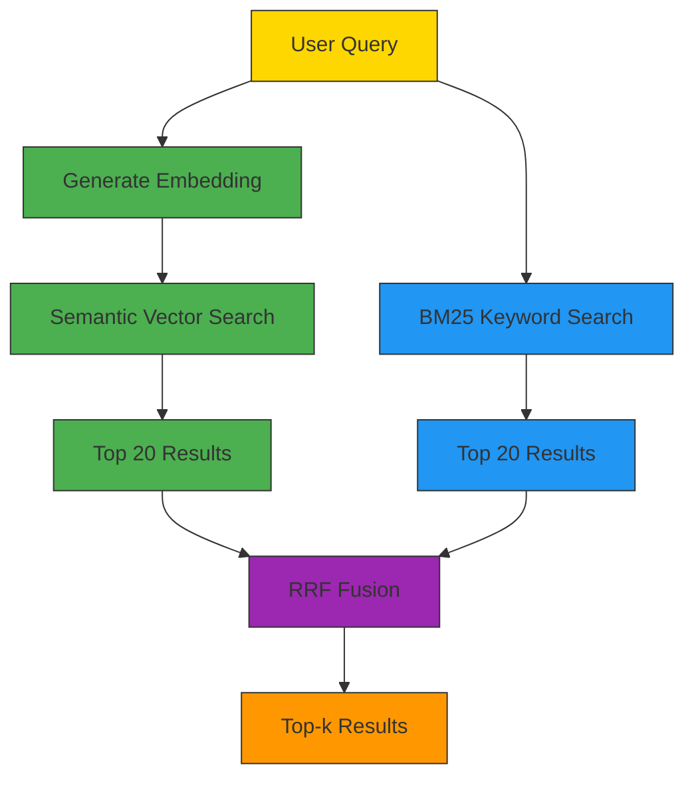
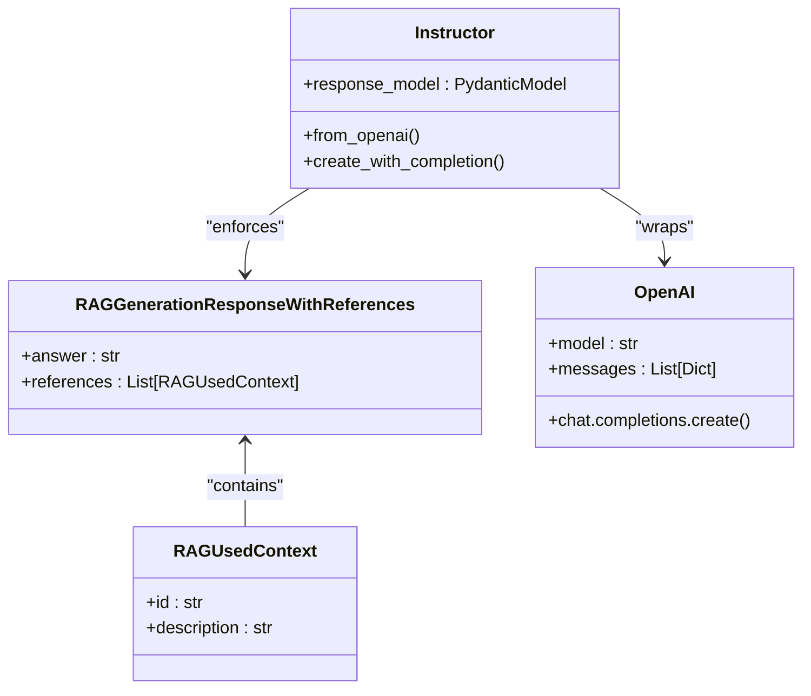
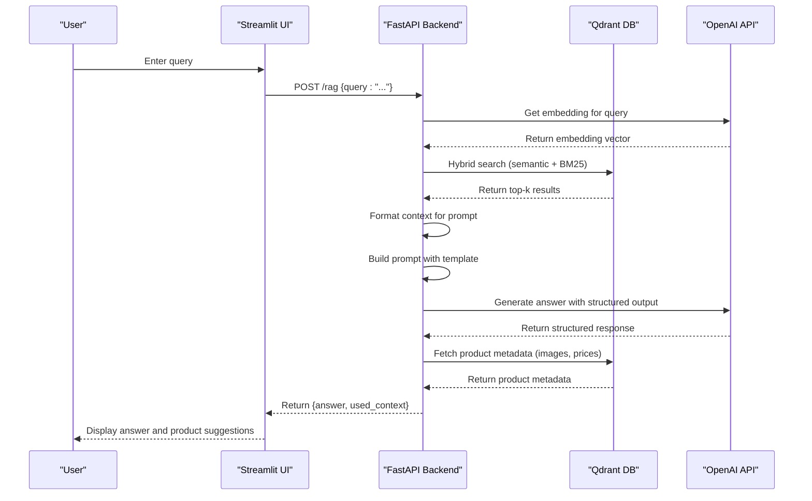
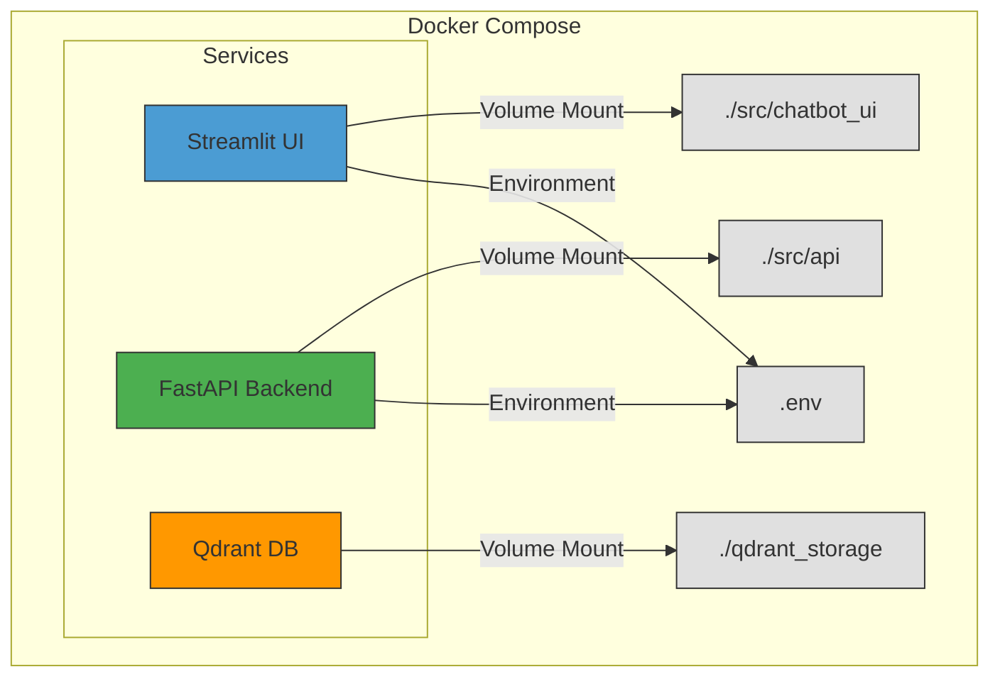

# System Overview

<cite>
**Referenced Files in This Document**   
- [README.md](file://README.md)
- [ARCHITECTURE.md](file://documentation/ARCHITECTURE.md)
- [app.py](file://src/chatbot_ui/app.py)
- [app.py](file://src/api/app.py)
- [retrieval_generation.py](file://src/api/rag/retrieval_generation.py)
- [models.py](file://src/api/api/models.py)
- [docker-compose.yml](file://docker-compose.yml)
</cite>

## Table of Contents
1. [Introduction](#introduction)
2. [High-Level Architecture](#high-level-architecture)
3. [Technology Stack](#technology-stack)
4. [Core Components](#core-components)
5. [Key Features](#key-features)
6. [System Data Flow](#system-data-flow)
7. [Use Cases](#use-cases)
8. [Development and Deployment](#development-and-deployment)

## Introduction

The AI-Powered Amazon Product Assistant is a full-stack, RAG-based conversational system designed to help users discover and explore Amazon Electronics products through natural language queries. This intelligent assistant transforms traditional e-commerce search into an interactive experience by combining semantic understanding with large language models to deliver accurate, context-aware product recommendations.

Built as a production-ready system, the assistant leverages advanced retrieval techniques and structured outputs to provide personalized responses with detailed explanations. The system is currently in Phase 3 of development, focusing on agent-based systems, with a projected completion date of November 23, 2024. The assistant enables users to ask questions like "What wireless earbuds have noise cancellation?" or "Show me gaming laptops under $1000" and receive comprehensive answers with product suggestions.

**Section sources**
- [README.md](file://README.md#L1-L50)

## High-Level Architecture

The AI-Powered Amazon Product Assistant follows a microservices architecture with three primary components orchestrated through Docker Compose. This design enables clear separation of concerns while maintaining efficient communication between the frontend, backend, and data storage layers.



**Diagram sources**
- [README.md](file://README.md#L50-L100)
- [docker-compose.yml](file://docker-compose.yml#L1-L33)

The architecture consists of:
- **Streamlit UI**: Provides an interactive chat interface with conversation history and a product suggestions sidebar
- **FastAPI Backend**: Orchestrates the RAG pipeline, handles API requests, and manages business logic
- **Qdrant Vector Database**: Stores product data with hybrid indexing for efficient semantic and keyword search
- **LangSmith Platform**: Provides observability, tracing, and evaluation capabilities

This containerized approach allows for independent scaling of components and facilitates development with hot-reload capabilities.

**Section sources**
- [README.md](file://README.md#L50-L100)
- [docker-compose.yml](file://docker-compose.yml#L1-L33)

## Technology Stack

The system leverages a modern technology stack designed for AI-powered applications, combining Python-based frameworks with cloud-native deployment patterns.

| Component | Technology | Purpose |
|-----------|-----------|---------|
| **UI Framework** | Streamlit | Interactive chat interface development |
| **API Framework** | FastAPI | Async backend with automatic OpenAPI documentation |
| **Vector Database** | Qdrant | Hybrid search with persistent storage |
| **LLM Provider** | OpenAI | GPT-4.1-mini for generation, text-embedding-3-small for embeddings |
| **Structured Outputs** | Instructor | Pydantic schema enforcement for type-safe LLM responses |
| **Observability** | LangSmith | Distributed tracing and evaluation |
| **Orchestration** | Docker Compose | Multi-container development and deployment |
| **Package Manager** | UV | Fast, reliable dependency resolution |
| **Testing** | pytest + RAGAS | Unit tests and RAG evaluation metrics |

The stack is optimized for rapid development and production readiness, with features like automatic code reloading during development and comprehensive observability in production.



**Diagram sources**
- [README.md](file://README.md#L100-L150)
- [ARCHITECTURE.md](file://documentation/ARCHITECTURE.md#L30-L79)

**Section sources**
- [README.md](file://README.md#L100-L150)
- [ARCHITECTURE.md](file://documentation/ARCHITECTURE.md#L30-L79)

## Core Components

### Streamlit Frontend

The Streamlit UI provides an intuitive chat interface that enables natural conversation with the product assistant. The interface consists of a main chat area for conversation history and a sidebar that displays product suggestions with images, descriptions, and prices.

The frontend manages session state to maintain conversation context across interactions and handles API integration with the FastAPI backend. When a user submits a query, the UI makes an HTTP POST request to the `/rag` endpoint and displays the response in the chat interface while updating the product suggestions sidebar with relevant items.



**Diagram sources**
- [app.py](file://src/chatbot_ui/app.py#L1-L93)

### FastAPI Backend

The FastAPI backend serves as the orchestration layer for the RAG pipeline, exposing a RESTful `/rag` endpoint that handles user queries and returns structured responses. The backend is built with async support and includes automatic OpenAPI documentation.

The backend implements several key features:
- Request ID middleware for tracing individual requests
- CORS configuration to enable communication with the Streamlit frontend
- Pydantic models for request/response validation
- Environment-based configuration using Pydantic Settings



**Diagram sources**
- [app.py](file://src/api/app.py#L1-L33)
- [models.py](file://src/api/api/models.py#L1-L16)

### Qdrant Vector Database

Qdrant serves as the vector database for storing and retrieving product information using hybrid search capabilities. The database is configured with a collection named `Amazon-items-collection-01-hybrid-search` that contains product data with dual indexing:

- **Semantic Index**: Uses OpenAI's text-embedding-3-small model (1536 dimensions) for vector similarity search
- **Keyword Index**: Uses BM25 algorithm for traditional keyword matching

The database is deployed as a Docker container with persistent storage mounted to the host filesystem, ensuring data persistence across container restarts.

**Section sources**
- [app.py](file://src/chatbot_ui/app.py#L1-L93)
- [app.py](file://src/api/app.py#L1-L33)
- [models.py](file://src/api/api/models.py#L1-L16)
- [retrieval_generation.py](file://src/api/rag/retrieval_generation.py#L1-L400)

## Key Features

### Hybrid Search

The system implements hybrid search by combining semantic vector search with keyword-based BM25 search, using Reciprocal Rank Fusion (RRF) to combine results. This approach leverages the strengths of both retrieval methods:

- **Semantic Search**: Captures user intent and finds products with similar meaning, even with different terminology
- **Keyword Search**: Ensures exact matches for specific product names, brands, or technical specifications

The retrieval process follows these steps:
1. Generate an embedding for the user query using OpenAI's text-embedding-3-small
2. Perform semantic search to retrieve top 20 results based on vector similarity
3. Perform BM25 keyword search to retrieve top 20 results based on text matching
4. Apply RRF fusion to combine and re-rank results
5. Return the top-k results (default: 5) to the generation stage



**Diagram sources**
- [retrieval_generation.py](file://src/api/rag/retrieval_generation.py#L81-L117)
- [ARCHITECTURE.md](file://documentation/ARCHITECTURE.md#L588-L619)

### Structured Outputs

The system uses the Instructor library to enforce structured outputs from the LLM, ensuring type safety and consistency in responses. This is achieved through Pydantic models that define the expected response schema.

The RAG pipeline uses a Pydantic model called `RAGGenerationResponseWithReferences` that enforces the following structure:
- `answer`: A string containing the natural language response
- `references`: A list of products used to generate the answer, each with:
  - `id`: Product identifier
  - `description`: Short description of the item

This structured approach eliminates the need for manual JSON parsing and validation, as Instructor handles schema enforcement and raises validation errors if the LLM output doesn't match the expected format.



**Diagram sources**
- [retrieval_generation.py](file://src/api/rag/retrieval_generation.py#L236-L273)
- [retrieval_generation.py](file://src/api/rag/retrieval_generation.py#L21-L27)

### Observability

The system incorporates comprehensive observability through LangSmith, providing end-to-end tracing of the RAG pipeline. Each step of the pipeline is decorated with `@traceable` to capture execution data, enabling detailed monitoring and analysis.

Key observability features include:
- **Distributed Tracing**: All pipeline steps are traced with hierarchical spans
- **Token Usage Tracking**: Input, output, and total tokens are logged for cost analysis
- **Latency Monitoring**: Execution time is measured for each pipeline component
- **Error Tracking**: Failures are captured with context for debugging
- **Request Tracing**: Each request is assigned a unique ID for correlation across components

The tracing hierarchy follows the pipeline flow:
```
rag_pipeline (root)
├── embed_query (embedding)
├── retrieve_data (retriever)
│   └── embed_query (embedding)  # Nested call
├── format_retrieved_context (prompt)
├── build_prompt (prompt)
└── generate_answer (llm)
```

**Section sources**
- [retrieval_generation.py](file://src/api/rag/retrieval_generation.py#L1-L400)
- [ARCHITECTURE.md](file://documentation/ARCHITECTURE.md#L492-L525)

## System Data Flow

The RAG pipeline processes user queries through a series of well-defined steps, transforming natural language questions into informative responses with product recommendations.



**Diagram sources**
- [retrieval_generation.py](file://src/api/rag/retrieval_generation.py#L331-L400)
- [app.py](file://src/chatbot_ui/app.py#L1-L93)

The data flow consists of the following stages:

1. **Query Submission**: The user enters a natural language query in the Streamlit interface
2. **Embedding Generation**: The query is sent to OpenAI to generate a vector embedding
3. **Hybrid Retrieval**: Qdrant performs both semantic and keyword searches, combining results with RRF
4. **Context Formatting**: Retrieved product data is formatted into a structured context string
5. **Prompt Building**: A YAML-based prompt template is rendered with the context and original query
6. **Answer Generation**: OpenAI generates a response using the structured prompt with Instructor enforcement
7. **Context Enrichment**: Product metadata (images, prices) is retrieved for UI display
8. **Response Delivery**: The final response is sent back to the frontend for display

Each step is instrumented with logging and tracing to enable monitoring and optimization.

**Section sources**
- [retrieval_generation.py](file://src/api/rag/retrieval_generation.py#L1-L400)
- [app.py](file://src/chatbot_ui/app.py#L1-L93)

## Use Cases

### Semantic Product Search

The assistant excels at semantic product search, understanding user intent beyond simple keyword matching. For example, when asked "What wireless earbuds have noise cancellation?", the system can identify relevant products even if the exact phrase "noise cancellation" doesn't appear in the product description, by understanding related concepts like "active noise cancelling" or "ANC".

This capability is enabled by the semantic search component, which maps both queries and product descriptions to a shared vector space where semantically similar items are close together. The system can find products based on functionality, use cases, or comparative attributes rather than just matching keywords.

### Personalized Recommendations

The assistant provides personalized product recommendations by analyzing the context of the conversation and user preferences. Through multi-turn conversations, the system can refine its recommendations based on user feedback and additional criteria.

For example:
- User: "I need a tablet for drawing"
- Assistant: Suggests tablets with stylus support and high-resolution displays
- User: "Under $500 please"
- Assistant: Filters recommendations to meet the budget constraint
- User: "With good battery life"
- Assistant: Prioritizes tablets with long battery duration

The system maintains context through the conversation, allowing for progressive refinement of product recommendations based on multiple criteria.

**Section sources**
- [README.md](file://README.md#L150-L200)

## Development and Deployment

### Development Environment

The system is designed for efficient development with hot-reload capabilities. Docker Compose is configured with volume mounts that automatically sync code changes from the host to the containers, eliminating the need to rebuild containers for code updates.

The development workflow includes:
- Editing files in `src/api/` or `src/chatbot_ui/`
- Changes are immediately reflected in the running containers
- Automatic reloading of the Streamlit and FastAPI services
- Real-time feedback during development

Configuration is managed through environment variables loaded from a `.env` file using Pydantic Settings, with validation at startup to ensure required variables are present.

### Deployment Architecture

The system uses Docker Compose for container orchestration, defining three services:
- **Streamlit UI**: Serves the chat interface on port 8501
- **FastAPI Backend**: Exposes the API on port 8000 with automatic documentation
- **Qdrant**: Runs the vector database on ports 6333 (HTTP) and 6334 (gRPC)

The deployment includes persistent storage for the vector database, ensuring data persistence across container restarts. Volume mounts are used to share code between the host and containers for development, while the production configuration would use built images.



**Diagram sources**
- [docker-compose.yml](file://docker-compose.yml#L1-L33)
- [README.md](file://README.md#L200-L250)

**Section sources**
- [docker-compose.yml](file://docker-compose.yml#L1-L33)
- [README.md](file://README.md#L200-L250)