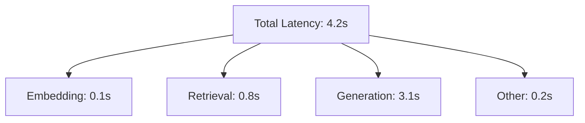

# Troubleshooting

<cite>
**Referenced Files in This Document**   
- [docker-compose.yml](file://docker-compose.yml)
- [src/api/core/config.py](file://src/api/core/config.py)
- [src/chatbot_ui/core/config.py](file://src/chatbot_ui/core/config.py)
- [src/api/app.py](file://src/api/app.py)
- [src/api/rag/retrieval_generation.py](file://src/api/rag/retrieval_generation.py)
- [src/api/api/endpoints.py](file://src/api/api/endpoints.py)
- [src/chatbot_ui/app.py](file://src/chatbot_ui/app.py)
- [documentation/ARCHITECTURE.md](file://documentation/ARCHITECTURE.md)
- [README.md](file://README.md)
</cite>

## Table of Contents
1. [Docker Container Failures](#docker-container-failures)
2. [API Connectivity Issues](#api-connectivity-issues)
3. [Database Initialization Problems](#database-initialization-problems)
4. [RAG-Specific Issues](#rag-specific-issues)
5. [Configuration Problems](#configuration-problems)
6. [Performance Issues](#performance-issues)
7. [Diagnostic Commands and Health Checks](#diagnostic-commands-and-health-checks)

## Docker Container Failures

When Docker containers fail to start or crash during operation, follow this systematic approach to identify and resolve the issue.

**Common Error Messages:**
- `ERROR: for service api  Cannot start service api: driver failed programming external connectivity on endpoint api`
- `qdrant_1    | thread 'main' panicked at 'Failed to create directory: Permission denied'`
- `streamlit-app_1  | ModuleNotFoundError: No module named 'streamlit'`

**Root Cause Analysis:**
1. **Port Conflicts**: Another process is using ports 8000, 8501, or 6333
2. **Permission Issues**: Docker cannot write to the `qdrant_storage` volume
3. **Missing Dependencies**: Python packages not installed correctly
4. **Build Failures**: Docker image build process failed

**Step-by-Step Resolution:**
1. Check container status:
```bash
docker compose ps
```

2. View detailed logs for problematic services:
```bash
docker compose logs api
docker compose logs qdrant
docker compose logs streamlit-app
```

3. Resolve port conflicts by stopping conflicting processes:
```bash
lsof -i :8000
lsof -i :8501
lsof -i :6333
# Kill the process using PID from above commands
kill -9 <PID>
```

4. Fix volume permission issues:
```bash
sudo chown -R $USER:$USER qdrant_storage/
```

5. Rebuild containers with fresh dependencies:
```bash
docker compose down
docker compose up --build
```

6. Verify all services are running:
```bash
docker compose ps
```

**Section sources**
- [docker-compose.yml](file://docker-compose.yml)
- [README.md](file://README.md#L150-L170)

## API Connectivity Issues

API connectivity problems typically manifest as failed requests between the Streamlit UI and FastAPI backend, or between the backend and external services.

**Common Error Messages:**
- `ConnectionError: HTTPConnectionPool(host='api', port=8000): Max retries exceeded`
- `CORS error: Response to preflight request doesn't pass access control check`
- `500 Internal Server Error` with no specific details

**Root Cause Analysis:**
1. **Network Configuration**: Incorrect service hostname in configuration
2. **CORS Policy**: Cross-origin resource sharing restrictions
3. **Service Not Running**: FastAPI backend container not started
4. **Firewall/Security Software**: Blocking container-to-container communication

**Step-by-Step Resolution:**
1. Verify API service is running:
```bash
docker compose ps
```

2. Test API connectivity from host machine:
```bash
curl -X POST http://localhost:8000/rag \
  -H "Content-Type: application/json" \
  -d '{"query": "test"}'
```

3. Check network connectivity between containers:
```bash
# Access the streamlit container
docker exec -it ai-powered-amazon-product-assistant-streamlit-app-1 /bin/bash
# Test connection to API
curl -v http://api:8000/health
```

4. Verify API URL configuration in UI:
Check `src/chatbot_ui/core/config.py` contains correct API URL:
```python
API_URL: str = "http://api:8000"
```

5. Validate CORS configuration in `src/api/app.py`:
```python
app.add_middleware(
    CORSMiddleware,
    allow_origins=["*"],
    allow_credentials=True,
    allow_methods=["*"],
    allow_headers=["*"],
)
```

6. Monitor real-time logs for connection attempts:
```bash
docker compose logs -f api
```

**Section sources**
- [src/chatbot_ui/core/config.py](file://src/chatbot_ui/core/config.py#L2-L9)
- [src/api/app.py](file://src/api/app.py#L21-L27)
- [src/chatbot_ui/app.py](file://src/chatbot_ui/app.py#L84-L92)

## Database Initialization Problems

Qdrant database initialization issues prevent the RAG system from retrieving product information.

**Common Error Messages:**
- `UnexpectedResponse: Not found: Collection 'Amazon-items-collection-01-hybrid-search' not found`
- `Qdrant connection refused`
- `Failed to generate embedding: API key not found`

**Root Cause Analysis:**
1. **Collection Not Created**: Data ingestion process not completed
2. **Connection Issues**: Qdrant service not running or network misconfiguration
3. **Schema Mismatch**: Collection exists but with incorrect schema
4. **Volume Mount Issues**: Persistent storage not properly mounted

**Step-by-Step Resolution:**
1. Verify Qdrant service status:
```bash
docker compose ps qdrant
```

2. Check Qdrant logs for startup errors:
```bash
docker compose logs qdrant
```

3. Access Qdrant dashboard to verify collection:
Open http://localhost:6333/dashboard and check if `Amazon-items-collection-01-hybrid-search` exists

4. Test Qdrant connection from Python:
```python
from qdrant_client import QdrantClient
client = QdrantClient(url="http://localhost:6333")
print(client.get_collections())
```

5. Verify volume mounting in `docker-compose.yml`:
```yaml
volumes:
  - ./qdrant_storage:/qdrant/storage:z
```

6. Recreate the collection if missing (requires data re-ingestion):
```bash
docker compose down
rm -rf qdrant_storage/
docker compose up -d
```

7. Validate collection schema matches expected structure:
- Vector index: `text-embedding-3-small` (1536 dimensions)
- Sparse vector: `bm25`
- Payload fields: `parent_asin`, `description`, `average_rating`, `image`, `price`

**Section sources**
- [docker-compose.yml](file://docker-compose.yml#L24-L32)
- [src/api/rag/retrieval_generation.py](file://src/api/rag/retrieval_generation.py#L352-L387)
- [documentation/ARCHITECTURE.md](file://documentation/ARCHITECTURE.md#L168-L192)

## RAG-Specific Issues

RAG pipeline issues affect retrieval quality, response relevance, and structured output parsing.

### Poor Retrieval Quality

**Symptoms:**
- Irrelevant products returned for queries
- Low-quality search results despite relevant products in database
- Inconsistent retrieval performance

**Root Cause Analysis:**
1. **Hybrid Search Configuration**: Improper RRF fusion parameters
2. **Embedding Quality**: Suboptimal vector representations
3. **Index Configuration**: Missing or incorrect indexes
4. **Query Processing**: Inadequate query preprocessing

**Step-by-Step Resolution:**
1. Verify hybrid search implementation in `retrieval_generation.py`:
```python
results = qdrant_client.query_points(
    collection_name="Amazon-items-collection-01-hybrid-search",
    prefetch=[
        Prefetch(
            query=query_embedding,
            using="text-embedding-3-small",
            limit=20
        ),
        Prefetch(
            query=Document(text=query, model="qdrant/bm25"),
            using="bm25",
            limit=20
        )
    ],
    query=FusionQuery(fusion="rrf"),
    limit=k
)
```

2. Check embedding generation process:
```python
response = openai.embeddings.create(
    input=text,
    model="text-embedding-3-small"
)
```

3. Validate that both semantic and keyword indexes exist in Qdrant collection

4. Test retrieval with different query types to identify patterns in poor performance

**Section sources**
- [src/api/rag/retrieval_generation.py](file://src/api/rag/retrieval_generation.py#L99-L118)

### Irrelevant Responses

**Symptoms:**
- Answers not based on retrieved context
- Hallucinations in generated responses
- Off-topic or generic answers

**Root Cause Analysis:**
1. **Prompt Engineering**: Inadequate instructions in prompt template
2. **Context Formatting**: Poorly formatted context passed to LLM
3. **Model Configuration**: Incorrect temperature or other generation parameters
4. **Retrieval-Generation Mismatch**: Retrieved context doesn't match query

**Step-by-Step Resolution:**
1. Review prompt template in `src/api/rag/prompts/retrieval_generation.yaml`:
```yaml
Instructions:
- Answer the question based on the provided context only.
- Never use word "context" and refer to it as the available products.
```

2. Verify context formatting in `process_context` function:
```python
formatted_context += f"- ID: {id}, rating: {rating}, description: {chunk}\n"
```

3. Check generation parameters in `generate_answer`:
```python
response, raw_response = client.chat.completions.create_with_completion(
    model="gpt-4.1-mini",
    messages=[{"role": "system", "content": prompt}],
    temperature=0.5,
    response_model=RAGGenerationResponseWithReferences
)
```

4. Use LangSmith traces to analyze input prompts and verify context is being passed correctly

**Section sources**
- [src/api/rag/retrieval_generation.py](file://src/api/rag/retrieval_generation.py#L200-L226)
- [src/api/rag/prompts/retrieval_generation.yaml](file://src/api/rag/prompts/retrieval_generation.yaml)

### Structured Output Parsing Errors

**Symptoms:**
- `ValidationError` when parsing LLM responses
- Missing fields in structured outputs
- Type mismatches in returned data

**Root Cause Analysis:**
1. **Schema-LLM Mismatch**: LLM not adhering to Pydantic schema
2. **Instructor Library Issues**: Problems with structured output enforcement
3. **Model Limitations**: GPT-4.1-mini not fully supporting function calling
4. **Complex Schemas**: Overly complex Pydantic models

**Step-by-Step Resolution:**
1. Verify Pydantic model definitions in `retrieval_generation.py`:
```python
class RAGUsedContext(BaseModel):
    id: str = Field(description="ID of the item used to answer the question.")
    description: str = Field(description="Short description of the item.")

class RAGGenerationResponseWithReferences(BaseModel):
    answer: str = Field(description="Answer to the question.")
    references: list[RAGUsedContext] = Field(description="List of items used.")
```

2. Check Instructor integration:
```python
client = instructor.from_openai(openai.OpenAI())
response, raw_response = client.chat.completions.create_with_completion(
    model="gpt-4.1-mini",
    response_model=RAGGenerationResponseWithReferences
)
```

3. Examine LangSmith traces for raw LLM responses that fail validation

4. Simplify schema if necessary and test with basic examples

**Section sources**
- [src/api/rag/retrieval_generation.py](file://src/api/rag/retrieval_generation.py#L21-L27)

## Configuration Problems

Configuration issues related to environment variables and API keys can prevent system components from functioning properly.

### Environment Variables and API Keys

**Common Symptoms:**
- `OPENAI_API_KEY not found` errors
- Authentication failures with external services
- Missing optional API keys for alternative LLM providers

**Root Cause Analysis:**
1. **Missing .env File**: Configuration file not created
2. **Incorrect Variable Names**: Typos in environment variable names
3. **File Permissions**: .env file not readable by containers
4. **Variable Scope**: Environment variables not passed to containers

**Step-by-Step Resolution:**
1. Create .env file in project root:
```env
OPENAI_API_KEY=sk-...
LANGSMITH_API_KEY=...
GROQ_API_KEY=gsk_...
GOOGLE_API_KEY=...
```

2. Verify required variables are present:
```python
# src/api/core/config.py
class Config(BaseSettings):
    OPENAI_API_KEY: str
    GROQ_API_KEY: str
    GOOGLE_API_KEY: str
    CO_API_KEY: str
```

3. Check that docker-compose.yml passes env_file:
```yaml
env_file:
  - .env
```

4. Test configuration loading:
```python
from src.api.core.config import config
print(config.OPENAI_API_KEY[:5])  # Should not raise ValidationError
```

5. Restart containers to ensure new environment variables are loaded:
```bash
docker compose down
docker compose up -d
```

**Section sources**
- [src/api/core/config.py](file://src/api/core/config.py#L2-L8)
- [docker-compose.yml](file://docker-compose.yml#L10-L11)

## Performance Issues

Performance problems can manifest as high latency or excessive token usage, affecting user experience and operational costs.

### High Latency

**Symptoms:**
- Slow response times (>5 seconds)
- UI appears to hang during queries
- Gradual performance degradation

**Root Cause Analysis:**
1. **LLM Generation**: GPT-4.1-mini response time
2. **Vector Search**: Qdrant retrieval performance
3. **Network Latency**: Container-to-container communication
4. **Resource Constraints**: Insufficient CPU/memory for containers

**Step-by-Step Resolution:**
1. Use LangSmith traces to identify slow components:


2. Monitor container resource usage:
```bash
docker stats
```

3. Optimize retrieval parameters:
- Adjust `top_k` parameter in `rag_pipeline_wrapper`
- Tune RRF fusion parameters

4. Consider caching strategies for frequent queries

5. Scale resources if necessary:
```yaml
# docker-compose.yml
services:
  api:
    deploy:
      resources:
        limits:
          cpus: '2'
          memory: 4G
```

**Section sources**
- [documentation/ARCHITECTURE.md](file://documentation/ARCHITECTURE.md#L732-L748)

### Token Overuse

**Symptoms:**
- High API costs
- Rate limiting from OpenAI
- Long context windows being consumed unnecessarily

**Root Cause Analysis:**
1. **Large Context Windows**: Too many retrieved documents
2. **Verbose Prompts**: Inefficient prompt templates
3. **Long Outputs**: Excessive response lengths
4. **Inefficient Chunking**: Large text chunks in vector database

**Step-by-Step Resolution:**
1. Monitor token usage via LangSmith metadata:
```python
current_run.metadata["usage_metadata"] = {
    "input_tokens": raw_response.usage.prompt_tokens,
    "output_tokens": raw_response.usage.completion_tokens,
    "total_tokens": raw_response.usage.total_tokens
}
```

2. Optimize retrieval count:
```python
def rag_pipeline_wrapper(question: str, top_k: int = 5):
```

3. Review and streamline prompt templates in `retrieval_generation.yaml`

4. Implement output length controls in generation parameters:
```python
response, raw_response = client.chat.completions.create_with_completion(
    model="gpt-4.1-mini",
    max_tokens=500,
    temperature=0.5,
)
```

5. Analyze cost patterns in LangSmith dashboard

**Section sources**
- [src/api/rag/retrieval_generation.py](file://src/api/rag/retrieval_generation.py#L254-L261)

## Diagnostic Commands and Health Checks

Essential commands and procedures for diagnosing and verifying system health.

### Diagnostic Commands

**Container Status:**
```bash
docker compose ps
```

**Service Logs:**
```bash
docker compose logs api
docker compose logs qdrant
docker compose logs streamlit-app
```

**Real-time Log Monitoring:**
```bash
docker compose logs -f api
```

**API Endpoint Testing:**
```bash
curl -X POST http://localhost:8000/rag \
  -H "Content-Type: application/json" \
  -d '{"query": "What wireless earbuds have noise cancellation?"}'
```

**Qdrant Collection Verification:**
```python
from qdrant_client import QdrantClient
client = QdrantClient(url="http://localhost:6333")
print(client.get_collection("Amazon-items-collection-01-hybrid-search"))
```

### Health Check Procedures

1. **Verify All Services Running:**
   - Check `docker compose ps` shows all services as "Up"
   - Confirm no services in "Restarting" or "Exited" state

2. **Test API Connectivity:**
   - Access http://localhost:8000/docs for API documentation
   - Test /rag endpoint with sample query
   - Verify response structure matches expected format

3. **Validate UI Functionality:**
   - Access http://localhost:8501
   - Submit test query
   - Verify responses appear in chat
   - Check product suggestions in sidebar

4. **Confirm Database Availability:**
   - Access Qdrant dashboard at http://localhost:6333/dashboard
   - Verify collection exists and contains records
   - Check vector and BM25 indexes are present

5. **Review Observability:**
   - Check LangSmith traces for successful pipeline execution
   - Verify all @traceable decorators are capturing data
   - Confirm request IDs are being generated and propagated

**Section sources**
- [README.md](file://README.md#L150-L170)
- [documentation/ARCHITECTURE.md](file://documentation/ARCHITECTURE.md#L909-L944)