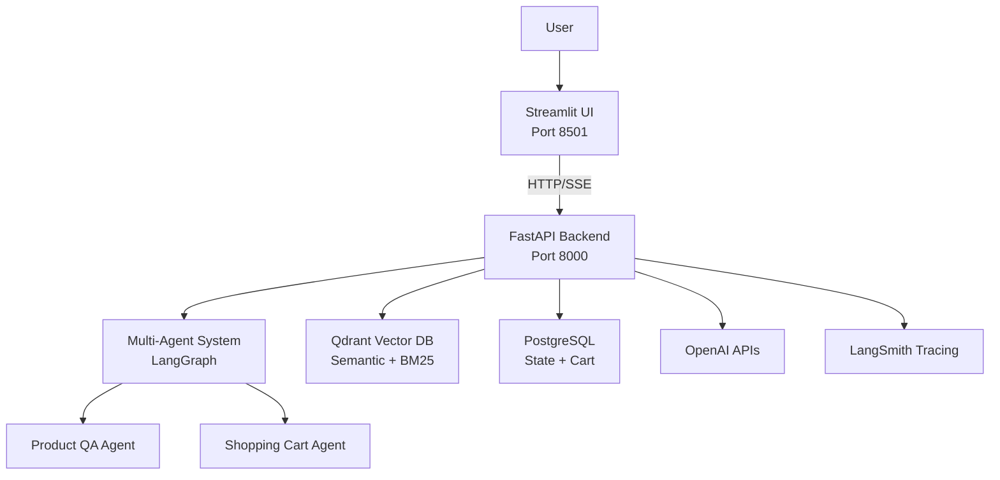
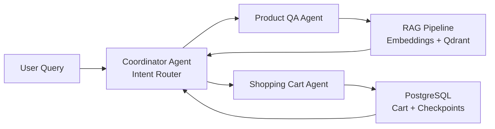
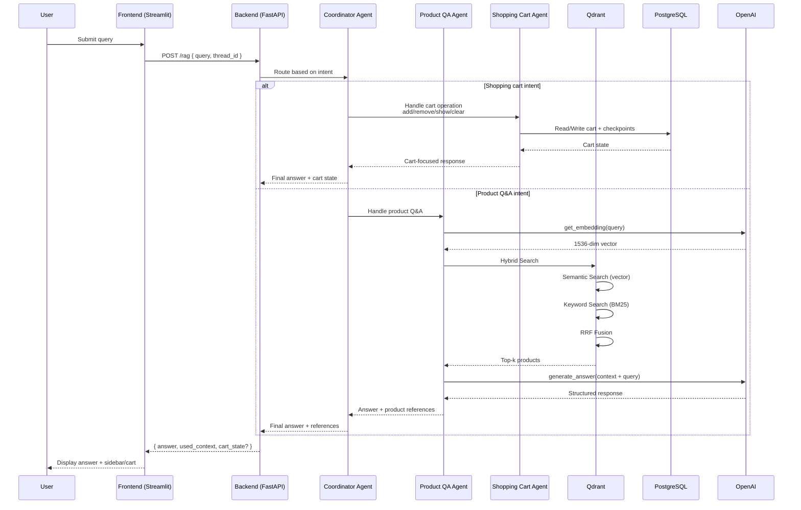

# Agentic Product Search

An intelligent multi-agent conversational system for product discovery and e-commerce assistance, built with advanced RAG (Retrieval-Augmented Generation) and LangGraph orchestration. The system features coordinator-based agent routing, hybrid search (semantic + keyword), structured outputs, and shopping cart management—all demonstrated on the Amazon Electronics dataset.

> **📍 Current Status**: **Phase 6 Complete** - Multi-agent system with shopping cart functionality, coordinator agent orchestration, and comprehensive testing infrastructure.
>
> **📊 Note**: This README contains Mermaid diagrams that render automatically on GitHub. If you're viewing this locally, use a Markdown viewer with Mermaid support (VS Code with Mermaid extension, GitHub web interface, or Obsidian).

## 🚀 Quick Start

```bash
# Clone the repository
git clone <repository-url>
cd agentic-product-search

# Set up environment variables
cp .env.example .env  # Add your API keys

# Install dependencies
uv sync

# Start all services
make run-docker-compose
```

Access the application:
- **Chat Interface**: http://localhost:8501
- **API Documentation**: http://localhost:8000/docs
- **Qdrant Dashboard**: http://localhost:6333/dashboard

## ✨ Key Features

### Core Capabilities
- **🔍 Hybrid Semantic + Keyword Search**: Combines vector similarity (OpenAI text-embedding-3-small) with BM25 keyword matching using Reciprocal Rank Fusion (RRF)
- **🤖 Multi-Agent System**: Coordinator agent orchestrates specialized agents (QA agent, shopping cart agent) for complex workflows
- **🛒 Shopping Cart Management**: Add, remove, and manage products in a persistent shopping cart
- **💬 Interactive Chat Interface**: Clean Streamlit UI with product suggestions sidebar showing images and prices
- **📊 Structured Outputs**: Type-safe LLM responses using Pydantic models via Instructor library
- **🔌 Production-Ready API**: FastAPI backend with streaming endpoints and automatic documentation
- **📈 LangSmith Observability**: End-to-end instrumentation with `@traceable` decorators for monitoring pipeline performance
- **✅ Comprehensive Testing**: Full test suite with pytest for API, RAG pipeline, and UI components

### Advanced Features
- **🎯 Coordinator Agent**: Intelligent routing between specialized agents based on user intent
- **🛍️ Shopping Cart Agent**: Dedicated agent for managing cart operations with PostgreSQL persistence
- **🔄 State Management**: PostgreSQL-based checkpointing for agent conversation state
- **📝 YAML-Based Prompt Management**: Version-controlled Jinja2 templates for systematic prompt engineering
- **🐳 Docker Hot Reload**: Volume-mounted development environment for instant code updates
- **🧪 Evaluation Framework**: RAGAS metrics (faithfulness, relevancy, context precision/recall) integrated with LangSmith

## 🏗️ Architecture

The system follows a microservices architecture with containerized components orchestrated through Docker Compose.

### System Overview



<details>
<summary><b>ASCII version (for local viewing without Mermaid support)</b></summary>

```
                    User
                     │
                     ▼
            ┌─────────────────┐
            │ Streamlit UI    │
            │  (Port 8501)    │
            └────────┬────────┘
                     │ HTTP/SSE
                     ▼
            ┌─────────────────┐
            │ FastAPI Backend │
            │  (Port 8000)    │
            └────────┬────────┘
                     │
         ┌───────────┼───────────┐
         │           │           │
         ▼           ▼           ▼
    ┌─────────┐ ┌─────────┐ ┌─────────┐
    │Multi-   │ │Qdrant   │ │PostgreSQL│
    │Agent    │ │Vector DB│ │  State   │
    │System   │ │         │ │          │
    └────┬────┘ └─────────┘ └─────────┘
         │
    ┌────┴────┐
    │         │
    ▼         ▼
┌────────┐ ┌──────────────┐
│Product │ │Shopping Cart │
│QA Agent│ │Agent         │
└────────┘ └──────────────┘
```

</details>

### Component Details

**Frontend (Streamlit)**
- Interactive chat interface with conversation history
- Product suggestions sidebar displaying images, descriptions, and prices
- Session state management for multi-turn conversations
- Real-time streaming responses from agent system

**Backend (FastAPI)**
- Multi-agent orchestration via LangGraph
- Coordinator agent for intelligent routing
- QA agent for product search and recommendations
- Shopping cart agent for cart management
- Streaming API endpoints with Server-Sent Events (SSE)
- Environment-based configuration with Pydantic Settings
- LangSmith instrumentation for all pipeline steps

**Vector Database (Qdrant)**
- Collection: `Amazon-items-collection-01-hybrid-search`
- Hybrid indexing: `text-embedding-3-small` (semantic) + `bm25` (keyword)
- RRF fusion for combining semantic and keyword results
- Persistent storage with Docker volume mounting (`./qdrant_storage`)

**State Management (PostgreSQL)**
- Conversation state persistence via LangGraph checkpointing
- Shopping cart data storage
- Thread-based conversation tracking
- Supports multi-user concurrent sessions

## 🛠️ Tech Stack

### Core Technologies
- **Python**: 3.12+
- **LLM**: OpenAI GPT-4.1-mini with Instructor for structured outputs
- **Embeddings**: OpenAI text-embedding-3-small (1536 dimensions)
- **Vector Database**: Qdrant (self-hosted via Docker) with hybrid search
- **State Management**: PostgreSQL 16 with LangGraph checkpointing
- **Backend Framework**: FastAPI with async support and streaming
- **Frontend**: Streamlit for rapid UI development
- **Agent Framework**: LangGraph for multi-agent orchestration

### Infrastructure & Tools
- **Orchestration**: Docker Compose for multi-container setup
- **Package Management**: UV for fast, reliable dependency resolution
- **Observability**: LangSmith for experiment tracking and evaluation
- **Evaluation**: RAGAS for retrieval and generation quality metrics
- **Testing**: Pytest with comprehensive test coverage
- **Data Processing**: Jupyter notebooks for EDA and pipeline development

## 📦 Installation

### Prerequisites

- Python 3.12+
- Docker and Docker Compose
- OpenAI API key (required)
- LangSmith API key (optional, for observability)
- Groq API key (optional)
- Google API key (optional)

### Setup Steps

**1. Clone the repository**
```bash
git clone <repository-url>
cd agentic-product-search
```

**2. Set up environment variables**

Create a `.env` file in the project root:

```env
# Required
OPENAI_API_KEY=sk-...

# Optional but recommended
LANGSMITH_API_KEY=...
LANGSMITH_PROJECT=agentic-product-search
GROQ_API_KEY=gsk_...
GOOGLE_API_KEY=...

# Database Configuration
POSTGRES_DB=langgraph_db
POSTGRES_USER=langgraph_user
POSTGRES_PASSWORD=langgraph_password
```

**3. Install dependencies**
```bash
uv sync
```

**4. Start all services**
```bash
make run-docker-compose
# or
docker compose up --build
```

## 🎯 Usage

### Chat Interface

1. Navigate to http://localhost:8501
2. Ask questions about electronics products:
   - "What wireless earbuds do you have with noise cancellation?"
   - "Show me gaming laptops under $1000"
   - "I need a tablet for drawing, what are my options?"
3. Manage your shopping cart:
   - "Add the Sony WH-1000XM5 to my cart"
   - "Show me what's in my cart"
   - "Remove the headphones from my cart"
4. View product suggestions in the sidebar with images and pricing

### API Integration

**Streaming RAG Endpoint**
```bash
curl -X POST http://localhost:8000/rag \
  -H "Content-Type: application/json" \
  -d '{
    "query": "What headphones are available?",
    "thread_id": "user-123"
  }'
```

**Submit Feedback**
```bash
curl -X POST http://localhost:8000/submit_feedback \
  -H "Content-Type: application/json" \
  -d '{
    "trace_id": "trace-123",
    "feedback_score": 5,
    "feedback_text": "Great recommendations!",
    "feedback_source_type": "user"
  }'
```

### API Documentation

Interactive API documentation available at:
- Swagger UI: http://localhost:8000/docs
- ReDoc: http://localhost:8000/redoc

## 🔄 Multi-Agent Workflow

The system uses a coordinator agent pattern to route requests between specialized agents. This high-level Mermaid diagram shows how responsibilities are split:



<details>
<summary><b>ASCII version (for local viewing without Mermaid support)</b></summary>

```
User Query
    │
    ▼
┌─────────────────┐
│ Coordinator     │
│ Agent           │
│ (Intent Router) │
└────────┬────────┘
         │
    ┌────┴────┐
    │         │
    ▼         ▼
┌────────┐ ┌──────────────┐
│Product │ │Shopping      │
│QA Agent│ │Cart Agent    │
└───┬────┘ └──────┬───────┘
    │             │
    ▼             ▼
┌──────────┐  ┌──────────┐
│RAG       │  │PostgreSQL│
│Pipeline  │  │Cart +    │
│          │  │Checkpoints│
└────┬─────┘  └────┬─────┘
     │             │
     └─────┬───────┘
           │
           ▼
    Coordinator Agent
    (returns final answer)
```

</details>

### Agent Responsibilities

**Coordinator Agent**
- Analyzes user intent
- Routes to appropriate specialist agent
- Manages conversation flow
- Handles multi-step workflows

**QA Agent**
- Product search and recommendations
- Answers product-related questions
- Uses RAG pipeline for context retrieval
- Provides detailed product information

**Shopping Cart Agent**
- Manages shopping cart operations
- Persists cart state in PostgreSQL
- Handles add/remove/clear operations
- Retrieves cart contents

## 📊 Data Pipeline

The RAG system processes Amazon Electronics product data through a comprehensive pipeline:

1. **Data Collection**: Amazon's public product datasets (Electronics category)
2. **Preprocessing**: Cleaning, filtering, and formatting (see `notebooks/phase_2/01-RAG-preprocessing-Amazon.ipynb`)
3. **Embedding Generation**: OpenAI text-embedding-3-small (1536 dimensions)
4. **Vector Storage**: Qdrant with hybrid indexing (semantic + BM25)
5. **Retrieval**: Hybrid search with RRF fusion
6. **Generation**: GPT-4.1-mini with structured outputs

### Pipeline Stages

1. **Data Collection**: 
   - Source: Amazon's public product datasets (Electronics category)
   - Format: JSONL files with product metadata and customer reviews
   - Components: Titles, descriptions, specifications, ratings, review text
   - Subset selection: Focused category for manageability (~thousands of products)

2. **Preprocessing** (`notebooks/phase_2/01-RAG-preprocessing-Amazon.ipynb`):
   - Data cleaning and validation
   - Filtering for quality and relevance
   - Text normalization and formatting
   - Review aggregation and summarization

3. **Embedding Generation**:
   - Model: OpenAI text-embedding-3-small
   - Dimensions: 1536
   - Input: Combined product metadata (title + description + key specs)
   - Output: Dense semantic vectors for similarity search

4. **Vector Storage**:
   - Database: Qdrant vector database
   - Collection: `Amazon-items-collection-01-hybrid-search`
   - Dual indexing strategy:
     - **Semantic index**: Vector embeddings for conceptual similarity
     - **BM25 index**: Keyword-based sparse vectors for exact matching
   - Persistent storage: Docker volume (`./qdrant_storage`)

5. **Retrieval** (Runtime):
   - Hybrid search strategy:
     - Prefetch 20 results via semantic vector search
     - Prefetch 20 results via BM25 keyword search  
     - Reciprocal Rank Fusion (RRF) to merge and rerank
     - Return top-k (default: 5) most relevant products

6. **Generation**:
   - LLM: GPT-4.1-mini via Instructor
   - Structured outputs: Pydantic models for type safety
   - Context injection: Retrieved products formatted into prompt
   - Response format: Natural language answer + product references
   - Enrichment: Add images, prices, and descriptions to final output

> **📊 Data Exploration**: See `notebooks/phase_1/02-explore-amazon-dataset.ipynb` for detailed exploratory data analysis

### System Flow: Multi-Agent Hybrid RAG

This Mermaid `sequenceDiagram` shows how a single user query flows through the **coordinator agent**, specialized agents, and the **hybrid RAG pipeline**:



## 🗂️ Project Structure

```
agentic-product-search/
├── src/
│   ├── api/                         # FastAPI backend
│   │   ├── api/
│   │   │   ├── endpoints.py         # REST endpoints
│   │   │   ├── models.py            # Pydantic models
│   │   │   └── processors/          # Request processors
│   │   ├── agent/                   # Multi-agent system
│   │   │   ├── agents.py            # Agent implementations
│   │   │   ├── graph.py             # LangGraph workflow
│   │   │   ├── tools.py             # Agent tools
│   │   │   ├── prompts/             # YAML prompt templates
│   │   │   └── utils/               # Agent utilities
│   │   ├── rag/                     # RAG pipeline
│   │   │   ├── retrieval_generation.py
│   │   │   └── prompts/
│   │   ├── core/
│   │   │   └── config.py            # Configuration
│   │   └── app.py                   # FastAPI application
│   ├── chatbot_ui/                  # Streamlit frontend
│   │   ├── app.py                   # Streamlit app
│   │   └── core/
│   │       └── config.py
│   ├── items_mcp_server/            # Items MCP server
│   └── reviews_mcp_server/         # Reviews MCP server
├── notebooks/
│   ├── phase_1/                     # LLM API exploration, dataset EDA
│   ├── phase_2/                     # RAG preprocessing, pipeline, evals
│   ├── phase_3/                     # Structured outputs, hybrid search
│   ├── phase_4/                     # Agentic RAG integration
│   ├── phase_5/                     # MCP integration
│   └── phase_6/                     # Shopping cart & coordinator agent
├── tests/                           # Test suite
│   ├── test_api.py
│   ├── test_rag_pipeline.py
│   ├── test_streamlit_ui.py
│   └── conftest.py
├── sql/                             # Database schemas
│   └── shopping_cart_table.sql
├── docker-compose.yaml              # Service orchestration
├── pyproject.toml                   # Project dependencies
├── Makefile                         # Development shortcuts
└── README.md                        # This file
```

## 🧪 Testing

Run the comprehensive test suite:

```bash
# Run all tests
make test

# Run with coverage
make test-cov

# Run specific test file
pytest tests/test_api.py -v
```

Test coverage includes:
- API endpoints and request/response handling
- RAG pipeline functionality
- Agent system workflows
- Streamlit UI components
- Configuration management
- Prompt management system

## 🛠️ Development

### Development Workflow

**Hot Reload**
- Docker Compose is configured with volume mounts for automatic code reloading
- Edit files in `src/api/` or `src/chatbot_ui/`
- Changes are reflected immediately without rebuilding containers

**Adding Dependencies**
```bash
# Add a new package
uv add package-name

# Rebuild containers to apply changes
docker compose up --build
```

**Code Quality**
```bash
# Format code
make format

# Lint and type check
make lint
```

**Notebook Management**
```bash
# Clean notebook outputs before committing
make clean-notebook-outputs
```

### Configuration

All services use Pydantic Settings for type-safe configuration:
- **API Config**: `src/api/core/config.py`
- **UI Config**: `src/chatbot_ui/core/config.py`

Configuration loads from `.env` file with validation at startup.

## 📈 Evaluation & Observability

### Instrumentation

The system includes comprehensive instrumentation:
- Request/response logging for all LLM calls
- Performance tracking for embedding generation
- Vector search latency monitoring
- End-to-end pipeline execution tracing
- Agent decision tracking
- Multi-agent workflow visualization

### Evaluation Metrics

RAGAS metrics tracked via evaluation framework:
- **Retrieval Quality**:
  - Context precision (relevant items in top-k)
  - Context recall (coverage of reference items)
- **Generation Quality**:
  - Faithfulness (answer grounded in retrieved context)
  - Response relevancy (answer addresses user query)

All metrics are logged to LangSmith for experiment tracking.

## 🗺️ Project Roadmap

### ✅ Completed Phases

- **Phase 0**: Problem framing & infrastructure setup ✅
- **Phase 1**: First working RAG prototype ✅
- **Phase 2**: Retrieval quality & context engineering ✅
- **Phase 3**: Agents & agentic systems ✅
- **Phase 4**: Agentic RAG with LangGraph integration ✅
- **Phase 5**: Multi-agent systems with MCP ✅
- **Phase 6**: Shopping cart & coordinator agent ✅

### 🚧 Future Enhancements

- [ ] CI/CD pipeline for automated testing and deployment
- [ ] Semantic caching for faster responses
- [ ] Rate limiting and API authentication
- [ ] Cloud deployment optimization
- [ ] Advanced monitoring dashboards
- [ ] Performance optimization and cost reduction

## 🐛 Troubleshooting

### Qdrant Connection Issues

```bash
# Verify Qdrant is running
docker compose ps

# Check Qdrant logs
docker compose logs qdrant

# Access dashboard
open http://localhost:6333/dashboard
```

### PostgreSQL Connection Issues

```bash
# Check PostgreSQL logs
docker compose logs postgres

# Verify database is accessible
docker compose exec postgres psql -U langgraph_user -d langgraph_db
```

### API Provider Errors

- Verify API keys in `.env` file
- Check model names match provider specifications
- Review API usage limits and quotas

### Container Issues

```bash
# Rebuild all containers
docker compose down
docker compose up --build

# View service logs
docker compose logs -f streamlit-app
docker compose logs -f api
```

## 📚 Documentation

- **[documentation/](documentation/)**: Comprehensive technical documentation
- **Notebooks**: Phase-by-phase implementation guides in `notebooks/`
- **API Docs**: Interactive documentation at http://localhost:8000/docs

## 🤝 Contributing

This is a personal portfolio/capstone project demonstrating AI engineering skills from basic RAG to advanced agentic systems. Feedback and suggestions are welcome—feel free to open issues or reach out with ideas.

## 📄 License

MIT License - feel free to use this project as a reference for your own AI engineering work.

