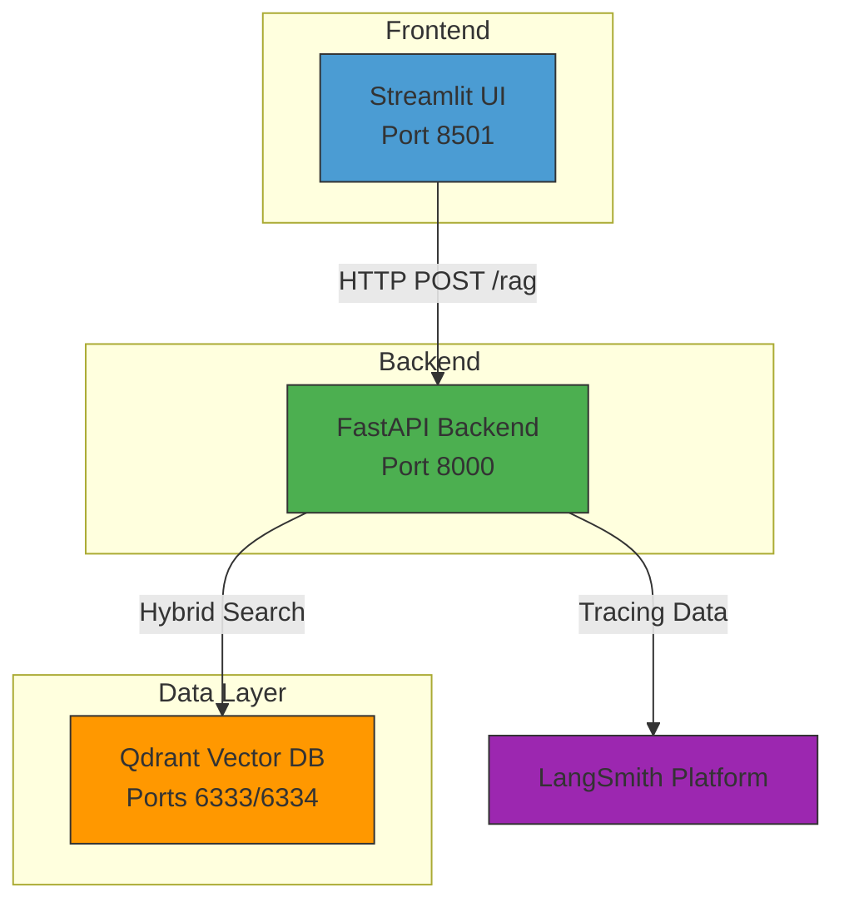
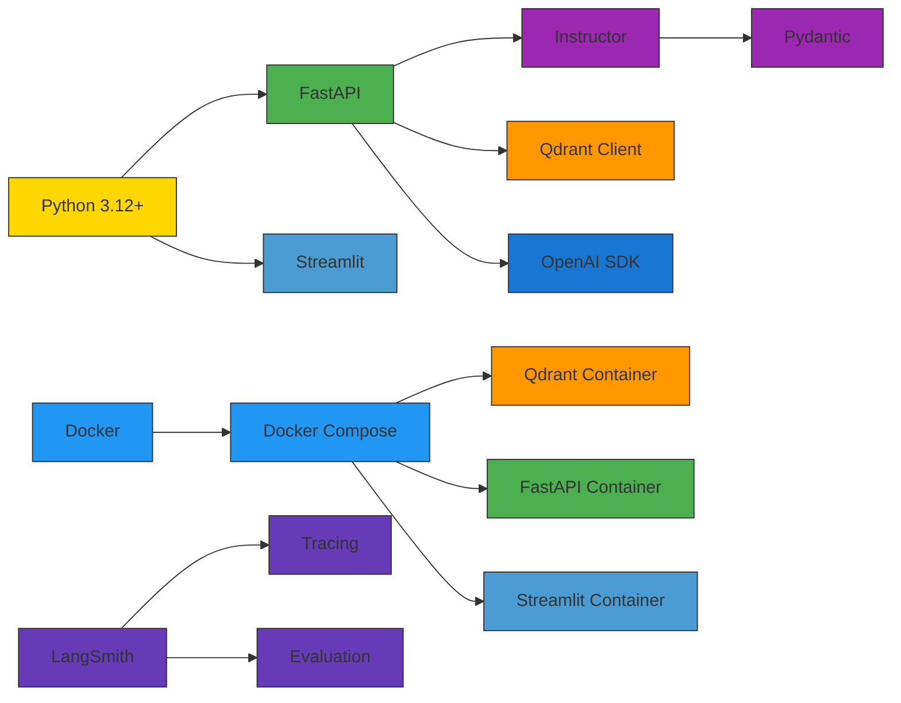
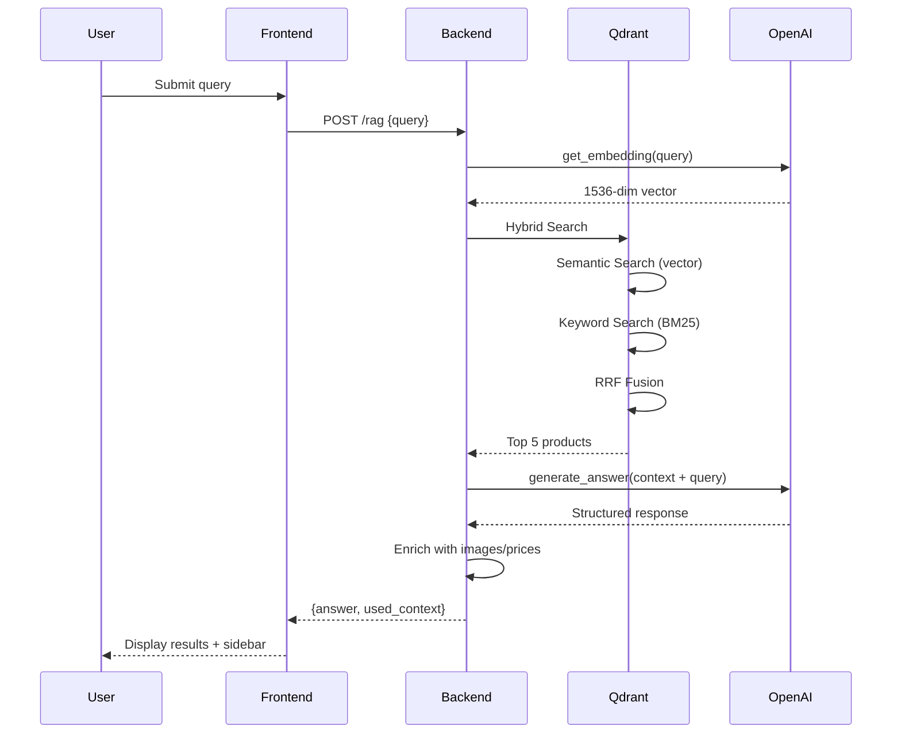

# AI-Powered Amazon Product Assistant

An intelligent conversational assistant that helps users discover and explore Amazon Electronics products through natural language queries. Built with advanced RAG (Retrieval-Augmented Generation) architecture, this system combines semantic search with large language models to provide accurate, context-aware product recommendations.

> **📍 Current Status**: **Phase 2 Complete (Oct 19, 2024)** - Production-ready RAG system with hybrid search, structured outputs, and comprehensive evaluation framework.
>
> **🎯 Current Phase**: **Phase 3 (Oct 20-26, 2024)** - Agents & Agentic Systems
>
> **🏁 Project Completion**: **November 23, 2024**

## Overview

This capstone project demonstrates the evolution of AI engineering from basic RAG systems to sophisticated agentic applications. Built as a production-ready learning journey, it transforms traditional e-commerce search into an interactive, AI-driven experience powered by Amazon's publicly available Electronics product dataset.

The assistant leverages vector embeddings and semantic search to understand user intent beyond keyword matching, providing personalized product recommendations with detailed explanations. Each development phase introduces new capabilities—from simple retrieval-augmented generation to advanced multi-step agentic workflows—showcasing end-to-end AI engineering skills in a real-world use case.

**Project Timeline**:
- **Phase 0** (Sep 29 - Oct 5): ✅ Problem framing & infrastructure setup
- **Phase 1** (Oct 6-12): ✅ First working RAG prototype
- **Phase 2** (Oct 13-19): ✅ **COMPLETE** - Retrieval quality & context engineering
- **Phase 3** (Oct 20-26): 🚧 **CURRENT** - Agents & agentic systems
- **Phase 4** (Oct 27 - Nov 2): 📋 Agentic RAG integration
- **Phase 5** (Nov 3-9): 📋 Multi-agent systems
- **Phase 6** (Nov 10-16): 📋 Deployment(CI/CD), optimization & reliability
- **Final Polish** (Nov 17-23): 🎯 Final integration & documentation

**🏁 Project Completion: November 23, 2024**

## Data Source

This project uses **Amazon's publicly available product dataset**, specifically focusing on the **Electronics category** for manageability and domain focus.

### Dataset Components

- **Product Metadata**: Product titles, descriptions, specifications, categories, brand information
- **Customer Reviews**: User reviews with ratings, review text, helpfulness votes, and review metadata
- **Rich Product Information**: Images, pricing (when available), technical specifications

### Dataset Characteristics

- **Source**: Open datasets compiled from Amazon's website for research and educational purposes
- **Dataset Link**: [Amazon Reviews 2023 - Electronics Category](https://amazon-reviews-2023.github.io/#grouped-by-category)
- **License**: Free for non-commercial use (academic projects, research)
- **Attribution**: Proper attribution required to original data compilers
- **Scope**: Focused subset of Electronics category (manageable size for RAG demonstration)
- **Format**: JSONL files with structured product and review data

### Data Usage in RAG Pipeline

1. **Collection**: Downloaded from public repositories
2. **Preprocessing**: Filtering, cleaning, and formatting (see `notebooks/phase_2/01-RAG-preprocessing-Amazon.ipynb`)
3. **Embedding**: Generated using OpenAI text-embedding-3-small (1536 dimensions)
4. **Storage**: Indexed in Qdrant collection `Amazon-items-collection-01-hybrid-search` with dual indexing:
   - Semantic search via vector embeddings
   - Keyword search via BM25 algorithm
5. **Retrieval**: Hybrid search combining both methods using Reciprocal Rank Fusion (RRF)

> **📊 Data Exploration**: See `notebooks/phase_1/02-explore-amazon-dataset.ipynb` for detailed exploratory data analysis

## Key Features
- **Hybrid Semantic + Keyword Search**: Combines vector similarity (OpenAI text-embedding-3-small) with BM25 keyword matching using Reciprocal Rank Fusion (RRF)
- **RAG Pipeline**: Retrieval-augmented generation combining Qdrant vector database with GPT-4.1-mini for contextually relevant responses
- **Structured Outputs**: Type-safe LLM responses using Pydantic models via Instructor library
- **Interactive Chat Interface**: Clean Streamlit UI with product suggestions sidebar showing images and prices
- **Production-Ready API**: FastAPI backend with RESTful `/rag` endpoint and automatic documentation
- **LangSmith Observability**: End-to-end instrumentation with `@traceable` decorators for monitoring pipeline performance
- **Evaluation Framework**: RAGAS metrics (faithfulness, relevancy, context precision/recall) integrated with LangSmith
- **YAML-Based Prompt Management**: Version-controlled Jinja2 templates for systematic prompt engineering
- **Docker Hot Reload**: Volume-mounted development environment for instant code updates

## Architecture (This architecture will be updated based on the progress in the project)

The system follows a microservices architecture with three containerized components orchestrated through Docker Compose.

> 📖 **Detailed Documentation**: For comprehensive system design, component interactions, data flows, and deployment architecture, see [ARCHITECTURE.md](documentation/ARCHITECTURE.md)
>
> ⚡ **Evolution Notice**: This architecture will evolve as the project progresses through phases 3-6, incorporating agentic systems, multi-agent patterns, and production deployment optimizations (target completion: November 23, 2024).

### System Overview


```mermaid
graph TB
    subgraph "Frontend"
        UI[Streamlit UI<br>Port 8501]
    end
    
    subgraph "Backend"
        API[FastAPI Backend<br>Port 8000]
    end
    
    subgraph "Data Layer"
        QDRANT[Qdrant Vector DB<br>Ports 6333/6334]
    end
    
    UI --> |HTTP POST /rag| API
    API --> |Hybrid Search| QDRANT
    API --> |Tracing Data| LANGSMITH[LangSmith Platform]
    
    style UI fill:#4B9CD3,stroke:#333
    style API fill:#4CAF50,stroke:#333
    style QDRANT fill:#FF9800,stroke:#333
    style LANGSMITH fill:#9C27B0,stroke:#333
```

### Component Dependencies


```mermaid
graph TD
    A[Streamlit UI] --> |HTTP| B[FastAPI Backend]
    B --> |gRPC| C[Qdrant Vector DB]
    B --> |API Calls| D[OpenAI Services]
    B --> |Tracing| E[LangSmith]
    C --> |Persistent Storage| F[qdrant_storage/]
    B --> |Configuration| G[.env file]
    A --> |Configuration| G
    
    style A fill:#4B9CD3,stroke:#34495E
    style B fill:#27AE60,stroke:#34495E
    style C fill:#9B59B6,stroke:#34495E
    style D fill:#E74C3C,stroke:#34495E
    style E fill:#F39C12,stroke:#34495E
    style F fill:#34495E,stroke:#34495E
    style G fill:#34495E,stroke:#34495E
```

### Technology Stack


```mermaid
graph LR
    A[Python 3.12+] --> B[FastAPI]
    A --> C[Streamlit]
    B --> D[Instructor]
    D --> E[Pydantic]
    B --> F[Qdrant Client]
    B --> G[OpenAI SDK]
    H[Docker] --> I[Docker Compose]
    I --> J[Qdrant Container]
    I --> K[FastAPI Container]
    I --> L[Streamlit Container]
    M[LangSmith] --> N[Tracing]
    M --> O[Evaluation]
    
    style A fill:#FFD700,stroke:#333
    style B fill:#4CAF50,stroke:#333
    style C fill:#4B9CD3,stroke:#333
    style D fill:#9C27B0,stroke:#333
    style E fill:#9C27B0,stroke:#333
    style F fill:#FF9800,stroke:#333
    style G fill:#1976D2,stroke:#333
    style H fill:#2196F3,stroke:#333
    style I fill:#2196F3,stroke:#333
    style J fill:#FF9800,stroke:#333
    style K fill:#4CAF50,stroke:#333
    style L fill:#4B9CD3,stroke:#333
    style M fill:#673AB7,stroke:#333
    style N fill:#673AB7,stroke:#333
    style O fill:#673AB7,stroke:#333
```

### Component Details
**Frontend (Streamlit)**
- Interactive chat interface with conversation history
- Product suggestions sidebar displaying images, descriptions, and prices
- Session state management for multi-turn conversations

**Backend (FastAPI)**
- RAG pipeline orchestration via `rag_pipeline_wrapper()` in `src/api/rag/retrieval_generation.py`
- Single `/rag` endpoint with automatic OpenAPI docs
- Environment-based configuration with Pydantic Settings
- LangSmith instrumentation for all pipeline steps

**Vector Database (Qdrant)**
- Collection: `Amazon-items-collection-01-hybrid-search`
- Hybrid indexing: `text-embedding-3-small` (semantic) + `bm25` (keyword)
- RRF fusion for combining semantic and keyword results
- Persistent storage with Docker volume mounting (`./qdrant_storage`)

## Tech Stack
- **LLM**: OpenAI GPT-4.1-mini with Instructor for structured outputs
- **Embeddings**: OpenAI text-embedding-3-small (1536 dimensions)
- **Vector Database**: Qdrant (self-hosted via Docker) with hybrid search
- **Backend Framework**: FastAPI with async support
- **Frontend**: Streamlit for rapid UI development
- **Orchestration**: Docker Compose for multi-container setup
- **Package Management**: UV for fast, reliable dependency resolution
- **Observability**: LangSmith for experiment tracking and evaluation
- **Evaluation**: RAGAS for retrieval and generation quality metrics
- **Data Processing**: Jupyter notebooks for EDA and pipeline development

## Getting Started

### Prerequisites

- Python 3.12+
- Docker and Docker Compose
- OpenAI API key (required)
- Groq API key (optional)
- Google API key (optional)

### Installation

**1. Clone the repository**

```bash
git clone <repository-url>
cd AI-Powered-Amazon-Product-Assistant
```

**2. Set up environment variables**

Create a `.env` file in the project root:

```env
OPENAI_API_KEY=sk-...
LANGSMITH_API_KEY=...       # Optional, for observability
GROQ_API_KEY=gsk_...        # Optional
GOOGLE_API_KEY=...          # Optional
```

**3. Install dependencies**

```bash
uv sync
```

**4. Start all services**

```bash
make run-docker-compose
# or
docker compose up --build
```

### Service Endpoints

Once running, access the following services:

- **Chat Interface**: http://localhost:8501
- **API Backend**: http://localhost:8000
- **API Documentation**: http://localhost:8000/docs
- **Qdrant Dashboard**: http://localhost:6333/dashboard

## Usage

### Chat Interface
1. Navigate to http://localhost:8501
2. Ask questions about electronics products, for example:
   - "What wireless earbuds do you have with noise cancellation?"
   - "Show me gaming laptops under $1000"
   - "I need a tablet for drawing, what are my options?"
3. View product suggestions in the sidebar with images and pricing

### API Integration
The FastAPI backend exposes a `/rag` endpoint for programmatic access:

```bash
curl -X POST http://localhost:8000/rag \
  -H "Content-Type: application/json" \
  -d '{
    "query": "What headphones are available?"
  }'
```

Response includes:
- `answer`: Natural language response
- `used_context`: Array of products with images, prices, and descriptions

## Data Pipeline

The RAG system processes Amazon Electronics product data through a comprehensive pipeline that transforms raw product metadata and customer reviews into a searchable knowledge base.

### Pipeline Stages

1. **Data Collection**: 
   - Source: Amazon's public product datasets (Electronics category)
   - Format: JSONL files with product metadata and customer reviews
   - Components: Titles, descriptions, specifications, ratings, review text
   - Subset selection: Focused category for manageability (~thousands of products)

2. **Preprocessing** (`notebooks/phase_2/01-RAG-preprocessing-Amazon.ipynb`):
   - Data cleaning and validation
   - Filtering for quality and relevance
   - Text normalization and formatting
   - Review aggregation and summarization

3. **Embedding Generation**:
   - Model: OpenAI text-embedding-3-small
   - Dimensions: 1536
   - Input: Combined product metadata (title + description + key specs)
   - Output: Dense semantic vectors for similarity search

4. **Vector Storage**:
   - Database: Qdrant vector database
   - Collection: `Amazon-items-collection-01-hybrid-search`
   - Dual indexing strategy:
     - **Semantic index**: Vector embeddings for conceptual similarity
     - **BM25 index**: Keyword-based sparse vectors for exact matching
   - Persistent storage: Docker volume (`./qdrant_storage`)

5. **Retrieval** (Runtime):
   - Hybrid search strategy:
     - Prefetch 20 results via semantic vector search
     - Prefetch 20 results via BM25 keyword search  
     - Reciprocal Rank Fusion (RRF) to merge and rerank
     - Return top-k (default: 5) most relevant products

6. **Generation**:
   - LLM: GPT-4.1-mini via Instructor
   - Structured outputs: Pydantic models for type safety
   - Context injection: Retrieved products formatted into prompt
   - Response format: Natural language answer + product references
   - Enrichment: Add images, prices, and descriptions to final output

> 📖 **Pipeline Details**: For in-depth technical documentation on the RAG pipeline, hybrid search implementation, and data flow diagrams, see [ARCHITECTURE.md](documentation/ARCHITECTURE.md#3-rag-pipeline-implementation)

### Hybrid Search Architecture


```mermaid
sequenceDiagram
    participant User
    participant Frontend
    participant Backend
    participant Qdrant
    participant OpenAI
    
    User->>Frontend: Submit query
    Frontend->>Backend: POST /rag {query}
    Backend->>OpenAI: get_embedding(query)
    OpenAI-->>Backend: 1536-dim vector
    Backend->>Qdrant: Hybrid Search
    Qdrant->>Qdrant: Semantic Search (vector)
    Qdrant->>Qdrant: Keyword Search (BM25)
    Qdrant->>Qdrant: RRF Fusion
    Qdrant-->>Backend: Top 5 products
    Backend->>OpenAI: generate_answer(context + query)
    OpenAI-->>Backend: Structured response
    Backend->>Backend: Enrich with images/prices
    Backend-->>Frontend: {answer, used_context}
    Frontend-->>User: Display results + sidebar
```

## RAG Pipeline Flow

Located in `src/api/rag/retrieval_generation.py`:

```
                    User Query: "What wireless earbuds have noise cancellation?"
                                        │
                                        ▼
┌───────────────────────────────────────────────────────────────────────────┐
│ Step 1: get_embedding()                                                    │
│ ➜ OpenAI text-embedding-3-small                                           │
│ ➜ Returns: 1536-dim vector                                                │
└────────────────────────────────┬──────────────────────────────────────────┘
                                 │
                                 ▼
┌───────────────────────────────────────────────────────────────────────────┐
│ Step 2: retrieve_data()                                                    │
│ ➜ Qdrant Hybrid Search:                                                   │
│   ├─ Prefetch 1: Semantic search (vector) → 20 results                    │
│   ├─ Prefetch 2: BM25 search (keywords) → 20 results                      │
│   └─ RRF Fusion → Top 5 products                                          │
│ ➜ Returns: IDs, descriptions, ratings, scores                             │
└────────────────────────────────┬──────────────────────────────────────────┘
                                 │
                                 ▼
┌───────────────────────────────────────────────────────────────────────────┐
│ Step 3: process_context()                                                  │
│ ➜ Format: "- ID: B123, rating: 4.5, description: Sony WH-1000XM5..."     │
│ ➜ Returns: Formatted context string                                       │
└────────────────────────────────┬──────────────────────────────────────────┘
                                 │
                                 ▼
┌───────────────────────────────────────────────────────────────────────────┐
│ Step 4: build_prompt()                                                     │
│ ➜ Load YAML template: src/api/rag/prompts/retrieval_generation.yaml      │
│ ➜ Jinja2 render with context + question                                   │
│ ➜ Returns: Structured prompt                                              │
└────────────────────────────────┬──────────────────────────────────────────┘
                                 │
                                 ▼
┌───────────────────────────────────────────────────────────────────────────┐
│ Step 5: generate_answer()                                                  │
│ ➜ GPT-4.1-mini via Instructor                                             │
│ ➜ Response model: RAGGenerationResponseWithReferences (Pydantic)          │
│ ➜ Returns: {answer: str, references: [RAGUsedContext]}                    │
└────────────────────────────────┬──────────────────────────────────────────┘
                                 │
                                 ▼
┌───────────────────────────────────────────────────────────────────────────┐
│ Step 6: rag_pipeline_wrapper()                                             │
│ ➜ Fetch images & prices for referenced products                           │
│ ➜ Returns: {answer, used_context: [{image_url, price, description}]}     │
└────────────────────────────────┬──────────────────────────────────────────┘
                                 │
                                 ▼
                  Response to Streamlit UI with product suggestions
```

**Observability**: All steps decorated with `@traceable` → LangSmith tracking with token usage, latency, and I/O.

## Development

### Project Structure
```
AI-Powered-Amazon-Product-Assistant/
├── src/
│   ├── api/                         # FastAPI backend
│   │   ├── api/
│   │   │   ├── endpoints.py         # REST endpoints (/rag)
│   │   │   ├── models.py            # Pydantic request/response models
│   │   │   └── middleware.py        # Request ID middleware
│   │   ├── rag/
│   │   │   ├── retrieval_generation.py  # Core RAG pipeline
│   │   │   ├── prompts/             # YAML prompt templates
│   │   │   └── utils/
│   │   │       └── prompt_management.py  # Jinja2 template loader
│   │   ├── core/
│   │   │   └── config.py            # Configuration management
│   │   └── app.py                   # FastAPI application
│   └── chatbot_ui/                  # Streamlit frontend
│       ├── core/
│       │   └── config.py            # UI configuration
│       └── app.py                   # Streamlit app
├── notebooks/
│   ├── phase_1/                     # LLM API exploration, dataset EDA
│   ├── phase_2/                     # RAG preprocessing, pipeline, evals
│   └── phase_3/                     # Structured outputs, hybrid search, reranking
├── evals/
│   └── eval_retriever.py            # RAGAS evaluation script
├── documentation/
│   └── ARCHITECTURE.md              # Detailed system architecture documentation
├── data/                            # Amazon product datasets (JSONL)
├── qdrant_storage/                  # Persistent vector DB storage
├── docker-compose.yml               # Service orchestration
├── pyproject.toml                   # Project dependencies
└── Makefile                         # Development shortcuts
```

### Development Workflow

**Working with Notebooks**

Notebooks are organized by development phase for exploratory analysis and prototyping:

```bash
# Clean notebook outputs before committing
make clean-notebook-outputs

# Run RAGAS evaluations on LangSmith dataset
make run-evals-retriever
```

**Hot Reload**

Docker Compose is configured with volume mounts for automatic code reloading:

- Edit files in `src/api/` or `src/chatbot_ui/`
- Changes are reflected immediately without rebuilding containers

**Adding Dependencies**

```bash
# Add a new package
uv add package-name

# Rebuild containers to apply changes
docker compose up --build
```

### Configuration

All services use Pydantic Settings for type-safe configuration:

- **API Config**: `src/api/core/config.py`
- **UI Config**: `src/chatbot_ui/core/config.py`

Configuration loads from `.env` file with validation at startup.

## Evaluation & Observability
### Instrumentation

The RAG pipeline includes comprehensive instrumentation:

- Request/response logging for all LLM calls
- Performance tracking for embedding generation
- Vector search latency monitoring
- End-to-end pipeline execution tracing

### Evaluation Metrics

Run evaluations with:
```bash
make run-evals-retriever
```

RAGAS metrics tracked via `evals/eval_retriever.py`:

- **Retrieval Quality**:
  - ID-based context precision (relevant items in top-k)
  - ID-based context recall (coverage of reference items)
- **Generation Quality**:
  - Faithfulness (answer grounded in retrieved context)
  - Response relevancy (answer addresses user query)

All metrics are logged to LangSmith dataset `rag-evaluation-dataset` for experiment tracking.

## Project Roadmap

> **🎯 Project Completion Target: November 23, 2024**

### Phase 0: Problem Framing & Infrastructure Setup ✅ (Sep 29 - Oct 5, 2024)
- [x] Understanding the AI product lifecycle
- [x] Defining real-world use case (Amazon product search)
- [x] Success metrics & evaluation frameworks
- [x] Dev environment setup (Docker, UV, Python 3.12+)
- [x] Tooling overview (LangGraph, Qdrant, LLM APIs)
- [x] GitHub project scaffolding

### Phase 1: Build First Working RAG Prototype ✅ (Oct 6-12, 2024)
- [x] RAG architecture and data ingestion pipeline
- [x] Qdrant vector database setup
- [x] Semantic search with OpenAI embeddings (text-embedding-3-small)
- [x] Basic RAG pipeline (retrieve → generate)
- [x] Streamlit chat interface
- [x] FastAPI backend with REST endpoints
- [x] LangSmith observability foundations
- [x] RAGAS evaluation framework and dataset creation

### Phase 2: Retrieval Quality & Context Engineering ✅ (Oct 13-19, 2024)
- [x] Pydantic structured outputs via Instructor
- [x] Hybrid search: Semantic (vector) + Keyword (BM25) with RRF fusion
- [x] Re-ranking for improved relevance
- [x] Chunking strategies and contextual embeddings
- [x] YAML-based prompt management with Jinja2
- [x] Product suggestions sidebar with images and pricing
- [x] Comprehensive evaluation metrics (faithfulness, relevancy, precision, recall)
- [x] Docker Compose orchestration with hot reload

### Phase 3: Agents & Agentic Systems 🚧 (Oct 20-26, 2024 - CURRENT)
- [ ] Agent architecture and decision loops
- [ ] Tool use in agents (function calling)
- [ ] Memory in agent systems
- [ ] Reflection & agent evaluation frameworks
- [ ] LangGraph workflow implementation

### Phase 4: Agentic RAG Integration 📋 (Oct 27 - Nov 2, 2024)
- [ ] Agent integrations with RAG systems
- [ ] Patterns for building agentic systems
- [ ] Human feedback and fault tolerance
- [ ] Human-in-the-loop (HITL) workflows
- [ ] Model Context Protocol (MCP)
- [ ] Tool-using agent integrated with RAG backend

### Phase 5: Multi-Agent Systems 📋 (Nov 3-9, 2024)
- [ ] Multi-agent system design patterns
- [ ] Planning, delegation, and task routing among agents
- [ ] Synchronization and memory sharing
- [ ] Agent-to-agent communication protocols (A2A)
- [ ] Debugging and evaluating multi-agent workflows
- [ ] Specialist agents (search, filter, recommend)

### Phase 6: Deployment, Optimization & Reliability 📋 (Nov 10-16, 2024)
- [ ] Deployment architecture patterns for AI systems
- [ ] Managing latency and cost optimization
- [ ] Semantic caching for faster responses
- [ ] Securing AI systems (rate limiting, API authentication)
- [ ] CI/CD for AI applications
- [ ] Containerization and cloud deployment
- [ ] Monitoring dashboards and alerting
- [ ] Performance optimization

### Final Week: Project Polish 🎯 (Nov 17-23, 2024)
- [ ] Final integration and testing
- [ ] Comprehensive documentation
- [ ] Performance tuning and optimization
- [ ] Demo and showcase preparation

## Troubleshooting

### Qdrant Connection Issues

If notebooks or services can't connect to Qdrant:

```bash
# Verify Qdrant is running
docker compose ps

# Check Qdrant logs
docker compose logs qdrant

# Access dashboard to verify data
open http://localhost:6333/dashboard

# Verify collection exists
# Collection name: Amazon-items-collection-01-hybrid-search
```

### API Provider Errors

If LLM calls fail:

- Verify API keys in `.env` file
- Check model names match provider specifications
- Review API usage limits and quotas

### Container Issues

```bash
# Rebuild all containers
docker compose down
docker compose up --build

# View service logs
docker compose logs -f streamlit-app
docker compose logs -f api
```

## Contributing

This is a personal portfolio/capstone project demonstrating AI engineering skills from basic RAG to advanced agentic systems. Feedback and suggestions are welcome—feel free to open issues or reach out with ideas.

## Documentation

- **[ARCHITECTURE.md](documentation/ARCHITECTURE.md)**: Comprehensive technical documentation covering:
  - System architecture and component interactions
  - RAG pipeline implementation details
  - Data flow diagrams
  - External dependencies (OpenAI, LangSmith, Qdrant)
  - Security architecture and threat model
  - Observability and monitoring setup
  - Evaluation framework and testing approach
  - Development workflow and debugging techniques
  - Production deployment considerations

## License

MIT License - feel free to use this project as a reference for your own AI engineering work.

