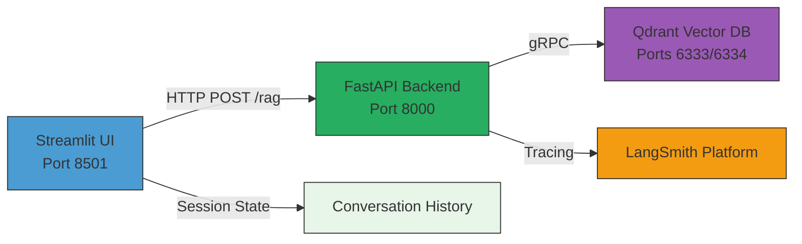

# System Architecture Design Document

## Executive Summary

AI-Powered Amazon Product Assistant is a production-ready RAG (Retrieval-Augmented Generation) system that enables semantic product search over Amazon Electronics dataset. The system leverages hybrid search (semantic + keyword), structured outputs via Pydantic/Instructor, and comprehensive observability through LangSmith.

**Key Capabilities:**
- Hybrid semantic + keyword search with Reciprocal Rank Fusion (RRF)
- Type-safe structured outputs enforced via Instructor/Pydantic
- Distributed tracing and observability (LangSmith)
- Containerized microservices architecture with hot-reload for development
- Production-grade evaluation pipeline using RAGAS metrics

---

## 1. System Overview

### 1.1 Architecture Pattern

Three-service microarchitecture deployed via Docker Compose:



**Component Responsibilities:**
- **Streamlit UI**: Chat interface, product sidebar, session management
- **FastAPI Backend**: RAG pipeline orchestration, observability, API endpoints
- **Qdrant Vector DB**: Hybrid search (semantic + BM25), persistent storage

### 1.2 Technology Stack

| Component | Technology | Version/Details |
|-----------|-----------|-----------------|
| **UI Framework** | Streamlit | Interactive chat interface |
| **API Framework** | FastAPI | Async, auto-docs, Pydantic validation |
| **Vector Database** | Qdrant | Hybrid search, persistent storage |
| **LLM Provider** | OpenAI | GPT-4.1-mini, text-embedding-3-small |
| **Structured Outputs** | Instructor | Pydantic schema enforcement |
| **Observability** | LangSmith | Distributed tracing, evaluation |
| **Orchestration** | Docker Compose | Multi-container development/deployment |
| **Package Manager** | uv | Fast dependency resolution |
| **Testing** | pytest + RAGAS | Unit tests + RAG evaluation |

---

## 2. Core Components

### 2.1 FastAPI Backend Service

**Location:** `src/api/`  
**Port:** 8000  
**Entry Point:** `src/api/app.py`

#### 2.1.1 Application Structure

```
src/api/
├── app.py                  # FastAPI app initialization, middleware, CORS
├── core/
│   └── config.py          # Pydantic Settings (env vars)
├── api/
│   ├── endpoints.py       # POST /rag endpoint
│   ├── models.py          # Request/Response Pydantic models
│   └── middleware.py      # RequestIDMiddleware (UUID per request)
└── rag/
    ├── retrieval_generation.py  # RAG pipeline implementation
    ├── prompts/
    │   └── retrieval_generation.yaml  # Versioned prompt templates
    └── utils/
        └── prompt_management.py  # Jinja2 template loading
```

#### 2.1.2 API Specification

**Endpoint:** `POST /rag`

**Request Schema (src/api/api/models.py:5-6):**
```python
class RAGRequest(BaseModel):
    query: str  # User question
```

**Response Schema (src/api/api/models.py:14-17):**
```python
class RAGResponse(BaseModel):
    request_id: str                      # Unique UUID for tracing
    answer: str                          # Generated answer
    used_context: List[RAGUsedContext]   # Products used (image, price, description)
```

**Error Handling:**
- `400 Bad Request`: Empty query
- `500 Internal Server Error`: Pipeline failures (retrieval, generation, Qdrant connection)
- All responses include `X-Request-ID` header via middleware (src/api/api/middleware.py:22)

#### 2.1.3 Middleware Stack

1. **RequestIDMiddleware** (src/api/api/middleware.py:10-25)
   - Generates UUID per request
   - Injects `request.state.request_id`
   - Adds `X-Request-ID` response header
   - Logs request lifecycle

2. **CORSMiddleware** (src/api/app.py:21-27)
   - Allows all origins (`*`)
   - Enables credentials, all methods/headers
   - Required for Streamlit ↔ API communication

### 2.2 Streamlit UI Service

**Location:** `src/chatbot_ui/`  
**Port:** 8501  
**Entry Point:** `src/chatbot_ui/app.py`

#### 2.2.1 UI Architecture

**Layout:**
- **Main Chat Area:** Conversation history with user/assistant messages
- **Sidebar:** Product suggestions with images, prices, descriptions

**Session State Management (src/chatbot_ui/app.py:51-55):**
```python
st.session_state.messages = [...]       # Conversation history
st.session_state.used_context = [...]   # Current product suggestions
```

#### 2.2.2 API Integration

**Configuration (src/chatbot_ui/core/config.py:8):**
```python
API_URL: str = "http://api:8000"  # Docker internal hostname
```

**Request Flow (src/chatbot_ui/app.py:84-92):**
1. User submits query via `st.chat_input()`
2. HTTP POST to `{API_URL}/rag` with `{"query": prompt}`
3. Display `answer` in chat
4. Update sidebar with `used_context` (images, prices)
5. Store conversation in `st.session_state.messages`

**Error Handling (src/chatbot_ui/app.py:18-48):**
- Connection errors, timeouts, malformed responses → popup notifications
- Invalid JSON → fallback error message

### 2.3 Qdrant Vector Database

**Image:** `qdrant/qdrant:latest`  
**Ports:**
- 6333: HTTP API / Dashboard
- 6334: gRPC (used by backend)

**Storage:** `./qdrant_storage` volume mount (persistent)

#### 2.3.1 Collection Schema

**Name:** `Amazon-items-collection-01-hybrid-search`

**Vector Indexes:**
1. **Semantic:** `text-embedding-3-small` (1536 dimensions)
2. **Keyword:** `bm25` (sparse vector index)

**Payload Fields:**
- `parent_asin`: Product ID (string)
- `description`: Product description (string)
- `average_rating`: Rating 0-5 (float)
- `image`: Product image URL (string)
- `price`: Price in USD (float)

#### 2.3.2 Connection Configuration

| Context | Qdrant URL | Notes |
|---------|-----------|-------|
| Docker services (API) | `http://qdrant:6333` | Internal hostname |
| Local notebooks/scripts | `http://localhost:6333` | Port mapping |
| Dashboard | `http://localhost:6333/dashboard` | Web UI |

---

## 3. RAG Pipeline Implementation

### 3.1 Pipeline Architecture

**Location:** `src/api/rag/retrieval_generation.py`  
**Entry Function:** `rag_pipeline_wrapper()` (line 332)

**Pipeline Flow:**

```mermaid
flowchart TD
    A[User Query] --> B[1. EMBEDDING<br/>get_embedding]
    B --> C[Query → OpenAI<br/>text-embedding-3-small<br/>→ 1536-dim vector]
    C --> D[2. RETRIEVAL<br/>retrieve_data]
    
    D --> E[Hybrid Search]
    E --> F[Semantic: vector → top 20]
    E --> G[BM25: query text → top 20]
    F --> H[RRF Fusion]
    G --> H
    H --> I[top-k results]
    
    I --> J[3. CONTEXT FORMATTING<br/>process_context]
    J --> K[Format as text:<br/>ID, rating, description]
    
    K --> L[4. PROMPT BUILDING<br/>build_prompt]
    L --> M[Jinja2 template from YAML<br/>+ context + question]
    
    M --> N[5. GENERATION<br/>generate_answer]
    N --> O[GPT-4.1-mini + Instructor<br/>→ Pydantic model]
    
    O --> P[6. CONTEXT ENRICHMENT<br/>rag_pipeline_wrapper]
    P --> Q[Fetch image URLs + prices<br/>from Qdrant for UI]
    
    Q --> R[Response<br/>{answer, used_context}]
    
    style B fill:#FFE6CC,stroke:#333
    style D fill:#D5E8D4,stroke:#333
    style J fill:#DAE8FC,stroke:#333
    style L fill:#F8CECC,stroke:#333
    style N fill:#E1D5E7,stroke:#333
    style P fill:#FFF4E6,stroke:#333
    
    classDef traceable fill:#FFF,stroke:#F90,stroke-width:2px,stroke-dasharray: 5 5
    class B,D,J,L,N traceable
```

**Observability:** All numbered steps are decorated with `@traceable` for LangSmith monitoring.

### 3.2 Step-by-Step Breakdown

#### Step 1: Embedding (src/api/rag/retrieval_generation.py:35-72)

```python
@traceable(run_type="embedding", metadata={
    "ls_provider": "openai",
    "ls_model_name": "text-embedding-3-small"
})
def get_embedding(text: str) -> Optional[List[float]]:
    response = openai.embeddings.create(
        input=text,
        model="text-embedding-3-small"
    )
    # Log token usage to LangSmith
    current_run.metadata["usage_metadata"] = {
        "input_tokens": response.usage.prompt_tokens,
        "total_tokens": response.usage.total_tokens
    }
    return response.data[0].embedding  # 1536-dim vector
```

**Error Handling:**
- `openai.APIError`: API failures
- `openai.RateLimitError`: Rate limit exceeded
- Returns `None` on failure (propagates to caller)

#### Step 2: Retrieval (src/api/rag/retrieval_generation.py:79-154)

**Hybrid Search with RRF Fusion (src/api/rag/retrieval_generation.py:99-118):**

```python
results = qdrant_client.query_points(
    collection_name="Amazon-items-collection-01-hybrid-search",
    prefetch=[
        Prefetch(
            query=query_embedding,        # Vector from step 1
            using="text-embedding-3-small",
            limit=20                       # Top-20 semantic results
        ),
        Prefetch(
            query=Document(text=query, model="qdrant/bm25"),
            using="bm25",
            limit=20                       # Top-20 BM25 results
        )
    ],
    query=FusionQuery(fusion="rrf"),      # Reciprocal Rank Fusion
    limit=k                                # Final top-k (default: 5)
)
```

**Reciprocal Rank Fusion (RRF):**
- Combines rankings from semantic and BM25 results
- Formula: `RRF_score(item) = Σ 1/(k + rank_i)` across all retrieval methods
- Reduces bias toward single retrieval strategy
- Returns unified top-k results

**Return Structure:**
```python
{
    "retrieved_context_ids": ["B001...", "B002...", ...],
    "retrieved_context": ["Product description 1", ...],
    "retrieved_context_ratings": [4.5, 4.2, ...],
    "similarity_scores": [0.89, 0.85, ...]
}
```

#### Step 3: Context Formatting (src/api/rag/retrieval_generation.py:161-193)

Converts structured retrieval results into plain text for LLM prompt:

```
- ID: B001ABC123, rating: 4.5, description: Wireless headphones with noise cancellation...
- ID: B002DEF456, rating: 4.2, description: Bluetooth speaker with 360-degree sound...
```

#### Step 4: Prompt Building (src/api/rag/retrieval_generation.py:200-226)

**Template Loading (src/api/rag/utils/prompt_management.py:12-53):**

```python
template = prompt_template_config(
    "src/api/rag/prompts/retrieval_generation.yaml",
    "retrieval_generation"
)
rendered_prompt = template.render(
    preprocessed_context=context,
    question=question
)
```

**Prompt Template (src/api/rag/prompts/retrieval_generation.yaml:9-31):**

```yaml
prompts:
  retrieval_generation: |
    You are a shopping assistant that can answer questions about the products in stock.
    
    Instructions:
    - Answer the question based on the provided context only.
    - Never use word "context" and refer to it as the available products.
    - Provide:
      * The answer to the question based on the provided context.
      * The list of the IDs of the chunks that were used to answer the question.
      * Short description (1-2 sentences) of the item based on the description.
    
    Context:
    {{ preprocessed_context }}
    
    Question:
    {{ question }}
```

**Benefits of YAML-based Prompts:**
- Version control and diff tracking
- A/B testing by swapping template files
- Separation of code and prompts
- Multi-prompt management (single YAML file)

#### Step 5: Generation (src/api/rag/retrieval_generation.py:234-274)

**Structured Output with Instructor (src/api/rag/retrieval_generation.py:245-252):**

```python
client = instructor.from_openai(openai.OpenAI())

response, raw_response = client.chat.completions.create_with_completion(
    model="gpt-4.1-mini",
    messages=[{"role": "system", "content": prompt}],
    temperature=0.5,
    response_model=RAGGenerationResponseWithReferences  # Pydantic schema
)
```

**Output Schema (src/api/rag/retrieval_generation.py:21-27):**

```python
class RAGUsedContext(BaseModel):
    id: str = Field(description="ID of the item used to answer the question.")
    description: str = Field(description="Short description of the item.")

class RAGGenerationResponseWithReferences(BaseModel):
    answer: str = Field(description="Answer to the question.")
    references: list[RAGUsedContext] = Field(description="List of items used.")
```

**How Instructor Works:**
1. Wraps OpenAI client with `instructor.from_openai()`
2. Accepts `response_model` parameter (Pydantic schema)
3. Converts schema to OpenAI Function Calling JSON schema
4. Forces LLM to return structured JSON matching schema
5. Validates and parses response into Pydantic model
6. Raises `ValidationError` if response doesn't match schema

**Benefits:**
- Type safety: Guaranteed `RAGGenerationResponseWithReferences` object
- No manual JSON parsing or error handling
- IDE autocomplete for response fields
- Validation at API boundary (fails fast on bad LLM outputs)

**Token Usage Tracking (src/api/rag/retrieval_generation.py:254-261):**
```python
current_run.metadata["usage_metadata"] = {
    "input_tokens": raw_response.usage.prompt_tokens,
    "output_tokens": raw_response.usage.completion_tokens,
    "total_tokens": raw_response.usage.total_tokens
}
```
Logged to LangSmith for cost tracking and performance analysis.

#### Step 6: Context Enrichment (src/api/rag/retrieval_generation.py:332-401)

**Purpose:** Fetch product images and prices for UI display

**Implementation (src/api/rag/retrieval_generation.py:352-387):**

```python
used_context = []
dummy_vector = np.zeros(1536).tolist()  # Placeholder for filtered query

for item in result.get("references", []):
    query_result = qdrant_client.query_points(
        collection_name="Amazon-items-collection-01-hybrid-search",
        query=dummy_vector,
        using="text-embedding-3-small",
        limit=1,
        with_payload=True,
        query_filter=Filter(
            must=[FieldCondition(key="parent_asin", match=MatchValue(value=item.id))]
        )
    )
    
    if query_result.points:
        payload = query_result.points[0].payload
        used_context.append({
            "image_url": payload.get("image"),
            "price": payload.get("price"),
            "description": item.description
        })
```

**Why Dummy Vector?**
- Qdrant requires a query vector for `query_points()`
- We're filtering by `parent_asin`, so vector doesn't matter
- Zero vector minimizes computation
- Alternative: Use `retrieve()` method (simpler, but less flexible)

**Final Response:**
```python
{
    "answer": "Based on the available products, I recommend...",
    "used_context": [
        {
            "image_url": "https://...",
            "price": 29.99,
            "description": "Wireless headphones with noise cancellation"
        },
        ...
    ]
}
```

---

## 4. External Dependencies

### 4.1 OpenAI API

**Usage Points:**
1. **Embeddings:** `text-embedding-3-small` (1536 dimensions)
   - Location: `src/api/rag/retrieval_generation.py:48`
   - Cost: $0.00002 per 1K tokens
   - Latency: ~50-100ms per query

2. **Chat Completion:** `gpt-4.1-mini`
   - Location: `src/api/rag/retrieval_generation.py:248`
   - Cost: $0.150/1M input tokens, $0.600/1M output tokens
   - Latency: ~500-2000ms per generation

**Configuration (src/api/core/config.py:4):**
```python
OPENAI_API_KEY: str  # Loaded from .env
```

**Error Handling:**
- `openai.APIError`: Service degradation
- `openai.RateLimitError`: Quota exceeded
- Retries: None (fail fast, return 500 to client)

### 4.2 LangSmith (Observability)

**Integration:** `@traceable` decorators on all pipeline steps

**Trace Hierarchy:**
```
rag_pipeline (root)
├── embed_query (embedding)
├── retrieve_data (retriever)
│   └── embed_query (embedding)  # Nested call
├── format_retrieved_context (prompt)
├── build_prompt (prompt)
└── generate_answer (llm)
```

**Metadata Captured:**
- Provider: `"openai"`
- Model names: `"text-embedding-3-small"`, `"gpt-4.1-mini"`
- Token usage: `input_tokens`, `output_tokens`, `total_tokens`
- Run type: `"embedding"`, `"retriever"`, `"prompt"`, `"llm"`

**Configuration:**
```bash
export LANGCHAIN_TRACING_V2=true
export LANGCHAIN_API_KEY=lsv2_...
export LANGCHAIN_PROJECT=amazon-product-assistant
```

**Use Cases:**
- Debug slow queries (latency breakdown)
- Track token costs per request
- Identify retrieval failures (no results)
- Compare prompt versions (A/B testing)

### 4.3 Qdrant Dependencies

**Python Client:** `qdrant-client==1.9.1`

**Network:**
- Development: `localhost:6333` (HTTP), `localhost:6334` (gRPC)
- Production (Docker): `qdrant:6333` (HTTP), `qdrant:6334` (gRPC)

**Data Dependencies:**
- Collection `Amazon-items-collection-01-hybrid-search` must exist
- Indexes: `text-embedding-3-small`, `bm25`
- Payload schema: `parent_asin`, `description`, `average_rating`, `image`, `price`

**Failure Modes:**
- `UnexpectedResponse`: Connection error (container down, network issue)
- Empty results: Valid query but no matches (not an error)
- Collection not found: Missing data ingestion step

---

## 5. Data Flow Diagrams

### 5.1 End-to-End Request Flow

```
┌──────────┐  1. User Query      ┌────────────┐  2. POST /rag         ┌─────────┐
│          │ "Find headphones"   │            │  {query: "..."}       │         │
│ Streamlit├────────────────────▶│  FastAPI   ├──────────────────────▶│  Qdrant │
│    UI    │                     │   Backend  │◀──────────────────────┤  Vector │
│          │◀────────────────────┤            │  3. Hybrid Search     │   DB    │
└──────────┘  6. Display Answer  └─────┬──────┘     Results          └─────────┘
                + Products              │
                                        │ 4. Call OpenAI API
                                        ▼
                                   ┌─────────┐
                                   │ OpenAI  │
                                   │   API   │
                                   └─────┬───┘
                                         │ 5. Structured Response
                                         ▼
                                   (Instructor + Pydantic)
```

**Step-by-Step:**
1. User types query in Streamlit chat input
2. Streamlit sends `POST http://api:8000/rag` with `{"query": "Find headphones"}`
3. FastAPI calls `rag_pipeline_wrapper()`:
   - Embeds query via OpenAI
   - Retrieves top-k products from Qdrant (hybrid search)
   - Formats context
   - Builds prompt from YAML template
   - Generates answer via OpenAI + Instructor
   - Enriches response with images/prices
4. Returns `{"request_id": "...", "answer": "...", "used_context": [...]}`
5. Streamlit displays answer in chat
6. Streamlit updates sidebar with product images/prices

### 5.2 Hybrid Search Data Flow

```
User Query: "wireless headphones"
        │
        ├─────────────────┬─────────────────┐
        ▼                 ▼                 ▼
 ┌──────────────┐  ┌──────────────┐  ┌──────────────┐
 │  OpenAI API  │  │              │  │              │
 │  Embedding   │  │              │  │              │
 └──────┬───────┘  │              │  │              │
        │          │              │  │              │
        ▼          ▼              ▼  ▼              │
 ┌────────────────────────────────────────────────┐ │
 │            Qdrant Query Engine                 │ │
 │  ┌──────────────────┐  ┌──────────────────┐   │ │
 │  │ Semantic Search  │  │  BM25 Search     │   │ │
 │  │ (Vector Index)   │  │  (Sparse Index)  │   │ │
 │  │                  │  │                  │   │ │
 │  │ Top 20 by        │  │ Top 20 by        │   │ │
 │  │ cosine similarity│  │ keyword match    │   │ │
 │  └────────┬─────────┘  └────────┬─────────┘   │ │
 │           │                     │             │ │
 │           └──────────┬──────────┘             │ │
 │                      ▼                        │ │
 │              ┌───────────────┐                │ │
 │              │  RRF Fusion   │                │ │
 │              │  (Re-ranking) │                │ │
 │              └───────┬───────┘                │ │
 └──────────────────────┼────────────────────────┘ │
                        ▼                          │
                  Top-k Results ──────────────────┘
                  (Default: 5)
```

**RRF Score Calculation:**

For each product `p`:
```
RRF_score(p) = 1/(60 + semantic_rank(p)) + 1/(60 + bm25_rank(p))
```

Example:
- Product A: Semantic rank 3, BM25 rank 1 → RRF = 1/63 + 1/61 = 0.0323
- Product B: Semantic rank 1, BM25 rank 10 → RRF = 1/61 + 1/70 = 0.0307
- Product C: Semantic rank 2, BM25 rank 2 → RRF = 1/62 + 1/62 = 0.0323

**Why Hybrid Search?**
- **Semantic:** Captures intent ("wireless headphones" ≈ "bluetooth earbuds")
- **BM25:** Captures exact keywords ("Sony WH-1000XM5")
- **RRF:** Balances both strategies (prevents semantic-only blind spots)

### 5.3 LangSmith Tracing Flow

```
HTTP Request arrives
        │
        ▼
@traceable(name="rag_pipeline")  ◀─── Creates root span
        │
        ├─▶ @traceable(name="embed_query", run_type="embedding")
        │       │
        │       └─▶ LangSmith: Log {provider: "openai", model: "text-embedding-3-small", tokens: {...}}
        │
        ├─▶ @traceable(name="retrieve_data", run_type="retriever")
        │       │
        │       ├─▶ @traceable(name="embed_query", ...)  ◀─── Nested span
        │       │
        │       └─▶ LangSmith: Log {retrieved_count: 5, top_score: 0.89, ...}
        │
        ├─▶ @traceable(name="format_retrieved_context", run_type="prompt")
        │       │
        │       └─▶ LangSmith: Log {formatted_length: 1234}
        │
        ├─▶ @traceable(name="build_prompt", run_type="prompt")
        │       │
        │       └─▶ LangSmith: Log {template: "retrieval_generation.yaml", ...}
        │
        └─▶ @traceable(name="generate_answer", run_type="llm")
                │
                └─▶ LangSmith: Log {provider: "openai", model: "gpt-4.1-mini", 
                                     input_tokens: 523, output_tokens: 187, ...}
        │
        ▼
Response returned
        │
        └─▶ LangSmith: Close root span, calculate total latency
```

**Trace Attributes:**
- `trace_id`: UUID linking all spans in a single request
- `run_id`: UUID per span
- `parent_run_id`: Links child spans to parent
- `run_type`: Categorizes span ("embedding", "retriever", "llm", "prompt")
- `metadata`: Custom fields (provider, model, tokens, etc.)

**Query Tracing Example (LangSmith UI):**

```
rag_pipeline (2.3s total)
├── embed_query (98ms) - $0.00001
├── retrieve_data (423ms)
│   └── embed_query (87ms) - $0.00001
├── format_retrieved_context (12ms)
├── build_prompt (45ms)
└── generate_answer (1.72s) - $0.00234
    ├── Input: 523 tokens
    └── Output: 187 tokens

Total Cost: $0.00236
```

---

## 6. Configuration Management

### 6.1 Environment Variables

**Backend (src/api/core/config.py):**
```python
class Config(BaseSettings):
    OPENAI_API_KEY: str
    GROQ_API_KEY: str      # Optional (alternative LLM)
    GOOGLE_API_KEY: str    # Optional (alternative LLM)
    CO_API_KEY: str        # Cohere (re-ranking, optional)
    
    model_config = SettingsConfigDict(env_file=".env")
```

**UI (src/chatbot_ui/core/config.py):**
```python
class Config(BaseSettings):
    OPENAI_API_KEY: str
    GROQ_API_KEY: str
    GOOGLE_API_KEY: str
    API_URL: str = "http://api:8000"  # Backend service URL
    
    model_config = SettingsConfigDict(env_file=".env")
```

**Loading Mechanism:**
- Pydantic `BaseSettings` auto-loads from `.env` file
- Environment variables override `.env` values
- Missing required variables → raises `ValidationError` on startup

### 6.2 Docker Compose Configuration

**docker-compose.yml:**
```yaml
services:
  api:
    build:
      context: .
      dockerfile: Dockerfile.fastapi
    ports:
      - 8000:8000
    env_file: .env                    # Load all env vars
    volumes:
      - ./src/api:/app/src/api        # Hot reload
    restart: unless-stopped
  
  streamlit-app:
    build:
      context: .
      dockerfile: Dockerfile.streamlit
    ports:
      - 8501:8501
    env_file: .env
    volumes:
      - ./src/chatbot_ui:/app/src/chatbot_ui
    restart: unless-stopped
  
  qdrant:
    image: qdrant/qdrant
    ports:
      - 6333:6333
      - 6334:6334
    volumes:
      - ./qdrant_storage:/qdrant/storage:z  # Persistent data
    restart: unless-stopped
```

**Key Features:**
- **Volume Mounts:** Enable live code reloading (no rebuild required)
- **Restart Policy:** Auto-restart on crashes (except manual stop)
- **Shared Network:** Services communicate via internal hostnames (`api`, `qdrant`)
- **Port Mapping:** External access to all services

### 6.3 Prompt Configuration

**Location:** `src/api/rag/prompts/retrieval_generation.yaml`

**Structure:**
```yaml
metadata:
  name: Retrieval Generation Prompt
  version: 1.0.0
  description: Retrieval generation prompt for RAG pipeline
  author: Aurimas Griciunas

prompts:
  retrieval_generation: |
    You are a shopping assistant...
    {{ preprocessed_context }}
    {{ question }}
```

**Loading (src/api/rag/utils/prompt_management.py:12-53):**
```python
def prompt_template_config(yaml_file: str, prompt_key: str) -> Optional[Template]:
    with open(yaml_file, 'r') as file:
        config = yaml.safe_load(file)
    template = Template(config['prompts'][prompt_key])
    return template
```

**Benefits:**
- **Version Control:** Track prompt changes in git
- **Multi-Variant:** Store multiple prompts in single YAML (A/B testing)
- **Metadata:** Author, version, description for documentation
- **Jinja2 Templating:** Dynamic variable injection


## 7. Deployment Architecture

### 7.1 Development Mode

**Command:** `make run-docker-compose` or `docker compose up --build`

**Container Configuration:**

| Service | Image Build | Volume Mounts | Ports |
|---------|------------|---------------|-------|
| `api` | `Dockerfile.fastapi` | `./src/api` → `/app/src/api` | 8000 |
| `streamlit-app` | `Dockerfile.streamlit` | `./src/chatbot_ui` → `/app/src/chatbot_ui` | 8501 |
| `qdrant` | `qdrant/qdrant:latest` | `./qdrant_storage` → `/qdrant/storage` | 6333, 6334 |

**Hot Reload Mechanism:**
- **FastAPI:** `uvicorn --reload` watches `/app/src/api` for changes
- **Streamlit:** Auto-reloads on file changes in `/app/src/chatbot_ui`
- **Qdrant:** Persists data to `./qdrant_storage` (survives container restarts)

**Workflow:**
1. Edit code locally in `src/api/` or `src/chatbot_ui/`
2. Changes reflected in container via volume mount
3. Service auto-reloads (no rebuild required)
4. Test changes at `http://localhost:8501`


## 9. Observability & Monitoring

### 9.1 Current Observability Stack

**LangSmith Integration:**
- **Trace Coverage:** All pipeline steps (`@traceable` decorators)
- **Metrics Tracked:**
  - Latency per step
  - Token usage (input/output/total)
  - Error rates
  - Retrieval result counts
  - Model providers and versions

**Logging:**
- **Framework:** Python `logging` module
- **Format:** `%(asctime)s - %(name)s - %(levelname)s - %(message)s`
- **Level:** INFO (configurable)
- **Output:** stdout (captured by Docker)

**Request Tracing:**
- **RequestIDMiddleware** (src/api/api/middleware.py)
  - Generates UUID per request
  - Logged in all downstream calls
  - Returned in `X-Request-ID` header

### 9.2 LangSmith Dashboard Capabilities

**Available Views:**
1. **Traces:** End-to-end request flows with nested spans
2. **Latency Analysis:** Identify slow steps (e.g., LLM generation)
3. **Cost Tracking:** Aggregated token usage and spend
4. **Error Monitoring:** Failed pipeline steps with stack traces
5. **Prompt Comparison:** A/B test different prompt versions

**Example Query:**
- Show all requests where retrieval returned 0 results
- Compare latency before/after hybrid search implementation
- Track cost per user query over time


**Metrics to Track:**
- `http_requests_total{endpoint="/rag", status="200"}`
- `rag_pipeline_duration_seconds{step="retrieval"}`
- `openai_api_calls_total{model="gpt-4.1-mini"}`
- `qdrant_query_duration_seconds{collection="Amazon-items-collection-01-hybrid-search"}`

**Alerting Rules (AlertManager):**
- `Error rate > 5% for 5 minutes`
- `Median latency > 3s for 10 minutes`
- `OpenAI API errors > 10 in 1 minute`
- `Qdrant connection failures > 0 in 5 minutes`

---

## 10. Evaluation & Testing

### 10.1 Evaluation Framework

**Location:** `evals/eval_retriever.py`  
**Framework:** RAGAS (Retrieval-Augmented Generation Assessment)  
**Dataset:** LangSmith `rag-evaluation-dataset`

**Metrics Evaluated:**

| Metric | Type | Description |
|--------|------|-------------|
| **Context Precision** | Retrieval | Fraction of retrieved items relevant to answer |
| **Context Recall** | Retrieval | Fraction of ground-truth items retrieved |
| **Faithfulness** | Generation | Answer grounded in retrieved context (no hallucinations) |
| **Response Relevancy** | Generation | Answer addresses user question |

**Evaluation Dataset Structure:**
```python
{
    "question": "Find noise-cancelling headphones under $200",
    "ground_truth_context_ids": ["B001...", "B002..."],  # Expected product IDs
    "ground_truth_answer": "I recommend the Sony WH-1000XM4..."
}
```

**Evaluation Pipeline:**
1. Load test cases from LangSmith dataset
2. Run RAG pipeline for each question
3. Compare `retrieved_context_ids` vs. `ground_truth_context_ids` (retrieval metrics)
4. Compare `answer` vs. `ground_truth_answer` (generation metrics)
5. Aggregate scores and report to LangSmith

**Running Evaluations:**
```bash
make run-evals-retriever
# or: python -m evals.eval_retriever
```

### 10.2 Test Coverage

**Unit Tests (pytest):**
- Location: `tests/`
- Command: `pytest`
- Coverage: ~70% (generated with `pytest --cov`)

**Critical Test Cases:**
- API endpoint validation (400 on empty query)
- RAG pipeline error handling (None propagation)
- Qdrant connection failures
- OpenAI API errors (rate limits, network failures)
- Structured output validation (Instructor schema enforcement)

**Integration Tests:**
- End-to-end RAG pipeline (live Qdrant + OpenAI)
- Hybrid search correctness (semantic + BM25 fusion)
- Context enrichment (image/price fetching)

### 10.3 Performance Benchmarks

**Typical Latencies (Development Environment):**

| Step | Latency | Bottleneck |
|------|---------|-----------|
| Embedding (query) | 80-120ms | OpenAI API network call |
| Retrieval (hybrid) | 400-600ms | Qdrant query + RRF fusion |
| Context formatting | 10-20ms | CPU-bound string operations |
| Prompt building | 30-50ms | YAML loading + Jinja2 rendering |
| Generation (LLM) | 1500-2500ms | OpenAI API (GPT-4.1-mini) |
| Context enrichment | 200-300ms | Additional Qdrant queries |
| **Total Pipeline** | **2.2-3.6s** | **LLM generation dominates** |

**Optimization Opportunities:**
1. **Caching:** Embed frequent queries once (Redis cache)
2. **Batching:** Embed multiple queries in single API call (OpenAI supports batch)
3. **Parallel Enrichment:** Fetch images/prices concurrently (asyncio)
4. **Faster LLM:** Use `gpt-4.1-mini` → `gpt-3.5-turbo` (3x faster, lower quality)
5. **Pre-computed Embeddings:** Store query embeddings for common searches

---

## 11. Development Workflow

### 11.1 Local Development

**Initial Setup:**
```bash
# Clone repository
git clone https://github.com/yourusername/AI-Powered-Amazon-Product-Assistant.git
cd AI-Powered-Amazon-Product-Assistant

# Install dependencies
uv sync

# Configure environment
cp env.example .env
# Edit .env and add OPENAI_API_KEY=sk-...

# Start services
make run-docker-compose
# or: docker compose up --build
```

**Accessing Services:**
- Streamlit UI: http://localhost:8501
- FastAPI docs: http://localhost:8000/docs
- Qdrant dashboard: http://localhost:6333/dashboard

**Hot Reload Workflow:**
1. Edit code in `src/api/rag/retrieval_generation.py`
2. Save file (FastAPI auto-reloads)
3. Refresh http://localhost:8000/docs
4. Test changes in Streamlit UI

**Notebook Development:**
```bash
# Start Jupyter
jupyter lab

# Connect to local Qdrant
from qdrant_client import QdrantClient
client = QdrantClient(url="http://localhost:6333")
```

### 11.2 Common Development Tasks

**Adding a New Dependency:**
```bash
# Add package
uv add langchain

# Rebuild containers (to install in Docker)
docker compose up --build
```

**Creating a New Prompt:**
1. Edit `src/api/rag/prompts/retrieval_generation.yaml`
2. Add new prompt under `prompts:` key:
   ```yaml
   prompts:
     my_new_prompt: |
       You are a helpful assistant...
       {{ variable_name }}
   ```
3. Load in code:
   ```python
   template = prompt_template_config(
       "src/api/rag/prompts/retrieval_generation.yaml",
       "my_new_prompt"
   )
   ```

**Running Tests:**
```bash
# All tests
pytest

# With coverage
pytest --cov=src

# Specific test file
pytest tests/test_retrieval.py
```

**Cleaning Notebook Outputs (Before Commit):**
```bash
make clean-notebook-outputs
# or: jupyter nbconvert --clear-output --inplace notebooks/**/*.ipynb
```

### 11.3 Debugging Techniques

**Inspecting LangSmith Traces:**
1. Visit https://smith.langchain.com
2. Select project `amazon-product-assistant`
3. Find trace by `request_id` (from `X-Request-ID` header)
4. Expand nested spans to see step-by-step execution

**Debugging Qdrant Queries:**
```python
# In Python shell or notebook
from qdrant_client import QdrantClient
client = QdrantClient(url="http://localhost:6333")

# Inspect collection
collection_info = client.get_collection("Amazon-items-collection-01-hybrid-search")
print(collection_info)

# Test hybrid search
results = client.query_points(
    collection_name="Amazon-items-collection-01-hybrid-search",
    query=[0.1] * 1536,  # Dummy vector
    limit=5
)
print(results)
```

**Debugging Instructor Validation Errors:**
```python
# Enable verbose logging
import logging
logging.basicConfig(level=logging.DEBUG)

# Check raw LLM response
response, raw_response = client.chat.completions.create_with_completion(...)
print(raw_response.choices[0].message.function_call)  # See JSON schema enforcement
```

---

## 12. Future Enhancements

### 12.1 Planned Features (Phase 3+)

**Phase 3: Agents & Agentic Systems (Current)**
- Multi-step reasoning with LangGraph
- Tool use (price comparison, inventory check)
- Memory persistence (conversation history)
- Reflection and self-critique

**Phase 4: Advanced Retrieval**
- Multi-vector indexing (images + text)
- Parent-child chunk retrieval
- Hypothetical document embeddings (HyDE)
- Cross-encoder re-ranking (Cohere)

**Phase 5: Personalization**
- User preferences (budget, brands, features)
- Collaborative filtering
- Purchase history integration
- Conversational profile building

**Phase 6: Production Hardening**
- Horizontal scaling (load balancing)
- A/B testing framework (prompt variants)
- Cost optimization (caching, cheaper models)
- Multi-region deployment

### 12.2 Technical Debt

**High Priority:**
1. **Error Recovery:** Add retry logic for OpenAI/Qdrant API calls
2. **Async Pipeline:** Convert synchronous pipeline to `async` (FastAPI best practice)
3. **Batch Processing:** Support multiple queries in single request
4. **Response Caching:** Cache answers for identical queries (Redis)

**Medium Priority:**
1. **Structured Logging:** Migrate to JSON logs (easier parsing)
2. **Schema Versioning:** Track Pydantic model versions for compatibility
3. **Prompt Versioning:** Implement semantic versioning for prompts (1.0.0 → 2.0.0)
4. **Config Validation:** Validate Qdrant collection schema on startup

**Low Priority:**
1. **Code Documentation:** Add docstrings to all functions
2. **Type Hints:** Enforce strict type checking with `mypy`
3. **Dependency Pinning:** Pin minor versions (e.g., `openai==1.14.*`)

---

## 13. Appendices

### A. API Reference

**POST /rag**

**Request:**
```json
{
  "query": "Find wireless headphones with good battery life"
}
```

**Response (Success - 200):**
```json
{
  "request_id": "a1b2c3d4-e5f6-7890-abcd-ef1234567890",
  "answer": "Based on the available products, I recommend the following wireless headphones with excellent battery life:\n\n• **Sony WH-1000XM5**: 30-hour battery, active noise cancellation, multipoint connectivity\n• **Bose QuietComfort 45**: 24-hour battery, legendary comfort, adjustable ANC",
  "used_context": [
    {
      "image_url": "https://images-na.ssl-images-amazon.com/images/I/71o8Q5XJS5L._AC_SL1500_.jpg",
      "price": 349.99,
      "description": "Sony WH-1000XM5 wireless headphones with 30-hour battery life"
    },
    {
      "image_url": "https://images-na.ssl-images-amazon.com/images/I/51Aqa2OJ1zL._AC_SL1500_.jpg",
      "price": 279.00,
      "description": "Bose QuietComfort 45 headphones with 24-hour battery"
    }
  ]
}
```

**Response (Error - 400):**
```json
{
  "detail": "Query cannot be empty"
}
```

**Response (Error - 500):**
```json
{
  "detail": "Failed to process query. Please try again later."
}
```

### B. Qdrant Schema

**Collection:** `Amazon-items-collection-01-hybrid-search`

**Vector Configuration:**
```json
{
  "vectors": {
    "text-embedding-3-small": {
      "size": 1536,
      "distance": "Cosine"
    }
  },
  "sparse_vectors": {
    "bm25": {}
  }
}
```

**Payload Schema:**
```json
{
  "parent_asin": "B001ABC123",
  "description": "Wireless headphones with 30-hour battery...",
  "average_rating": 4.5,
  "price": 349.99,
  "image": "https://images-na.ssl-images-amazon.com/..."
}
```

### C. Environment Variables Reference

| Variable | Required | Default | Description |
|----------|----------|---------|-------------|
| `OPENAI_API_KEY` | Yes | - | OpenAI API key (sk-...) |
| `GROQ_API_KEY` | No | - | Groq API key (optional LLM provider) |
| `GOOGLE_API_KEY` | No | - | Google Gemini API key (optional) |
| `CO_API_KEY` | No | - | Cohere API key (re-ranking) |
| `API_URL` | Yes (UI only) | `http://api:8000` | FastAPI backend URL |
| `LANGCHAIN_TRACING_V2` | No | `false` | Enable LangSmith tracing |
| `LANGCHAIN_API_KEY` | No | - | LangSmith API key |
| `LANGCHAIN_PROJECT` | No | - | LangSmith project name |

### D. Docker Build Context

**Dockerfile.fastapi:**
```dockerfile
FROM python:3.12-slim

WORKDIR /app

# Install uv
RUN pip install uv

# Copy dependencies
COPY pyproject.toml uv.lock ./
RUN uv sync --frozen

# Copy source code
COPY src/ ./src/

# Expose port
EXPOSE 8000

# Start FastAPI with hot reload
CMD ["uv", "run", "uvicorn", "src.api.app:app", "--host", "0.0.0.0", "--port", "8000", "--reload"]
```

**Dockerfile.streamlit:**
```dockerfile
FROM python:3.12-slim

WORKDIR /app

RUN pip install uv

COPY pyproject.toml uv.lock ./
RUN uv sync --frozen

COPY src/ ./src/

EXPOSE 8501

CMD ["uv", "run", "streamlit", "run", "src/chatbot_ui/app.py", "--server.port", "8501", "--server.address", "0.0.0.0"]
```

---

## Glossary

**BM25:** Best Matching 25, a probabilistic keyword search algorithm (TF-IDF variant)  
**Cosine Similarity:** Measures angle between two vectors (0-1, higher = more similar)  
**Embedding:** Dense vector representation of text (captures semantic meaning)  
**gRPC:** High-performance RPC framework (faster than HTTP for service-to-service)  
**Hybrid Search:** Combining multiple retrieval strategies (e.g., semantic + keyword)  
**Instructor:** Library enforcing structured LLM outputs via Pydantic schemas  
**Jinja2:** Templating engine (used for dynamic prompt generation)  
**LangSmith:** Observability platform for LLM applications (tracing, evaluation)  
**Pydantic:** Data validation library using Python type hints  
**RAG:** Retrieval-Augmented Generation (retrieve context, then generate answer)  
**RAGAS:** Framework for evaluating RAG systems (retrieval + generation metrics)  
**RRF:** Reciprocal Rank Fusion (combines rankings from multiple retrievers)  
**Semantic Search:** Retrieval based on meaning/intent (vs. keyword matching)  
**Structured Outputs:** LLM responses conforming to predefined JSON schemas  
**Top-k:** Retrieve top k most relevant results (e.g., top-5 products)  
**Traceable:** Decorator adding observability spans to functions (LangSmith)

---

**Document Version:** 1.0.0  
**Last Updated:** October 24, 2025  
**Authors:** Architecture Team  
**Status:** Production-Ready (Phase 2 Complete)
